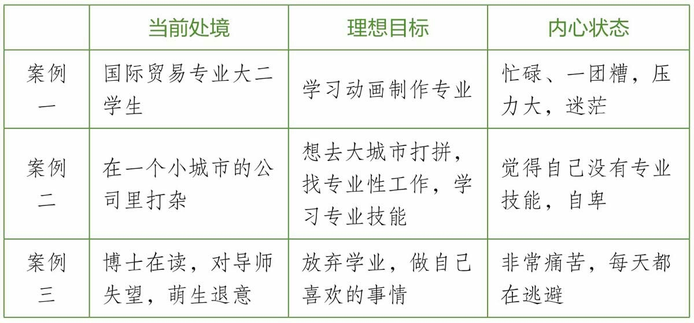
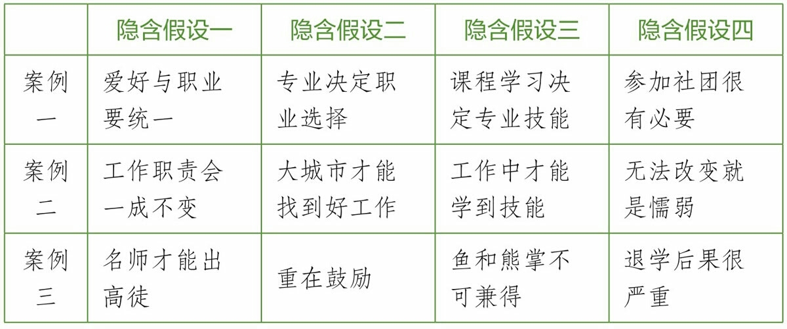
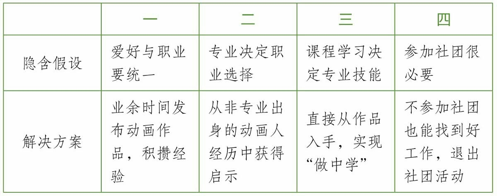
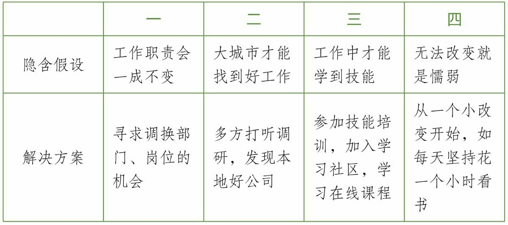
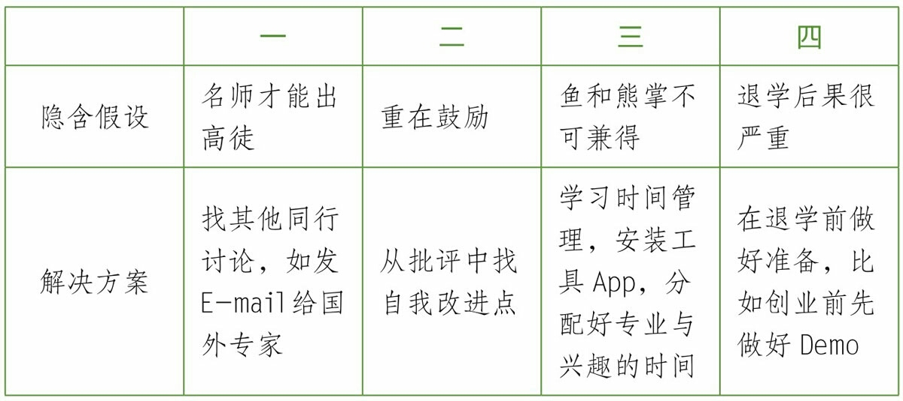

我好奇心很强，对众多东西都感兴趣，这本质上也是贪婪，也让我苦恼不已，最主要矛盾在于，时间有限，我没有机会去尝试，而且说不定我去尝试了我会做得非常好！

举个例子，我在编程，我做得还不赖，不过设计也很好玩啊！我也想玩！我应该可以做出很酷的东西，但是时间有限，我还是先编程吧……可是心里还想着，我说不定是个设计天才呢！所以时不时就会去看看设计的书籍，做点小尝试，然而这个时候内心又在矛盾，编程需要精进，需要心无旁骛。

这才是两个兴趣爱好在打架，如果再融入一个，那种感觉……

但我注意到一个现象，编程的时候我也会写博客，主要用于写一些笔记和心得，这两个好像就没有什么冲突，时间久了，虽不说写作水平提高了，但也进步了不少，编程能力在反思中也提高了不少。 编程和写作之间没有冲突啊！

无论是好奇心还是痛苦驱使着我去找答案，我觉得下面的几个解释还是能说明问题的：

<!--more-->

## 隐含假设

在讨论这个话题，我们再看几个例子：

1. 我从高一开始想学动画制作，大学的专业也想选这个，但是高考失利让我没有读上想读的专业，而是读了国际贸易。我现在大二，在顾及自己专业的同时还要去动画学院蹭课，同时还要搞社团，忙得一团糟，还感觉什么都没做好，同学都说我压力很大，但是我真的很迷茫，希望你能帮帮我！

2. 我是一个刚毕业的大学生，在一家公司做着无关痛痒的工作，我渴望去大城市展示自己的才华，尽管我没有什么才华可言。我想做一些有技术水准的工作，不停学习一些专业技能，我渴望到一个能用得到我所学知识的地方去，尽管我不专业。正是这种不专业让自己很没底气，没底气就没信心出去，突然发现我居然这么懦弱，或者说，自卑吧。

3. 我是××大学的博士生，读博的过程非常痛苦，每天都在逃避，主要的原因是导师“放羊”和没有意义的指导以及对我的各种否定。这些耗尽了我的积极性。我自己什么也做不出，又找不到方向，越来越什么都不想做，天天只做自己喜欢的事情，实在不想在本专业继续下去，明白这样下去不是办法但又不知道该怎么改变，期望听到您对于读博过程的建议。

虽然三位求助者的处境各不相同，但稍作分析我发现他们存在一个共通的模式。从当前处境、理想目标和内心状态三个方面来看（见表2-1）：

表2-1

总结一下可以看到这样一个模式：

1. 有唯一的理想目标。
2. 理想目标与当前处境相反或者相差悬殊，两者构成严重冲突。
3. 理想和现实的矛盾导致了糟糕的内心状态。

我很理解三位求助者的心情。他们感觉自己就像掉入了一口深井，四周无路可走，爬出井外成了唯一却又似乎不可及的希望。可事实真如他们感受的那样吗？
当我们陷于某个人生困局时，困住我们的不仅有外界的客观现实，还有我们过去的经历、习惯和思维惯性。这些东西会在我们思考时自动植入“隐含假设”，从而限制了思考的角度和范围。其结果是，我们通常只是在两三个“可见选项”中去做决定，而意识不到更多的“可能选项”。

> * 可见选项：从我们的个人经验和当前情境中自动产生，显而易见，无须主动探索和发现。
> * 可能选项：指未被发现的潜在可能性，来自与我们关联的未知世界，或者已知事物的深层信息，需要我们主动探索和发现。

隐含假设的威力在于，虽然它们存在，你却意识不到，只是时时刻刻被它们影响着。在上面三个案例中，仔细分析一下，就能发现三个人各自具有的隐含假设（见表2-2）：

表2-2

上面这个表格中的隐含假设粗看都有一定的“合理性”，但是仔细推敲一下就会发现，它们不过是不同形式的“偏见”，并没有充足的证据证明这些假设是对的。如果求助者能意识到这些假设的不可靠，廓清这些假设的不合理成分，就可以挣脱这些假设给自己思维造成的束缚，从原先“无路可走”的假象中走出来，发现新的改变现状的途径，进而为自己的人生找到一些新的“可能选项”。

按照这个思路，我们看看这三个求助者应该如何走出困局（见表2-3、表2-4、表2-5）。

案例一：

表2-3

表2-4

表2-5

当然，我这里所列的可能选项只是全部可能中的一小部分，还可以有很多。由于求助者给我的信息有限，所以我只能列出这些。求助者显然对自己更加了解，只要运用这个方法，在对自己情况全盘梳理的基础上，就能发现更多的可能性。
当我们在人生中遇到某个无法摆脱的僵局时，先不妨试试这三步：

1. 找出潜意识中的隐含假设；
2. 识别隐含假设中的不合理性，进行校正；
3. 形成新的更灵活的思维框架，在此基础上思考出“可能选项”并进行尝试。

### 四种最普遍的隐含假设

对于刚才的三位求助者，我找到了他们各自不同的隐含假设。还有一些隐含假设，潜藏在很多人的思想深处，具有相当大的普遍性。如果能把它们事先找出来，可以让更多人提早防备人生困局的发生。为此，我初步归纳了四个典型的有关人生选择的隐含假设：

#### 第一个典型的隐含假设是“赛道假设”。

“不要让孩子输在起跑线上”这句话就是赛道假设的体现。
暗自认同赛道假设的人，认为人生就是一场漫长的比赛，比赛的项目是设定好的，而获胜者寥寥无几。于是他们就容易陷入对竞争的焦虑和对失败的恐惧中。他们可能由于害怕失败而不敢尝试、不敢试错，只能战战兢兢、亦步亦趋地在一个被外界固化了的轨道上不停地跑着。

#### 第二个隐含假设是“低关联假设”。

暗自认同这种假设的人认为，人生的种种经历之间相互独立，不存在什么关联。比如很多人小时候学过画画，但是长大后就再也不画了，他们不会想到，这些绘画基础对于在职场中运用视觉化思考很有帮助。正如乔布斯在斯坦福大学那个著名的演讲中所说，人生就是一个连点成线的过程，有些经历也许一开始看不到它的意义所在，但也许若干年后便会发挥其特有的作用。

#### 第三个隐含假设是心理学中讲的“僵固型心智”（fixed mindset）。

暗自认同这种假设的人会用一种固定的眼光看待自己的能力，其中很多人会认为自己的天赋不够，或者智商平平，于是在遇到一些挫折时就自怨自艾，失去了继续努力的勇气。与之相对的是“成长型心智”（growth mindset），拥有这种心智的人认为智力和才能是可以通过努力不断增长的，因而并不惧怕短期的失败，反而会愈挫愈勇，这样的人往往能获得更高的成就。

#### 第四个隐含假设是“零和博弈”。

暗自认同零和博弈假设的人，在人与人的竞争中，更倾向于从别人那里争夺利益，而很少去构想双赢的方案。针对这种思维，《高效能人士的七个习惯》的作者史蒂芬·柯维专门写了一本书《第3选择》，倡导在“你的方法”和“我的方法”之外，应该努力寻找一个“我们的方法”，通过这个“第3选择”，参与的双方可以实现协同和双赢。

### 新的思维框架，探寻新的可能

上面的四种隐含假设曾经不知不觉地影响着我们的生活。现在应该是跟它们说再见的时候了。僵化的教条应该被新的更为灵活的思维框架代替，这种框架应该具有比较大的包容性和开放性，为更多的可能性开辟空间。下面是我总结的三种更加灵活的思维框架，也许能对正寻找新方向的人有所帮助。

#### 第一个框架是“目标悬置”。

很多人的烦恼来自同时有多个不同的人生目标想实现，但又不知道怎么处理多个目标之间的关系，因此感到无所适从。我们在追求两个以上的人生目标时，最常见的有两种模式，一种是串行模式，还有一种是并行模式（见图2-1）。

* 串行模式：必须在实现目标A后才能实现目标B，实现目标A是实现目标B的前提。比如:有些人会说他的人生计划是先赚大钱再做慈善。
* 并行模式：同时追求目标A和目标B。

这两种模式都暗含着实现目标的迫切心态：在串行模式中，要实现B就必须先完成A，所以A要尽快完成；在并行模式中，A和B一起来，就更显得迫切了。无论使用哪种模式，在实现目标的过程中，都可能会使我们每天都觉得压力很大，忧心忡忡，甚至感到心力交瘁。
那么“目标悬置”是什么意思呢？顾名思义，就是把你的目标停下来、放一放，但这个“放”不是放弃，只是悬置。在这个停下来的时间（比如几天、几个月甚至几年）里，你可以休息放松，也可以去做完全不同的事情。等到时机成熟时，你又可以重新开始。斯坦福大学在2015年10月宣布开启一项学制改革，将传统的集中在18—22岁区间的连续四年制学习改为可终身多次进出学校的六年制学习。他们把这次改革称为“开环大学”（open loop university）。这无疑是一场“目标悬置”的尝试，原本在大家看来重要而迫切的“拿到大学学位”这个任务变成了一件可以悬置起来、暂不理会的事情。这样一来，大学学习不再是封闭性的，不再是与工作实践分离的两个不同的人生阶段，两者是可以灵活地交替展开的。
[插图]
图2-1
注：实现目标A/B ：表示执行目标A/B，直到目标实现；执行目标A/B：执行目标A/B，但并未完成；悬置目标A/B：表示将目标A/B搁置一旁。
目标悬置的思维框架下，我们可以使用“悬置模式”来行动，这样我们的生活、学业和事业可以变得更加灵活，有更多辗转腾挪的空间。比如你可以设定在一年中，拿十个月时间全身心工作，余下两个月时间来发展自己的爱好，也就是说用十个月里赚的钱来养活另外两个月的自己。或者周期更长一点，先工作两三年，然后辞职，空出一年来做自己喜欢的事，然后再工作。这样做虽然看上去比较大胆，但不少人已经在尝试了，它未尝不是拓展人生新航道的方法。

#### 第二个框架是“能力嫁接”。

出于将复杂问题简单化的需要，我们潜意识里会把整体分解成局部，把不同的事物划分类别，建立区隔，最典型的就是我们的知识体系，被人为划分成不同的学科，每一个学科下又形成了不同的分支。这种分解性思维在我们的生活中影响深远，有时候它确实是解决问题的利器，但有时候它也会是局限我们思维的阻碍。很多时候，我们之所以认为工作和爱好之间有不可调和的对立和冲突，往往是因为我们没有发现两者之间的潜在关联，因而没法把它们统合在一起。
美国有一位数学家和物理学家叫罗伯特·朗（Robert Lang），他在加州理工学院和斯坦福大学接受教育，获得物理学博士学位，后又去了NASA（美国国家航空航天局）工作。让人感到惊奇的是，在作为一名物理学家工作了几年之后，他突然辞去工作，全身心投入到从幼年起就非常热爱的折纸艺术中。其实，那时他已是一位世界顶尖的折纸艺术家，一件作品可以卖几万美元，作品的复杂和精美程度甚至超过了一直以来在这一领域占统治地位的日本折纸家。
他是如何从一位物理学家变成一名折纸艺术家，把儿时的爱好最后变成自己的职业的呢？一方面的原因是，他从没有舍弃过自己的爱好，一直在业余时间探索折纸艺术；更重要的原因是，他发现一件复杂的折纸作品，需要
我:
借助数学工具的分析才能完成，所以他就把他的数学能力“嫁接”到了折纸这个领域。凭借他强大的数学功底，历经多年尝试，他终于成为了世界顶尖的折纸艺术家。
罗伯特·朗的故事给我们的启示是，固然某一项能力有直接相关的任务类型与之对应，但与此同时，能力也是可以迁移的，它也可以在某些你尚未发现的领域有用武之地。当你处在才能无法发挥的境地时，试着寻找施展你既有能力的其他可能性，为你的能力找到新的适用空间。这不失为寻找人生出口的一个方法。

#### 第三个框架是“特性改造”。

关于工作和爱好，我们可能早已形成了某些僵化的看法，比如工作是“要我做”，爱好是“我要做”，工作是被动接受的苦差事，爱好就是图个消遣娱乐。这种简单的二分法把工作和爱好隔绝开来，容易造成我们生活的割裂。为何不换个角度看问题呢？工作是否也可以变得活泼、主动而享受，爱好是否能不单单是消遣而也具有工作一样的严肃成分呢？这就是“特性改造”。
改造我们工作的特性并非不可能。管理学大师彼得·德鲁克认为，大多数的智力劳动者，对自己的工作都有一定的掌控权和自由度，工作并不完全是由组织分配和决定的，而是具有充分的弹性。当你认为你的工作枯燥无味时，你不妨考虑一下如何去“改造”你的工作，包括挑战你的时间分配，优化你的工具，改善你与同事间的关系，以及影响上级的想法和思路。举个例子来说，假设你在一家公司做一名普通职员，而你的个人爱好是画画，那么你可以考虑在平时的工作中用画画来表达你的想法，不论是工作汇报演示还是会议时，你都可以流露出你的这些才能，引起同事和领导对你的重视和欣赏，甚至，你可以在公司或者部门内推广视觉思考的方法，使它成为更多人提升工作效率和沟通效果的工具。
而“改造”爱好的一个常见方法，是把对一件事情的“消费型兴趣”升级为“生产型兴趣”。形成“生产型兴趣”可以让你的热爱更加可持续，也是你把热爱变成事业的前提。有“游戏禅师”美誉的著名游戏设计师陈星汉，就是因为14岁时玩《仙剑奇侠传》玩到感动落泪，而立志成为一名优秀的游戏设计师。实际上，今天很多的游戏从业者，年轻时都对游戏很痴迷，但他们并不仅仅满足于赏玩游戏，而是还希望亲自创制出游戏作品。同样地，如果你对文学非常感兴趣，那么不妨提起笔来，自己尝试创作，借用著名小说家斯蒂芬·金的劝告就是：“开始写吧，年轻人！”如果你对电影感兴趣，看过很多很多电影作品，那么你就不妨写几篇影评，通过写作影评的过程来收获对电影更深入的思考。实际上，只有当你把“消费型兴趣”升级为“生产型兴趣”时，你才会渐渐发现以前没有窥见的门径，发现之前未见的妙处。

从以上三个思路中我们就可以看到，在看似非此即彼的两个极端选择之间，你还可以有很多的中间选择，你可以大胆地重组你的时间，让理想与现实兼顾且不冲突；你可以寻找两个选择之间的连接点，把能力嫁接过去；你也可以对它们做出创造性的改造，让它们互相影响，使你的工作更像你的爱好，你的爱好更像你的事业。总之，永远不要放弃寻找“第3选择”，因为最好的选择，往往来自在更高目标指引下的我们的创造。

## 关于“自我”

小孩子喜欢一些东西也许是比较纯粹的，但成年后的一些兴趣爱好，似乎都有一些功利心在里面，当谈到喜欢，或想做某件事的时候，就会构想自己掌握了的情景，如果自己同时想发展多个兴趣爱好，那么对外来的构想可能是千差万别，那个时候麻烦就不请自来。

我曾不止一次处于这个状态，尤其是自己对当前状态不满意的时候。继而我就会思考，我会不会做什么更加合适呢？我会不断的自省，以求得“我是谁？”，“我真正感兴趣的东西是什么？”

但我也曾不止一次发现，对于未来构想的自己有时候跨度比较大，而内心的渴望也是强烈的，这就让我非常困惑，我到底该怎么办？

内心似乎给了我各种指引，我却不知道怎么办，又给我带来了每天似乎都在浪费时间，离想要的自己越来越远了，这可是双重打击。

在 **Herminia lbarra** 的《转行》 中我找到了比较系统性的答案。

简单来说，我们都希望先通过找到“自我”，然后制定改变的计划，而不是问“这么多可能的自我，哪个是最吸引我的，哪个是最有可能实现的？”

### 当前的我和可能的我

我们假设当前的我的版本是1.0，可能的我是2.0， 现在你在设计新版本的自己，对于2.0你有不少想法，

### 想一蹴而就
### 忽略了时间的复利

包括三样东西：
1. 是不是真的是我想要的
2. 我不知道我有哪些可能性（被隐含假设屏蔽了）
3. 找不到途径

## 参考

* 采铜 《如何成为一个很厉害的人》
* 