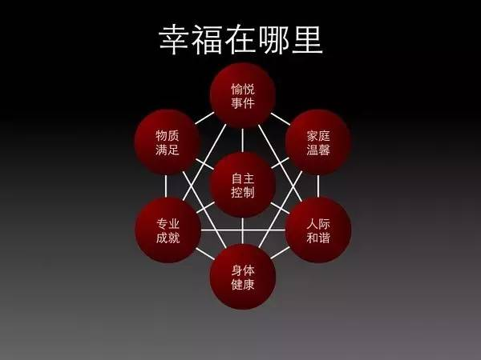

<!--more-->

[幸福的来源](http://mp.weixin.qq.com/s?__biz=MzA3MzM0MjUyMQ==&mid=2652149145&idx=1&sn=f3d80d255e958af9c73d8fc083596398&scene=21#wechat_redirect)

这和阳志平在2004年做得一个研究：普通人的幸福。传统心里学将幸福分成`主观幸福感`和`幸福表现行为`：

* 主观幸福感：它指人们对生活整体满意程度、快乐程度等体验， 一般处于消极——积极中。
* 幸福表现行为：主要指影响人们感知幸福的行为事件，其实也就是主观幸福感的来源。

所有行为的集合 -> 幸福表现行为 -> 主观幸福感 -> 幸福 

阳志平提出了幸福表现行为的通用模式：

这些术语分别代表什么意思？先看模型图左边，更多与成就、能力相关:

* 物质满足——指对金钱、名誉、地位等外在物质条件感到满意。 
* 专业成就——指在工作中表现出来的出众业绩和成果。

再看看模型图右边，更多与人际相关：

* 家庭温馨——指家庭环境拥有一种亲切体贴的氛围。 
* 人际和谐——指人际关系稳定和睦，与他人交往的过程很愉快。 

最后看看模型图中间，更多与自主性相关：

* 愉悦事件——指能带给自己身心快乐的活动或事件。 
* 自主控制——指对自己的日常生活和工作的自主把握控制空间。 
* 身体健康——指身体状态良好，有足够充沛的精力和体力应付日常各类事件。

## 其他
[如何才能去做喜欢的事情](https://www.wanglianghome.org/zh_CN/translation/HowToDoWhatYouLove.html)