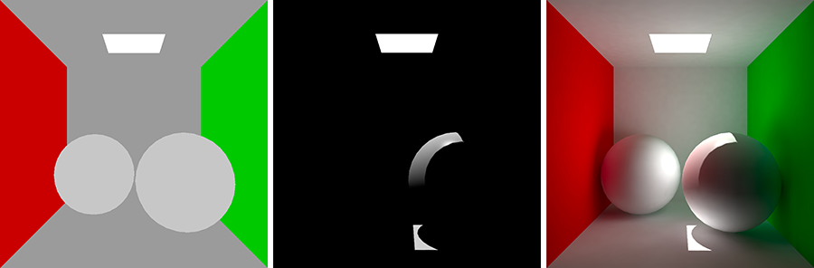

# Introduction to Lighting and Rendering

## 1. Introduction to Lighting and Rendering

Modern game lighting makes extensive use of ‘global illumination’.

Global illumination, or ‘GI’, is a term used to describe a range of techniques and mathematical models which attempt to simulate the complex behaviour of light as it bounces and interacts with the world. Simulating global illumination accurately is challenging and can be computationally expensive. Because of this, games use a range of approaches to handle these calculations beforehand, rather than during gameplay.

***Lighting IntroductionThe same scene: With no lighting (Left), with ‘direct light’ only (Center) & with indirect 'global illumination' (Right). Note how colors are transferred as light ‘bounces’ between surfaces, giving a much more realistic result.***

In this document we will give you an overview of how GI works in Unity. We will walk you through the different lighting techniques available, explain how to setup your project for lighting and then explore the various tools at your disposal when considering how to light a scene.

## 2. Choosing a Lighting Technique

## 3. The Precompute Process

## 4. Choosing a Rendering Path

## 5. Choosing a Color Space

## 6. High Dynamic Range (HDR)

## 7. Reflections

## 8. Ambient Lighting

## 9. Light Types

## 10. Emissive Materials

## 11. Light Probes