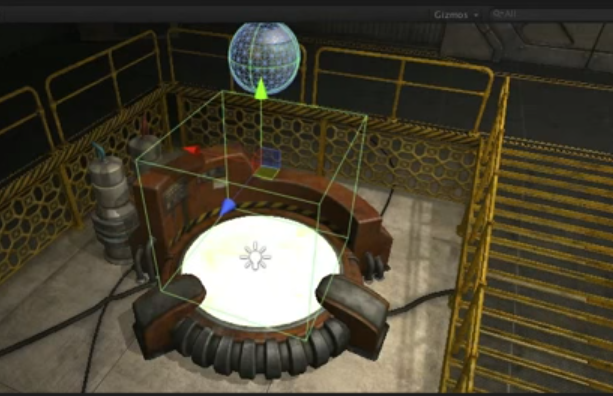

<!-- TOC -->

- [3D物理](#3d%E7%89%A9%E7%90%86)
    - [Collider](#collider)
    - [Colliders as Triggers (碰撞器作为触发器)](#colliders-as-triggers-%E7%A2%B0%E6%92%9E%E5%99%A8%E4%BD%9C%E4%B8%BA%E8%A7%A6%E5%8F%91%E5%99%A8)
        - [示例代码](#%E7%A4%BA%E4%BE%8B%E4%BB%A3%E7%A0%81)
    - [Rigidbody 刚体](#rigidbody-%E5%88%9A%E4%BD%93)
    - [Adding Physics  Forces](#adding-physics--forces)
    - [Add Physics  Torque](#add-physics--torque)
    - [Physics Materials 物理材质](#physics-materials-%E7%89%A9%E7%90%86%E6%9D%90%E8%B4%A8)
    - [Physics Joints 物理关节](#physics-joints-%E7%89%A9%E7%90%86%E5%85%B3%E8%8A%82)
    - [通过OnCollisionEnter侦测碰撞](#%E9%80%9A%E8%BF%87oncollisionenter%E4%BE%A6%E6%B5%8B%E7%A2%B0%E6%92%9E)
    - [Raycasting](#raycasting)
    - [相关教程](#%E7%9B%B8%E5%85%B3%E6%95%99%E7%A8%8B)
    - [相关文档](#%E7%9B%B8%E5%85%B3%E6%96%87%E6%A1%A3)

<!-- /TOC -->

# 3D物理

## Collider

问题：

1. Collider是干什么的
2. 如何通过初始的、混合的和网状Collider创建不同的碰撞体。

Colliders are a component that allows the game object they're attached to react to other colliders provied that one of the game objects has a rigidbody component attahced.

Collider有不同的形状和类型，在场景中我们看到的都是绿色边缘线，它们有最原始的形状：

* Sphere Collider
* Capsule Collider
* Box Collider

这些单个Collider可以用于一些相对简单或检测不严格的模型，对于更加复杂的形状，我们有两种选项：

1. 通过混合使用这些初始Collider，比如在模型下创建模型的不同部分的空对象，然后附加这些初始Collider。
2. 使用Mesh Collider，它会完全契合我们的模型外形，之所以很少直接用Mesh Collider的原因是它会直接根据我们提供的Mesh（模型网格）作为Mesh Collider的依据，如果直接使用高模，这就可能会生成过于详细的Mesh Collider，从而会影响性能。 

> 问题：为什么过于复杂的Mesh Collider会影响性能呢？

所以对于碰撞检测要求不严格的情况，我们可以使用混合原始Collider来达成目标，如果碰撞检测要求比较严格，模型又过于复杂，我们可以考虑第三种方案，用低模作为Mesh Collider的依据

When collisions occur in the game engine one collider strikes another and an event called `OnCollisionEnter` is called

需要注意的过程有三个方法可能会调用：

* `OnCollisionEnter(Collision collision)`
* `OnCollisionStay(Collision collision)`
* `OnCollisionExit(Collision collision)`

> 要想触发OnCollision的系列事件，两个物体除了有Collider外，其中一个必须有 `Rigidbody` 组件！


## Colliders as Triggers (碰撞器作为触发器)

游戏实际里，通过将Collider作为触发器（也称为触发域），从而可以侦测一个物体是否进入某个特定空间。

只需要在Collider里勾选IsTrigger就好了。

如果Collider启用了Is Trigger选项，那么它就不会与其他物体产生碰撞，而是直接穿过，对应的也有三个方法：

* OnTriggerEnter
* OnTriggerStay
* OnTriggerExit

和常规的碰撞一样，两个物体中必须有一个有Rigidbody，标准实践方式是将Trigger作为Static Object，也就是说Physics引擎不会移动他们，计算的时候会作为一个整体，从而提高效率。所以常见的方法是我们创建一个Trigger，然后另外一个Rigidbody穿过它。

It's standard practice to make sure that your trigger colliders are static objects, meaning they will not be moved by the physics engine. So usually you will make a trigger and then pass a rigidbody through it. 

Trigger或者Trigger Zone的设计意向就是，我们可以直接使用代码侦测并做处理，而非必须等到物体碰撞到一起才能做到。 



### 示例代码

```cs
using UnityEngine;
using System.Collections;

public class HovePad: MonoBehaviour{
    public float hoverForce = 12f;

    void OnTriggerStay(Collider other){
        other.rigidbody.AddForce(Vector3.up * hoverForce, ForceMode.Accleration);
    }
}

```

## Rigidbody 刚体


如何使用刚体 —— Unity世界物理驱动的物体。


## Adding Physics  Forces

如何通过AddForce函数来移动一个物理(rigidbody)对象


## Add Physics  Torque

如何通过AddTorque函数来旋转物理(rigidbody)对象


## Physics Materials 物理材质

如何使用物理材质来控制移动物体表面摩擦力？

## Physics Joints 物理关节

如何使用基本的物理关节：弹簧、固定和合页关节来为我们的Rigidbo 对象创建动态的反应。


## 通过OnCollisionEnter侦测碰撞

如何在代码中通过OnCollision函数来侦测碰撞


## Raycasting

How to use Rays to detect line of sight and angular calculations.

如何通过射线


## 相关教程

* [Colliders](https://unity3d.com/learn/tutorials/topics/physics/colliders)
* [Colliders as Triggers](https://unity3d.com/learn/tutorials/topics/physics/colliders-triggers?playlist=17120)
* [Rigidbodies](https://unity3d.com/learn/tutorials/topics/physics/rigidbodies)
* [Adding Physics Forces](https://unity3d.com/learn/tutorials/topics/physics/adding-physics-forces?playlist=17120)
* [Adding Physics Torque](https://unity3d.com/learn/tutorials/topics/physics/adding-physics-torque?playlist=17120)
* [Physics Materials](https://unity3d.com/learn/tutorials/topics/physics/physics-materials?playlist=17120)
* [Physics Joints](https://unity3d.com/learn/tutorials/topics/physics/physics-joints?playlist=17120)
* [Detecting Collisions with OnCollisionEnter](https://unity3d.com/learn/tutorials/topics/physics/detecting-collisions-oncollisionenter?playlist=17120)
* [Raycasting](https://unity3d.com/learn/tutorials/topics/physics/raycasting?playlist=17120)

## 相关文档

* [Collider](http://docs.unity3d.com/Documentation/ScriptReference/Collider.html?_ga=1.217187679.838993178.1480250241) (Script Reference)
* [Box Collider](http://docs.unity3d.com/Documentation/Components/class-BoxCollider.html?_ga=1.208882011.838993178.1480250241) (Manual)
* [Capsule Collider](http://docs.unity3d.com/Documentation/Components/class-CapsuleCollider.html?_ga=1.208882011.838993178.1480250241) (Manual)
* [Mesh Collider](http://docs.unity3d.com/Documentation/Components/class-MeshCollider.html?_ga=1.208882011.838993178.1480250241) (Manual)
* [Collision](http://docs.unity3d.com/Documentation/ScriptReference/Collision.html?_ga=1.146467325.838993178.1480250241) (Script Reference)
* [OnCollisionEnter](http://docs.unity3d.com/Documentation/ScriptReference/Collider.OnCollisionEnter.html?_ga=1.172830442.838993178.1480250241) (Script Reference)
* [OnCollisionExit](http://docs.unity3d.com/Documentation/ScriptReference/Collider.OnCollisionExit.html?_ga=1.172830442.838993178.1480250241) (Script Reference)
* [OnCollisionStay](http://docs.unity3d.com/Documentation/ScriptReference/Collider.OnCollisionStay.html?_ga=1.146467325.838993178.1480250241) (Script Reference)
* [IsTrigger](http://docs.unity3d.com/Documentation/ScriptReference/Collider-isTrigger.html?_ga=1.181267950.838993178.1480250241) (Script Reference)
* [OnTriggerEnter](http://docs.unity3d.com/Documentation/ScriptReference/Collider.OnTriggerEnter.html?_ga=1.181267950.838993178.1480250241) (Script Reference)
* [OnTriggerStay](http://docs.unity3d.com/Documentation/ScriptReference/Collider.OnTriggerStay.html?_ga=1.181267950.838993178.1480250241) (Script Reference)
* [OnTriggerExit](http://docs.unity3d.com/Documentation/ScriptReference/Collider.OnTriggerExit.html?_ga=1.181267950.838993178.1480250241) (Script Reference)

* [Rigidbody](http://docs.unity3d.com/Documentation/Components/class-Rigidbody.html?_ga=1.71976538.838993178.1480250241) (Manual)
* [Rigidbody](http://docs.unity3d.com/Documentation/ScriptReference/Rigidbody.html?_ga=1.71976538.838993178.1480250241) (Script Reference)
* [Rigidbody  OnCollisionEnter](http://docs.unity3d.com/Documentation/ScriptReference/Rigidbody.OnCollisionEnter.html?_ga=1.172830442.838993178.1480250241) (Script Reference)
* [AddForce](http://docs.unity3d.com/Documentation/ScriptReference/Rigidbody.AddForce.html?_ga=1.181152366.838993178.1480250241)(Script Reference)
* [ForceMode](http://docs.unity3d.com/Documentation/ScriptReference/ForceMode.html?_ga=1.181152366.838993178.1480250241) (Script Reference)
* [AddTorque](http://docs.unity3d.com/Documentation/ScriptReference/Rigidbody.AddTorque.html?_ga=1.185404128.838993178.1480250241) (Script Reference)

* [Physic Material](http://docs.unity3d.com/Documentation/Components/class-PhysicMaterial.html?_ga=1.188432737.838993178.1480250241) (Manual)
* [Physic Material](http://docs.unity3d.com/Documentation/ScriptReference/PhysicMaterial.html?_ga=1.188432737.838993178.1480250241) (Script Reference)
* [Joint](http://docs.unity3d.com/Documentation/ScriptReference/Joint.html?_ga=1.214255198.838993178.1480250241) (Script Reference)
* [FixedJoint](http://docs.unity3d.com/Documentation/ScriptReference/FixedJoint.html?_ga=1.214255198.838993178.1480250241) (Script Reference)
* [SpringJoint](http://docs.unity3d.com/Documentation/ScriptReference/SpringJoint.html?_ga=1.214255198.838993178.1480250241) (Script Reference)
* [HingeJoint](http://docs.unity3d.com/Documentation/ScriptReference/HingeJoint.html?_ga=1.214255198.838993178.1480250241) (Script Reference)


* [Raycast](http://docs.unity3d.com/Documentation/ScriptReference/Physics.Raycast.html?_ga=1.109382220.838993178.1480250241) (Script Reference)
* [RaycastHit](http://docs.unity3d.com/Documentation/ScriptReference/RaycastHit.html?_ga=1.109382220.838993178.1480250241) (Script Reference)