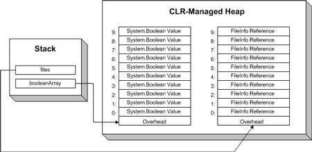
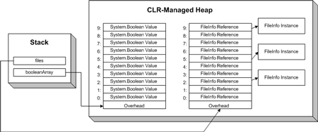
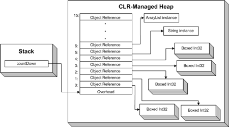

概述：该系列的6篇文章主要讲解重要的数据结构及其在实际开发中的运用。我们将讲解当前.NET框架内置的和自定义的一些重要的数据结构。
第一篇主要介绍数据结构，包括什么是数据结构，如何分析数据结构的效率，以及为什么分析很重要。本文中，我们还将介绍.NET中两个常用的数据结构：数组(Array)和列表(List)

> 注意：本文假设读者熟悉C#编程语言

<!-- TOC -->

- [简介](#简介)
- [分析数据结构性能](#分析数据结构性能)
- [渐近运行时间与实际算法](#渐近运行时间与实际算法)
- [每个人都喜爱的线性，直接存取，相同类型的数据结构：数组](#每个人都喜爱的线性直接存取相同类型的数据结构数组)
- [创建类型安全，高性能，可复用的数据结构](#创建类型安全高性能可复用的数据结构)
    - [用泛型来拯救](#用泛型来拯救)
- [List：同类型数据，自增长的数组](#list同类型数据自增长的数组)
- [总结](#总结)

<!-- /TOC -->

<!--more-->

## 简介

欢迎来到.NET 2.0数据结构使用教程系列6篇的第一篇。

通过本系列文章，我们将讲解不同的数据结构，一些是.NET框架基本类库自带的，其他一些将由我们自己手动创建。也许你不知道什么数据结构，简单来说，**它是用来管理数据以及提供数据操作方法的类**。也许最常见和广为人知的数据结构就是数组(Array)了，也就是可以通过有序索引直接存取的一段连续的数据项的集合。

在正式进入本文主题之前，我们先简单介绍一下本系列的6篇文章的侧重点，这样你就可以很好的将这部分知识点串起来。

1/6 我们将了解为什么数据结构很重要，对算法性能的影响。要测试一种数据结构对性能的影响，我们需要知道(we'll need to examine how the various operations performed by a data structure can be rigorously analyzed. )
最后，我们将集中注意力到.NET框架中已有的两个相似的数据结构，数组(Array)和列表(List)。也许你已经在之前的项目中用过这些数据结构了。本文将主要介绍它们提供了哪些操作方法以及这些操作的效率。

2/6 我们将探索列表的“近亲”，队列(Queue)和栈(Stack)，和列表一样，队列和栈用于存储一组数据，且已经加入.NET框架基类。和列表不同是，在列表中我们可以获取任意位置的元素，但队列和栈只允许以既定的方式存取。我们将通过一些队列和栈的应用来说明.NET框架中这些类是如何实现的。之后我们将了解哈希表(Hash Table，也称为 散 列表)，一种可以像ArrayList一样直接存取，但通过字符串关键字来存索引。（we'll look at hashtables, which allow for direct access like an ArrayList, but store data indexed by a string key.）

数组和列表对于直接存取内容是个理想的选择，但对于操作大规模的数据，例如搜索的时候，它们是次选项。在3/6中，我们将介绍二叉搜索树(Binary Search Tree)数据结构，可以降低搜索时间。尽管提高了搜索效率但BST也伴随一些缺点。在4/6中，我们将介绍 跳跃列表(SkipLists)，它是二叉树和链表的组合，并解决了二叉树的一些问题。

5/6 我们将讲解什么是图(Graph)，图是一组节点和连接各个顶点的边的集合。许多现实世界的问题都可以图来抽象地表示，这也促使图成为了常用的数据结构。

最后，6/6我们将主要讨论表示集合(Set)和互斥集合(disjoint sets)的数据结构。集合是一组无序的元素的组合。互斥集合是一组没有相同元素的集合的集合。这两种组合在日常编程中都很常用，我们将在最后一篇中着重讨论。

## 分析数据结构性能

当我们想到一个特定的应用或者编程相关的问题时，许多开发者（包括我）最感兴趣的部分就是写个算法解决问题或者是给应用添加酷炫的功能来提升用户体验。你很少或几乎没有听到谁会对他们使用了哪种数据结构而兴奋的。然而对于某个特定算法而言，数据结构对性能有很大的影响。非常常见的一个例子就是在数据结构中查找一个元素。对于一个没有排序的数组，完成该过程的时间和数组中的元素的个数成比例(proportional)。对于二叉查找树和跳跃列表则和元素总量的对数(logarithmically)成比例。当我们搜索规模足够大的数据量时，数据结构的选择会使得应用的性能差别能以几秒甚至几分钟直接感知到。

由于算法中所使用的数据结构可以极大的影响算法的性能，那么有没有一个严谨的方法来比较不同数据结构的效率的就很重要。作为开发者，我们在使用某种数据结构时，最感兴趣的就是当存储的数据量不断增加时，性能是如何变化的。也就是说，对于使用的数据结构，每增加一个新元素时，对于该数据结构的操作（例如查找）时间有什么影响？考虑如下的情境：假设你的任务是写一段程序用来接收包含文件名的字符串数组作为参数，程序的任务就是检测该数组中的文件名是否包含特定的后缀名。一种方式就是遍历整个数组，当找到一个符合后缀的文件时，修改是否存在该文件的标识。代码看起来如下：

```cs
public bool DoesExtensionExist(string [] fileNames, string extension)
{
      int i = 0;
      for (i = 0; i < fileNames.Length; i++)
         if (String.Compare(Path.GetExtension(fileNames[i]), extension, true) == 0)
            return true;

      return false;   // If we reach here, we didn't find the extension
   }
}
```

从这段代码中我们可以看到，最差的情况就是没有要找的文件后缀，或者有这样的文件，但位于数组中的最后一个元素，那么我们把整个数组搜索一次。对于分析数组的排序效率时，我们必须问自己如下的问题：“假设我们有一个有$n$个元素的数组，现在我像数组中添加了一个新的元素，数组中则有$n+1$个元素，新增元素后程序的运行时间有什么变化”(虽然取名叫“运行时间”，但它并不是用来衡量程序运行的绝对时间的，而是指程序完成指定任务的所有步骤总数。当使用数组时When working with arrays, typically the steps considered are how many array accesses one needs to perform.) 由于在数组中查找一个值是，潜在的可能是我们要访问数组中的每一个值，如果数组中有了$n+1$个元素，我们也许就要执行$n+1$次检查。也就是说在数组中查找元素所要的时间是和数组中元素线性相关的。

类似这样的分析方法称为渐近分析法，它用于检验数据结构中元素总量在不断增长到无穷时候，数据结构的效率是如何变化的。渐近分析法常用的标记方法称为大O标记法。用来描述搜索未排序数组的大O标记法可以用符号$O(n)$来表示。 $O$来自于来自于big-Oh(大O),$n$表示当数组中元素增加的数量是和完成查找数组所需要的步骤总数是线性的。

A more methodical way of computing the asymptotic running time of a block of code is to follow these simple steps:

用于分析一段代码的渐近运行时间的系统方法如下：
确定和构成算法运行时间相关的步骤。如前面所提到的，数组要考虑的步骤是对数组的读和写，对于其他数据类型，步骤可能有些差异。As aforementioned, with arrays, typically the steps considered are the read and write accesses to the array. For other data structures, the steps might differ. Typically, you want to concern yourself with steps that involve the data structure itself, and not simple, atomic operations performed by the computer. 也就是说，参考上面的代码，分析它运行的时间，我只需考虑数组需要被访问的次数，而无需关心数组的创建和初始表变量，或则检测两个字符串是否相同

找到和计数相关的步骤的

Find the line(s) of code that perform the steps you are interested in counting. Put a 1 next to each of those lines.

For each line with a 1 next to it, see if it is in a loop. If so, change the 1 to 1 times the maximum number of repetitions the loop may perform. If you have two or more nested loops, continue the multiplication for each loop.

Find the largest single term you have written down. This is the running time.

现在我们把这些步骤用到上面的代码中去。我们已经确定我们关注的步骤是数组的访问次数。第二步就是标记访问数组，文件名只有作为`String.Compare()`方法参数的那一行，给这一行旁边标记`1`。现在执行第三步，我们注意到反问`fileNames`的`String.Compare()`方法位于一个最多运行`n`次(`n`是数组的长度)的循环中。划掉1，在循环代码处标记`n`， 最大值也是`n`，因此运行时间就可以表示为$O(n)$。

$O(n)$，或者线性时间，表示其中一种可能的渐近运行时间。其他还有$O(\log_2 n)$, $O(n \log_2 n)$, $O(n^2)$, $O(2^n)$, and so on. 等等。为了避免搅入大O标记法中残酷的数学细节，我们只需要明白，括号中的值越小，数据结构的操作性能就越好，例如，如果一个操作的运行时间是$O(\log_2 n)$ ，那么它比操作运行时间为$O(n)$的效率更高，因为，$\log_2 n$ < $n$

> 如果你需要快速会议一下数学知识，$\log_a b = y$ 只是 $ a^y = b$的另外一种写法，也就是，$\log_2 4 = 2$，因为$2^2 = 4$，类似的，因为$2^3 = 8$，所以$/log_2 8 = 3$，显而易见，$\log_2 n$比 $n$增长的速度慢多了，因为当 n= 8时候，$\log_2 8 = 3$，在第三篇中我们将讨论的二叉搜索树的查找操作的操作时间就是$O(\log_2 n)$。

在该系列文章中，每次我们讨论一个新的数据结构和操作时，我们都要计算它的渐近运行时间，并用其他数据结构的相似的操作的运行时间做比较。

## 渐近运行时间与实际算法

The asymptotic running time of an algorithm measures how the performance of the algorithm fares as the number of steps that the algorithm must perform approaches infinity. When the running time for one algorithm is said to be greater than another's, what this means mathematically is that there exists some number of steps such that once this number of steps is exceeded the algorithm with the greater running time will always take longer to execute than the one with the shorter running time. However, for instances with fewer steps, the algorithm with the asymptotically-greater running time may run faster than the one with the shorter running time.

For example, there are a myriad of algorithms for sorting an array that have differing running times. One of the simplest and most naïve sorting algorithms is bubble sort, which uses a pair of nested for loops to sort the elements of an array. Bubble sort exhibits a running time of O(n2) due to the two for loops. An alternative sorting algorithm is merge sort, which divides the array into halves and recursively sorts each half. The running time for merge sort is O(n log2 n). Asymptotically, merge sort is much more efficient than bubble sort, but for small arrays, bubble sort may be more efficient. Merge sort must not only incur the expense of recursive function calls, but also of recombining the sorted array halves, whereas bubble sort simply loops through the array quadratically, swapping pairs of array values as needed. Overall, merge sort must perform fewer steps, but the steps merge sort has to perform are more expensive than the steps involved in bubble sort. For large arrays, this extra expense per step is negligible, but for smaller arrays, bubble sort may actually be more efficient.

例如，有大量的具有不同运行时间的算法用于对数组进行排序，其中最简单直观的排序算法是冒泡排序，它使用了一组嵌套的`for`循环来对数组中的元素排序。由于使用了两个`for`循环，冒泡排序的运行时间为$O(n^2)$，另外一个排序算法归并排序，将数组对半分开然后递归进行对半划分再排序，它的运行时间是$O(n \log_2 n)$。从渐近分析的角度讲，归并排序算法比冒泡排序算法的效率高很多，但对于小数组，冒泡排序算法的效率却更高

Asymptotic analysis definitely has its place, as the asymptotic running time of two algorithms can show how one algorithm will outperform another when the algorithms are operating on sufficiently sized data. Using only asymptotic analysis to judge the performance of an algorithm, though, is foolhardy, as the actual execution times of different algorithms depends upon specific implementation factors, such as the amount of data being plugged into the algorithm. When deciding what data structure to employ in a real-world project, consider the asymptotic running time, but also carefully profile your application to ascertain the actual impact on performance your data structure choice bears.

在操作大规模数据时，对两种算法的渐近运行时间进行比较，可以告诉我们哪个算法更优，渐近分析法肯定有它的一席之地的。但仅凭该方法来判断哪个算法更加优秀则过于武断，这是因为不同算法的实际操作时间和实际的实现因素相关，例如算法涉及的数据量。在实际项目中决定使用哪种算法的时候，需要考虑渐近运行时间同时也……

## 每个人都喜爱的线性，直接存取，相同类型的数据结构：数组

数组是计算机程序中最简单的、最广泛使用的数据结构之一。在任何编程语言中，数组都有如下的几个属性：
* 数组内容存放在一组连续的内存中
* 数组中的所有元素的类型必须相同或者是其派生的类型，因此数组也被称为同类型的数据结构。
* 数组元素可以直接存取。你可以直接通过`arrayName[i]`代码来直接访问素组中的第`i+1`个元素。

常见的数组操作有：

* 内存分配Allocation
* 存取


在C#中，当数组(或其他任何引用类型的变量)声明时，它的默认值是`null`，也就是，下面的代码创建了一个名为`booleanArray`的数组，它的值是`null`

```cs
bool[] booleanArray;
```
在我们可以使用数组之前，我们必须创建数组的实例以便我们可以存储一定数量的元素，可以通过如下的语法来完成：

```cs
booleanArray = new bool[10];
```

或者更为通用的做法：

```
arrayName = new arrayType[allocationSize];
```

This allocates a contiguous block of memory in the CLR-managed heap large enough to hold the allocationSize number of arrayTypes. If arrayType is a value type, then allocationSize number of unboxed arrayType values are created. If arrayType is a reference type, then allocationSize number of arrayType references are created. (If you are unfamiliar with the difference between reference and value types and the managed heap versus the stack, check out Understanding .NET's Common Type System.)

如果数组的数据类型是值类型，
如果数组的数据类型是引用类型，

为了便于理解.NET框架是如何(To help hammer home how the .NET Framework stores the internals of an array,) 查看如下的案例：

```cs
bool [] booleanArray;
FileInfo [] files;

booleanArray = new bool[10];
files = new FileInfo[10];
```

代码中`booleanArray`是一个`System.Boolean`值类型的数组，`files`数组则是`System.IO.FileInfo`的引用类型的数组。图1 展示了以上4行代码执行后的CLR-managed堆



需要时刻记住的是`files`数组中的10个元素是`FileInfo`实例的引用。图2显示了如果我们通过`files`数组给`FileInfo`实例赋值时内存中的布局。



.NET中所有的数组都允许对其元素进行读和写操作，存取数组元素的代码如下：

```cs
// Read an array element
bool b = booleanArray[7];

// Write to an array element
booleanArray[0] = false;
```

存取数组元素的运行时间可以标记为$O(1)$，因为它是常量。也就是说，不管数组中存储了多少元素，查找(lookup)某个元素的时间是相同的，运行时间之所以可以是常量仅仅是因为数组中的元素存储是连续的，因此，一次查找(lookup)只需要知道数组在内存中开始的位置，每个数组元素的大小以及该元素的索引。（hence a lookup only requires knowledge of the array's starting location in memory, the size of each array element, and the element to be indexed.）

需要注意的是，在CLR-managed代码中，数组元素的查找涉及的东西比这些更多一些，因为每次访问数组时，CLR都会检测确保请求的索引值在数组的范围内。如果指定的数组索引超出了范围，就会抛出`IndexOutOfRangeException`的异常。该检测确保我们在数组中步进时不会意外地超出数组的最后一个索引，而获取内存中的其他值。尽管需要运行该检测，但不会影响访问数组的渐近运行时间，因为执行这样的检测不会随着数组内容的增加而增加。

> 注意：对于有大量元素的数组，访问元素时的索引范围检测会对应用的性能产生一些影响。当然，通过一些非托管代码，可以省略范围检测。想了解更多，查看Jeffrey Richter写的**Applied  Microsoft .NET Framework Programming**第14章

使用数组时，你也许要调整数组的长度，完成这个想法，首先的创建一个新的指定长度的数组实例，然后将之前的数组中的内容复制到新的数组中去，如何实现，请看如下的代码：
```cs
// Create an integer array with three elements
int [] fib = new int[3];
fib[0] = 1;
fib[1] = 1;
fib[2] = 2;
      
// Redimension message to a 10 element array
int [] temp = new int[10];

// Copy the fib array to temp
fib.CopyTo(temp, 0);
      
// Assign temp to fib
fib = temp;   
```

最后一行代码执行完后，`fib`引用指向一个有10个元素的`Int32`数组。`fib`数组中元素`3`到`9`是`Int32`的默认值`0`。

对于仅需要用来存储和直接访问一组同类型元素，数组无疑是非常好的选项。搜索未排序的数组需要和数组元素线性相关的运行时间。对于小数组，或者搜素的次数比较少，这是可以接受的。如果你的应用需要存储大量数据并且需要频繁搜索，有不少其他的数据结构更加适合。在接下来的系列文章中我们将讨论一些数据类型。如果你根据某些属性来搜索，且数组是按照属性排序的，你可以使用二叉搜索的算法来搜索数组，它需要的运行时间是$O(log_2 n)$，可以和二叉搜索树媲美。事实上，在`Array`类中就有`BinarySearch`方法。想了解更多信息，请阅读我之前关于有序数组的高效搜索相关的文章。

> 注意：.NET框架允许创建多维数组。和单维度数组一样，多维数组访问特定元素需的时间是常量。记住，搜索单维度，有n个元素的数组需要的运行时间为$O(n)$,对于一个 $nxn$的二维数组，运行时间是$O(n^2)$，因为需要搜索$n^2$个元素。通用情况，在一个k维的数组中需要的搜索时间为$O(n^k)$，需要注意的是，这里的`n`是指每个维度的数组中元素的数量，而不是多维数组中元素的总个数。

## 创建类型安全，高性能，可复用的数据结构

When creating a data structure for a particular problem, oftentimes the data structure's internals can be customized to the specifics of the problem. For example, imagine that you were working on a payroll application. One of the entities of this system would be an employee, so you might create an Employee class with applicable properties and methods. To represent a set of employees, you could use an array of type Employee, but perhaps you need some extra functionality not present in the array, or you simply don't want to have to concern yourself with writing code to watch the capacity of the array and resize it when necessary. One option would be to create a custom data structure that uses an internal array of Employee instances, and offered methods to extend the base functionality of an array, such as automatic resizing, searching of the array for a particular Employee object, and so on.
This data structure would likely prove very helpful in your application, so much so that you might want to reuse it in other applications. However, this data structure is not open to reuse because it is tightly-coupled to the payroll application, only being able to store elements of type Employee (or types derived from Employee). One option to make a more flexible data structure is to have the data structure maintain an internal array of object instances, as opposed to Employee instances. Because all types in the .NET Framework are derived from the object type, the data structure could store any type. This would make your collection data structure usable in other applications and scenarios.
Not surprisingly, the .NET Framework already contains a data structure that provides this functionality—the System.Collections.ArrayList class. The ArrayList maintains an internal object array and provides automatic resizing of the array as the number of elements added to the ArrayList grows. Because the ArrayList uses an object array, developers can add any type—strings, integers, FileInfo objects, Form instances, anything.
While the ArrayList provides added flexibility over the standard array, this flexibility comes at the cost of performance. Because the ArrayList stores an array of objects, when reading the value from an ArrayList you need to explicitly cast it to the data type being stored in the specified location. Recall that an array of a value type—such as a System.Int32, System.Double, System.Boolean, and so on—is stored contiguously in the managed heap in its unboxed form. The ArrayList's internal array, however, is an array of object references. Therefore, even if you have an ArrayList that stores nothing but value types, each ArrayList element is a reference to a boxed value type, as shown in Figure 3.


The boxing and unboxing, along with the extra level of indirection, that comes with using value types in an ArrayList can hamper the performance of your application when using large ArrayLists with many reads and writes. As Figure 3 illustrates, the same memory layout occurs for reference types in both ArrayLists and arrays.
Having an object array also introduces potential bugs that won't be noticed until run-time. A developer may intend to only add elements of a particular type to an ArrayList, but since the ArrayList allows any type to be added, adding an incorrect type won't be caught during compilation. Instead, such a mistake would not be apparent until run-time, meaning the bug would not be found until testing or, in the worse case, during actual use.

### 用泛型来拯救

Fortunately, the typing and performance issues associated with the ArrayList have been remedied in the .NET Framework 2.0, thanks to Generics. Generics allow for a developer creating a data structure to defer type selection. The types associated with a data structure can, instead, be chosen by the developer utilizing the data structure. To better understand Generics, let's look at an example of creating a type-safe collection. Specifically, we'll create a class that maintains an internal array of a to-be specified type, with methods to read and add items from the internal array.

```cs
public class TypeSafeList<T>
{
    T[] innerArray = new T[0];
    int currentSize = 0;
    int capacity = 0;

    public void Add(T item)
    {
        // see if array needs to be resized
        if (currentSize == capacity)
        {
            // resize array
            capacity = capacity == 0 ? 4 : capacity * 2;  // double capacity 
            T[] copy = new T[capacity];    // create newly sized array
            Array.Copy(innerArray, copy, currentSize);  // copy over the array
            innerArray = copy;    // assign innerArray to the new, larger array
        }

        innerArray[currentSize] = item;
        currentSize++;
    }

    public T this[int index]
    {
        get
        {
            if (index < 0 || index >= currentSize)
                throw new IndexOutOfRangeException();
            return innerArray[index];
        }
        set
        {
            if (index < 0 || index >= currentSize)
                throw new IndexOutOfRangeException();
            innerArray[index] = value;
        }
    }

    public override string ToString()
    {
        string output = string.Empty;
        for (int i = 0; i < currentSize - 1; i++)
            output += innerArray[i] + ", ";

        return output + innerArray[currentSize - 1];
    }
}
```

Notice that in the first line of code, in the class definition, a type identifier, T, is defined. What this syntax indicates is that the class will require the developer using it to specify a single type. This developer-specified type is aliased as T, although any other valid variable name could have been used. The type identifier is used within the class's properties and methods. For example, the inner array is of type T, and the Add() method accepts an input parameter of type T, which is then added to the array.
To declare a variable of this class, a developer would need to specify the type T, like so:

```cs
TypeSafeList<type> variableName;
```

The following code snippet demonstrates creating an instance of TypeSafeList that stores integers, and populating the list with the first 25 Fibonacci numbers.
```cs
TypeSafeList<int> fib = new TypeSafeList<int>();
fib.Add(1);
fib.Add(1);

for (int i = 2; i < 25; i++)
    fib.Add(fib[i - 2] + fib[i - 1]);

Console.WriteLine(fib.ToString());
```

The main advantages of Generics include:
Type-safety: a developer using the TypeSafeList class can only add elements that are of the type or are derived from the type specified. For example, trying to add a string to the fib TypeSafeList in the example above would result in a compile-time error.
Performance: Generics remove the need to type check at run-time, and eliminate the cost associated with boxing and unboxing.
Reusability: Generics break the tight-coupling between a data structure and the application for which it was created. This provides a higher degree of reuse for data structures.
Many of the data structures we'll be examining throughout this series are data structures that utilize Generics, and when creating data structures—such as the binary tree data structure we'll build in Part 3—we'll be utilizing Generics ourselves.

## List：同类型数据，自增长的数组

An array, as we saw, is designed to store a specific number of items of the same type in a contiguous fashion. Arrays, while simple to use, can quickly become a nuisance if you find yourself needing to regularly resize the array, or don't know how many elements you'll need when initializing the array. One option to avoid having to manually resize an array is to create a data structure that serves as a wrapper for an array, providing read/write access to the array and automatically resizing the array as needed. We started creating our own such data structure in the previous section—the TypeSafeList, but there's no need to implement this yourself as the .NET Framework provides such a class for you. This class, the List class, is found in the System.Collections.Generics namespace.
The List class contains an internal array and exposes methods and properties that, among other things, allow read and write access to the elements of the internal array. The List class, like an array, is a homogeneous data structure, meaning that you can only store items of the same type or from a derived type within a given List. The List utilizes Generics, a new feature in version 2.0 of the .NET Framework, in order to let the developer specify at development time the type of data a List will hold.
Therefore, when creating a List instance, you must specify the data type of the List's contents using the Generics syntax:

```cs
// Create a List of integers
List<int> myFavoriteIntegers = new List<int>();

// Create a list of strings
List<string> friendsNames = new List<string>();
```
Note that the type of data the List can store is specified in the declaration and instantiation of the List. When creating a new List, you don't have to specify a List size, although you can specify a default starting size by passing in an integer into the constructor, or through the List's Capacity property. To add an item to a List, simply use the Add() method. The List, like the array, can have its elements directly accessed via an ordinal index. The following code snippet shows creating a List of integers, populating the list with some initial values with the Add() method, and then reading and writing the List's values through an ordinal index.

```cs
// Create a List of integers
List<int> powersOf2 = new List<int>();

// Add 6 integers to the List
powersOf2.Add(1);
powersOf2.Add(2);
powersOf2.Add(4);
powersOf2.Add(8);
powersOf2.Add(16);
powersOf2.Add(32);

// Change the 2nd List item to 10
powersOf2[1] = 10;

// Compute 2^3 + 2^4
int sum = powersOf2[2] + powersOf2[3];
```

The List takes the basic array and wraps it in a class that hides the implementation complexity. When creating a List, you don't need to explicitly specify an initial starting size. When adding items to the List, you don't need to concern yourself with resizing the data structure, as you do with an array. Furthermore, the List has a number of other methods that take care of common array tasks. For example, to find an element in an array, you'd need to write a for loop to scan through the array (unless the array was sorted). With a List, you can simply use the Contains() method to determine if an element exists in an array, or IndexOf() to find the ordinal position of an element. The List class also contains a BinarySearch() method to efficiently search a sorted array, and methods like Find(), FindAll(), Sort(), and ConvertAll(), which can utilize delegates to perform operations that would require several lines of code using arrays.
The asymptotic running time of the List's operations are the same as those of the standard array's. While the List does indeed have more overhead, the relationship between the number of elements in the List and the cost per operation is the same as the standard array.

## 总结

本文作为系列文章的第一篇，通过以讨论为什么学习数据结构很重要开始，提供了如何分析数据结构的性能的方法。理解这个部分很重要的原因是因为通过分析各种数据结构操作的运行时间是我们在解决实际编程问题时决定采用什么数据结构的主要工具。

在学习如何分析数据结构之后，我们讨论了.NET框架基本类库中两种最常见的数据结构：`System.Array`和`System.Collections.GEnerics.List`。数组可以用于在一段连续内存中存取同类型或派生类型的数据。主要优点是提供了非常快的方式来访问和写入数据元素，缺点是搜索，（对于未排序的数组）很可能需要访问数组中的每个元素，且调整数组大小的时候需要额外的代码来完成。

`List`类通过围绕数组的的功能以及加入了一些非常有用的方法。例如`Add()`方法用于向列表中加入元素，且如果有必要就调整数组的大小.`IndexOf()`通过方法用于帮助开发人员查找特定的元素。`List`提供的功能虽然你都可以通过数组来实现，但它省去了需要自己来完成常用操作的麻烦。


下一篇我们先讨论列表的"近亲": `Stack`和`Queue`类。也会讨论关联列表，which are arrays indexed by a string key as opposed to an integer value. .NET框架基本类库用`Hashtable`和`Dictionary`类提供了关联数组数。

编程愉快！