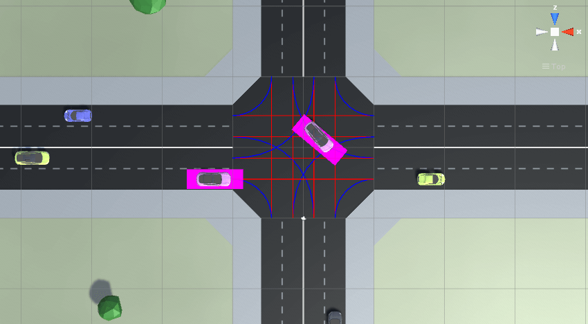
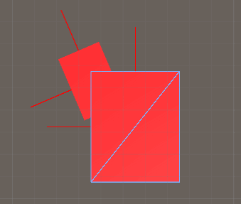

I've recently had the need to detect if two rectangles with orientation are intersecting:



<!--more-->

The method I first used was to use the triangle-triangle from the previous tutorial: 6. Are two triangles in 2D space intersecting?. The reason this is working is because a rectangle consists of two triangles, and then you test if any of the four possible triangle-triangle intersections are intersecting. But what if there is a better way?

A better way could be the **Separating Axis Theorem (SAT)** algorithm. With that algorithm you can detect if two convex polygons are intersecting. And since a rectangle is just a polygon with four sides, it's possible to use the algorithm to test if two rectangles are intersecting. I will not explain the ideas behind the algorithm here because it has aldready been done elsewhere and there's no need to copy the Internet all over again. Anyway, these are the sources I think explain the SAT algorithm:

* [2D collision detection (SAT)](https://www.youtube.com/watch?v=IELWpIGtjRg)
* [TypeScript Game Dev - Separating Axis Theorem](https://www.youtube.com/watch?v=OjEks7PmZ2Q)
* [3D Theory - Example - Car Racing Game - Collisions](http://www.euclideanspace.com/threed/games/examples/cars/collisions/index.htm)
* [OBB vs OBB Collision Detection](http://gamedev.stackexchange.com/questions/25397/obb-vs-obb-collision-detection)
* [SAT (Separating Axis Theorem)](http://www.dyn4j.org/2010/01/sat/)
* [2D Rotated Rectangle Collision](http://www.gamedev.net/page/resources/_/technical/game-programming/2d-rotated-rectangle-collision-r2604)
* [N Tutorial A - Collision Detection and Response](http://www.metanetsoftware.com/technique/tutorialA.html)
* [Collision Detection Using the Separating Axis Theorem](https://gamedevelopment.tutsplus.com/tutorials/collision-detection-using-the-separating-axis-theorem--gamedev-169)

But before we begin we need a scene. You need to create the following: just two cubes that will act as our rectangles. Then add the following code (we will soon add the intersection methods):

```cs
using UnityEngine;
using System.Collections;

//Are 2 rectangles with orientation (in 2d space) colliding?
public class OBBIntersection : MonoBehaviour 
{
    //Rectangles
    public Transform r1;
    public Transform r2;

    void Update() 
    {
        RectangleRectangle();
    }

    //Rectangle-rectangle collision
    private void RectangleRectangle()
    {
        //Find the corners of each rectangle
        //Rectangle 1
        Vector3 r1_FL, r1_FR, r1_BL, r1_BR = Vector3.zero;

        GetCornerPositions(r1, out r1_FL, out r1_FR, out r1_BL, out r1_BR);

        //Rectangle 2
        Vector3 r2_FL, r2_FR, r2_BL, r2_BR = Vector3.zero;

        GetCornerPositions(r2, out r2_FL, out r2_FR, out r2_BL, out r2_BR);


        //Are the rectangles intersecting?

        //Method 1 - Check for intersection with the Separating Axis Theorem (SAT)
        bool isIntersecting1 = Intersections.IsIntersectingOBBRectangleRectangle(r1_FL, r1_FR, r1_BL, r1_BR, r2_FL, r2_FR, r2_BL, r2_BR);

        //Method 2 - Check for intersection with triangle-triangle intersection
        //bool isIntersecting2 = TriangleTriangle(r1_FL, r1_FR, r1_BL, r1_BR, r2_FL, r2_FR, r2_BL, r2_BR);

        if (isIntersecting1)
        {
            r1.GetComponent<MeshRenderer>().material.color = Color.red;
            r2.GetComponent<MeshRenderer>().material.color = Color.red;
        }
        else
        {
            r1.GetComponent<MeshRenderer>().material.color = Color.blue;
            r2.GetComponent<MeshRenderer>().material.color = Color.blue;
        }
    }

    //Find the corners of a rectangle transform
    void GetCornerPositions(Transform r, out Vector3 FL, out Vector3 FR, out Vector3 BL, out Vector3 BR)
    {
        FL = r.position + r.forward * r.localScale.z * 0.5f - r.right * r.localScale.x * 0.5f;
        FR = r.position + r.forward * r.localScale.z * 0.5f + r.right * r.localScale.x * 0.5f;

        BL = r.position - r.forward * r.localScale.z * 0.5f - r.right * r.localScale.x * 0.5f;
        BR = r.position - r.forward * r.localScale.z * 0.5f + r.right * r.localScale.x * 0.5f;
    }

    //Rectangle-rectangle intersection by using triangle-triangle intersection for comparisons
    private bool TriangleTriangle(
        Vector3 r1_FL, Vector3 r1_FR, Vector3 r1_BL, Vector3 r1_BR,
        Vector3 r2_FL, Vector3 r2_FR, Vector3 r2_BL, Vector3 r2_BR)
    {
        bool isIntersecting = false;
		
        //The same algorithm from the rectangle-rectangle intersection tutorial so use the code from that one
        if (Intersections.IsTriangleTriangleIntersecting(r1_FL, r1_FR, r1_BR, r2_FL, r2_FR, r2_BR))
        {
            isIntersecting = true;

            return isIntersecting;
        }
        if (Intersections.IsTriangleTriangleIntersecting(r1_FL, r1_FR, r1_BR, r2_FL, r2_BR, r2_BL))
        {
            isIntersecting = true;

            return isIntersecting;
        }
        if (Intersections.IsTriangleTriangleIntersecting(r1_FL, r1_BR, r1_BL, r2_FL, r2_BR, r2_BL))
        {
            isIntersecting = true;

            return isIntersecting;
        }
        if (Intersections.IsTriangleTriangleIntersecting(r1_FL, r1_BL, r1_BR, r2_FL, r2_FR, r2_BR))
        {
            isIntersecting = true;

            return isIntersecting;
        }


        return isIntersecting;
    }
}
```

## The intersection algorithm

I've here collected all intersection methods in a static class called Intersections.

```cs
//Rectangle-rectangle in 2d space with orientation
public static bool IsIntersectingOBBRectangleRectangle(
	Vector3 r1_FL, Vector3 r1_FR, Vector3 r1_BL, Vector3 r1_BR,
	Vector3 r2_FL, Vector3 r2_FR, Vector3 r2_BL, Vector3 r2_BR)
{
	bool isIntersecting = false;

	//Create the rectangles
	Rectangle r1 = new Rectangle(r1_FL, r1_FR, r1_BL, r1_BR);
	Rectangle r2 = new Rectangle(r2_FL, r2_FR, r2_BL, r2_BR);

	//Find out if the rectangles are intersecting by approximating them with rectangles 
	//with no rotation and then use AABB intersection
	//Will make it faster if the probability that the rectangles are intersecting is low
	if (!IsIntersectingAABB_OBB(r1, r2))
	{
		return isIntersecting;
	}

	//Find out if the rectangles are intersecting by using the Separating Axis Theorem (SAT)
	isIntersecting = SATRectangleRectangle(r1, r2);

	return isIntersecting;
}

//Find out if the rectangles are intersecting by using AABB
private static bool IsIntersectingAABB_OBB(Rectangle r1, Rectangle r2)
{
	bool isIntersecting = false;

	//Find the min/max values for the AABB algorithm
	float r1_minX = Mathf.Min(r1.FL.x, Mathf.Min(r1.FR.x, Mathf.Min(r1.BL.x, r1.BR.x)));
	float r1_maxX = Mathf.Max(r1.FL.x, Mathf.Max(r1.FR.x, Mathf.Max(r1.BL.x, r1.BR.x)));

	float r2_minX = Mathf.Min(r2.FL.x, Mathf.Min(r2.FR.x, Mathf.Min(r2.BL.x, r2.BR.x)));
	float r2_maxX = Mathf.Max(r2.FL.x, Mathf.Max(r2.FR.x, Mathf.Max(r2.BL.x, r2.BR.x)));

	float r1_minZ = Mathf.Min(r1.FL.z, Mathf.Min(r1.FR.z, Mathf.Min(r1.BL.z, r1.BR.z)));
	float r1_maxZ = Mathf.Max(r1.FL.z, Mathf.Max(r1.FR.z, Mathf.Max(r1.BL.z, r1.BR.z)));

	float r2_minZ = Mathf.Min(r2.FL.z, Mathf.Min(r2.FR.z, Mathf.Min(r2.BL.z, r2.BR.z)));
	float r2_maxZ = Mathf.Max(r2.FL.z, Mathf.Max(r2.FR.z, Mathf.Max(r2.BL.z, r2.BR.z)));

	if (IsIntersectingAABB(r1_minX, r1_maxX, r1_minZ, r1_maxZ, r2_minX, r2_maxX, r2_minZ, r2_maxZ))
	{
		isIntersecting = true;
	}

	return isIntersecting;
}

//Intersection: AABB-AABB (Axis-Aligned Bounding Box) - rectangle-rectangle in 2d space with no orientation
public static bool IsIntersectingAABB(
	float r1_minX, float r1_maxX, float r1_minZ, float r1_maxZ, 
	float r2_minX, float r2_maxX, float r2_minZ, float r2_maxZ)
{
	//If the min of one box in one dimension is greater than the max of another box then the boxes are not intersecting
	//They have to intersect in 2 dimensions. We have to test if box 1 is to the left or box 2 and vice versa
	bool isIntersecting = true;

	//X axis
	if (r1_minX > r2_maxX)
	{
		isIntersecting = false;
	}
	else if (r2_minX > r1_maxX)
	{
		isIntersecting = false;
	}
	//Z axis
	else if (r1_minZ > r2_maxZ)
	{
		isIntersecting = false;
	}
	else if (r2_minZ > r1_maxZ)
	{
		isIntersecting = false;
	}


	return isIntersecting;
}

//Find out if 2 rectangles with orientation are intersecting by using the SAT algorithm
private static bool SATRectangleRectangle(Rectangle r1, Rectangle r2)
{
	bool isIntersecting = false;

	//We have just 4 normals because the other 4 normals are the same but in another direction
	//So we only need a maximum of 4 tests if we have rectangles
	//It is enough if one side is not overlapping, if so we know the rectangles are not intersecting

	//Test 1
	Vector3 normal1 = GetNormal(r1.BL, r1.FL);

	if (!IsOverlapping(normal1, r1, r2))
	{
		//No intersection is possible!
		return isIntersecting;
	}

	//Test 2
	Vector3 normal2 = GetNormal(r1.FL, r1.FR);

	if (!IsOverlapping(normal2, r1, r2))
	{
		return isIntersecting;
	}

	//Test 3
	Vector3 normal3 = GetNormal(r2.BL, r2.FL);

	if (!IsOverlapping(normal3, r1, r2))
	{
		return isIntersecting;
	}

	//Test 4
	Vector3 normal4 = GetNormal(r2.FL, r2.FR);

	if (!IsOverlapping(normal4, r1, r2))
	{
		return isIntersecting;
	}

	//If we have come this far, then we know all sides are overlapping
	//So the rectangles are intersecting!
	isIntersecting = true;

	return isIntersecting;
}

//Is this side overlapping?
private static bool IsOverlapping(Vector3 normal, Rectangle r1, Rectangle r2)
{
	bool isOverlapping = false;

	//Project the corners of rectangle 1 onto the normal
	float dot1 = DotProduct(normal, r1.FL);
	float dot2 = DotProduct(normal, r1.FR);
	float dot3 = DotProduct(normal, r1.BL);
	float dot4 = DotProduct(normal, r1.BR);

	//Find the range
	float min1 = Mathf.Min(dot1, Mathf.Min(dot2, Mathf.Min(dot3, dot4)));
	float max1 = Mathf.Max(dot1, Mathf.Max(dot2, Mathf.Max(dot3, dot4)));


	//Project the corners of rectangle 2 onto the normal
	float dot5 = DotProduct(normal, r2.FL);
	float dot6 = DotProduct(normal, r2.FR);
	float dot7 = DotProduct(normal, r2.BL);
	float dot8 = DotProduct(normal, r2.BR);

	//Find the range
	float min2 = Mathf.Min(dot5, Mathf.Min(dot6, Mathf.Min(dot7, dot8)));
	float max2 = Mathf.Max(dot5, Mathf.Max(dot6, Mathf.Max(dot7, dot8)));


	//Are the ranges overlapping?
	if (min1 <= max2 && min2 <= max1)
	{
		isOverlapping = true;
	}

	return isOverlapping;
}

//Get the normal from 2 points. This normal is pointing left in the direction start -> end
//But it doesn't matter in which direction the normal is pointing as long as you have the same
//algorithm for all edges
private static Vector3 GetNormal(Vector3 startPos, Vector3 endPos)
{
	//The direction
	Vector3 dir = endPos - startPos;

	//The normal, just flip x and z and make one negative (don't need to normalize it)
	Vector3 normal = new Vector3(-dir.z, dir.y, dir.x);

	//Draw the normal from the center of the rectangle's side
	Debug.DrawRay(startPos + (dir * 0.5f), normal.normalized * 2f, Color.red);

	return normal;
}

//Get the dot product
//p - the vector we want to project
//u - the unit vector p is being projected on
//proj_p_on_u = Vector3.Dot(p, u) * u;
//But we only need to project a point, so just Vector3.Dot(p, u)
private static float DotProduct(Vector3 v1, Vector3 v2)
{
	//2d space
	float dotProduct = v1.x * v2.x + v1.z * v2.z;

	return dotProduct;
}

//To create a rectangle
private struct Rectangle
{
	//Corners
	public Vector3 FL, FR, BL, BR;

	public Rectangle(Vector3 FL, Vector3 FR, Vector3 BL, Vector3 BR)
	{
		this.FL = FL;
		this.FR = FR;
		this.BL = BL;
		this.BR = BR;
	}
}

```

It should look like this in Unity (the red lines are the normals we need to project the corners onto):



## Summary

But is it faster to detect if two rectangles are intersecting with the Separating Axis Theorem than it is to approximate the rectangles with triangles and then use the triangle-triangle intersection algorithm? The answer is not really. This is the result after 2000 updates:

* **SAT:** 00.0629384 seconds
* **Triangle-triangle:** 00.0537138 seconds

So SAT is actullay slower than if we approximate the rectangles with triangles and then use the triangle-triangle intersection algorithm. But if you have a more complicated convex shape with more sides, then SAT will (probably) be faster. And since you now know the basic idea behind the SAT algorithm, it will be much easier to modify the code to make it work with more complicated shapes!

## 参考

* [Are two rectangles with orientation in 2D space intersecting?](http://www.habrador.com/tutorials/linear-algebra/7-rectangle-rectangle-intersection/)