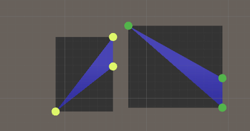
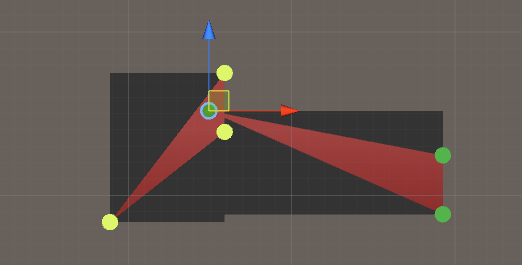

You have two triangles in 2D space and want to know if they are intersecting. If you do some reasearch on the Internet you will find that the fastest way to check if two triangles are intersecting is to combine the following intersection methods:

* **Step 1.** Approximate the triangles with rectangles and test if they intersect.
* **Step 2.** Check if any of the sides of one triangle is intersecting with any of the sides of the other triangle.
* **Step 3.** Check if any of the corners of one triangle is inside the other triangle, and vice versa.

<!--more-->

But before we begin we need a scene. You need to create the following:

* 2 gameobjects with a mesh filter and mesh renderer attached to them. To display the triangles we will build triangle meshes and attach them to these gameobjects.
* 6 spheres, where 3 have one color and 3 have another color. These are the corners of our triangles.
* 2 cubes. These will be used to display the rectangles that will approximate our triangles.
* 1 empty gameobject to attach the c# script to.
Then add the following code (we will soon add each intersection method to this script):

```cs
using UnityEngine;
using System.Collections;

//Triangle-triangle intersection in 2D
public class TriangleTriangleIntersection : MonoBehaviour 
{
    //Triangle corners
    public Transform[] triangle1Corners;
    public Transform[] triangle2Corners;
    //Triangle objects to which we will attach meshes showing the triangles
    public GameObject triangle1Obj;
    public GameObject triangle2Obj;
    //Boxes for debugging of bounding box around triangle
    public GameObject box1Obj;
    public GameObject box2Obj;

	void Update() 
	{
        //Get the positions of the triangles corners
        Vector3 t1_p1 = triangle1Corners[0].position;
        Vector3 t1_p2 = triangle1Corners[1].position;
        Vector3 t1_p3 = triangle1Corners[2].position;

        Vector3 t2_p1 = triangle2Corners[0].position;
        Vector3 t2_p2 = triangle2Corners[1].position;
        Vector3 t2_p3 = triangle2Corners[2].position;

        //Create new triangles
        Triangle triangle1 = new Triangle(t1_p1, t1_p2, t1_p3);
        Triangle triangle2 = new Triangle(t2_p1, t2_p2, t2_p3);

        //Build a triangle mesh between the corners
        CreateTriangleMesh(triangle1, triangle1Obj);
        CreateTriangleMesh(triangle2, triangle2Obj);

        //Check for intersection
        if (IsTriangleTriangleIntersecting(triangle1, triangle2))
        {
            triangle1Obj.GetComponent<MeshRenderer>().material.color = Color.red;
            triangle2Obj.GetComponent<MeshRenderer>().material.color = Color.red;
        }
        else
        {
            triangle1Obj.GetComponent<MeshRenderer>().material.color = Color.blue;
            triangle2Obj.GetComponent<MeshRenderer>().material.color = Color.blue;
        }
    }

    //The triangle-triangle intersection in 2D algorithm
    bool IsTriangleTriangleIntersecting(Triangle triangle1, Triangle triangle2)
    {
        bool isIntersecting = false;

        //Step 1. AABB intersection
        if (IsIntersectingAABB(triangle1, triangle2))
        {
            //Step 2. Line segment - triangle intersection
            if (AreAnyLineSegmentsIntersecting(triangle1, triangle2))
            {
                isIntersecting = true;
            }
            //Step 3. Point in triangle intersection - if one of the triangles is inside the other
            else if (AreCornersIntersecting(triangle1, triangle2))
            {
                isIntersecting = true;
            }
        }

        return isIntersecting;
    }


    //
    // Other stuff
    //

    //Create a triangle mesh with 2 sides from 3 coordinates
    void CreateTriangleMesh(Triangle triangle, GameObject triangleObj)
    {
        //The vertices
        Vector3[] newVertices = new Vector3[3];

        //Add the vertices
        newVertices[0] = triangle.p1;
        newVertices[1] = triangle.p2;
        newVertices[2] = triangle.p3;

        //The triangles (6 because we need a bottom so we can move the corners the way we want)
        int[] newTriangles = new int[6];

        newTriangles[0] = 2;
        newTriangles[1] = 1;
        newTriangles[2] = 0;

        newTriangles[3] = 0;
        newTriangles[4] = 1;
        newTriangles[5] = 2;

        //Add everything to a mesh
        Mesh newMesh = new Mesh();

        newMesh.vertices = newVertices;
        newMesh.triangles = newTriangles;

        //Add the mesh to the object
        triangleObj.GetComponent<MeshFilter>().mesh = newMesh;
    }

    //To store triangle data to get cleaner code
    public struct Triangle
    {
        //Corners of the triangle
        public Vector3 p1, p2, p3;
        //The 3 line segments that make up this triangle
        public LineSegment[] lineSegments;

        public Triangle(Vector3 p1, Vector3 p2, Vector3 p3)
        {
            this.p1 = p1;
            this.p2 = p2;
            this.p3 = p3;

            lineSegments = new LineSegment[3];

            lineSegments[0] = new LineSegment(p1, p2);
            lineSegments[1] = new LineSegment(p2, p3);
            lineSegments[2] = new LineSegment(p3, p1);
        }
    }

    //To create a line segment
    public struct LineSegment
    {
        //Start/end coordinates
        public Vector3 p1, p2;

        public LineSegment(Vector3 p1, Vector3 p2)
        {
            this.p1 = p1;
            this.p2 = p2;
        }
    }
}
```

## Step 1. AABB intersection

AABB is short for Axis-Aligned Bounding Box and is an intersection method to test if 2 rectangles (with no rotation) intersect in 2D space. You don't really need this method to test if 2 triangles are intersecting, but if you are using it, it will make the algorithm faster because it's faster to just test if 2 rectangles are intersecting before we test if the triangles are intersecting.

The basic idea is that you test 8 different values, but if just 2 of them are "failing" the algorithm stops, which is why this method is fast. If you want a better explanation of the algorithm, you can watch this YouTube video: [Math for Game Developers - Trigger Areas (AABB Intersection).](https://www.youtube.com/watch?v=ENuk9HgeTiI)

To approximate the triangles with rectangles, we just check each corner of each triangle and find the maximum and minimum value of both x and z coordinates.

```cs
//
// Intersection: AABB
//

//Approximate the triangles with rectangles and see if they intersect with the AABB intersection algorithm
bool IsIntersectingAABB(Triangle t1, Triangle t2)
{
	//Find the size of the bounding box

	//Triangle 1
	float t1_minX = Mathf.Min(t1.p1.x, Mathf.Min(t1.p2.x, t1.p3.x));
	float t1_maxX = Mathf.Max(t1.p1.x, Mathf.Max(t1.p2.x, t1.p3.x));
	float t1_minZ = Mathf.Min(t1.p1.z, Mathf.Min(t1.p2.z, t1.p3.z));
	float t1_maxZ = Mathf.Max(t1.p1.z, Mathf.Max(t1.p2.z, t1.p3.z));

	//Triangle 2
	float t2_minX = Mathf.Min(t2.p1.x, Mathf.Min(t2.p2.x, t2.p3.x));
	float t2_maxX = Mathf.Max(t2.p1.x, Mathf.Max(t2.p2.x, t2.p3.x));
	float t2_minZ = Mathf.Min(t2.p1.z, Mathf.Min(t2.p2.z, t2.p3.z));
	float t2_maxZ = Mathf.Max(t2.p1.z, Mathf.Max(t2.p2.z, t2.p3.z));


	//Are the rectangles intersecting?
	//If the min of one box in one dimension is greater than the max of another box then the boxes are not intersecting
	//They have to intersect in 2 dimensions. We have to test if box 1 is to the left or box 2 and vice versa
	bool isIntersecting = true;

	//X axis
	if (t1_minX > t2_maxX)
	{
		isIntersecting = false;
	}
	else if (t2_minX > t1_maxX)
	{
		isIntersecting = false;
	}
	//Z axis
	else if (t1_minZ > t2_maxZ)
	{
		isIntersecting = false;
	}
	else if (t2_minZ > t1_maxZ)
	{
		isIntersecting = false;
	}


	//Debugging to display the approximated rectangles
	//Box 1
	Vector3 BB_1_centerPos = new Vector3((t1_maxX - t1_minX) * 0.5f + t1_minX, -0.2f, (t1_maxZ - t1_minZ) * 0.5f + t1_minZ);

	box1Obj.transform.position = BB_1_centerPos;

	box1Obj.transform.localScale = new Vector3(t1_maxX - t1_minX, 0.1f, t1_maxZ - t1_minZ);

	//Box 2
	Vector3 BB_2_centerPos = new Vector3((t2_maxX - t2_minX) * 0.5f + t2_minX, -0.2f, (t2_maxZ - t2_minZ) * 0.5f + t2_minZ);

	box2Obj.transform.position = BB_2_centerPos;

	box2Obj.transform.localScale = new Vector3(t2_maxX - t2_minX, 0.1f, t2_maxZ - t2_minZ);


	return isIntersecting;
}
```

It should look like this in Unity:



## Step 2. Line-line intersection

In the tutorial before this one, the Are two line segments in 2D space intersecting?, we learned how to check if two lines are intersecting. We will use this idea to test if our triangles are intersecting. So we will loop through all sides of one triangle and see if each side intersects with any of the sides of the other triangle. This is how it looks like in code:

```cs
//
// Intersection: Line segment - triangle
//

//Check if any of the edges that make up one of the triangles is intersecting with any of
//the edges of the other triangle
bool AreAnyLineSegmentsIntersecting(Triangle t1, Triangle t2)
{
	bool isIntersecting = false;

	//Loop through all edges
	for (int i = 0; i < t1.lineSegments.Length; i++)
	{
		for (int j = 0; j < t2.lineSegments.Length; j++)
		{
			//The start/end coordinates of the current line segments
			Vector3 t1_p1 = t1.lineSegments[i].p1;
			Vector3 t1_p2 = t1.lineSegments[i].p2;
			Vector3 t2_p1 = t2.lineSegments[j].p1;
			Vector3 t2_p2 = t2.lineSegments[j].p2;

			//Are they intersecting?
			if (AreLineSegmentsIntersecting(t1_p1, t1_p2, t2_p1, t2_p2))
			{
				isIntersecting = true;

				//To stop the outer for loop
				i = int.MaxValue - 1;

				break;
			}
		}
	}

	return isIntersecting;
}

//Check if 2 line segments are intersecting in 2d space
//http://thirdpartyninjas.com/blog/2008/10/07/line-segment-intersection/
//p1 and p2 belong to line 1, p3 and p4 belong to line 2
bool AreLineSegmentsIntersecting(Vector3 p1, Vector3 p2, Vector3 p3, Vector3 p4)
{
	bool isIntersecting = false;

	float denominator = (p4.z - p3.z) * (p2.x - p1.x) - (p4.x - p3.x) * (p2.z - p1.z);

	//Make sure the denominator is != 0, if 0 the lines are parallel
	if (denominator != 0)
	{
		float u_a = ((p4.x - p3.x) * (p1.z - p3.z) - (p4.z - p3.z) * (p1.x - p3.x)) / denominator;
		float u_b = ((p2.x - p1.x) * (p1.z - p3.z) - (p2.z - p1.z) * (p1.x - p3.x)) / denominator;

		//Is intersecting if u_a and u_b are between 0 and 1
		if (u_a >= 0 && u_a <= 1 && u_b >= 0 && u_b <= 1)
		{
			isIntersecting = true;
		}
	}

	return isIntersecting;
}
```

It should look like this in Unity:



## Step 3. Point in triangle intersection

What if one of the triangles is so small that it can be inside of the other triangle? In that case we need to check if one of the corners of each triangle is inside of the other triangle, and vice versa but for the other triangle.

```cs
//
// Intersection: Point in triangle
//

//There's a possibility that one of the triangles is smaller than the other
//So we have to check if any of the triangle's corners is inside the other triangle
bool AreCornersIntersecting(Triangle t1, Triangle t2)
{
	bool isIntersecting = false;

	//We only have to test one corner from each triangle
	//Triangle 1 in triangle 2
	if (IsPointInTriangle(t1.p1, t2.p1, t2.p2, t2.p3))
	{
		isIntersecting = true;
	}
	//Triangle 2 in triangle 1
	else if (IsPointInTriangle(t2.p1, t1.p1, t1.p2, t1.p3))
	{
		isIntersecting = true;
	}

	return isIntersecting;
}


//Is a point p inside a triangle p1-p2-p3?
//From http://totologic.blogspot.se/2014/01/accurate-point-in-triangle-test.html
bool IsPointInTriangle(Vector3 p, Vector3 p1, Vector3 p2, Vector3 p3)
{
	bool isWithinTriangle = false;

	float denominator = ((p2.z - p3.z) * (p1.x - p3.x) + (p3.x - p2.x) * (p1.z - p3.z));

	float a = ((p2.z - p3.z) * (p.x - p3.x) + (p3.x - p2.x) * (p.z - p3.z)) / denominator;
	float b = ((p3.z - p1.z) * (p.x - p3.x) + (p1.x - p3.x) * (p.z - p3.z)) / denominator;
	float c = 1 - a - b;

	//The point is within the triangle if 0 <= a <= 1 and 0 <= b <= 1 and 0 <= c <= 1
	if (a >= 0f && a <= 1f && b >= 0f && b <= 1f && c >= 0f && c <= 1f)
	{
		isWithinTriangle = true;
	}

	return isWithinTriangle;
}

```

It should look like this in Unity:


That's it!

## 参考

* [Are two triangles in 2D space intersecting?](http://www.habrador.com/tutorials/linear-algebra/6-triangle-triangle-intersection/)