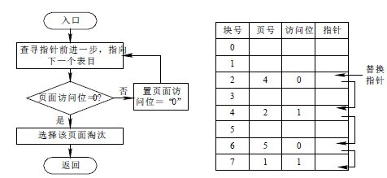

至少得掌握面向对象的编程语言，例如`C++(Unreal Engine 4)`，`C#(Unity)`

得掌握数据结构：链表，二叉树，哈希表等等

要有数学基础，尤其是向量，线性代数，微积分

要有物理学基础，因为除了碰撞之外，在运动中，会考虑作用力，加速度，质量等等牛顿经典力学，还需要判断物体去向，这里就必须用到微积分了，主要是数值积分，牛顿物理之线性力学。

<!--more-->

## 编程(C#)

**游戏开发之编程**这并非是一个严谨的分类，更像是一个主题，好比我们在讨论编程的时候，举的都是和游戏相关的例子。而且奇怪的是，和游戏开发相关的主题，其他的都是名词(Algorithms, Mathematics, Patterns, Tutorials)，只有编程相关的是进行时(Scripting)，大抵是我们工作的内容更多集中在这个部分吧！

鉴于我主要使用的是Unity，我探索的编程语言主要是C#，其他一些，例如需要和服务器交互的，可能会涉及到一些JavaScript(Node)，Python等等。

本文更像是一个目录，收集、翻译、自著地文章，并无先后顺序，文章列表如下：


* [快速了解C#](GDS)
* [内存管理]() —— 什么是`内存空间`？什么是`堆`，`栈`？什么是`Class`，什么是`Struct`？
* [String]()
* [OOP]()
* [GetComponent]()
* [协同进程(Coroutine)]()
* [委托]()
* [反射]()
* [拓展]()
* [Quick Benchmark]()
* [生成随机数]()


## 数学及应用

Math is fun, especially if you can use the math to solve problems you have. In this tutorial you will learn how to use Linear Algebra to solve problems in Unity. You will learn how to solve the following problems:

* [向量]() —— 点乘、叉乘以及归一化的意义？
  1）点乘描述了两个向量的相似程度，结果越大两向量越相似，还可表示投影
  2）叉乘得到的向量垂直于原来的两个向量
  3）标准化向量：用在只关系方向，不关心大小的时候

* [线性代数]()

	1. 怎样知道敌人是在你前面还是后面？
	2. If you are following a series of waypoints how do you know if you have passed a waypoint?
	3. If you are steering towards a waypoint, how do you determine if you should steer left or right? You will also learn if you should turn left or right to reach a direction.
	4. How can you find the coordinate where a ray intersects with a plane?
	5. How can you tell if two line segments in 2D space intersect?
	6. Are two triangles in 2D space intersecting?
	7. Are two rectangles with orientation in 2D space intersecting?

* [矩阵]()
	[四元数的运用]() —— 用于表示旋转
	  相对欧拉角的优点：
	  1）能进行增量旋转
	  2）避免万向锁
	  3）给定方位的表达方式有两种，互为负（欧拉角有无数种表达方式）

	矩阵相乘的意义及注意点
  		用于表示线性变换：旋转、缩放、投影、平移、仿射
  		注意矩阵的蠕变：误差的积累

## 游戏编程常见算法

游戏开发到现在已经积累了很多实用的部分，例如常用的算法，设计模式等等。这里就粗略的讨论下，游戏中常用的算法，详细内容可以看相关的链接。


Well, obviously it depends of what type of game you are talking about. Crysis is a very different game to Angry birds, Diablo is a very different from Chess.

However, here are some algorithms that I find useful:

For grid-based AI, you should start off learning [A*](http://en.wikipedia.org/wiki/A*_search_algorithm) search algorithm. There are various ways to improve it, such as caching and reusing parts of the search or collapse gridpoints into a simpler waypoint system, but it's a good start.

For graphics, you need to learn about [spatial partitioning](http://en.wikipedia.org/wiki/Space_partitioning). At the very least, learn about uniform grids and quad/oct-trees. Also, if you don't know about [hash functions](http://en.wikipedia.org/wiki/Hash_function), then learn them now. A large aspect of games is dealing with lists of entities, so data structures designed for fast lookups are a must.

You also need to know about [numerical integration](http://gafferongames.com/game-physics/integration-basics/) for things like basic physics. But it is also very useful to know how to simulate things like springs, for smooth user interfaces and stuff like that.

For multiplayer games, you need to know that the entire structure of your game should be created with multiplayer aspect in mind. It is a very bad idea to retroactively refit a single player game to multiplayer. I am no expert at this so I will just point you [here](http://gamedevelopment.tutsplus.com/tutorials/building-a-peer-to-peer-multiplayer-networked-game--gamedev-10074).


## 基础数学算法

随机数

常用的数学算法，例如插补，角度和弧度转换等等，算夹角，点积等等。

How common are you looking for? Some of the most common algorithms are simple things like lerping.

```cs
T lerp(T start, T end, T percent)
{
    return ((end - start) * percent) + start;
}
```

* [排序算法]()
* [最短路径之A* Search Algorithm]()
* [Breadth first pathfinding]()
* [Djikstra pathfinding]()
* [Greedybest first pathfinding]()

Heap priority queue
MinMax Algorithm
NegaMax Algorithm
Alpha Beta Algorithm




　游戏开发这东西，有很多现成的代码了，主要看效率，起码要对常用算法有基本概念，那么在游戏开发中经常使用到的算法是有哪一些呢？下面将给大家进行介绍一下，有在学习游戏开发的朋友们可以参考学习一下。


* [Getting local axis vectors from a quaternion](http://nic-gamedev.blogspot.com/2011/11/quaternion-math-getting-local-axis.html)
* [Djikstra's Algorithm (shortest path algorithm)](http://nic-gamedev.blogspot.com/2013/03/djikstras-algorithm.html)
* [Finding an angle between two vectors](http://nic-gamedev.blogspot.com/2011/11/using-vector-mathematics-finding-angle.html)
* [Finding signed angle between two vectors](http://nic-gamedev.blogspot.com/2011/11/using-vector-mathematics-finding-signed.html)
* [Finding closest point on a line](http://nic-gamedev.blogspot.com/2011/11/using-vector-mathematics-and-bit-of_08.html)
* [Finding closest point between line and sphere](http://nic-gamedev.blogspot.com/2011/11/using-vector-mathematics-and-bit-of_09.html)
* [Cone<->Point intersection test (used for AI and FOV checks)](http://www.nic-gamedev.blogspot.com/2011/11/using-vector-mathematics-and-bit-of.html)
* [AABB<->Point intersection test](http://nic-gamedev.blogspot.com/2011/11/using-vector-mathematics-point-against.html)
* [Point<->Sphere intersection test](http://nic-gamedev.blogspot.com/2011/11/using-vector-mathematics-point-against_09.html)
* [Distance over time given constant acceleration](http://nic-gamedev.blogspot.com/2011/11/calculus-network-prediction-calculating.html)
* [Time to distance given a constant acceleration](http://nic-gamedev.blogspot.com/2011/11/calculus-network-prediction-calculating_12.html)
* [Aiming ballistic trajectory given two points](http://nic-gamedev.blogspot.com/2011/11/ballistic-trajectory-to-get-between-two.html)
* [Heightmap smoothing algorithm](http://nic-gamedev.blogspot.com/2013/02/simple-terrain-smoothing.html)

https://www.gamedev.net/resources/_/technical/math-and-physics
[Game Development Math Recipes](http://www.gamefromscratch.com/page/Game-Development-Math-Recipes.aspx)
[Game Development TutorialsAlgorithms](https://gamedevelopment.tutsplus.com/categories/algorithms)


## 游戏编程模式

In this tutorial you will learn everything about programming patterns in Unity with C# code. This is how [Wikipedia](https://en.wikipedia.org/wiki/Software_design_pattern) defines programming patterns:

> In software engineering, a software design pattern is a general reusable solution to a commonly occurring problem within a given context in software design. It is not a finished design that can be transformed directly into source or machine code. It is a description or template for how to solve a problem that can be used in many different situations. Design patterns are formalized best practices that the programmer can use to solve common problems when designing an application or system.

Most of the basic ideas I've used here originate from the free book [Game Programming Patterns](http://gameprogrammingpatterns.com/), so if you want to read more about design patterns you should read it. But the code in that book is in C++ and neither is the code complete, so you can't just take the code, add it to a game engine, and run it. You will here find complete code in C# that you will be able to run in Unity with a few clicks.

The book includes the following design patterns:

1. **Command pattern**. Learn an easy way to rebind keys, how to undo old movements, and how to make a cool replay function.
2. **Flyweight pattern**. Learn how to save memory by reusing what objects have in common.
3. **Observer pattern**. Learn how to make boxes listen for events before they jump.
4. **Prototype**. The basic idea behind this pattern is that an object can spawn other objects similar to itself. But the conclusion from the author of the book is that you don't really need it: "I honestly can't say I've found a case where I felt the Prototype design pattern was the best answer." So I will not cover it here.
5. **Singleton**. With the singleton design pattern you will just be able to create one instance of the class. But the conclusion from the book is that this pattern usually does more harm than good, so it should be used sparingly. I haven't yet come up with a good game-application-example for the pattern, so I will not cover it here. If you need an example of a C# singleton class, there are several on Google.
6. **State pattern**. Learn how to make a simple Minecraft clone where creepers and skeletons are attacking you.
7. **Double Buffer**. According to [Wikipedia](https://en.wikipedia.org/wiki/Multiple_buffering), "multiple buffering is the use of more than one buffer to hold a block of data, so that a reader will see a complete (though perhaps old) version of the data, rather than a partially updated version of the data being created by a writer."

If you want to see it in action you should head to my tutorial on water wakes. There I'm using 2 arrays where I'm calculating the new heights of all points in a mesh by looking at the surrounding heights. I can't add the result of the calculations of a single point to the same array because that will affect the calculations of the other heights because they should use the old surrounding heights. So I'm saving the height in a new array, and then I flip the arrays when I'm done.

8. **Game Loop**. Unity has its own game loop built in and we can't really write our own. But you should read through the book's chapter to get a better understanding of how Unity is really working, like why Time.deltaTime is not constant.

9. **Update Method**. This design pattern is Unity's Update() method. The idea is that the game world has a collection of objects whose behavior has to be updated each frame. Each of these objects has to have an update method, and each frame the game updates every object in the collection.

10. **Bytecode**. Is the most complex pattern in the book. You develop your own programming language called bytecode. This is especially useful if you want your users to modify the game because bytecode can't accidentally reach weird parts of the game engine and it controls how much memory it uses.

11. **Subclass Sandbox**. Learn an easy way to handle all superpowers in your game.

12. **Type Object**. Let's say you have a monster base class and several different monsters inheriting from that base class. The basic idea behind the type object pattern is to give the monster base class a type of monster (or breed as in the book) instead of having several monsters inheriting from the base class. So you will just have two classes: monster and breed, instead of monster, dragon, troll, etc. So each monster in the game is an instance of the class monster, and the breed class contains the information shared between all monsters of the same breed, such as dragon breed.

It will be much easier to create a new breed object than creating yet another subclass. And if you have different types of dragons, then the type of dragon can inherit from a more general type of dragon. This design pattern is extremely useful if you let your users download new breeds of monsters. But the drawback is that it's more difficult to specialize different behaviors the monsters can have.

13. **Component**. The idea behind this pattern is why Unity has different components that you can attach to a gameobject. You can add a sound component, a rigidbody component, and/or a particle system component. What if all of those were a part of the same class? Now you can modify each of the components individually without having to give a single thought to one of the other components. The components are still allowed to talk to each other.

14. **Event Queue**. This design pattern is similar to the Observer pattern, and is used for high level communication between game systems that want to stay decoupled. The event queue is basically a list. When an event has happened (like a key has been pressed), you add the event to the list, and then another part of the game picks the oldest events from the queue and processes it.

This pattern is really useful if you are making a tutorial. You want to avoid mixing the tutorial code with the other game code. So the game code can send events to the event queue, and then the tutorial code picks events from the queue. You can also use it for playing sounds effects by merging the sound effects before adding them to the list if they are the same (and then playing only the loudest). The reason is we can't play several of the same sound effect at the same time. When the sound effects have the same waveform, it's the same as one sound effect played twice as loud.

15. **Service Locator**. A service could be something as simple as a random number generator. It's a system that needs to be available to the entire game. So you can say that the Service Locator pattern is similar to the Singleton pattern. You can also say that the Service Locator is similar to a phone book in which we can find both name and address. But use this pattern only if you have to because making something global is always asking for trouble. Unity is using this pattern together with the Component pattern in the GetComponent() method.

16. **Data Locality**. What you need to know here is that memory is slow while processors are fast. To try to compensate, the CPU is storing a little bit of memory on its own, which is called CPU caching. This is much faster than accessing the other memory, so you have to optimize that little bit of memory. You measure these improvements by measuring the "cache miss." To optimize the chache miss, you have to organize your data structures so that the things you're processing are next to each other in memory. This is easier said than done, but, according to the book, you should avoid unnecessary pointers, not send deactivated gameobjects or other unnecessary data to the cache, and avoid subclassing.

17. **Dirty Flag**. Let's say you have a gameobject with a certain position and rotation. This gameobject has also a child gameobject with its own position and rotation. If the parent gameobject is moving, then we have to recalculate the position of the child (this is costly from a performance point of view), otherwise we don't. To determine if we have to recalculate the position and rotation of the child, we set a boolean called Dirty Flag if the parent has moved. If the parent hasn't moved, we simply use the old position and rotation. Another example is if you let your players build something and then upload the build to the server. Then you can set Dirty Flags to what has actually changed, and upload only the changes.

18. **Object Pool**. If you have a gun that's firing bullets, then you should reuse the bullets instead of destroying them and creating new ones. So when a bullet has hit its target (or left the screen), you deactivate the bullet. When you then fire a new bullet, you activate an old bullet, move it to the gun's position, and give it a speed. It will improve the performance and memory of the game. This pattern has already been covered by Unity themselves: [Object Pooling](https://unity3d.com/learn/tutorials/modules/beginner/live-training-archive/object-pooling).

19. **[Spatial Partition]()**. Learn a fast way to find the closest enemy on a battlefield.


Other patterns than the ones in the book:

**Null Object**. If we can't return an object from a method, it's common to just return null. But that may break the game. So a Null Object is an object we can return instead of just null, but it does nothing, meaning it won't break the game. One example is the DoNothing class in the Command Pattern tutorial.

行为树模式是什么


## Unity教程系列

### 基础

* [Unity时钟]()
* [分形]()
* [Unity FPS]()
* [Unity对象池]()
* [曲线]()


## 参考

* [Use Linear Algebra to solve problems in Unity with C#](http://www.habrador.com/tutorials/linear-algebra/)
* [What are the most helpful algorithms for game development?](https://www.quora.com/What-are-the-most-helpful-algorithms-for-game-development)
* [Collection of Game algorithms](https://www.reddit.com/r/gamedev/comments/1aw8am/collection_of_game_algorithms/)
* [Good websites and/or books to learn game algorithms?](http://stackoverflow.com/questions/2495853/good-websites-and-or-books-to-learn-game-algorithms)