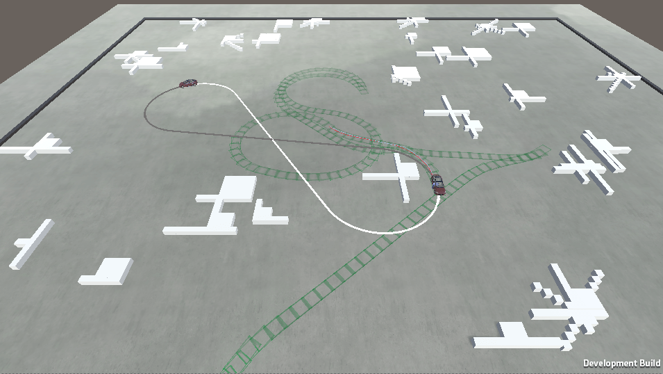

## Introduction

In this tutorial you will learn how to make Dubins paths in Unity with C# code. This is how [Wikipedia](https://en.wikipedia.org/wiki/Dubins_path) defines Dubins paths:

>In geometry, the term Dubins path typically refers to the shortest curve that connects two points in the two-dimensional Euclidean plane (i.e. x-y plane) with a constraint on the curvature of the path and with prescribed initial and terminal tangents to the path, and an assumption that the vehicle traveling the path can only travel forward. If the vehicle can also travel in reverse, then the path follows the Reeds-Shepp curve.

<!--more-->

But why would anyone need a Dubins path? One application is self-driving cars. I've made a self-driving car in Unity and I used Dubins paths to improve the pathfinding algorithm Hybrid A*. The problem with Hybrid A* is that Hybrid A* doesn't care about the final orientation of the car, which is what Dubins paths care about. This is how it looks like:



The white line is the shortest Dubins path and the gray line is a modified Dubins path because it can also reverse. As the Wikipedia article said, you can modify the Dubins paths and you will end up with the so-called Reeds–Shepp curves. But we will here focus on the original Dubins paths, which can only drive forward.

## Basic Dubins Paths

This will be a super short introduction to Dubins paths. Other people have written longer descriptions of Dubins paths, so if you want to read more you should maybe read this: [A Comprehensive, Step-by-Step Tutorial to Computing Dubins Paths](https://gieseanw.wordpress.com/2012/10/21/a-comprehensive-step-by-step-tutorial-to-computing-dubins-paths/).

So how do we calculate Dubins paths? Let's repeat the definition from Wikipedia:

> In geometry, the term Dubins path typically refers to the shortest curve that connects two points in the two-dimensional Euclidean plane (i.e. x-y plane) with a constraint on the curvature of the path and with prescribed initial and terminal tangents to the path, and an assumption that the vehicle traveling the path can only travel forward. If the vehicle can also travel in reverse, then the path follows the Reeds-Shepp curve.

So the car can only drive forward with constant speed. According to the inventor of Dubins paths, Lester Dubins, there are a maximum of 6 paths you need to calculate to find the shortest distance from A to B if you are a car driving forward with constant speed. Depending on the position of the car and the target we want to reach, there may be fewer than 6 paths.

The 6 paths are described by the following path segments: drive Right, drive Left, and drive Straight. So we end up with the following combinations: RSR, LSL, RSL, LSR, LRL, RLR.

To be able to construct these 6 paths we first have to add 4 circles: 1 circle 90 degrees to the right of the car, 1 circle 90 degrees to the left of the car, 1 circle 90 degrees to the right of the target car, and 1 circle 90 degrees to the left of the target car. It will look like this:


Now we need to connect these circles with so-called tangent lines. A tangent line to a circle is perpendicular to the center of the circle. There are 2 different groups of tangent lines: Outer tangent and Inner tangent. The difference is that the inner tangent lines cross the center line that connects the center points of the circles.


Now we can group the 6 paths into 3 different groups, and each group needs a different calculation. RSR and LSL will always use an outer tangent line, RSL and LSR will always use an inner tangent line, and LRL and RLR will not have a tangent line at all, but 2 tangent coordinates that connects with a third circle.

One good thing that will make things less complicated is that each path will always have the same tangent line. For example, RSR will always use the upper outer tangent line, no matter the orientation of the car and the target:


So let's learn how to calculate the tangent lines and coordinates.

### Outer tangent lines

Calculating the outer tangent lines are easy if the circles have the same radius. This is what we have:


What we have is the center coordinates of the both circles, and we want to figure out coordinate B and C. We begin with B. The angle theta is always 90 degrees if the circles have the same radius. But if the circles are not in line (are not at the same "height") we also have to calculate the angle atan2 to compensate for the rotation.

When we have the angle theta (and modified it with atan2), we can calculate the first tangent coordinate B like this: Bx = Ax + R * cos theta and By = Ay + R * sin theta.

To get the other tangent point C, we can use the fact that the center line between the circles have the same direction and length as the tangent line. This vector is D-A, and then we just add this vector to the coordinate B to get the second tangent point C.

To get the bottom tangent line, we just repeat the above calculations, but we add pi to the angle theta. The reason is that the bottom tangent is on the opposite side of the upper tangent line, and pi radians is the same as 180 degrees. So now we can find the tangent coordinates belonging to RSR (top tangent line) and LSL (bottom tangent line)!

### Inner tangent lines

Alright, 2 paths down, 4 to go. Now we will figure out how to calculate the tangent lines belonging to LSR and RSL, which are the inner tangents. This is what we have:


We are interested in finding the coordinates B and E. We have the coordinates A and D (center coordinates of each circle) as well as the circle radius R.

With the help of the center coordinates of each circle we can calculate the distance between the circles, which we call D. If we know the distance between A and D and the radius of the circle, we can calculate theta with cosine: theta = acos(2R / D). And as when we calculate the outer tangents, we have to compensate for the fact that the circles don't have the same position by calculating the angle atan2.

Now (as with the outer tangent lines) we can calculate the first tangent point B. But the difference now is that we can't calculate the direction of the tangent by just using the vector between the center of the circles. So to get the direction of the tangent we also have to calculate coordinate C by using the same math as when we calculated B, but instead of R we use 2R.

The line CD and the tangent line BE have the same direction, and since we now know both C and D we can calculate the direction as we did with the outer tangent line. Then we just add the direction to B to get the final tangent coordinate E.

Now we know the tangent line RSL (from the top of the right start circle to the bottom of the left goal circle) and LSR (bottom-to-top tangent).

### LRL and RLR tangent coordinates

The last path curves are a little special, because now we have to add a third circle with the same size as the other two circles. It looks like this:


As before we have the center position of each circle: A and B. We also have the circle radius R. We are interested in the coordinates D and E.

As you might think, we first have to calculate the angle theta. To get theta we have to use the law of cosines. And if D is the distance between the center position of the circles (not to be confused with tangent coordinate D), the law of cosines becomes: cos theta = (D^2 + (4R)^2 - (4R)^2) / (2 * D * 2* R) = D / 4R. And as before we have to compensate for the fact that the circles don't have the same position by calculating angle atan2.

With theta we can get the center coordinate of the third circle in the same way as we before calculated the first tangent position of the inner and outer tangent: Cx = Ax + 2R * cos theta and Cy = Ay + 2R * sin theta.

Now E is on the same line as BC and D is one the same line as AC. So we can calculate the direction between BC and AC and normalize it. To get tangent coordinates we just multiply the direction with the radius R and add it to the center coordinate C of the third circle.

And that's it! The boring math part is over. Well, you'll have to learn on your own how to calculate arc lengths and how to iterate over the path with a numerical method, but that's easy. Now we will create something looking like this in the next part (the white line is the shortest of the Dubins paths):


## Dubins Paths in Unity

First of all we need a basic scene, so add a large plane that will act as ground. You then need to build a car consisting of 2 boxes (so we can tell which part of the car is the front to make it easier to debug). The car's size should be something like 2 m * 5 m, like a real car. Also don't forget to remove all colliders of everything we add in this part (except the ground). Duplicate the car because we need two cars (one real car and one car that the real car will travel towards).

Then add 4 circles with the same radius as the turning radius (R in the previous section) you want. My turning radius is 11 m so my circles have the x- and z-scale 22. Also add an empty gameobject called "Dubins Paths". Parent the circles to this gameobject to get a cleaner workspace. Then add 6 gameobject with line renderers attached to them. These line renderers will display our final Dubins paths.

Everything should now look like this:


### Script 1 - Move and Rotate the target car

We will be able to move and rotate the target car (the car we want to reach) with the mouse and some keys. So add this script to the "Goal car."

```cs
using UnityEngine;
using System.Collections;

namespace DubinsPathsTutorial
{
    //Move and rotate the car we want to reach with a Dubins Path
    //Attach the script to the target car
    public class MoveRotateCar : MonoBehaviour 
    {
        //The scene's camera
        public Camera cameraObj;
	
	
	    void Update() 
	    {
            //Move the target car with the mouse
            MoveCar();

            //Rotate the target car around y
            RotateCar();
        }


        //Move the car with the mouse
        void MoveCar()
        {
            //Fire a ray from the mouse position
            Ray ray = cameraObj.ScreenPointToRay(Input.mousePosition);

            RaycastHit hit;

            if (Physics.Raycast(ray, out hit))
            {
                //Where the the ray hot the ground?
                Vector3 hitCoordinate = hit.point;

                hitCoordinate.y = 0f;

                //Move the car to that position
                transform.position = hitCoordinate;
            }
        }


        //Rotate the car around its axis
        void RotateCar()
        {
            float rotationSpeed = 80f;

            //Rotate counter clock-wise
            if (Input.GetKey(KeyCode.Q))
            {
                transform.Rotate(-Vector3.up * Time.deltaTime * rotationSpeed);
            }
            else if (Input.GetKey(KeyCode.E))
            {
                transform.Rotate(Vector3.up * Time.deltaTime * rotationSpeed);
            }
        }
    }
}
```

### Script 2 - Debug the Dubins paths

The script is the main script that will control everything else and is the only script you have to attach to the gameobject "Dubins Paths".

```cs
using UnityEngine;
using System.Collections;
using System.Collections.Generic;

namespace DubinsPathsTutorial
{
    //Display the final Dubins Paths
    public class DubinsDebug : MonoBehaviour
    {
        //Everything we need to add in the editor
        //Circles
        public Transform goalCircleLeft;
        public Transform goalCircleRight;
        public Transform startCircleLeft;
        public Transform startCircleRight;
        //Line renderers
        public LineRenderer lineRSR;
        public LineRenderer lineLSL;
        public LineRenderer lineRSL;
        public LineRenderer lineLSR;
        public LineRenderer lineRLR;
        public LineRenderer lineLRL;
        //The cars we generate paths to/from
        public Transform startCar;
        public Transform goalCar;

        //Objects
        DubinsGeneratePaths dubinsPathGenerator;


        void Start()
        {
            dubinsPathGenerator = new DubinsGeneratePaths();
        }


        void Update()
        {
            //To generate paths we need the position and rotation (heading) of the cars
            Vector3 startPos = startCar.position;
            Vector3 goalPos = goalCar.position;
            //Heading is in radians
            float startHeading = startCar.eulerAngles.y * Mathf.Deg2Rad;
            float goalHeading = goalCar.eulerAngles.y * Mathf.Deg2Rad;
            
            //Get all valid Dubins paths
            List<OneDubinsPath> pathDataList = dubinsPathGenerator.GetAllDubinsPaths(
                startPos, 
                startHeading,
                goalPos,
                goalHeading);

            //If we have paths
            if (pathDataList.Count > 0)
            {
                //Display all paths with line renderers
                DebugAllPaths(pathDataList);
            }

            //Position the left and right circles
            PositionLeftRightCircle();
        }


        //Position the left and right circle objects for debugging
        void PositionLeftRightCircle()
        {
            goalCircleLeft.position = dubinsPathGenerator.goalLeftCircle;
            goalCircleRight.position = dubinsPathGenerator.goalRightCircle;

            startCircleLeft.position = dubinsPathGenerator.startLeftCircle;
            startCircleRight.position = dubinsPathGenerator.startRightCircle;
        }


        //Displaying all Dubins paths with line renderers for debugging
        void DebugAllPaths(List<OneDubinsPath> pathDataList)
        {
            //Deactivate all line renderers (we activate them if a path is available)
            DeactivateLineRenderers();

            for (int i = 0; i < pathDataList.Count; i++)
            {
                PathType currentPathType = pathDataList[i].pathType;

                switch (currentPathType)
                {
                    case PathType.LRL:
                        DisplayPath(pathDataList[i], lineLRL);
                        break;
                    case PathType.RLR:
                        DisplayPath(pathDataList[i], lineRLR);
                        break;
                    case PathType.LSR:
                        DisplayPath(pathDataList[i], lineLSR);
                        break;
                    case PathType.RSL:
                        DisplayPath(pathDataList[i], lineRSL);
                        break;
                    case PathType.RSR:
                        DisplayPath(pathDataList[i], lineRSR);
                        break;
                    case PathType.LSL:
                        DisplayPath(pathDataList[i], lineLSL);
                        break;
                }
            }
        }


        //Display a path with a line renderer
        void DisplayPath(OneDubinsPath pathData, LineRenderer lineRenderer)
        {
            //Activate the line renderer
            lineRenderer.gameObject.SetActive(true);

            //The coordinates of the path
            List pathCoordinates = pathData.pathCoordinates;

            //Display the final line
            lineRenderer.SetVertexCount(pathCoordinates.Count);

            for (int i = 0; i < pathCoordinates.Count; i++)
            {
                lineRenderer.SetPosition(i, pathCoordinates[i]);
            }
        }


        //Deactivate all line renderers in case a circle is not possible
        //Then we dont want to show the old circle
        void DeactivateLineRenderers()
        {
            lineLRL.gameObject.SetActive(false);
            lineRLR.gameObject.SetActive(false);
            lineLSL.gameObject.SetActive(false);
            lineRSR.gameObject.SetActive(false);
            lineLSR.gameObject.SetActive(false);
            lineRSL.gameObject.SetActive(false);
        }
    }
}
```

### Script 3 - Generate Dubins paths

This script will generate the Dubins paths and sort them.

```cs
using UnityEngine;
using System.Collections;
using System.Collections.Generic;

namespace DubinsPathsTutorial
{
    //Generates Dubins paths
    public class DubinsGeneratePaths
    {
        //The 4 different circles we have that sits to the left/right of the start/goal
        //Public so we can position the circle objects for debugging
        public Vector3 startLeftCircle;
        public Vector3 startRightCircle;
        public Vector3 goalLeftCircle;
        public Vector3 goalRightCircle;

        //To generate paths we need the position and rotation (heading) of the cars
        Vector3 startPos;
        Vector3 goalPos;
        //Heading is in radians
        float startHeading;
        float goalHeading;

        //Where we store all path data so we can sort and find the shortest path
        List<OneDubinsPath> pathDataList = new List<OneDubinsPath>();


        //Get all valid Dubins paths sorted from shortest to longest
        public List<OneDubinsPath> GetAllDubinsPaths(Vector3 startPos, float startHeading, Vector3 goalPos, float goalHeading)
        {
            this.startPos = startPos;
            this.goalPos = goalPos;
            this.startHeading = startHeading;
            this.goalHeading = goalHeading;

            //Reset the list with all Dubins paths
            pathDataList.Clear();

            //Position the circles that are to the left/right of the cars
            PositionLeftRightCircles();

            //Find the length of each path with tangent coordinates
            CalculateDubinsPathsLengths();

            //If we have paths
            if (pathDataList.Count > 0)
            {
                //Sort the list with paths so the shortest path is first
                pathDataList.Sort((x, y) => x.totalLength.CompareTo(y.totalLength));

                //Generate the final coordinates of the path from tangent points and segment lengths
                GeneratePathCoordinates();

                return pathDataList;
            }

            //No paths could be found
            return null;
        }


        //Position the left and right circles that are to the left/right of the target and the car
        void PositionLeftRightCircles()
        {
            //Goal pos
            goalRightCircle = DubinsMath.GetRightCircleCenterPos(goalPos, goalHeading);

            goalLeftCircle = DubinsMath.GetLeftCircleCenterPos(goalPos, goalHeading);


            //Start pos
            startRightCircle = DubinsMath.GetRightCircleCenterPos(startPos, startHeading);

            startLeftCircle = DubinsMath.GetLeftCircleCenterPos(startPos, startHeading);
        }


        //
        //Calculate the path lengths of all Dubins paths by using tangent points
        //
        void CalculateDubinsPathsLengths()
        {
            //RSR and LSL is only working if the circles don't have the same position
            
            //RSR
            if (startRightCircle.x != goalRightCircle.x && startRightCircle.z != goalRightCircle.z)
            {
                Get_RSR_Length();
            }
            
            //LSL
            if (startLeftCircle.x != goalLeftCircle.x && startLeftCircle.z != goalLeftCircle.z)
            {
                Get_LSL_Length();
            }


            //RSL and LSR is only working of the circles don't intersect
            float comparisonSqr = DubinsMath.turningRadius * 2f * DubinsMath.turningRadius * 2f;

            //RSL
            if ((startRightCircle - goalLeftCircle).sqrMagnitude > comparisonSqr)
            {
                Get_RSL_Length();
            }

            //LSR
            if ((startLeftCircle - goalRightCircle).sqrMagnitude > comparisonSqr)
            {
                Get_LSR_Length();
            }


            //With the LRL and RLR paths, the distance between the circles have to be less than 4 * r
            comparisonSqr = 4f * DubinsMath.turningRadius * 4f * DubinsMath.turningRadius;

            //RLR        
            if ((startRightCircle - goalRightCircle).sqrMagnitude < comparisonSqr)
            {
                Get_RLR_Length();
            }

            //LRL
            if ((startLeftCircle - goalLeftCircle).sqrMagnitude < comparisonSqr)
            {
                Get_LRL_Length();
            }
        }


        //RSR
        void Get_RSR_Length()
        {
            //Find both tangent positons
            Vector3 startTangent = Vector3.zero;
            Vector3 goalTangent = Vector3.zero;

            DubinsMath.LSLorRSR(startRightCircle, goalRightCircle, false, out startTangent, out goalTangent);

            //Calculate lengths
            float length1 = DubinsMath.GetArcLength(startRightCircle, startPos, startTangent, false);

            float length2 = (startTangent - goalTangent).magnitude;

            float length3 = DubinsMath.GetArcLength(goalRightCircle, goalTangent, goalPos, false);

            //Save the data
            OneDubinsPath pathData = new OneDubinsPath(length1, length2, length3, startTangent, goalTangent, PathType.RSR);

            //We also need this data to simplify when generating the final path
            pathData.segment2Turning = false;

            //RSR
            pathData.SetIfTurningRight(true, false, true);

            //Add the path to the collection of all paths
            pathDataList.Add(pathData);
        }


        //LSL
        void Get_LSL_Length()
        {
            //Find both tangent positions
            Vector3 startTangent = Vector3.zero;
            Vector3 goalTangent = Vector3.zero;

            DubinsMath.LSLorRSR(startLeftCircle, goalLeftCircle, true, out startTangent, out goalTangent);

            //Calculate lengths
            float length1 = DubinsMath.GetArcLength(startLeftCircle, startPos, startTangent, true);

            float length2 = (startTangent - goalTangent).magnitude;

            float length3 = DubinsMath.GetArcLength(goalLeftCircle, goalTangent, goalPos, true);

            //Save the data
            OneDubinsPath pathData = new OneDubinsPath(length1, length2, length3, startTangent, goalTangent, PathType.LSL);

            //We also need this data to simplify when generating the final path
            pathData.segment2Turning = false;

            //LSL
            pathData.SetIfTurningRight(false, false, false);

            //Add the path to the collection of all paths
            pathDataList.Add(pathData);
        }


        //RSL
        void Get_RSL_Length()
        {
            //Find both tangent positions
            Vector3 startTangent = Vector3.zero;
            Vector3 goalTangent = Vector3.zero;

            DubinsMath.RSLorLSR(startRightCircle, goalLeftCircle, false, out startTangent, out goalTangent);

            //Calculate lengths
            float length1 = DubinsMath.GetArcLength(startRightCircle, startPos, startTangent, false);

            float length2 = (startTangent - goalTangent).magnitude;

            float length3 = DubinsMath.GetArcLength(goalLeftCircle, goalTangent, goalPos, true);

            //Save the data
            OneDubinsPath pathData = new OneDubinsPath(length1, length2, length3, startTangent, goalTangent, PathType.RSL);

            //We also need this data to simplify when generating the final path
            pathData.segment2Turning = false;

            //RSL
            pathData.SetIfTurningRight(true, false, false);

            //Add the path to the collection of all paths
            pathDataList.Add(pathData);
        }


        //LSR
        void Get_LSR_Length()
        {
            //Find both tangent positions
            Vector3 startTangent = Vector3.zero;
            Vector3 goalTangent = Vector3.zero;

            DubinsMath.RSLorLSR(startLeftCircle, goalRightCircle, true, out startTangent, out goalTangent);

            //Calculate lengths
            float length1 = DubinsMath.GetArcLength(startLeftCircle, startPos, startTangent, true);

            float length2 = (startTangent - goalTangent).magnitude;

            float length3 = DubinsMath.GetArcLength(goalRightCircle, goalTangent, goalPos, false);

            //Save the data
            OneDubinsPath pathData = new OneDubinsPath(length1, length2, length3, startTangent, goalTangent, PathType.LSR);

            //We also need this data to simplify when generating the final path
            pathData.segment2Turning = false;

            //LSR
            pathData.SetIfTurningRight(false, false, true);

            //Add the path to the collection of all paths
            pathDataList.Add(pathData);
        }


        //RLR
        void Get_RLR_Length()
        {
            //Find both tangent positions and the position of the 3rd circle
            Vector3 startTangent = Vector3.zero;
            Vector3 goalTangent = Vector3.zero;
            //Center of the 3rd circle
            Vector3 middleCircle = Vector3.zero;

            DubinsMath.GetRLRorLRLTangents(
                startRightCircle,
                goalRightCircle,
                false,
                out startTangent,
                out goalTangent,
                out middleCircle);

            //Calculate lengths
            float length1 = DubinsMath.GetArcLength(startRightCircle, startPos, startTangent, false);

            float length2 = DubinsMath.GetArcLength(middleCircle, startTangent, goalTangent, true);

            float length3 = DubinsMath.GetArcLength(goalRightCircle, goalTangent, goalPos, false);

            //Save the data
            OneDubinsPath pathData = new OneDubinsPath(length1, length2, length3, startTangent, goalTangent, PathType.RLR);

            //We also need this data to simplify when generating the final path
            pathData.segment2Turning = true;

            //RLR
            pathData.SetIfTurningRight(true, false, true);

            //Add the path to the collection of all paths
            pathDataList.Add(pathData);
        }


        //LRL
        void Get_LRL_Length()
        {
            //Find both tangent positions and the position of the 3rd circle
            Vector3 startTangent = Vector3.zero;
            Vector3 goalTangent = Vector3.zero;
            //Center of the 3rd circle
            Vector3 middleCircle = Vector3.zero;

            DubinsMath.GetRLRorLRLTangents(
                startLeftCircle,
                goalLeftCircle,
                true,
                out startTangent,
                out goalTangent,
                out middleCircle);

            //Calculate the total length of this path
            float length1 = DubinsMath.GetArcLength(startLeftCircle, startPos, startTangent, true);

            float length2 = DubinsMath.GetArcLength(middleCircle, startTangent, goalTangent, false);

            float length3 = DubinsMath.GetArcLength(goalLeftCircle, goalTangent, goalPos, true);

            //Save the data
            OneDubinsPath pathData = new OneDubinsPath(length1, length2, length3, startTangent, goalTangent, PathType.LRL);

            //We also need this data to simplify when generating the final path
            pathData.segment2Turning = true;

            //LRL
            pathData.SetIfTurningRight(false, true, false);

            //Add the path to the collection of all paths
            pathDataList.Add(pathData);
        }


        //
        // Generate the final path from the tangent points
        //

        //When we have found the tangent points and lengths of each path we need to get the individual coordinates
        //of the entire path so we can travel along the path
        void GeneratePathCoordinates()
        {
            for (int i = 0; i < pathDataList.Count; i++)
            {
                GetTotalPath(pathDataList[i]);
            }
        }


        //Find the coordinates of the entire path from the 2 tangents and length of each segment
        void GetTotalPath(OneDubinsPath pathData)
        {
            //Store the waypoints of the final path here
            List<Vector3> finalPath = new List<Vector3>();

            //Start position of the car
            Vector3 currentPos = startPos;
            //Start heading of the car
            float theta = startHeading;

            //We always have to add the first position manually = the position of the car
            finalPath.Add(currentPos);

            //How many line segments can we fit into this part of the path
            int segments = 0;

            //First
            segments = Mathf.FloorToInt(pathData.length1 / DubinsMath.driveDistance);

            DubinsMath.AddCoordinatesToPath(
                ref currentPos,
                ref theta,
                finalPath,
                segments,
                true,
                pathData.segment1TurningRight);

            //Second
            segments = Mathf.FloorToInt(pathData.length2 / DubinsMath.driveDistance);

            DubinsMath.AddCoordinatesToPath(
                ref currentPos,
                ref theta,
                finalPath,
                segments,
                pathData.segment2Turning,
                pathData.segment2TurningRight);

            //Third
            segments = Mathf.FloorToInt(pathData.length3 / DubinsMath.driveDistance);

            DubinsMath.AddCoordinatesToPath(
                ref currentPos,
                ref theta,
                finalPath,
                segments,
                true,
                pathData.segment3TurningRight);

            //Add the final goal coordinate
            finalPath.Add(new Vector3(goalPos.x, currentPos.y, goalPos.z));

            //Save the final path in the path data
            pathData.pathCoordinates = finalPath;
        }
    }
}
```

### Script 4 - Math

This script will take care of all the fun math we calculated in section 2.

```cs
using UnityEngine;
using System.Collections;
using System.Collections.Generic;

namespace DubinsPathsTutorial
{
    //To keep track of the different paths when debugging
    public enum PathType { RSR, LSL, RSL, LSR, RLR, LRL }


    //Takes care of all standardized methods related the generating of Dubins paths
    public static class DubinsMath
    {
        //How far we are driving each update, the accuracy will improve if we lower the driveDistance
        //But not too low because rounding errors will appear
        //Is used to generate the coordinates of a path
        public static float driveDistance = 0.02f;
        //The radius the car can turn 360 degrees with
        public static float turningRadius = 11f;


        //Calculate center positions of the Right circle
        public static Vector3 GetRightCircleCenterPos(Vector3 carPos, float heading)
        {
            Vector3 rightCirclePos = Vector3.zero;

            //The circle is 90 degrees (pi/2 radians) to the right of the car's heading
            rightCirclePos.x = carPos.x + turningRadius * Mathf.Sin(heading + (Mathf.PI / 2f));
            rightCirclePos.z = carPos.z + turningRadius * Mathf.Cos(heading + (Mathf.PI / 2f));

            return rightCirclePos;
        }


        //Calculate center positions of the Left circle
        public static Vector3 GetLeftCircleCenterPos(Vector3 carPos, float heading)
        {
            Vector3 rightCirclePos = Vector3.zero;

            //The circle is 90 degrees (pi/2 radians) to the left of the car's heading
            rightCirclePos.x = carPos.x + turningRadius * Mathf.Sin(heading - (Mathf.PI / 2f));
            rightCirclePos.z = carPos.z + turningRadius * Mathf.Cos(heading - (Mathf.PI / 2f));

            return rightCirclePos;
        }


        //
        // Calculate the start and end positions of the tangent lines
        //

        //Outer tangent (LSL and RSR)
        public static void LSLorRSR(
            Vector3 startCircle,
            Vector3 goalCircle,
            bool isBottom,
            out Vector3 startTangent,
            out Vector3 goalTangent)
        {
            //The angle to the first tangent coordinate is always 90 degrees if the both circles have the same radius
            float theta = 90f * Mathf.Deg2Rad;

            //Need to modify theta if the circles are not on the same height (z)
            theta += Mathf.Atan2(goalCircle.z - startCircle.z, goalCircle.x - startCircle.x);

            //Add pi to get the "bottom" coordinate which is on the opposite side (180 degrees = pi)
            if (isBottom)
            {
                theta += Mathf.PI;
            }

            //The coordinates of the first tangent points
            float xT1 = startCircle.x + turningRadius * Mathf.Cos(theta);
            float zT1 = startCircle.z + turningRadius * Mathf.Sin(theta);

            //To get the second coordinate we need a direction
            //This direction is the same as the direction between the center pos of the circles
            Vector3 dirVec = goalCircle - startCircle;

            float xT2 = xT1 + dirVec.x;
            float zT2 = zT1 + dirVec.z;

            //The final coordinates of the tangent lines
            startTangent = new Vector3(xT1, 0f, zT1);

            goalTangent = new Vector3(xT2, 0f, zT2);
        }


        //Inner tangent (RSL and LSR)
        public static void RSLorLSR(
            Vector3 startCircle,
            Vector3 goalCircle,
            bool isBottom,
            out Vector3 startTangent,
            out Vector3 goalTangent)
        {
            //Find the distance between the circles
            float D = (startCircle - goalCircle).magnitude;

            //If the circles have the same radius we can use cosine and not the law of cosines 
            //to calculate the angle to the first tangent coordinate 
            float theta = Mathf.Acos((2f * turningRadius) / D);

            //If the circles is LSR, then the first tangent pos is on the other side of the center line
            if (isBottom)
            {
                theta *= -1f;
            }

            //Need to modify theta if the circles are not on the same height            
            theta += Mathf.Atan2(goalCircle.z - startCircle.z, goalCircle.x - startCircle.x);

            //The coordinates of the first tangent point
            float xT1 = startCircle.x + turningRadius * Mathf.Cos(theta);
            float zT1 = startCircle.z + turningRadius * Mathf.Sin(theta);

            //To get the second tangent coordinate we need the direction of the tangent
            //To get the direction we move up 2 circle radius and end up at this coordinate
            float xT1_tmp = startCircle.x + 2f * turningRadius * Mathf.Cos(theta);
            float zT1_tmp = startCircle.z + 2f * turningRadius * Mathf.Sin(theta);

            //The direction is between the new coordinate and the center of the target circle
            Vector3 dirVec = goalCircle - new Vector3(xT1_tmp, 0f, zT1_tmp);

            //The coordinates of the second tangent point is the 
            float xT2 = xT1 + dirVec.x;
            float zT2 = zT1 + dirVec.z;

            //The final coordinates of the tangent lines
            startTangent = new Vector3(xT1, 0f, zT1);

            goalTangent = new Vector3(xT2, 0f, zT2);
        }


        //Get the RLR or LRL tangent points
        public static void GetRLRorLRLTangents(
            Vector3 startCircle,
            Vector3 goalCircle,
            bool isLRL,
            out Vector3 startTangent,
            out Vector3 goalTangent,
            out Vector3 middleCircle)
        {
            //The distance between the circles
            float D = (startCircle - goalCircle).magnitude;

            //The angle between the goal and the new 3rd circle we create with the law of cosines
            float theta = Mathf.Acos(D / (4f * turningRadius));

            //But we need to modify the angle theta if the circles are not on the same line
            Vector3 V1 = goalCircle - startCircle;

            //Different depending on if we calculate LRL or RLR
            if (isLRL)
            {
                theta = Mathf.Atan2(V1.z, V1.x) + theta;
            }
            else
            {
                theta = Mathf.Atan2(V1.z, V1.x) - theta;
            }

            //Calculate the position of the third circle
            float x = startCircle.x + 2f * turningRadius * Mathf.Cos(theta);
            float y = startCircle.y;
            float z = startCircle.z + 2f * turningRadius * Mathf.Sin(theta);

            middleCircle = new Vector3(x, y, z);

            //Calculate the tangent points
            Vector3 V2 = (startCircle - middleCircle).normalized;
            Vector3 V3 = (goalCircle - middleCircle).normalized;

            startTangent = middleCircle + V2 * turningRadius;
            goalTangent = middleCircle + V3 * turningRadius;
        }


        //Calculate the length of an circle arc depending on which direction we are driving
        public static float GetArcLength(
            Vector3 circleCenterPos,
            Vector3 startPos,
            Vector3 goalPos,
            bool isLeftCircle)
        {
            Vector3 V1 = startPos - circleCenterPos;
            Vector3 V2 = goalPos - circleCenterPos;

            float theta = Mathf.Atan2(V2.z, V2.x) - Mathf.Atan2(V1.z, V1.x);

            if (theta < 0f && isLeftCircle)
            {
                theta += 2f * Mathf.PI;
            }
            else if (theta > 0 && !isLeftCircle)
            {
                theta -= 2f * Mathf.PI;
            }

            float arcLength = Mathf.Abs(theta * turningRadius);

            return arcLength;
        }


        //Loops through segments of a path and add new coordinates to the final path
        public static void AddCoordinatesToPath(
            ref Vector3 currentPos,
            ref float theta,
            List<Vector3> finalPath,
            int segments,
            bool isTurning,
            bool isTurningRight)
        {
            for (int i = 0; i < segments; i++)
            {
                //Update the position of the car
                currentPos.x += driveDistance * Mathf.Sin(theta);
                currentPos.z += driveDistance * Mathf.Cos(theta);

                //Don't update the heading if we are driving straight
                if (isTurning)
                {
                    //Which way are we turning?
                    float turnParameter = 1f;

                    if (!isTurningRight)
                    {
                        turnParameter = -1f;
                    }

                    //Update the heading
                    theta += (driveDistance / turningRadius) * turnParameter;
                }

                //Add the new coordinate to the path
                finalPath.Add(currentPos);
            }
        }
    }
}
```

### Script 5 - A class that will hold one Dubins path

This final script will hold everything we need when we have generated a Dubins path.

```cs
using UnityEngine;
using System.Collections;
using System.Collections.Generic;

namespace DubinsPathsTutorial
{
    //Will hold data related to one Dubins path so we can sort them
    public class OneDubinsPath
    {
        //Tthe total length of this path
        public float totalLength;

        //Need the individual path lengths for debugging and to find the final path
        public float length1;
        public float length2;
        public float length3;

        //The 2 tangent points we need to connect the lines and curves
        public Vector3 tangent1;
        public Vector3 tangent2;

        //The type, such as RSL
        public PathType pathType;

        //The coordinates of the final path
        public List<Vector3> pathCoordinates;

        //To simplify when we generate the final path coordinates
        //Are we turning or driving straight in segment 2?
        public bool segment2Turning;

        //Are we turning right in the particular segment?
        public bool segment1TurningRight;
        public bool segment2TurningRight;
        public bool segment3TurningRight;


        public OneDubinsPath(float length1, float length2, float length3, Vector3 tangent1, Vector3 tangent2, PathType pathType)
        {
            //Calculate the total length of this path
            this.totalLength = length1 + length2 + length3;

            this.length1 = length1;
            this.length2 = length2;
            this.length3 = length3;

            this.tangent1 = tangent1;
            this.tangent2 = tangent2;

            this.pathType = pathType;
        }


        //Are we turning right in any of the segments?
        public void SetIfTurningRight(bool segment1TurningRight, bool segment2TurningRight, bool segment3TurningRight)
        {
            this.segment1TurningRight = segment1TurningRight;
            this.segment2TurningRight = segment2TurningRight;
            this.segment3TurningRight = segment3TurningRight;
        }
    }
}

```

...and if you now press play (and attach a cool camera script to the scene) you should see something like this:


## 参考

* [How to make Dubins Paths in Unity with C# code](http://www.habrador.com/tutorials/unity-dubins-paths/)
* [Reeds-Shepp曲线和Dubins曲线](http://blog.csdn.net/robinvista/article/details/54141762)