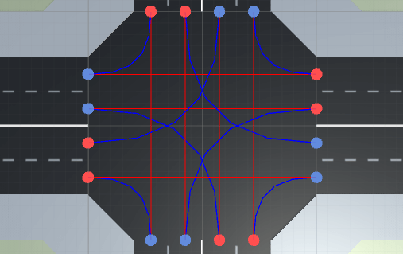
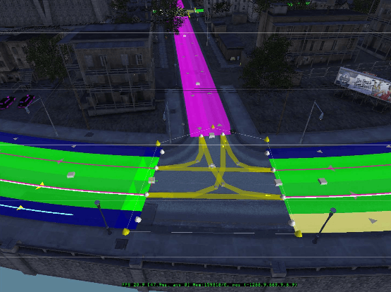
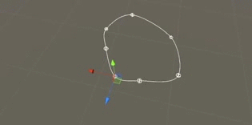
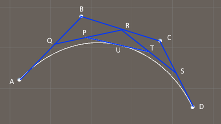
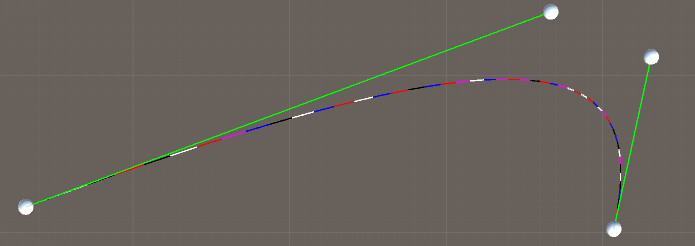
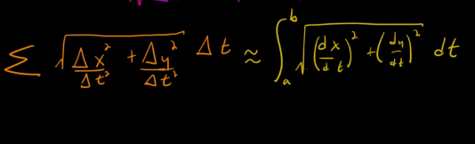
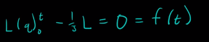
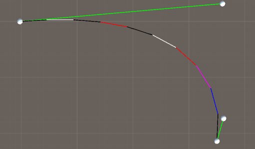

## Introduction
According to [Wikipedia](https://en.wikipedia.org/wiki/Interpolation), interpolation is a method of constructing new data points within the range of a discrete set of known data points. The easiest form of interpolation is linear interpolation, where you follow a straight line from A to B (the known data points).

<!--more-->

When interpolating you are using a parameter called t, which is defined as 0 when you are at the start position and 1 if you are at the end position. So to interpolate linearly from A to B we get the following function: f(t) = (1 - t) * A + t * B. If you insert t = 0, you get f(0) = A, which is the start position. Unity has this function built-in, so if you write Vector3.Lerp(A, B, t), it's the same as writing (1 - t) * A + t * B.

But following straight lines are kinda boring - it's more fun to follow curves. The curves are here called [splines](https://en.wikipedia.org/wiki/Spline_(mathematics)), which is "a numeric function that is piecewise-defined by polynomial functions, and which possesses a high degree of smoothness at the places where the polynomial pieces connect." The most common splines are quadratic, with one control point, and cubic, with two control points. These control points are determining the shape of the spline.

A [Cubic Hermite spline](https://en.wikipedia.org/wiki/Cubic_Hermite_spline) is a cubic polynomial spline. One example of these is the Catmull-Rom spline. But these can also be specified in other ways, where the [Bézier](https://en.wikipedia.org/wiki/B%C3%A9zier_curve) form being the most common. However, these two methods provide the same set of splines, and data can be easily converted between the Bézier and Hermite forms, so the names are often used as if they were synonymous.


This tutorial is divided into the following sections:

1. [Generate a Catmull-Rom spline](http://www.habrador.com/tutorials/interpolation/1-catmull-rom-splines/). Use these if you want to control the shape of the curve by moving the points that make up the curve.
2. [Generate a Bezier Curve](http://www.habrador.com/tutorials/interpolation/2-bezier-curve/). Use these if you want to control the shape of the curve even though the points that make up the curve are fixed.
3. [Move along a Bezier curve](http://www.habrador.com/tutorials/interpolation/3-move-along-curve/). Learn how to move along a Bezier curve with constant steps by first finding the length of the curve.
...and when you are done you will be able to guide your self-driving cars through a traffic intersection:



## 1.Generate a Catmull-Rom spline

Here you will create your very own Catmull-Rom spline in Unity. The name orignates from the creators of the spline: Edwin Catmull, co-founder of Pixar, and Raphael Rom. So the Catmull-Rom splines are often used in 3D animations. But the splines are also very popular to use in computer games. For example, the game Mafia uses Catmull-Rom splines to connect waypoints.


Catmull-Rom splines in Mafia. [Source](http://www.gdcvault.com/play/1013728/Living-City-in-Mafia)

In this tutorial we will focus on the very basics. We will create a smooth path between a series of spheres. And if we want to create a connected path so it can form a loop, we will also be able to do that. This is the beauty of the Catmull-Rom spline: if you have a series of points and want to generate a smooth curve along these points, it's possible. The reason is that the curve will use all points to form the curve (except the first and last point if you are not making a loop). Compare this with the Bezier curve, which will need extra control points which are not a part of the spline itself.

What's the basic idea behind the Catmull-Rom spline?. The answer is a [cubic polynomial](http://mathworld.wolfram.com/CubicPolynomial.html), which looks like this: f(t) = a_3 * t^3 + a_2 * t^2 + a_1 * t + a_0. It's your job to determine the coefficients a. To help, you can use [this link](http://www.iquilezles.org/www/articles/minispline/minispline.htm).

If you have 4 points called p0, p1, p2, and p3, you will be able to add a smooth path between the 2 middle points p1 and p2 (if the curve is not forming a loop). The middle points are called the curve´s **endpoints**. We need the first and last point (p0 and p3) to define the curve's **control points** that control the shape of the curve.

To create the curve we will move from p1 to p2 with a parameter called t (the same t as is in the cubic polynomial above). This t will always be a number between 0 and 1. If t is 0 we are exactly at the same coordinate as p1, and if t is 1 we are exactly at the same coordinate as p2. This [link](http://www.mvps.org/directx/articles/catmull/) will explain it better if you are lost.

What you first have to do after you have created a new scene in Unity is to create an empty GameObject. As children to that GameObject, you should create 4 spheres. Name these something like p1, p2, p3,... because they will form our path. Remember to create at least 4 of them, because that is the minimum number of points in a Catmull-Rom spline. Then create a new script called CatmullRomSpline, and add the following:

```cs
using UnityEngine;
using System.Collections;

//Interpolation between points with a Catmull-Rom spline
public class CatmullRomSpline : MonoBehaviour
{
	//Has to be at least 4 points
	public Transform[] controlPointsList;
	//Are we making a line or a loop?
	public bool isLooping = true;

	//Display without having to press play
	void OnDrawGizmos()
	{
		Gizmos.color = Color.white;

		//Draw the Catmull-Rom spline between the points
		for (int i = 0; i < controlPointsList.Length; i++)
		{
			//Cant draw between the endpoints
			//Neither do we need to draw from the second to the last endpoint
			//...if we are not making a looping line
			if ((i == 0 || i == controlPointsList.Length - 2 || i == controlPointsList.Length - 1) && !isLooping)
			{
				continue;
			}

			DisplayCatmullRomSpline(i);
		}
	}

	//Display a spline between 2 points derived with the Catmull-Rom spline algorithm
	void DisplayCatmullRomSpline(int pos)
	{
		//The 4 points we need to form a spline between p1 and p2
		Vector3 p0 = controlPointsList[ClampListPos(pos - 1)].position;
		Vector3 p1 = controlPointsList[pos].position;
		Vector3 p2 = controlPointsList[ClampListPos(pos + 1)].position;
		Vector3 p3 = controlPointsList[ClampListPos(pos + 2)].position;

		//The start position of the line
		Vector3 lastPos = p1;

		//The spline's resolution
		//Make sure it's is adding up to 1, so 0.3 will give a gap, but 0.2 will work
		float resolution = 0.2f;

		//How many times should we loop?
		int loops = Mathf.FloorToInt(1f / resolution);

		for (int i = 1; i <= loops; i++)
		{
			//Which t position are we at?
			float t = i * resolution;

			//Find the coordinate between the end points with a Catmull-Rom spline
			Vector3 newPos = GetCatmullRomPosition(t, p0, p1, p2, p3);

			//Draw this line segment
			Gizmos.DrawLine(lastPos, newPos);

			//Save this pos so we can draw the next line segment
			lastPos = newPos;
		}
	}

	//Clamp the list positions to allow looping
	int ClampListPos(int pos)
	{
		if (pos < 0)
		{
			pos = controlPointsList.Length - 1;
		}

		if (pos > controlPointsList.Length)
		{
			pos = 1;
		}
		else if (pos > controlPointsList.Length - 1)
		{
			pos = 0;
		}

		return pos;
	}

	//Returns a position between 4 Vector3 with Catmull-Rom spline algorithm
	//http://www.iquilezles.org/www/articles/minispline/minispline.htm
	Vector3 GetCatmullRomPosition(float t, Vector3 p0, Vector3 p1, Vector3 p2, Vector3 p3)
	{
		//The coefficients of the cubic polynomial (except the 0.5f * which I added later for performance)
		Vector3 a = 2f * p1;
		Vector3 b = p2 - p0;
		Vector3 c = 2f * p0 - 5f * p1 + 4f * p2 - p3;
		Vector3 d = -p0 + 3f * p1 - 3f * p2 + p3;

		//The cubic polynomial: a + b * t + c * t^2 + d * t^3
		Vector3 pos = 0.5f * (a + (b * t) + (c * t * t) + (d * t * t * t));

		return pos;
	}
}
```

That wasn't too difficult? If you go to the editor you should be able to do this:




## 2. Generate a Bezier curve

The [Bezier curve](https://en.wikipedia.org/wiki/B%C3%A9zier_curve) is the most common spline, and is used to design streamlined cars (that's why the algorithm was invented), in Photoshop, and to make roads in the game [Cities: Skylines](http://www.gamasutra.com/view/news/239534/Game_Design_Deep_Dive_Traffic_systems_in_Cities_Skylines.php). The basic idea is that you have 2 end points and 2 control points. To form the final spline you need to interpolate linearly in different layers with [De Casteljau's algorithm](https://en.wikipedia.org/wiki/De_Casteljau%27s_algorithm). But why is it called a Bezier curve if we are using De Casteljau's algorithm? The answer is that poor De Casteljau came up with the algorithm and Bezier stole it a few years later and renamed it to Bezier! Anyway, the algorithm is best explained with a picture:


A and D are the end points, and B and C are the control points. This will form a cubic curve. It is possible to add just one control point and you will end up with a quadratic curve, which is useful if you have limited processing power. For example, the game Quake 3 used quadratic Bezier curves. But a quadratic curve is less flexible than a cubic curve. You may also add more dimensions, so you can have as many control points as you want.

If A and D are fixed, you can move B and C to change the shape of the curve. But to make the curve itself, you first have to interpolate linearly between A and B, B and C, C and D. Now you have 3 new positions: Q, R, S. Now you are at a different "layer," so you have to interpolate linearly between Q and R, and R and S. To get the final point U you need on the Bezier curve, you interpolate linearly one final time between P and T. All these interpolations use the same t value. This is how it looks like in a script (To make it work you just need 4 spheres that make up the end points and control points):

```cs
using UnityEngine;
using System.Collections;

//Interpolation between 2 points with a Bezier Curve (cubic spline)
public class BezierCurve : MonoBehaviour 
{
    //Has to be at least 4 so-called control points
    public Transform startPoint;
    public Transform endPoint;
    public Transform controlPointStart;
    public Transform controlPointEnd;

    //Easier to use ABCD for the positions of the points so they are the same as in the tutorial image
    Vector3 A, B, C, D;

    //Display without having to press play
    void OnDrawGizmos()
    {
        A = startPoint.position;
        B = controlPointStart.position;
        C = controlPointEnd.position;
        D = endPoint.position;

	//The Bezier curve's color
        Gizmos.color = Color.white;

        //The start position of the line
        Vector3 lastPos = A;

        //The resolution of the line
        //Make sure the resolution is adding up to 1, so 0.3 will give a gap at the end, but 0.2 will work
        float resolution = 0.02f;

        //How many loops?
        int loops = Mathf.FloorToInt(1f / resolution);

        for (int i = 1; i <= loops; i++)
        {
            //Which t position are we at?
            float t = i * resolution;

            //Find the coordinates between the control points with a Catmull-Rom spline
            Vector3 newPos = DeCasteljausAlgorithm(t);

            //Draw this line segment
            Gizmos.DrawLine(lastPos, newPos);

            //Save this pos so we can draw the next line segment
            lastPos = newPos;
        }
		
	//Also draw lines between the control points and endpoints
        Gizmos.color = Color.green;

        Gizmos.DrawLine(A, B);
        Gizmos.DrawLine(C, D);
    }

    //The De Casteljau's Algorithm
    Vector3 DeCasteljausAlgorithm(float t)
    {
        //Linear interpolation = lerp = (1 - t) * A + t * B
        //Could use Vector3.Lerp(A, B, t)

        //To make it faster
        float oneMinusT = 1f - t;
        
        //Layer 1
        Vector3 Q = oneMinusT * A + t * B;
        Vector3 R = oneMinusT * B + t * C;
        Vector3 S = oneMinusT * C + t * D;

        //Layer 2
        Vector3 P = oneMinusT * Q + t * R;
        Vector3 T = oneMinusT * R + t * S;

        //Final interpolated position
        Vector3 U = oneMinusT * P + t * T;

        return U;
    }
}

```
That wasn't too difficult? If you go to the editor you should see this:


## 3. Move along a Bezier curve

The focus here is on the Bezier curve. But the ideas are the same if you want to move along a Catmull-Rom spline. The problem we want to solve is that the parameter t we have used to determine where we are on a spline is **NOT** always percentage of distance along the line. The reason is that the distances between each t step may be different depending on the positions of the points that determines the shape of the spline. As you can see in the image below where I've interpolated the Bezier curve with constant t steps, the individual line segments don't have the same length:


If you have a camera which need to move along the curve with constant steps you need to modify the curve to make sure each step has the same size. It's by the way common to move cameras along cubic splines. And yes, you could move the camera with constant speed (with something like Transform.Translate(Vector3.forward * speed * Time.deltatime)) and rotate it towards waypoints along the curve, but maybe that's not always possible. The solution to the problem is that we have to **reparametrize the curve** to make each step the same size.

To make each step the same size you need to learn a few things. Luckily, people have already made detailed explanations on YouTube, so there's no need to flood the Internet with more of the same information. So if you are interested in understanding what's going on here, you should watch the following (or if you aldready have the knowledge needed, or if you are just interested in the code, you can ignore them):

[1. Constant Speed Movement](https://www.youtube.com/watch?v=ajkvjI8DXbY)
[2. Review & Introduction to Quadratures](https://www.youtube.com/watch?v=PGFY8vKXzQU)
[3. Simpson's Rule](https://www.youtube.com/watch?v=J_a4PXI_nLY)
[4. Constant Speed Splines](https://www.youtube.com/watch?v=-mad4YPAn2U)
[Bonus: Crazy Collisions (Newton's Method)](https://www.youtube.com/watch?v=Ge28Xb4B3rU)
[Bonus: Arc Length: Derivation, Reparametrization, Example](https://www.youtube.com/watch?v=zj3eRqFXrQE)

To sum it up, the basic idea is that we have to first learn how to compute the length of the Bezier curve, and then how to compute where we are on a curve at certain positions. We already know how to compute where we are on a curve based on the parameter t. But now we imagine that we move along a straight line at constant steps, and at each step we have to translate the straight line to a position on the curve by calculating the curve's t value (to get a position on the curve) as if we had traveled along a curve.

### Calculate the length of the curve

To be able to compute the length of a curve we will use two methods. Both of these methods involve a root (which is not good from a performance perspective), so I'm not sure which one is the fastest, but one of them is most likely more accurate than the other.

#### Method 1. Straight lines

Here we loop through the Bezier curve in the same way as when we created it. But we will also calculate the length of each section and add them up to get the total length. So we will approximate the Bezier curve with a lot of small straight lines. This is the code:

```cs
//Get the length of the curve with a naive method where we divide the
//curve into straight lines and then measure the length of each line
float GetLengthNaive(float tStart, float tEnd)
{
	//This is the resolution, the higher the better
	int sections = 10;

	//Divide the curve into sections
	float delta = (tEnd - tStart) / (float)sections;

	//The start position of the curve
	Vector3 lastPos = DeCasteljausAlgorithm(tStart);

	//Init length
	float length = 0f;

	//Move along the curve
	for (int i = 1; i <= sections; i++)
	{
		//Calculate the t value at this section
		float t = tStart + delta * i;

		//Find the coordinates at this t
		Vector3 pos = DeCasteljausAlgorithm(t);

		//Add the section to the total length
		length += Vector3.Magnitude(pos - lastPos);

		//Save the latest pos for next loop
		lastPos = pos;
	}

	return length;
}
```

#### Method 2. Simpson's Rule

Here we loop through the Bezier curve in the same way as when we created it. But instead of approximating each section with a straight line, we will approximate each section with a second degree polynomial. The easiest way to do that is to use [Simpson's rule](https://en.wikipedia.org/wiki/Simpson%27s_rule).

To be able to use Simpson's rule we need an integral that calculates the length of the line. Luckily, the nice people in the YouTube videos gave us that integral (but we have three dimensions, so just add dz to it):


It's not possible to find an analytic solution to that integral, which is why we have to approximate it with Simpson's rule. But first we need to figure out what's inside the integral. If we have a Bezier curve, what's inside the integral is the derivative of the Bezier curve with respect to t. So you have to take the derivative of De Casteljau's Algorithm. This is easy: you just combine all different layers into one big equation called U, simplify, and then take the derivative. The result is this:

```cs
//The derivative of cubic De Casteljau's Algorithm
Vector3 DeCasteljausAlgorithmDerivative(float t)
{
	Vector3 dU = t * t * (-3f * (A - 3f * (B - C) - D));

	dU += t * (6f * (A - 2f * B + C));

	dU += -3f * (A - B); 

	return dU;
}
```

But what's inside the integral is actually the magnitude of the derivative, so we need another method:

```cs
//Get and infinite small length from the derivative of the curve at position t
float GetArcLengthIntegrand(float t)
{
	//The derivative at this point (the velocity vector)
	Vector3 dPos = DeCasteljausAlgorithmDerivative(t);

	//This the how it looks like in the YouTube videos
	//float xx = dPos.x * dPos.x;
	//float yy = dPos.y * dPos.y;
	//float zz = dPos.z * dPos.z;

	//float integrand = Mathf.Sqrt(xx + yy + zz);

	//Same as above
	float integrand = dPos.magnitude;

	return integrand;
}
```

And now we can use Simpson's rule to approximate the integral to get the length of the Bezier curve between two t values:

```cs
//Get the length of the curve between two t values with Simpson's rule
float GetLengthSimpsons(float tStart, float tEnd)
{
	//This is the resolution and has to be even
	int n = 20;

	//Now we need to divide the curve into sections
	float delta = (tEnd - tStart) / (float)n;

	//The main loop to calculate the length
	
	//Everything multiplied by 1
	float endPoints = GetArcLengthIntegrand(tStart) + GetArcLengthIntegrand(tEnd);

	//Everything multiplied by 4
	float x4 = 0f;
	for (int i = 1; i < n; i += 2)
	{
		float t = tStart + delta * i;

		x4 += GetArcLengthIntegrand(t);
	}

	//Everything multiplied by 2
	float x2 = 0f;
	for (int i = 2; i < n; i += 2)
	{
		float t = tStart + delta * i;

		x2 += GetArcLengthIntegrand(t);
	}

	//The final length
	float length = (delta / 3f) * (endPoints + 4f* x4 + 2f * x2);

	return length;
}
```

So which of the methods is most accurate? The answer is that we don't know because we don't know the exact length of the line. But if you test the methods you get the following:

* Small straight lines: 860.0575 m
* Simpson's rule: 861.2954 m
...so the difference between the methods is not big.

### Divide the curve into constant steps

Alright, finding the length of the Bezier curve was cool, but why do we need it? Well, if you have watched the YouTube videos you know that we need it to solve this equation:



The above equation answers the question: at which t value have we walked 1/3 of the total length of the curve? In the future we will replace this 1/3 with however far we have walked on the line. This distance is always measured from the start of the line. To solve the equation we are going to use a numerical method called [Newton's method](https://en.wikipedia.org/wiki/Newton%27s_method). The basic idea behind the method is that it starts with a t value, and then it's trying to find a better t value by using the t value from the last iteration. This is how it looks like in code:

```cs
//Use Newton–Raphsons method to find the t value at the end of this distance d
float FindTValue(float d, float totalLength)
{
	//Need a start value to make the method start
	//Should obviously be between 0 and 1
	//We can say that a good starting point is the percentage of distance traveled
	//If this start value is not working you can use the Bisection Method to find a start value
	//https://en.wikipedia.org/wiki/Bisection_method
	float t = d / totalLength;

	//Need an error so we know when to stop the iteration
	float error = 0.001f;

	//We also need to avoid infinite loops
	int iterations = 0;

	while (true)
	{
		//Newton's method
		float tNext = t - ((GetLengthSimpsons(0f, t) - d) / GetArcLengthIntegrand(t));

		//Have we reached the desired accuracy?
		if (Mathf.Abs(tNext - t) < error)
		{
			break;
		}

		t = tNext;

		iterations += 1;

		if (iterations > 1000)
		{
			break;
		}
	}

	return t;
}
```

To be able to better see the line sections, I've added a way to display a new color each new step. To make that work you need to add this to the top of the script:

```cs
//An array with colors to display the line segments that make up the final curve
Color[] colorsArray = {Color.white, Color.red, Color.blue, Color.magenta, Color.black};
```

And finally the method that will divide the Bezier curve into equal steps:

```cs
//Divide the curve into equal steps
void DivideCurveIntoSteps()
{
	//Find the total length of the curve
	float totalLength = GetLengthSimpsons(0f, 1f);

	//How many sections do we want to divide the curve into
	int parts = 10;

	//What's the length of one section?
	float sectionLength = totalLength / (float)parts;

	//Init the variables we need in the loop
	float currentDistance = 0f + sectionLength;
	
	//The curve's start position
	Vector3 lastPos = A;

	//The Bezier curve's color
	//Need a seed or the line will constantly change color
	Random.InitState(12345);

	int lastRandom = Random.Range(0, colorsArray.Length);

	for (int i = 1; i <= parts; i++)
	{
		//Use Newton–Raphsons method to find the t value from the start of the curve 
		//to the end of the distance we have
		float t = FindTValue(currentDistance, totalLength);

		//Get the coordinate on the Bezier curve at this t value
		Vector3 pos = DeCasteljausAlgorithm(t);


		//Draw the line with a random color
		int newRandom = Random.Range(0, colorsArray.Length);
		
		//Get a different random number each time
		while (newRandom == lastRandom)
		{
			newRandom = Random.Range(0, colorsArray.Length);
		}

		lastRandom = newRandom;

		Gizmos.color = colorsArray[newRandom];

		Gizmos.DrawLine(lastPos, pos);


		//Save the last position
		lastPos = pos;

		//Add to the distance traveled on the line so far
		currentDistance += sectionLength;
	}
}
```

Now we can compare if all this math was really worth it:




If you can't tell the difference then you've wasted a lot of time, but maybe learned something new! Otherwise you've just learned how to take constant steps along a Bezier curve!


## Read more

* [Essential Mathematics for Games and Interactive Applications](https://www.amazon.com/Essential-Mathematics-Games-Interactive-Applications/dp/0123742978)
* [Red Blob Games - Curved Paths](http://www.redblobgames.com/articles/curved-paths/)

## 参考

* [Everything about interpolation in Unity with C# code](http://www.habrador.com/tutorials/interpolation/)