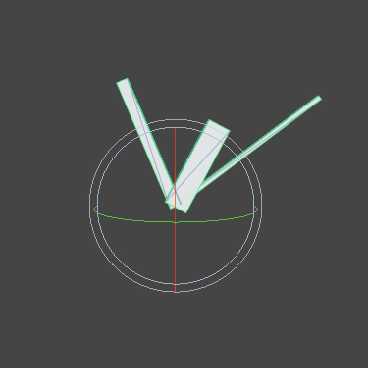

## 概述

时钟，一个简单的时间显示器。


* 创建对象层级；
* 创建、编写脚本添加到对象上；
* 访问命名空间；
* 使用方法来更新对象；
* 根据时间旋转对象。

本教程，我们将通过简单的C#脚本来控制时钟的时针、分针和秒针。

开始本教程之前，假设你了解了Unity编辑器的基本操作，如果你简单试玩过了Unity，那么就可以大胆开始了。


<!--more-->

## 创建时钟

首先创建一个新的Unity项目，这个项目不需要任何额外的包(package)，默认场景中有一个位于 `(0, 1, -10)`的摄像机沿着`Z轴`向前看。要想获得和场景视图相同的视角的话，可以选择摄像机，然后通过菜单栏中`GameObject / Align View`来设置，Mac中可以通过 `Command + Shift + F`快捷键设置。


我们需要一个对象结构来表示时钟。通过`GameObject / Create Empty`菜单或者Mac下通过`Command + Shift + N`创建一个新的空对象(GameObject)。将其我位置设置(position)为 `(0, 0, 0)`，命名为`Clock`，为该游戏对象创建三个子对象，分别命名为`Hours`，`Minutes`，`Seconds`并将它们的位置都设置为`(0, 0, 0)`。

> 什么是GameObject，子对象，请查看[Unity引擎重要概念](Unity-Engine-Core-Concept.md)

我们将使用简单的`box`来表示指针。通过`GameObject / 3D Object / Cube`为每个指针创建一个子长方体对象。分别设置：
* 时针的位置值为`(0, 1.0, 0)`，缩放值为`(0.50, 2, 0.50)`，
* 分针的位置值为`(0, 1.5, 0)`，缩放值为`(0.25, 3, 0.25)`，
* 秒针的位置值为`(0, 2.0, 0)`，缩放值为`(0.10, 4, 0.10)`。


## 让指针动起来

我们需要用脚本让指针动起来。在项目面板中右击通过`Create / C# Script`选项创建一个新的脚本，命名为`ClockAnimator`，双击打开，删除脚本中所有内容，这样我们好从零开始。

首先，需要明确的是，我们将要使用到`UnityEngine`命名空间中的一些东西，然后我们定义一个继承自`MonoBehaviour`且修饰符是`public`的类，类名为`ClockAnimator`。

```cs
using UnityEngine;

public class ClockAnimator : MonoBehaviour {
}
```

> 什么是`命名空间`，`类`请查看[C#要点](C-Sharp-Essential.md)
> 什么是`MonoBehaviour`，请查看[Unity引擎重要概念](Unity-Engine-Core-Concept.md)

这是用于作为游戏对象组件的内容最简单的脚本了。保存，然后将其从项目面板(Project)拖到层级(Hierarchy)面板的`Clock`对象上，或者通过`Add Component`按钮来添加。


To animate the arms, we need access to their Transform components first. Add a public Transform variable for each arm to the script, then save it. These public variables will become component properties which you can assign object to in the editor. The editor will then grab the Transform components of these objects and assign them to our variables. Select the Clock object, then drag the corresponding objects to the new properties.

要使指针动起来，首先我们需要能访问它们的`Transform`组件。在脚本中为每个指针创建一个`public`修饰的`Transform`变量并保存。我们将在Unity编辑器中看到这些公共变量，它们都成了组件的属性。编辑器将获取这些对象的`Transform`组件并赋值给我们定义的变量。选中`Clock`对象，拖动对应的对象到这些新的属性里去。

> 什么是`变量`，类请查看[C#要点](C-Sharp-Essential.md)

```cs
using UnityEngine;

public class ClockAnimator : MonoBehaviour {

	public Transform hours, minutes, seconds;
}
```

  


ClockAnimator with empty and filled properties.


接下来，我们向脚本中添加`Update`方法。这是Unity引擎中的一个特殊方法，它将会在每一帧调用一次，我们将用它来旋转时钟的指针。

```cs
using UnityEngine;

public class ClockAnimator : MonoBehaviour {

	public Transform hours, minutes, seconds;

	private void Update () {
		// currently do nothing
	}
}
```

> 什么是`方法`，类请查看[C#要点](C-Sharp-Essential.md)
> `Update`方法的访问修饰符可不可以是`public` ？请查看[Unity编程要点](Unity-Scripting-Core.md)


脚本保存之后，编辑器注意到我们的脚本有Update方法（当然除此之外，Start方法之类的都有这个特征），就会显示一个复选框，让我们可以禁用或启用该脚本。当然，我们这里会确保启用，也就是勾选该脚本。


每小时时针会旋转 `360/12`度，分针每分钟旋转`360/60`度，秒针每秒钟旋转`360/60`度。 为了方便，我们先把这些值定义为私有的浮点数常量。

```cs
using UnityEngine;

public class ClockAnimator : MonoBehaviour {

	private const float
		hoursToDegrees = 360f / 12f,
		minutesToDegrees = 360f / 60f,
		secondsToDegrees = 360f / 60f;

	public Transform hours, minutes, seconds;

	private void Update () {
		// currently do nothing
	}
}

```

> 关于const，请查看[C#要点](C-Sharp-Essential.md)

每次更新，我们都需要知道当前时间，`System`命名空间中包含了[DateTime](http://social.msdn.microsoft.com/search/en-us?query=DateTime) 结构(struct)，它完全可以胜任。它有一个静态属性`Now`一直可以提供当前时间，每次更新，我们需要获取它的值，然后存到临时变量中。

```cs
using UnityEngine;
using System;

public class ClockAnimator : MonoBehaviour {

	private const float
		hoursToDegrees = 360f / 12f,
		minutesToDegrees = 360f / 60f,
		secondsToDegrees = 360f / 60f;

	public Transform hours, minutes, seconds;

	private void Update () {
		DateTime time = DateTime.Now;
	}
}
```

> 什么是`结构`，类请查看[C#要点](C-Sharp-Essential.md)
> 什么是`属性(property)`，类请查看[C#要点](C-Sharp-Essential.md)

To get the arms to rotate, we need to change their local rotation. We do this by directly setting the localRotation of the arms, using quaternions. Quaternion has a nice method we can use to define an arbitrary rotation.

Because we're looking down the Z axis and Unity uses a left-handed coordinate system, the rotation must be negative around the Z axis.

要使得指针旋转，我们需要修改它们的`local rotation`值。我们通过使用`四元数(Quaternion)`直接设置指针的`localRotation`来实现。`Quaternion`有个很方便的方法可以用于任意设置游戏对象的角度。

```cs
using UnityEngine;
using System;

public class ClockAnimator : MonoBehaviour {

	private const float
		hoursToDegrees = 360f / 12f,
		minutesToDegrees = 360f / 60f,
		secondsToDegrees = 360f / 60f;

	public Transform hours, minutes, seconds;

	private void Update () {
		DateTime time = DateTime.Now;
		hours.localRotation =
			Quaternion.Euler(0f, 0f, time.Hour * -hoursToDegrees);
		minutes.localRotation =
			Quaternion.Euler(0f, 0f, time.Minute * -minutesToDegrees);
		seconds.localRotation =
			Quaternion.Euler(0f, 0f, time.Second * -secondsToDegrees);
	}
}
```


> 什么是四元数？请查看[3D 数学](Math-3D.md)

> **Why not use rotation?**
> localRotation refers to the actual rotation of a Transform, independent of the rotation of its parent. So if we were to rotate Clock, its arms would rotate along with it, as expected.
>
> rotation refers to the final rotation of a Transform as it is observed, taking the rotation of its parent into account. The arms would not adjust when we rotate Clock, as its rotation will be compensated for.


## 优化一下

This works! When in play mode, our clock shows the current time. However, it behaves much like a digital clock as it only shows discrete steps. Let's include an option to show analog time as well. Add a public boolean variable analog to the script and use it to determine what to do in the update method. We can toggle this value in the editor, even when in play mode.

哈！有用了！

进入Play模式下，时钟会显示当前的时间。

然而，由于每一步都是离散的，它看上去很像电子钟。我们来添加一个选项，让它也可以像模拟时钟一样。

在脚本中添加一个公共的bool类型的变量`analog`，用于决定`Update`方法中具体做什么。我们可以在编辑器切换该值，哪怕是在运行时都可以哦！


```cs
using UnityEngine;
using System;

public class ClockAnimator : MonoBehaviour {

	private const float
		hoursToDegrees = 360f / 12f,
		minutesToDegrees = 360f / 60f,
		secondsToDegrees = 360f / 60f;

	public Transform hours, minutes, seconds;

	public bool analog;

	private void Update () {
		if (analog) {
			// currently do nothing
		}
		else {
			DateTime time = DateTime.Now;
			hours.localRotation =
				Quaternion.Euler(0f, 0f, time.Hour * -hoursToDegrees);
			minutes.localRotation =
				Quaternion.Euler(0f, 0f, time.Minute * -minutesToDegrees);
			seconds.localRotation =
				Quaternion.Euler(0f, 0f, time.Second * -secondsToDegrees);
		}
	}
}
```


要实现模拟时钟特性，我们需要稍微不同的方式，不同于使用`DateTime.Now`，我们将使用`DateTime.Now.TimeOfDay`，它是`TimeSpan`类型。它可以让我们简单地获取到非常小的小时、分钟或秒钟的过渡。由于这些值是双精度的浮点数，我们需要进行强制转换。

> 什么是`类型转换`，类请查看[C#要点](C-Sharp-Essential.md)

```cs
using UnityEngine;
using System;

public class ClockAnimator : MonoBehaviour {

	private const float
		hoursToDegrees = 360f / 12f,
		minutesToDegrees = 360f / 60f,
		secondsToDegrees = 360f / 60f;

	public Transform hours, minutes, seconds;
	public bool analog;

	private void Update () {
		if (analog) {
			TimeSpan timespan = DateTime.Now.TimeOfDay;
			hours.localRotation = Quaternion.Euler(
				0f, 0f, (float)timespan.TotalHours * -hoursToDegrees);
			minutes.localRotation = Quaternion.Euler(
				0f, 0f, (float)timespan.TotalMinutes * -minutesToDegrees);
			seconds.localRotation = Quaternion.Euler(
				0f, 0f, (float)timespan.TotalSeconds * -secondsToDegrees);
		}
		else {
			DateTime time = DateTime.Now;
			hours.localRotation =
				Quaternion.Euler(0f, 0f, time.Hour * -hoursToDegrees);
			minutes.localRotation =
				Quaternion.Euler(0f, 0f, time.Minute * -minutesToDegrees);
			seconds.localRotation =
				Quaternion.Euler(0f, 0f, time.Second * -secondsToDegrees);
		}
	}
}
```


好了！现在我们的时钟也可以像模拟时钟一样工作了！