Curves and Splines, making your own path

This tutorial will take you from creating a simple line all the way to editing your own Beziér splines. You'll learn to

* Create a custom editor;
* Draw in the scene view;
* Support editing via the scene view;
* Create Beziér curves and understand the math behind them;
* Draw curves and their direction of movement.
* Build Beziér splines by combining curves;
* Support free, aligned, and mirrored control points;
* Support looping splines;
* Move and place objects along a spline.

This tutorial builds on the foundation laid by previous tutorials. If you completed the Maze tutorial then you're good to go.
This tutorial was made with Unity 4.5.2. It might not work for older versions.


<!--more-->

## Lines

Let's start simple by creating a line component. It needs two points `p0` and `p1` which define a line segment that goes from the first to the second.

```cs
using UnityEngine;

public class Line : MonoBehaviour {

	public Vector3 p0, p1;
}
```

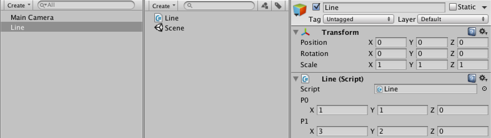

While we can now create game objects with line components and adjust the points, we don't see anything in the scene. Let's provide some useful visual information when our line is selected. We can do this by creating a custom inspector for our component.
Editor-related code needs to be placed inside an `Editor` folder, so create one and put a new `LineInspector` script in it.
The inspector needs to extend `UnityEditor.Editor`. We also have to give it the `UnityEditor.CustomEditor` attribute. This lets Unity know that it should use our class instead of the default editor for Line components.

> What does typeof do?
> The typeof operator is used to get the type object of something, usually a class. You cannot use it with variables, only with explicit type names.
Why not just write down the class name? Because that results in a compiler error! The extra step is needed because you're converting a type into a variable.

> Is the Editor folder required?
> Unity splits projects into multiple parts that are compiled in a specific order. The Editor folder is used to separate everything that's about the editor from everything that's not. It's not included in game builds, and code outside of it cannot access it. For example, while LineInspector knows about Line, the reverse is not true.

```cs
using UnityEditor;
using UnityEngine;

[CustomEditor(typeof(Line))]
public class LineInspector : Editor {
}
```

An empty editor does not change anything. We need to add an OnSceneGUI method, which is a special Unity event method. We can use it to draw stuff in the scene view for our component.
The Editor class has a target variable, which is set to the object to be drawn when OnSceneGUI is called. We can cast this variable to a line and then use the Handles utility class to draw a line between our points.

```cs
	private void OnSceneGUI () {
		Line line = target as Line;

		Handles.color = Color.white;
		Handles.DrawLine(line.p0, line.p1);
	}
```

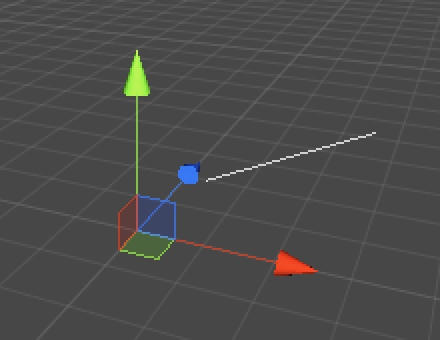  
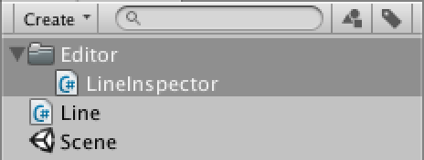
Showing a line.

We now see the line, but it doesn't take its transform's settings into account. Moving, rotating, and scaling does not affect them at all. This is because [Handles](http://docs.unity3d.com/Documentation/ScriptReference/Handles.html) operates in world space while the points are in the local space of the line. We have to explicitly convert the points into world space points.

```cs
	private void OnSceneGUI () {
		Line line = target as Line;
		Transform handleTransform = line.transform;
		Vector3 p0 = handleTransform.TransformPoint(line.p0);
		Vector3 p1 = handleTransform.TransformPoint(line.p1);

		Handles.color = Color.white;
		Handles.DrawLine(p0, p1);
	}
```

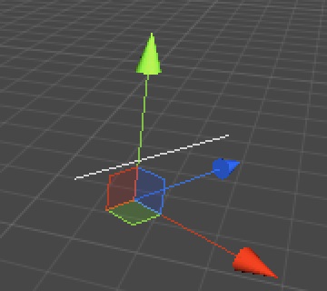  
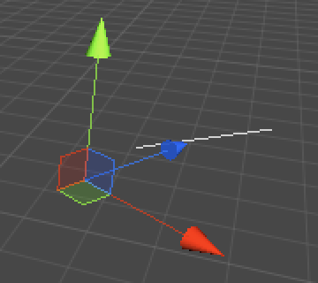
Untransformed vs. transformed.

Besides showing the line, we can also show position handles for our two points. To do this, we also need our transform's rotation so we can align them correctly.

```cs
	private void OnSceneGUI () {
		Line line = target as Line;
		Transform handleTransform = line.transform;
		Quaternion handleRotation = handleTransform.rotation;
		Vector3 p0 = handleTransform.TransformPoint(line.p0);
		Vector3 p1 = handleTransform.TransformPoint(line.p1);

		Handles.color = Color.white;
		Handles.DrawLine(p0, p1);
		Handles.DoPositionHandle(p0, handleRotation);
		Handles.DoPositionHandle(p1, handleRotation);
	}

```

Although we now get handles, they do not honor Unity's pivot rotation mode. Fortunately, we can use `Tools.pivotRotation` to determine the current mode and set our rotation accordingly.

```cs
		Quaternion handleRotation = Tools.pivotRotation == PivotRotation.Local ?
			handleTransform.rotation : Quaternion.identity;
```

 
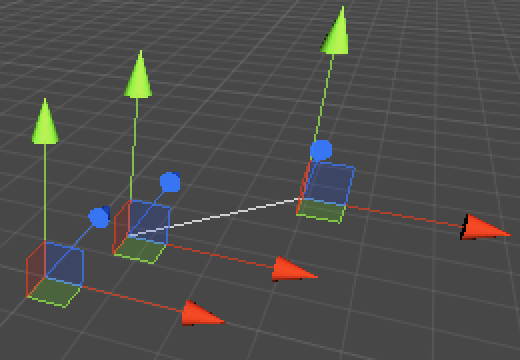
 

Local vs. global pivot rotation.

To make the handles actually work, we need to assign their results back to the line. However, as the handle values are in world space we need to convert them back into the line's local space with the `InverseTransformPoint` method. Also, we only need to do this when a point has changed. We can use `EditorGUI.BeginChangeCheck` and `EditorGUI.EndChangeCheck` for this. The second method tells us whether a change happened after calling the first method.

```cs
		EditorGUI.BeginChangeCheck();
		p0 = Handles.DoPositionHandle(p0, handleRotation);
		if (EditorGUI.EndChangeCheck()) {
			line.p0 = handleTransform.InverseTransformPoint(p0);
		}
		EditorGUI.BeginChangeCheck();
		p1 = Handles.DoPositionHandle(p1, handleRotation);
		if (EditorGUI.EndChangeCheck()) {
			line.p1 = handleTransform.InverseTransformPoint(p1);
		}
```

Now we can drag our points in the scene view!

There are two additional issues that need attention. First, we cannot undo the drag operations. This is fixed by adding a call to `Undo.RecordObject` before we make any changes. Second, Unity does not know that a change was made, so for example won't ask the user to save when quitting. This is remedied with a call to `EditorUtility.SetDirty`.

```cs
    EditorGUI.BeginChangeCheck();
		p0 = Handles.DoPositionHandle(p0, handleRotation);
		if (EditorGUI.EndChangeCheck()) {
			Undo.RecordObject(line, "Move Point");
			EditorUtility.SetDirty(line);
			line.p0 = handleTransform.InverseTransformPoint(p0);
		}
		EditorGUI.BeginChangeCheck();
		p1 = Handles.DoPositionHandle(p1, handleRotation);
		if (EditorGUI.EndChangeCheck()) {
			Undo.RecordObject(line, "Move Point");
			EditorUtility.SetDirty(line);
			line.p1 = handleTransform.InverseTransformPoint(p1);
		}
```

## Curves

It is time to upgrade to curves. A curve is like a line, but it doesn't need to be straight. Specifically, we'll create a Beziér curve.
A Beziér curve is defined by a sequence of points. It starts at the first point and ends at the last point, but does not need to go through the intermediate points. Instead, those points pull the curve away from being a straight line.
Create a new BezierCurve component and give it an array of points. Also give it a Reset method that initializes it with three points. This method also functions as a special Unity method, which is called by the editor when the component is created or reset.

```cs
using UnityEngine;

public class BezierCurve : MonoBehaviour {

	public Vector3[] points;

	public void Reset () {
		points = new Vector3[] {
			new Vector3(1f, 0f, 0f),
			new Vector3(2f, 0f, 0f),
			new Vector3(3f, 0f, 0f)
		};
	}
}
```

We also create an inspector for the curve, based on `LineInspector`. To reduce code repetition, we move the code that shows a point to a separate ShowPoint method that we can call with an index. We also turn curve, handleTransform, and handleRotation into class variables so we don't need to pass then to ShowPoint.
While it is a new script, I've marked the differences as if we modified `LineInspector`.

```cs
using UnityEditor;
using UnityEngine;

[CustomEditor(typeof(BezierCurve))]
public class BezierCurveInspector : Editor {

	private BezierCurve curve;
	private Transform handleTransform;
	private Quaternion handleRotation;

	private void OnSceneGUI () {
		curve = target as BezierCurve;
		handleTransform = curve.transform;
		handleRotation = Tools.pivotRotation == PivotRotation.Local ?
			handleTransform.rotation : Quaternion.identity;

		Vector3 p0 = ShowPoint(0);
		Vector3 p1 = ShowPoint(1);
		Vector3 p2 = ShowPoint(2);

		Handles.color = Color.white;
		Handles.DrawLine(p0, p1);
		Handles.DrawLine(p1, p2);
	}

	private Vector3 ShowPoint (int index) {
		Vector3 point = handleTransform.TransformPoint(curve.points[index]);
		EditorGUI.BeginChangeCheck();
		point = Handles.DoPositionHandle(point, handleRotation);
		if (EditorGUI.EndChangeCheck()) {
			Undo.RecordObject(curve, "Move Point");
			EditorUtility.SetDirty(curve);
			curve.points[index] = handleTransform.InverseTransformPoint(point);
		}
		return point;
	}
}
```

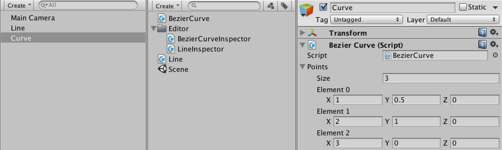 
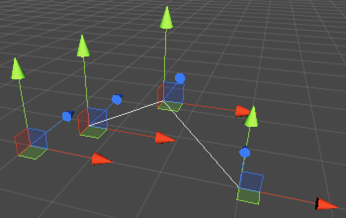
A 3-point curve.

The idea of Beziér curves is that they are parametric. If you give it a value – typically named `t` – between zero and one, you get a point on the curve. As `t` increases from zero to one, you move from the first point of the curve to the last point.
To show our curve in the scene, we can approximate it by drawing straight lines between successive steps on the curve. We can do this with a simple loop, assuming our curve has a `GetPoint` method. We also keep drawing the straight lines between the points, but change their color to gray.

```cs
	private const int lineSteps = 10;
			
	private void OnSceneGUI () {
		curve = target as BezierCurve;
		handleTransform = curve.transform;
		handleRotation = Tools.pivotRotation == PivotRotation.Local ?
			handleTransform.rotation : Quaternion.identity;

		Vector3 p0 = ShowPoint(0);
		Vector3 p1 = ShowPoint(1);
		Vector3 p2 = ShowPoint(2);

		Handles.color = Color.gray;
		Handles.DrawLine(p0, p1);
		Handles.DrawLine(p1, p2);

		Handles.color = Color.white;
		Vector3 lineStart = curve.GetPoint(0f);
		for (int i = 1; i <= lineSteps; i++) {
			Vector3 lineEnd = curve.GetPoint(i / (float)lineSteps);
			Handles.DrawLine(lineStart, lineEnd);
			lineStart = lineEnd;
		}
	}
```

Now we have to add the `GetPoint` method to BezierCurve otherwise it won't compile. Here we again make an assumption, this time that there's a utility Beziér class that does the calculation for any sequence of points. We feed it our points and transform the result to world space.

```cs
	public Vector3 GetPoint (float t) {
		return transform.TransformPoint(Bezier.GetPoint(points[0], points[1], points[2], t));
	}
```

So we add a static Bezier class with the required method. For now, let's ignore the middle point and simply linearly interpolate between the first and last point.

> How does Vector3.Lerp work?
> The Vector3.Lerp method performs a linear interpolation between two vectors or points. Linear interpolation means you start at the first value and end at the second value, moving in a straight line at constant velocity between them.
Mathematically, such interpolation is done by providing a parameter – usually named t – that specifies how far along this process we are. It starts at zero and ends at one.
So the result of Vector3.Lerp(a, b, 0f) should be a, the result of Vector3.Lerp(a, b, 1f) should be b, and the result of Vector3.Lerp(a, b, 0.5f) should be the average of them. This is done by multiplying the first argument by (1f - t), multiplying the second argument by t, and then adding them.
> As this is only valid when t is in the 0–1 range, it is clamped as well.

```cs
using UnityEngine;

public static class Bezier {

	public static Vector3 GetPoint (Vector3 p0, Vector3 p1, Vector3 p2, float t) {
		return Vector3.Lerp(p0, p2, t);
	}
}
```

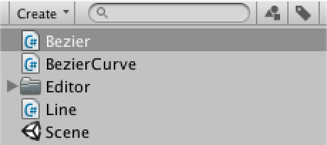  
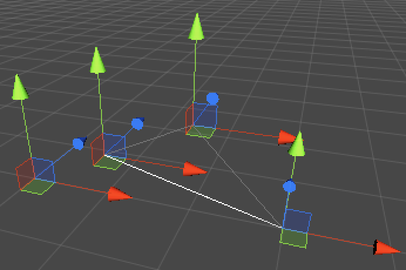
Beziér library and linear interpolation.

Of course, linear interpolation between the end points totally ignores the middle point. So how do we incorporate the middle point? The answer is to interpolate more than once. First, linearly interpolate between the first and middle point, and also between the middle and last point. That gives us two new points. Linearly interpolating between those two gives us the final point on the curve.

```cs
	public static Vector3 GetPoint (Vector3 p0, Vector3 p1, Vector3 p2, float t) {
		return Vector3.Lerp(Vector3.Lerp(p0, p1, t), Vector3.Lerp(p1, p2, t), t);
	}
```

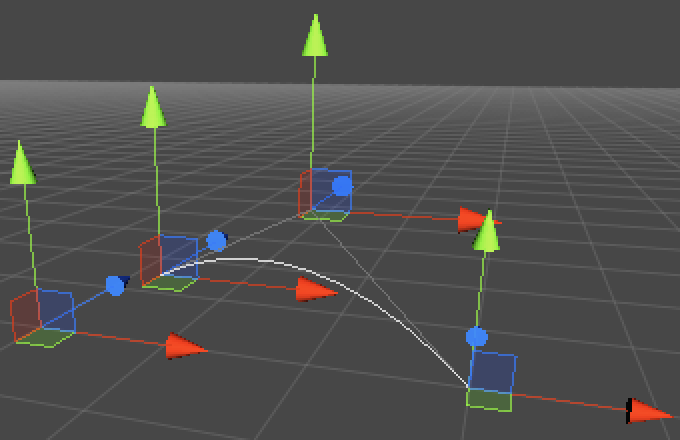
A quadratic Beziér curve.

This kind of curve is known as a quadratic Beziér curve, because of the polynomial math involved.
The linear curve can be written as **B(t) = (1 - t) P0 + t P1**.
One step deeper you get **B(t) = (1 - t) ((1 - t) P0 + t P1) + t ((1 - t) P1 + t P2)**. This is really just the linear curve with P0 and P1 replaced by two new linear curves. It can also be rewritten into the more compact form **B(t) = (1 - t)2 P0 + 2 (1 - t) t P1 + t2 P2**. （要详细看看公式，这边有平方）
So we could use the quadratic formula instead of three calls to `Vector3.Lerp`.

```cs
	public static Vector3 GetPoint (Vector3 p0, Vector3 p1, Vector3 p2, float t) {
		t = Mathf.Clamp01(t);
		float oneMinusT = 1f - t;
		return
			oneMinusT * oneMinusT * p0 +
			2f * oneMinusT * t * p1 +
			t * t * p2;
	}
```

Now that we have a polynomial function, we can also describe its derivatives. The first derivative of our quadratic Beziér curve is `B'(t) = 2 (1 - t) (P1 - P0) + 2 t (P2 - P1)`. Let's add it.

> What's a derivative?
> A derivative of a function measures its rate of change, and is a function itself as well.
For example, the function f(t) = 3 is constant, so its derivative is f'(t) = 0.
Another example, f(t) = t is linear, so its rate of change is constant f'(t) = 1. Compare this with f(t) = 2 t, which has derivative f'(t) = 2.
> Jumping to a quadratic function, f(t) = t2 has a linear derivative, f'(t) = 2 t, which means it keeps growing faster.
Combinations work too. f(t) = t2 + 3 t + 4 has derivative f'(t) = 2 t + 3 + 0.
In general, tn becomes n t(n - 1) as long as n is larger than zero. There are more complex rules as well, but you don't need those to deal with derivatives of Beziér curves.
> So how do we get the first derivative of B(t) = (1 - t)2 P0 + 2 (1 - t) t P1 + t2 P2?
> Note that (1 - t)2 rewrites to t2 - 2 t + 1, which has derivative 2 t - 2. And 2 (1 - t) t rewrites to 2 t - 2 t2, which has derivative 2 - 4 t.
> So we end up with B'(t) = (2 t - 2) P0 + (2 - 4 t) P1 + 2 t P2.
> Then we rewrite it somewhat, turning the P1 part into -(2 t - 2) P1 - 2 t P1. This allows us to combine it with the P0 and P2 parts so we get B'(t) = (2 t - 2) (P0 - P1) + 2 t (P2 - P1).
> As a last step we invert the first term and extract 2 so we get the nice B'(t) = 2 (1 - t) (P1 - P0) + 2 t (P2 - P1).

```cs
	public static Vector3 GetFirstDerivative (Vector3 p0, Vector3 p1, Vector3 p2, float t) {
		return
			2f * (1f - t) * (p1 - p0) +
			2f * t * (p2 - p1);
	}
```

This function produces lines tangent to the curve, which can be interpreted as the speed with which we move along the curve. So now we can add a `GetVelocity` method to `BezierCurve`.
Because it produces a velocity vector and not a point, it should not be affected by the position of the curve, so we subtract that after transforming.

> What about the second derivative?
> The second derivative is the derivative of the first derivative, which defines the acceleration – the change of velocity – along the curve. For the quadratic Beziér curve, it is B''(t) = 2 (P2 - 2 P1 + P0). As t is not part of the formula, quadratic curves have a constant acceleration.

> Why not use TransformDirection?
> The TransformDirection method only takes the object's rotation into account, but we also need to apply its scale. So we transform our vector as if it were a point and then undo the positioning. This way it always produces the correct velocity, even when using a negative scale.

```cs
	public Vector3 GetVelocity (float t) {
		return transform.TransformPoint(Bezier.GetFirstDerivative(points[0], points[1], points[2], t)) -
			transform.position;
	}
```

Now we can visualize the speed along the curve in BezierCurveInspector's OnSceneGUI method.

```cs
		Vector3 lineStart = curve.GetPoint(0f);
		Handles.color = Color.green;
		Handles.DrawLine(lineStart, lineStart + curve.GetVelocity(0f));
		for (int i = 1; i <= lineSteps; i++) {
			Vector3 lineEnd = curve.GetPoint(i / (float)lineSteps);
			Handles.color = Color.white;
			Handles.DrawLine(lineStart, lineEnd);
			Handles.color = Color.green;
			Handles.DrawLine(lineEnd, lineEnd + curve.GetVelocity(i / (float)lineSteps));
			lineStart = lineEnd;
		}
```

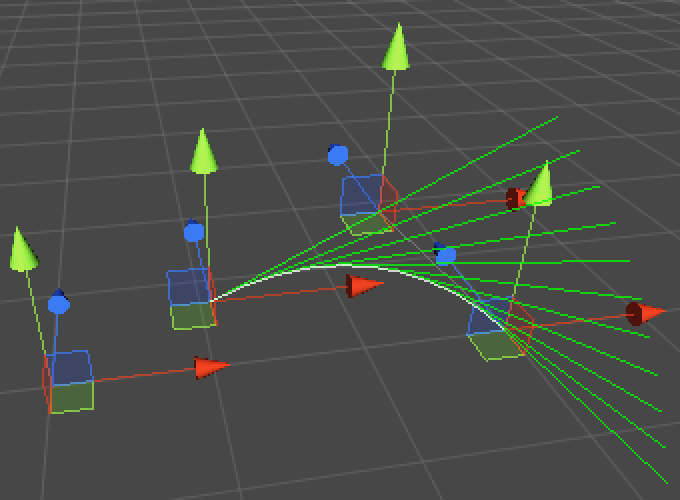
Showing velocity.

We can clearly see how the velocity changes along the curve, but those long lines are cluttering the view. Instead of showing the velocity, we can suffice with showing the direction of movement.

```cs
		Vector3 lineStart = curve.GetPoint(0f);
		Handles.color = Color.green;
		Handles.DrawLine(lineStart, lineStart + curve.GetDirection(0f));
		for (int i = 1; i <= lineSteps; i++) {
			Vector3 lineEnd = curve.GetPoint(i / (float)lineSteps);
			Handles.color = Color.white;
			Handles.DrawLine(lineStart, lineEnd);
			Handles.color = Color.green;
			Handles.DrawLine(lineEnd, lineEnd + curve.GetDirection(i / (float)lineSteps));
			lineStart = lineEnd;
		}

```

Which requires that we add GetDirection to BezierCurve, which simply normalizes the velocity.

```cs
	public Vector3 GetDirection (float t) {
		return GetVelocity(t).normalized;
	}
```

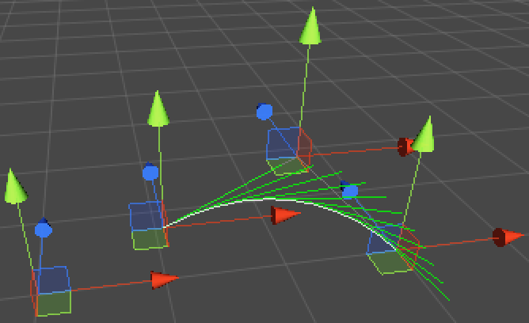
Showing direction.

Let's go a step further and add new methods to Bezier for cubic curves as well! It works just like the quadratic version, except that it needs a fourth point and its formula goes another step deeper, resulting in a combination of six linear interpolations. The consolidated function of that becomes **B(t) = (1 - t)3 P0 + 3 (1 - t)2 t P1 + 3 (1 - t) t2 P2 + t3 P3** which has as its first derivative **B'(t) = 3 (1 - t)2 (P1 - P0) + 6 (1 - t) t (P2 - P1) + 3 t2 (P3 - P2)**.

```cs
	public static Vector3 GetPoint (Vector3 p0, Vector3 p1, Vector3 p2, Vector3 p3, float t) {
		t = Mathf.Clamp01(t);
		float oneMinusT = 1f - t;
		return
			oneMinusT * oneMinusT * oneMinusT * p0 +
			3f * oneMinusT * oneMinusT * t * p1 +
			3f * oneMinusT * t * t * p2 +
			t * t * t * p3;
	}
	
	public static Vector3 GetFirstDerivative (Vector3 p0, Vector3 p1, Vector3 p2, Vector3 p3, float t) {
		t = Mathf.Clamp01(t);
		float oneMinusT = 1f - t;
		return
			3f * oneMinusT * oneMinusT * (p1 - p0) +
			6f * oneMinusT * t * (p2 - p1) +
			3f * t * t * (p3 - p2);
	}
```

With that, we can upgrade BezierCurve from quadratic to cubic by taking an additional point into consideration. Be sure to add the fourth point to its array either manually or by resetting the component.

```cs
	public Vector3 GetPoint (float t) {
		return transform.TransformPoint(Bezier.GetPoint(points[0], points[1], points[2], points[3], t));
	}
	
	public Vector3 GetVelocity (float t) {
		return transform.TransformPoint(
			Bezier.GetFirstDerivative(points[0], points[1], points[2], points[3], t)) - transform.position;
	}
	
	public void Reset () {
		points = new Vector3[] {
			new Vector3(1f, 0f, 0f),
			new Vector3(2f, 0f, 0f),
			new Vector3(3f, 0f, 0f),
			new Vector3(4f, 0f, 0f)
		};
	}
```

`BezierCurveInspector` now needs to be updated so it shows the fourth point as well.

```cs
		Vector3 p0 = ShowPoint(0);
		Vector3 p1 = ShowPoint(1);
		Vector3 p2 = ShowPoint(2);
		Vector3 p3 = ShowPoint(3);
		
		Handles.color = Color.gray;
		Handles.DrawLine(p0, p1);
		Handles.DrawLine(p2, p3);
```

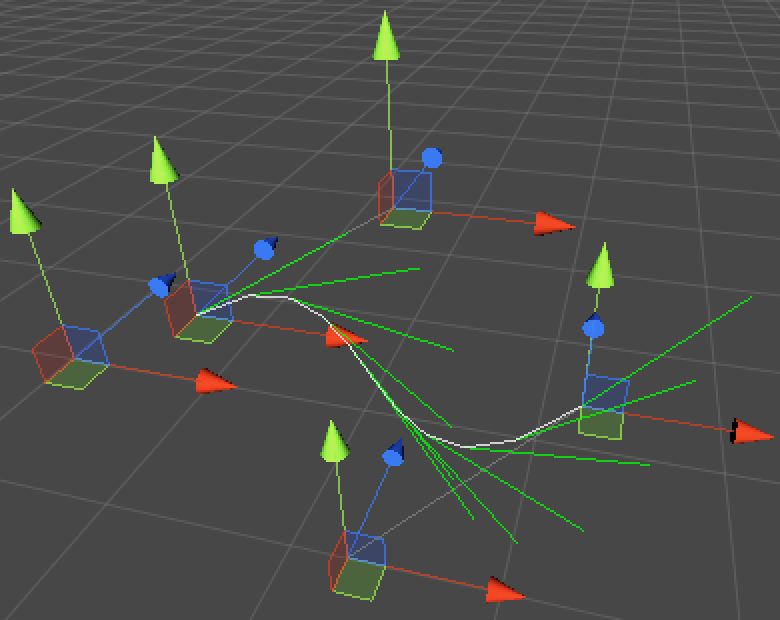
A cubic Beziér curve.

It is probably visually obvious by now that we draw our curve using straight line segments. We could increase the number of steps to improve the visual quality. We could also use an iterative approach to get accurate down to pixel level. But we can also use Unity's Handles.DrawBezier method, which takes care of drawing nice cubic Beziér curves for us.
Let's also show the directions in their own method and scale them to take up less space.

> How does DrawBezier work?
> The method is a bit weird in that its parameter list begins with the end points, followed by the two intermediate points. The middle points are named tangents, but they are expected to be actual control points and not direction vectors.
The color argument is obvious, but it also expects a texture and a width. The width is in pixels and should be 2 if you want an anti-aliased look. The texture also needs to be of a specific form to allow anti-aliasing, though the default works fine and I always supply null.

```cs
	private const float directionScale = 0.5f;
	
	private void OnSceneGUI () {
		curve = target as BezierCurve;
		handleTransform = curve.transform;
		handleRotation = Tools.pivotRotation == PivotRotation.Local ?
			handleTransform.rotation : Quaternion.identity;
		
		Vector3 p0 = ShowPoint(0);
		Vector3 p1 = ShowPoint(1);
		Vector3 p2 = ShowPoint(2);
		Vector3 p3 = ShowPoint(3);
		
		Handles.color = Color.gray;
		Handles.DrawLine(p0, p1);
		Handles.DrawLine(p2, p3);
		
		ShowDirections();
		Handles.DrawBezier(p0, p3, p1, p2, Color.white, null, 2f);
	}

	private void ShowDirections () {
		Handles.color = Color.green;
		Vector3 point = curve.GetPoint(0f);
		Handles.DrawLine(point, point + curve.GetDirection(0f) * directionScale);
		for (int i = 1; i <= lineSteps; i++) {
			point = curve.GetPoint(i / (float)lineSteps);
			Handles.DrawLine(point, point + curve.GetDirection(i / (float)lineSteps) * directionScale);
		}
	}
```

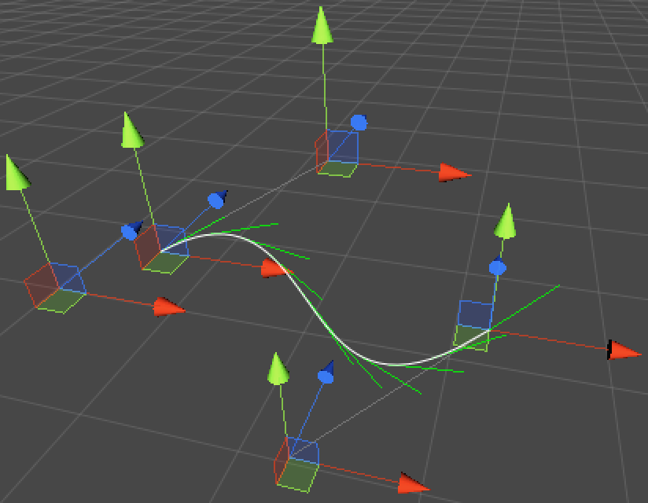
Using Handles.DrawBezier and scaled direction lines.

## Splines

Having a single curve is nice, but to create complex paths we would need to concatenate multiple curves. Such a construct is known as a spline. Let's create one by copying the `BezierCurve` code, changing the type to `BezierSpline`.

```cs
using UnityEngine;

public class BezierSpline : MonoBehaviour {

	public Vector3[] points;
	
	public Vector3 GetPoint (float t) {
		return transform.TransformPoint(Bezier.GetPoint(points[0], points[1], points[2], points[3], t));
	}
	
	public Vector3 GetVelocity (float t) {
		return transform.TransformPoint(
			Bezier.GetFirstDerivative(points[0], points[1], points[2], points[3], t)) - transform.position;
	}
	
	public Vector3 GetDirection (float t) {
		return GetVelocity(t).normalized;
	}
	
	public void Reset () {
		points = new Vector3[] {
			new Vector3(1f, 0f, 0f),
			new Vector3(2f, 0f, 0f),
			new Vector3(3f, 0f, 0f),
			new Vector3(4f, 0f, 0f)
		};
	}
}
```

We also create an editor for it, by copying and tweaking the code from `BezierCurveInspector`. We can then create a spline object and edit it, just like a curve.

```cs
using UnityEditor;
using UnityEngine;

[CustomEditor(typeof(BezierSpline))]
public class BezierSplineInspector : Editor {

	private const int lineSteps = 10;
	private const float directionScale = 0.5f;

	private BezierSpline spline;
	private Transform handleTransform;
	private Quaternion handleRotation;

	private void OnSceneGUI () {
		spline = target as BezierSpline;
		handleTransform = spline.transform;
		handleRotation = Tools.pivotRotation == PivotRotation.Local ?
			handleTransform.rotation : Quaternion.identity;
		
		Vector3 p0 = ShowPoint(0);
		Vector3 p1 = ShowPoint(1);
		Vector3 p2 = ShowPoint(2);
		Vector3 p3 = ShowPoint(3);
		
		Handles.color = Color.gray;
		Handles.DrawLine(p0, p1);
		Handles.DrawLine(p2, p3);
		
		ShowDirections();
		Handles.DrawBezier(p0, p3, p1, p2, Color.white, null, 2f);
	}

	private void ShowDirections () {
		Handles.color = Color.green;
		Vector3 point = spline.GetPoint(0f);
		Handles.DrawLine(point, point + spline.GetDirection(0f) * directionScale);
		for (int i = 1; i <= lineSteps; i++) {
			point = spline.GetPoint(i / (float)lineSteps);
			Handles.DrawLine(point, point + spline.GetDirection(i / (float)lineSteps) * directionScale);
		}
	}

	private Vector3 ShowPoint (int index) {
		Vector3 point = handleTransform.TransformPoint(spline.points[index]);
		EditorGUI.BeginChangeCheck();
		point = Handles.DoPositionHandle(point, handleRotation);
		if (EditorGUI.EndChangeCheck()) {
			Undo.RecordObject(spline, "Move Point");
			EditorUtility.SetDirty(spline);
			spline.points[index] = handleTransform.InverseTransformPoint(point);
		}
		return point;
	}
}
```

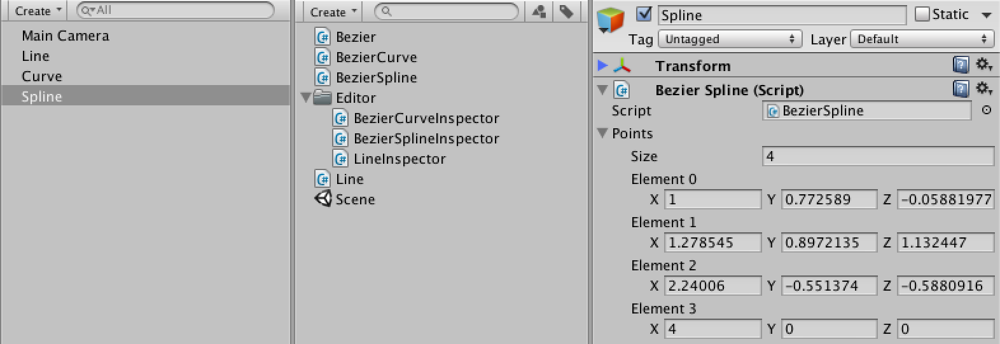
A new spline type.


Let's add a method to BezierSpline to add another curve to the spline. Because we want the spline to be continuous, the last point of the previous curve is the same as the first point of the next curve. So each extra curve adds three more points.

> What's ref?
> The ref keyword indicates that we're passing an argument by reference. This means that the method is working directly with our value and not a copy of it. So if we provided an integer variable and the method assigned a value to it, then it is our integer that changed. It would be like the method returned the new value and we assigned it to our own variable.
The same applies when used with object references. If the method changed the reference, then it is our reference that changed. This means that after the method finished, we could be holding a reference to a different object.
You can't pass a constant value as a ref argument, it must be an initialized variable.
There is also an out keyword. It works the same as ref, except that it need not be initialized and enforces that the method assigns a value to it.
The ref and out modifiers are typically only used when a method has multiple independent results or when wanting to guarantee that a caller's variable is assigned to. And sometimes for performance when dealing with large structs. In general, it is to be avoided.


> How does Array.Resize work?
> Array.Resize is a generic method that takes a reference to an array variable, creates a new array of the same type of the given length, and assigns it to the variable. It also copies the contents of the old array to the new array, up to its capacity.
So a new array is created and the old one – if there was one – is probably no longer used by anyone and will be taken care of by the garbage collector at some point.
Note that it is a generic method, but we didn't indicate what type to use. The compiler is smart enough to infer the type from the argument and turn it into Array.Resize<Vector3>(ref points, points.Length + 3).

```cs
	public void AddCurve () {
		Vector3 point = points[points.Length - 1];
		Array.Resize(ref points, points.Length + 3);
		point.x += 1f;
		points[points.Length - 3] = point;
		point.x += 1f;
		points[points.Length - 2] = point;
		point.x += 1f;
		points[points.Length - 1] = point;
	}
```

We're using the `Array.Resize` method to create a larger array to hold the new points. It's inside the System namespace, so we should declare that we're using it at the top of our script.

```cs
using UnityEngine;
using System;
```

To actually be able to add a curve, we have to add a button to our spline's inspector. We can customize the inspector that Unity uses for our component by overriding the OnInspectorGUI method of BezierSplineInspector. Note that this is not a special Unity method, it relies on inheritance.
To keep drawing the default inspector, we call the DrawDefaultInspector method. Then we use `GUILayout` to draw a button, which when clicked adds a curve.

> How does GUILayout.Button work?
> The Button method both shows a button and returns whether it was clicked. So you typically call it inside an if statement and perform the necessary work in the corresponding code block.
What actually happens is that your own GUI method – in this case OnInspectorGUI – gets called far more often than just once. It gets called when performing layout, when repainting, and whenever a significant GUI event happens, which is quite often. Only when a mouse click event comes along that is consumed by the button, will it return true.
To get an idea of how often the GUI methods get called, put Debug.Log(Event.current); at the start of your OnInspectorGUI method, then fool around a bit in the editor and watch the console.
Usually you need not worry about this, but be aware of it when performing heavy work like generating textures. You don't want to do that dozens of times per second if you don't need to.


> Why assign spline in both methods?
> We're using spline in both OnInspectorGUI and OnSceneGUI, but these two methods basically act independent of one another. OnInspectorGUI is called once for the entire component selection, which could contain multiple objects if we were to support that. OnSceneGUI is called once for each appropriate component in the selection, and each time target changes. So it is best to not have these methods rely on each other.

```cs
	public override void OnInspectorGUI () {
		DrawDefaultInspector();
		spline = target as BezierSpline;
		if (GUILayout.Button("Add Curve")) {
			Undo.RecordObject(spline, "Add Curve");
			spline.AddCurve();
			EditorUtility.SetDirty(spline);
		}
	}
```

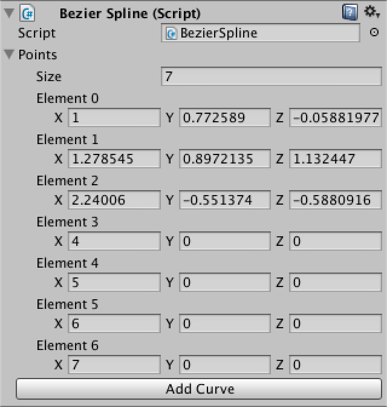
Adding a curve.

Of course we still only see the first curve. So we adjust BezierSplineInspector so it loops over all the curves.

```cs
	private void OnSceneGUI () {
		spline = target as BezierSpline;
		handleTransform = spline.transform;
		handleRotation = Tools.pivotRotation == PivotRotation.Local ?
			handleTransform.rotation : Quaternion.identity;
		
		Vector3 p0 = ShowPoint(0);
		for (int i = 1; i < spline.points.Length; i += 3) {
			Vector3 p1 = ShowPoint(i);
			Vector3 p2 = ShowPoint(i + 1);
			Vector3 p3 = ShowPoint(i + 2);
			
			Handles.color = Color.gray;
			Handles.DrawLine(p0, p1);
			Handles.DrawLine(p2, p3);
			
			Handles.DrawBezier(p0, p3, p1, p2, Color.white, null, 2f);
			p0 = p3;
		}
		ShowDirections();
	}
```

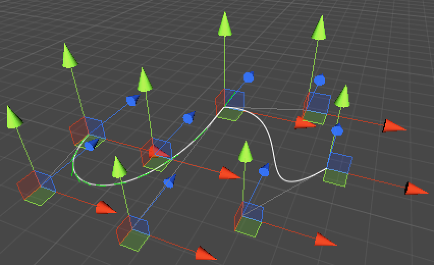
The whole spline.

Now we can see all the curves, but the direction lines are only added to the first one. This is because BezierSpline's method also still only work with the first curve. It's time to change that.
To cover the entire spline with a t going from zero to one, we fist need to figure out which curve we're on. We can get the curve's index by multiplying t by the number of curves and then discarding the fraction. Let's add a CurveCount property to make that easy.

```cs
	public int CurveCount {
		get {
			return (points.Length - 1) / 3;
		}
	}
```

After that we can reduce t to just the fractional part to get the interpolation value for our curve. To get to the actual points, we have to multiply the curve index by three.
However, this would fail when then original t equals one. In this case we can just set it to the last curve.

```cs
	public Vector3 GetPoint (float t) {
		int i;
		if (t >= 1f) {
			t = 1f;
			i = points.Length - 4;
		}
		else {
			t = Mathf.Clamp01(t) * CurveCount;
			i = (int)t;
			t -= i;
			i *= 3;
		}
		return transform.TransformPoint(Bezier.GetPoint(
			points[i], points[i + 1], points[i + 2], points[i + 3], t));
	}
	
	public Vector3 GetVelocity (float t) {
		int i;
		if (t >= 1f) {
			t = 1f;
			i = points.Length - 4;
		}
		else {
			t = Mathf.Clamp01(t) * CurveCount;
			i = (int)t;
			t -= i;
			i *= 3;
		}
		return transform.TransformPoint(Bezier.GetFirstDerivative(
			points[i], points[i + 1], points[i + 2], points[i + 3], t)) - transform.position;
	}
```

We now see direction lines across the entire spline, but we can improve the visualization by making sure that each curve segment gets the same amount of lines. Fortunately, it is easy to change `BezierSplineInspector.ShowDirections` so it uses `BezierSpline.CurveCount` to determine how many lines to draw.

```cs
	private const int stepsPerCurve = 10;
	
	private void ShowDirections () {
		Handles.color = Color.green;
		Vector3 point = spline.GetPoint(0f);
		Handles.DrawLine(point, point + spline.GetDirection(0f) * directionScale);
		int steps = stepsPerCurve * spline.CurveCount;
		for (int i = 1; i <= steps; i++) {
			point = spline.GetPoint(i / (float)steps);
			Handles.DrawLine(point, point + spline.GetDirection(i / (float)steps) * directionScale);
		}
	}
```


Directions along the entire spline.

It's rather crowded with all those transform handles. We could only show a handle for the active point. Then then other points can suffice with dots.
Let's update ShowPoint so it shows a button instead of a position handle. This button will look like a white dot, which when clicked will turn into the active point. Then we only show the position handle if the point's index matches the selected index, which we initialize at -1 so nothing is selected by default.

> How does Handles.Button work?
> This Button method shows a button in 3D space inside the scene view. Besides a regular size, it also has a pick size. Think of this as the size of the collider used to determine whether the user touches the button. We made it larger than the visible dot so the points are easier to select.
Like a few other Handles method, it also needs to be told what shape to draw. This is done by giving it a delete to a draw method. We're using Handles.DotCap, which draws a square that ignores the rotation and always faces the scene camera.

```cs
	private const float handleSize = 0.04f;
	private const float pickSize = 0.06f;
	
	private int selectedIndex = -1;
	
	private Vector3 ShowPoint (int index) {
		Vector3 point = handleTransform.TransformPoint(spline.points[index]);
		Handles.color = Color.white;
		if (Handles.Button(point, handleRotation, handleSize, pickSize, Handles.DotCap)) {
			selectedIndex = index;
		}
		if (selectedIndex == index) {
			EditorGUI.BeginChangeCheck();
			point = Handles.DoPositionHandle(point, handleRotation);
			if (EditorGUI.EndChangeCheck()) {
				Undo.RecordObject(spline, "Move Point");
				EditorUtility.SetDirty(spline);
				spline.points[index] = handleTransform.InverseTransformPoint(point);
			}
		}
		return point;
	}
```

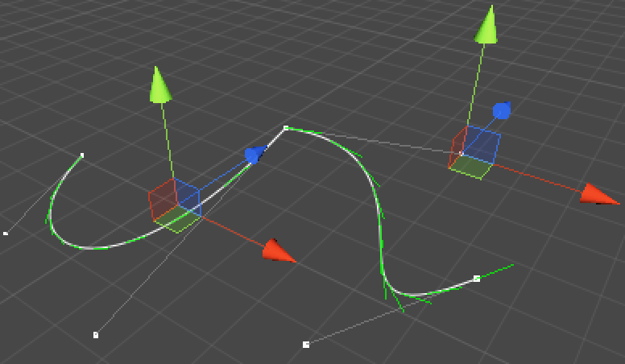
Showing dots.

This works, but it is tough to get a good size for the dots. Depending on the scale you're working at, they could end up either too large or too small. It would be nice if we could keep the screen size of the dots fixed, just like the position handles always have the same screen size. We can do this by factoring in `HandleUtility.GetHandleSize`. This method gives us a fixed screen size for any point in world space.

```cs
		float size = HandleUtility.GetHandleSize(point);
		Handles.color = Color.white;
		if (Handles.Button(point, handleRotation, size * handleSize, size * pickSize, Handles.DotCap)) {
			selectedIndex = index;
		}
```

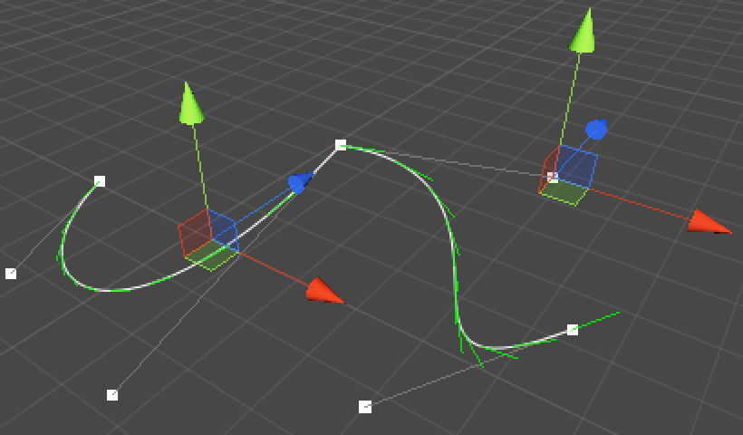
Dots with fixed size.

## Constraining Control Points

Although our spline is continuous, it sharply changes direction in between curve sections. These sudden changes in direction and speed are possible because the shared control point between two curves has two different velocities associated with it, one for each curve.
If we want the velocities to be equal, we must ensure that the two control points that define them – the third of the previous curve and the second of the next curve – mirror each other around the shared point. This ensures that the combined first and second derivatives are continuous.
Alternatively, we could align them but let their distance from the shared point differ. That will result in an abrubt change in velocity, while still keeping the direction continuous. In this case the combined first derivative is continuous, but the second is not.
The most flexible approach is to decide per curve boundary which contraints should apply, so we'll do that. Of course, once we have these constraints we can't just let anyone directly edit BezierSpline's points. So let's make our array private and provide indirect access to it. Make sure to let Unity know that we still want to serialize our points, otherwise they won't be saved.

```cs
	[SerializeField]
	private Vector3[] points;

	public int ControlPointCount {
		get {
			return points.Length;
		}
	}

	public Vector3 GetControlPoint (int index) {
		return points[index];
	}

	public void SetControlPoint (int index, Vector3 point) {
		points[index] = point;
	}
```

Now BezierSplineInspector must use the new methods and property instead of directly accessing the points array.

```cs
	private void OnSceneGUI () {
		spline = target as BezierSpline;
		handleTransform = spline.transform;
		handleRotation = Tools.pivotRotation == PivotRotation.Local ?
			handleTransform.rotation : Quaternion.identity;
		
		Vector3 p0 = ShowPoint(0);
		for (int i = 1; i < spline.ControlPointCount; i += 3) {
			Vector3 p1 = ShowPoint(i);
			Vector3 p2 = ShowPoint(i + 1);
			Vector3 p3 = ShowPoint(i + 2);
			
			Handles.color = Color.gray;
			Handles.DrawLine(p0, p1);
			Handles.DrawLine(p2, p3);
			
			Handles.DrawBezier(p0, p3, p1, p2, Color.white, null, 2f);
			p0 = p3;
		}
		ShowDirections();
	}
	
	private Vector3 ShowPoint (int index) {
		Vector3 point = handleTransform.TransformPoint(spline.GetControlPoint(index));
		float size = HandleUtility.GetHandleSize(point);
		Handles.color = Color.white;
		if (Handles.Button(point, handleRotation, size * handleSize, size * pickSize, Handles.DotCap)) {
			selectedIndex = index;
		}
		if (selectedIndex == index) {
			EditorGUI.BeginChangeCheck();
			point = Handles.DoPositionHandle(point, handleRotation);
			if (EditorGUI.EndChangeCheck()) {
				Undo.RecordObject(spline, "Move Point");
				EditorUtility.SetDirty(spline);
				spline.SetControlPoint(index, handleTransform.InverseTransformPoint(point));
			}
		}
		return point;
	}
```

While we're at it, we also no longer want to allow direct access to the array in the inspector, so remove the call to `DrawDefaultInspector`. To still allow changes via typing, let's show a vector field for the selected point.

```cs
	public override void OnInspectorGUI () {
		spline = target as BezierSpline;
		if (selectedIndex >= 0 && selectedIndex < spline.ControlPointCount) {
			DrawSelectedPointInspector();
		}
		if (GUILayout.Button("Add Curve")) {
			Undo.RecordObject(spline, "Add Curve");
			spline.AddCurve();
			EditorUtility.SetDirty(spline);
		}
	}

	private void DrawSelectedPointInspector() {
		GUILayout.Label("Selected Point");
		EditorGUI.BeginChangeCheck();
		Vector3 point = EditorGUILayout.Vector3Field("Position", spline.GetControlPoint(selectedIndex));
		if (EditorGUI.EndChangeCheck()) {
			Undo.RecordObject(spline, "Move Point");
			EditorUtility.SetDirty(spline);
			spline.SetControlPoint(selectedIndex, point);
		}
	}
```

Unfortunately, it turns out that the inspector doesn't refresh itself when we select a point in the scene view. We could fix this by calling `SetDirty` for the spline, but that's not right because the spline didn't change. Fortunately, we can issue a repaint request instead.

```cs
	private Vector3 ShowPoint (int index) {
		Vector3 point = handleTransform.TransformPoint(spline.GetControlPoint(index));
		float size = HandleUtility.GetHandleSize(point);
		Handles.color = Color.white;
		if (Handles.Button(point, handleRotation, size * handleSize, size * pickSize, Handles.DotCap)) {
			selectedIndex = index;
			Repaint();
		}
		if (selectedIndex == index) {
			EditorGUI.BeginChangeCheck();
			point = Handles.DoPositionHandle(point, handleRotation);
			if (EditorGUI.EndChangeCheck()) {
				Undo.RecordObject(spline, "Move Point");
				EditorUtility.SetDirty(spline);
				spline.SetControlPoint(index, handleTransform.InverseTransformPoint(point));
			}
		}
		return point;
	}
```

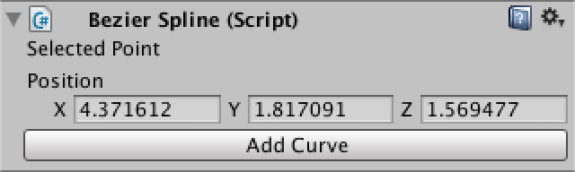
Selected point only.

Let's define an enumeration type to describe our three modes. Create a new script, remove the default code, and define an `enum` with the three options.

```cs
public enum BezierControlPointMode {
	Free,
	Aligned,
	Mirrored
}
```

Now we can add these modes to BezierSpline. We only need to store the mode in between curves, so let's put them in an array with a length equal to the number of curves plus one. You'll need to reset your spline or create a new one to make sure you have an array of the right size.

```cs
	[SerializeField]
	private BezierControlPointMode[] modes;
	
	public void AddCurve () {
		Vector3 point = points[points.Length - 1];
		Array.Resize(ref points, points.Length + 3);
		point.x += 1f;
		points[points.Length - 3] = point;
		point.x += 1f;
		points[points.Length - 2] = point;
		point.x += 1f;
		points[points.Length - 1] = point;

		Array.Resize(ref modes, modes.Length + 1);
		modes[modes.Length - 1] = modes[modes.Length - 2];
	}
	
	public void Reset () {
		points = new Vector3[] {
			new Vector3(1f, 0f, 0f),
			new Vector3(2f, 0f, 0f),
			new Vector3(3f, 0f, 0f),
			new Vector3(4f, 0f, 0f)
		};
		modes = new BezierControlPointMode[] {
			BezierControlPointMode.Free,
			BezierControlPointMode.Free
		};
	}
```

While we store the modes in between curves, it is convenient if we could get and set modes per control point. So we need to convert a point index into a mode index because in reality points share modes. As an example, the point index sequence 0, 1, 2, 3, 4, 5, 6 corresponds to the mode index sequence 0, 0, 1, 1, 1, 2, 2. So we need to add one and then divide by three.

```cs
	public BezierControlPointMode GetControlPointMode (int index) {
		return modes[(index + 1) / 3];
	}

	public void SetControlPointMode (int index, BezierControlPointMode mode) {
		modes[(index + 1) / 3] = mode;
	}
```

Now BezierSplineInspector can allow us to change the mode of the selected point. You will notice that changing the mode of one point also appears to change the mode of the points that are linked to it.

```cs
	private void DrawSelectedPointInspector() {
		GUILayout.Label("Selected Point");
		EditorGUI.BeginChangeCheck();
		Vector3 point = EditorGUILayout.Vector3Field("Position", spline.GetControlPoint(selectedIndex));
		if (EditorGUI.EndChangeCheck()) {
			Undo.RecordObject(spline, "Move Point");
			EditorUtility.SetDirty(spline);
			spline.SetControlPoint(selectedIndex, point);
		}
		EditorGUI.BeginChangeCheck();
		BezierControlPointMode mode = (BezierControlPointMode)
			EditorGUILayout.EnumPopup("Mode", spline.GetControlPointMode(selectedIndex));
		if (EditorGUI.EndChangeCheck()) {
			Undo.RecordObject(spline, "Change Point Mode");
			spline.SetControlPointMode(selectedIndex, mode);
			EditorUtility.SetDirty(spline);
		}
	}
```

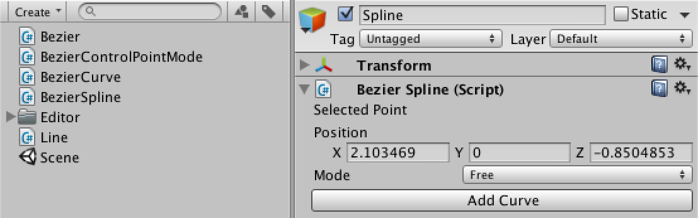
Now with adjustable control point mode.

It would be useful if we also got some visual feedback about our node types in the scene view. We can easily add this by coloring the dots. I'll use white for free, yellow for aligned, and cyan for mirrored.

```cs
	private static Color[] modeColors = {
		Color.white,
		Color.yellow,
		Color.cyan
	};
	
	private Vector3 ShowPoint (int index) {
		Vector3 point = handleTransform.TransformPoint(spline.GetControlPoint(index));
		float size = HandleUtility.GetHandleSize(point);
		Handles.color = modeColors[(int)spline.GetControlPointMode(index)];
		if (Handles.Button(point, handleRotation, size * handleSize, size * pickSize, Handles.DotCap)) {
			selectedIndex = index;
			Repaint();
		}
		if (selectedIndex == index) {
			EditorGUI.BeginChangeCheck();
			point = Handles.DoPositionHandle(point, handleRotation);
			if (EditorGUI.EndChangeCheck()) {
				Undo.RecordObject(spline, "Move Point");
				EditorUtility.SetDirty(spline);
				spline.SetControlPoint(index, handleTransform.InverseTransformPoint(point));
			}
		}
		return point;
	}
```
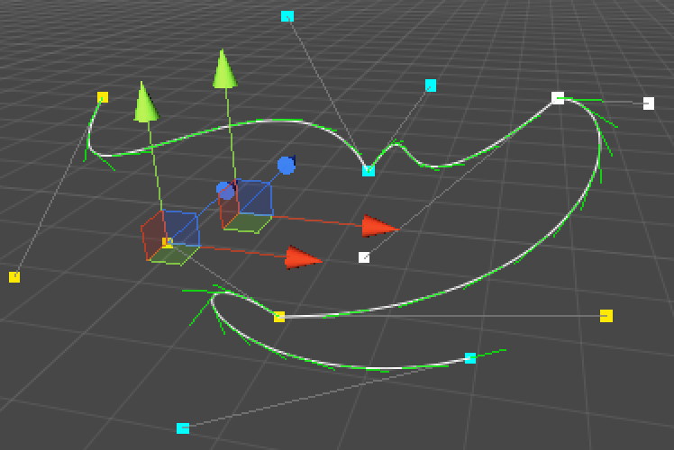
Now with color-coded points.

So far we're just coloring points. It's time to enforce the constraints. We add a new method to BezierSpline to do so and call it when a point is moved or a mode is changed. It takes a point index and begins by retrieving the relevant mode.

```cs
	public void SetControlPoint (int index, Vector3 point) {
		points[index] = point;
		EnforceMode(index);
	}
	
	public void SetControlPointMode (int index, BezierControlPointMode mode) {
		modes[(index + 1) / 3] = mode;
		EnforceMode(index);
	}

	private void EnforceMode (int index) {
		int modeIndex = (index + 1) / 3;
	}
```

We should check if we actually don't have to enforce anything. This is the case when the mode is set to free, or when we're at the end points of the curve. In these cases, we can return without doing anything.

```cs
	private void EnforceMode (int index) {
		int modeIndex = (index + 1) / 3;
		BezierControlPointMode mode = modes[modeIndex];
		if (mode == BezierControlPointMode.Free || modeIndex == 0 || modeIndex == modes.Length - 1) {
			return;
		}
	}
```

Now which point should we adjust? When we change a point's mode, it is either a point in between curves or one of its neighbors. When we have the middle point selected, we can just keep the previous point fixed and enforce the constraints on the point on the opposite side. If we have one of the other points selected, we should keep that one fixed and adjust its opposite. That way our selected point always stays where it is. So let's define the indices for these points.

```cs
		if (mode == BezierControlPointMode.Free || modeIndex == 0 || modeIndex == modes.Length - 1) {
			return;
		}
		
		int middleIndex = modeIndex * 3;
		int fixedIndex, enforcedIndex;
		if (index <= middleIndex) {
			fixedIndex = middleIndex - 1;
			enforcedIndex = middleIndex + 1;
		}
		else {
			fixedIndex = middleIndex + 1;
			enforcedIndex = middleIndex - 1;
		}
```

Let's consider the mirrored case first. To mirror around the middle point, we have to take the vector from the middle to the fixed point – which is (fixed - middle) – and invert it. This is the enforced tangent, and adding it to the middle gives us our enforced point.

```cs
		if (index <= middleIndex) {
			fixedIndex = middleIndex - 1;
			enforcedIndex = middleIndex + 1;
		}
		else {
			fixedIndex = middleIndex + 1;
			enforcedIndex = middleIndex - 1;
		}

		Vector3 middle = points[middleIndex];
		Vector3 enforcedTangent = middle - points[fixedIndex];
		points[enforcedIndex] = middle + enforcedTangent;
```

For the aligned mode, we also have to make sure that the new tangent has the same length as the old one. So we normalize it and then multiply by the distance between the middle and the old enforced point.

```cs
		Vector3 enforcedTangent = middle - points[fixedIndex];
		if (mode == BezierControlPointMode.Aligned) {
			enforcedTangent = enforcedTangent.normalized * Vector3.Distance(middle, points[enforcedIndex]);
		}
		points[enforcedIndex] = middle + enforcedTangent;

```

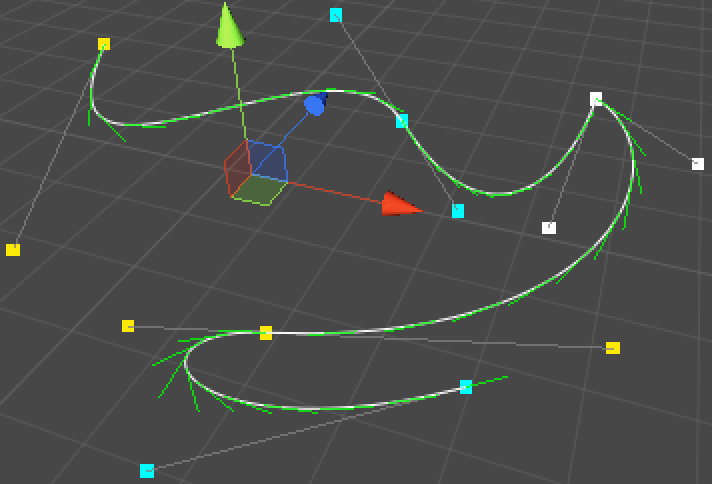
Enforced constraints.

From now on, whenever you move a point or change a point's mode, the constraints will be enforced. But when moving a middle point, the previous point always stays fixed and the next point is always enforced. This might be fine, but it's intuitive if both other points move along with the middle one. So let's adjust SetControlPoint so it moves them together.

```cs
	public void SetControlPoint (int index, Vector3 point) {
		if (index % 3 == 0) {
			Vector3 delta = point - points[index];
			if (index > 0) {
				points[index - 1] += delta;
			}
			if (index + 1 < points.Length) {
				points[index + 1] += delta;
			}
		}
		points[index] = point;
		EnforceMode(index);
	}
```

To wrap things up, we should also make sure that the constraints are enforced when we add a curve. We can do this by simply calling EnforceMode at the point where the new curve was added.

```cs
	public void AddCurve () {
		Vector3 point = points[points.Length - 1];
		Array.Resize(ref points, points.Length + 3);
		point.x += 1f;
		points[points.Length - 3] = point;
		point.x += 1f;
		points[points.Length - 2] = point;
		point.x += 1f;
		points[points.Length - 1] = point;

		Array.Resize(ref modes, modes.Length + 1);
		modes[modes.Length - 1] = modes[modes.Length - 2];
		EnforceMode(points.Length - 4);
	}
```

There is yet another constraint that we could add. By enforcing that the first and last control points share the same position, we can turn our spline into a loop. Of course, we also have to take modes into consideration as well.
So let's add a loop property to BezierSpline. Whenever it is set to true, we make sure the modes of the end points match and wel call SetPosition, trusting that it will take care of the position and mode constraints.

```cs
	[SerializeField]
	private bool loop;

	public bool Loop {
		get {
			return loop;
		}
		set {
			loop = value;
			if (value == true) {
				modes[modes.Length - 1] = modes[0];
				SetControlPoint(0, points[0]);
			}
		}
	}
```

Now we can add the loop property to BezierSplineInspector.

```cs
	public override void OnInspectorGUI () {
		spline = target as BezierSpline;
		EditorGUI.BeginChangeCheck();
		bool loop = EditorGUILayout.Toggle("Loop", spline.Loop);
		if (EditorGUI.EndChangeCheck()) {
			Undo.RecordObject(spline, "Toggle Loop");
			EditorUtility.SetDirty(spline);
			spline.Loop = loop;
		}
		if (selectedIndex >= 0 && selectedIndex < spline.ControlPointCount) {
			DrawSelectedPointInspector();
		}
		if (GUILayout.Button("Add Curve")) {
			Undo.RecordObject(spline, "Add Curve");
			spline.AddCurve();
			EditorUtility.SetDirty(spline);
		}
	}
```


Optional loop.

To correctly enforce the loop, we need to make a few more changes to BezierSpline.
First, SetControlPointMode needs to make sure that the first and last mode remain equal in case of a loop.

```cs
	public void SetControlPointMode (int index, BezierControlPointMode mode) {
		int modeIndex = (index + 1) / 3;
		modes[modeIndex] = mode;
		if (loop) {
			if (modeIndex == 0) {
				modes[modes.Length - 1] = mode;
			}
			else if (modeIndex == modes.Length - 1) {
				modes[0] = mode;
			}
		}
		EnforceMode(index);
	}
```

Next, SetControlPoint needs different edge cases when dealing with a loop, because it needs to wrap around the points array.

```cs
	public void SetControlPoint (int index, Vector3 point) {
		if (index % 3 == 0) {
			Vector3 delta = point - points[index];
			if (loop) {
				if (index == 0) {
					points[1] += delta;
					points[points.Length - 2] += delta;
					points[points.Length - 1] = point;
				}
				else if (index == points.Length - 1) {
					points[0] = point;
					points[1] += delta;
					points[index - 1] += delta;
				}
				else {
					points[index - 1] += delta;
					points[index + 1] += delta;
				}
			}
			else {
				if (index > 0) {
					points[index - 1] += delta;
				}
				if (index + 1 < points.Length) {
					points[index + 1] += delta;
				}
			}
		}
		points[index] = point;
		EnforceMode(index);
	}
```

Next, EnforceMode can now only bail at the end points when not looping. It also has to check whether the fixed or enforced point wraps around the array.

```cs
	private void EnforceMode (int index) {
		int modeIndex = (index + 1) / 3;
		BezierControlPointMode mode = modes[modeIndex];
		if (mode == BezierControlPointMode.Free || !loop && (modeIndex == 0 || modeIndex == modes.Length - 1)) {
			return;
		}

		int middleIndex = modeIndex * 3;
		int fixedIndex, enforcedIndex;
		if (index <= middleIndex) {
			fixedIndex = middleIndex - 1;
			if (fixedIndex < 0) {
				fixedIndex = points.Length - 2;
			}
			enforcedIndex = middleIndex + 1;
			if (enforcedIndex >= points.Length) {
				enforcedIndex = 1;
			}
		}
		else {
			fixedIndex = middleIndex + 1;
			if (fixedIndex >= points.Length) {
				fixedIndex = 1;
			}
			enforcedIndex = middleIndex - 1;
			if (enforcedIndex < 0) {
				enforcedIndex = points.Length - 2;
			}
		}

		Vector3 middle = points[middleIndex];
		Vector3 enforcedTangent = middle - points[fixedIndex];
		if (mode == BezierControlPointMode.Aligned) {
			enforcedTangent = enforcedTangent.normalized * Vector3.Distance(middle, points[enforcedIndex]);
		}
		points[enforcedIndex] = middle + enforcedTangent;
	}
```

And finally, we also have to take looping into account when adding a curve to the spline. The result might be a tangle, but it will remain a proper loop.

```cs
	public void AddCurve () {
		Vector3 point = points[points.Length - 1];
		Array.Resize(ref points, points.Length + 3);
		point.x += 1f;
		points[points.Length - 3] = point;
		point.x += 1f;
		points[points.Length - 2] = point;
		point.x += 1f;
		points[points.Length - 1] = point;

		Array.Resize(ref modes, modes.Length + 1);
		modes[modes.Length - 1] = modes[modes.Length - 2];
		EnforceMode(points.Length - 4);

		if (loop) {
			points[points.Length - 1] = points[0];
			modes[modes.Length - 1] = modes[0];
			EnforceMode(0);
		}
	}
```

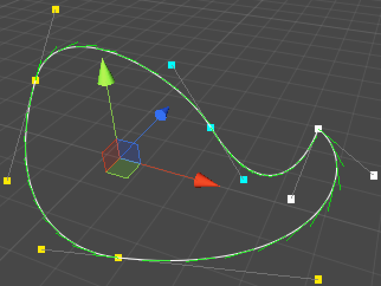
A spline loop.

It is great that we have loops, but it is inconvenient that we can no longer see where the spline begins. We can make this obvious by letting BezierSplineInspector always doubling the size of the dot for the first point.
Note that in case of a loop the last point will be drawn on top of it, so if you clicked the middle of the big dot you'd select the last point, while if you clicked further from the center you'd get the first point.

```cs
	private Vector3 ShowPoint (int index) {
		Vector3 point = handleTransform.TransformPoint(spline.GetControlPoint(index));
		float size = HandleUtility.GetHandleSize(point);
		if (index == 0) {
			size *= 2f;
		}
		Handles.color = modeColors[(int)spline.GetControlPointMode(index)];
		if (Handles.Button(point, handleRotation, size * handleSize, size * pickSize, Handles.DotCap)) {
			selectedIndex = index;
			Repaint();
		}
		if (selectedIndex == index) {
			EditorGUI.BeginChangeCheck();
			point = Handles.DoPositionHandle(point, handleRotation);
			if (EditorGUI.EndChangeCheck()) {
				Undo.RecordObject(spline, "Move Point");
				EditorUtility.SetDirty(spline);
				spline.SetControlPoint(index, handleTransform.InverseTransformPoint(point));
			}
		}
		return point;
	}
```

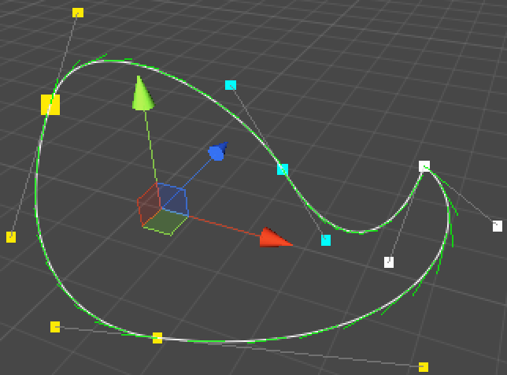
We start big.

## Using Splines

We have been working with splines for a while now, but we haven't used them for anything yet. There are uncountable things you can do with splines, for example moving an object alongs its path. Let's create a SplineWalker component that does just that.

```cs
using UnityEngine;

public class SplineWalker : MonoBehaviour {

	public BezierSpline spline;

	public float duration;

	private float progress;

	private void Update () {
		progress += Time.deltaTime / duration;
		if (progress > 1f) {
			progress = 1f;
		}
		transform.localPosition = spline.GetPoint(progress);
	}
}
```

Now we can create a walker object, assign our spline, set a duration, and watch it move after we enter play mode. I simply used a cube and gave it smaller cubes to resemble eyes, so you can see in what direction it's looking.

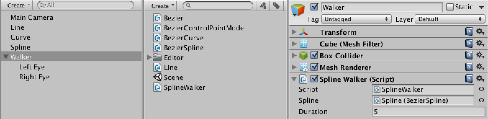 
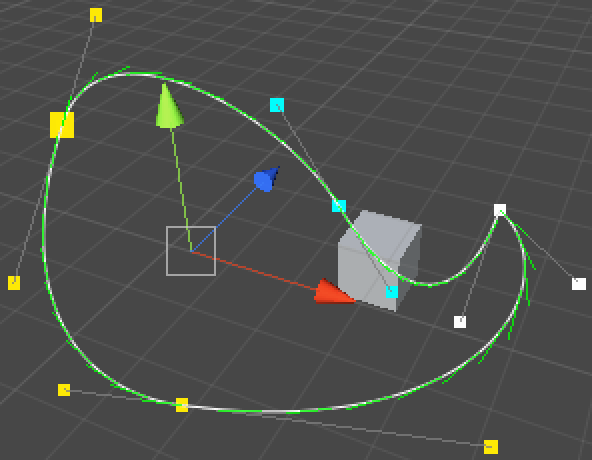
Walking the spline.

The walker now walks , but it's not looking in the direction that it's going. We can add an option for that.

> How does LookAt work?
> The Transform.LookAt method has multiple versions. We're using the one where we give it a position in world space and it rotates itself so its forward direction points at that position. As it's relative to its own position, we had to add the position to our spline's direction.
Providing one direction is not enough to define a 3D rotation. The method also keeps the upward direction of the transform aligned with the world's up direction. This means that the walker will try to keep itself upright. You could also provide an alternative up vector.

```cs
	public bool lookForward;

	private void Update () {
		progress += Time.deltaTime / duration;
		if (progress > 1f) {
			progress = 1f;
		}
		Vector3 position = spline.GetPoint(progress);
		transform.localPosition = position;
		if (lookForward) {
			transform.LookAt(position + spline.GetDirection(progress));
		}
	}
```

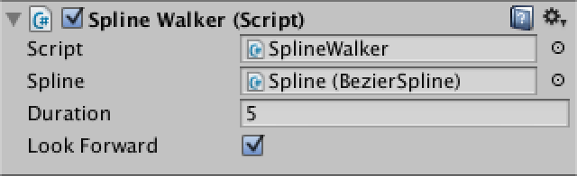  
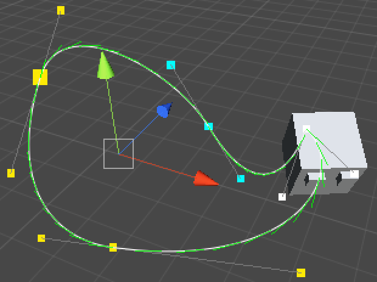
Looking where you go.

Another option is to keep looping the splines, instead of walking it just once. While we're at it, we could also make the walker move back and forth, ping-ponging across the spline. Let's create an enumeration to select between these modes.

```cs
public enum SplineWalkerMode {
	Once,
	Loop,
	PingPong
}
```

Now SplineWalker has to remember whether it's going forward or backward. It also needs to adjust the progress when passing the spline ends depending on its mode.

```cs
	public SplineWalkerMode mode;

	private bool goingForward = true;

	private void Update () {
		if (goingForward) {
			progress += Time.deltaTime / duration;
			if (progress > 1f) {
				if (mode == SplineWalkerMode.Once) {
					progress = 1f;
				}
				else if (mode == SplineWalkerMode.Loop) {
					progress -= 1f;
				}
				else {
					progress = 2f - progress;
					goingForward = false;
				}
			}
		}
		else {
			progress -= Time.deltaTime / duration;
			if (progress < 0f) {
				progress = -progress;
				goingForward = true;
			}
		}

		Vector3 position = spline.GetPoint(progress);
		transform.localPosition = position;
		if (lookForward) {
			transform.LookAt(position + spline.GetDirection(progress));
		}
	}
```

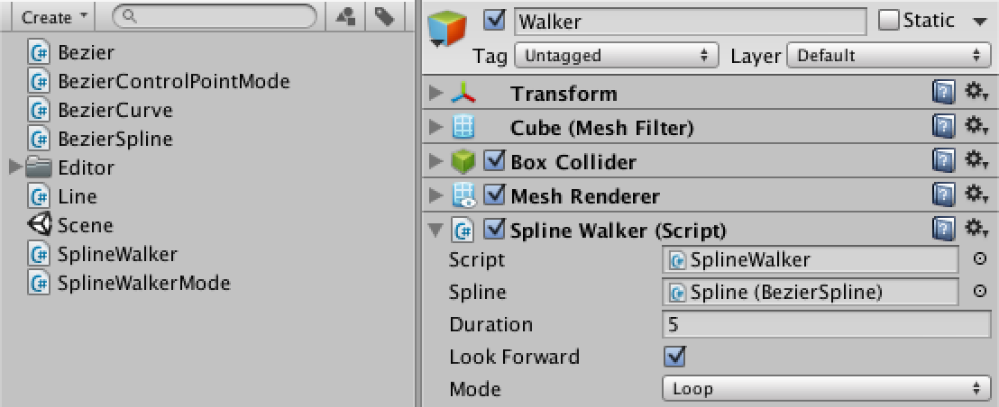
Walking in different ways.

Another thing we could do is create a decorator that instantiates a sequence of items along a spline when it awakens. We also give it a forward-looking option, which applies to the items it spawns. The item sequence with some frequency, allowing for repetitions. Of course, if either the frequency is zero or there are no items, we do nothing.
We need some items, so create a few prefabs for that purpose as well.

```cs
using UnityEngine;

public class SplineDecorator : MonoBehaviour {

	public BezierSpline spline;

	public int frequency;

	public bool lookForward;

	public Transform[] items;

	private void Awake () {
		if (frequency <= 0 || items == null || items.Length == 0) {
			return;
		}
		float stepSize = 1f / (frequency * items.Length);
		for (int p = 0, f = 0; f < frequency; f++) {
			for (int i = 0; i < items.Length; i++, p++) {
				Transform item = Instantiate(items[i]) as Transform;
				Vector3 position = spline.GetPoint(p * stepSize);
				item.transform.localPosition = position;
				if (lookForward) {
					item.transform.LookAt(position + spline.GetDirection(p * stepSize));
				}
				item.transform.parent = transform;
			}
		}
	}
}
```

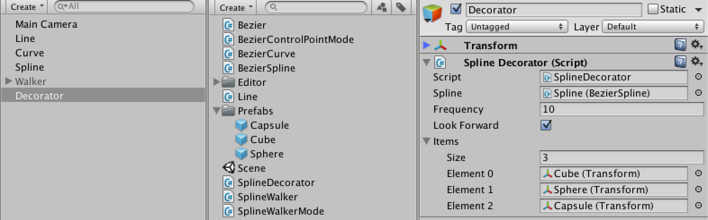 
  

Decorating splines.

This works well for loops, but it doesn't go all the way to the end of splines that aren't loops. We can fix this by increasing our step size to cover the entire length of the spline, as long as it's not a loop and we have more than one item to place.

```cs
		if (frequency <= 0 || items == null || items.Length == 0) {
			return;
		}
		float stepSize = frequency * items.Length;
		if (spline.Loop || stepSize == 1) {
			stepSize = 1f / stepSize;
		}
		else {
			stepSize = 1f / (stepSize - 1);
		}
```

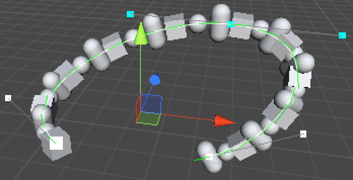
Going all the way.

## 原文链接

[Curves and Splines, making your own path](http://catlikecoding.com/unity/tutorials/curves-and-splines/)