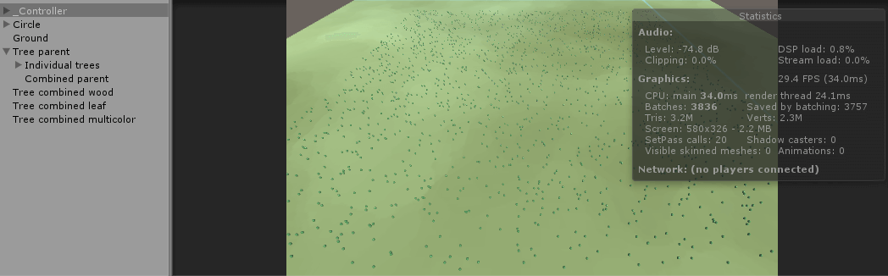

## Introduction

A few weeks ago I decided to make a forest fire simulator in Unity (you can test it here). A forest, as you know, has a lot of trees. But when I added all trees to the forest I realized that the simulation was running very slow. Then I recalled the game [Cities: Skylines](http://www.citiesskylines.com/) and began to wonder how that game was running faster despite having more trees than my small forest. After an unscientific research on the Internet I realized that the answer was mesh combining.

<!--more-->

Mesh combining is the art of taking several of your objects in Unity and combine them into one object. So instead of having several tree game objects, you will end up with one big tree game object that contains several trees. This will increase the performance of your game or simulator. You can measure this by looking at the number of batches in Unity's "Statistics" window. The fewer batches, the better.

Unity already has a small tutorial on how to combine meshes (you can find it [here](http://docs.unity3d.com/ScriptReference/Mesh.CombineMeshes.html)). But that tutorial is way too basic. What if you need to remove a tree from the combined mesh? What if you need to add a tree to the combined mesh? So I decided to extend that tutorial with this tutorial.

* In part 2 you will set up the basic scene and make a tool that looks like Cities: Skylines's Tree Brush tool.
* In part 3 you will learn how to combine meshes with different colors into one mesh. You will not need this part to complete the rest of the tutorial, so you can safely ignore it if you want.
* In part 4 you will learn how to make a forest and combine the trees into larger meshes.
* In part 5 you will learn how to add and remove trees from the combined meshes, by using a tool similar to the Tree Brush tool in Cities: Skylines.

## Set up the basic scene

In this part of the tutorial you will make a ground, a tree, a moving camera, and a Tree Brush tool similar to the tool in Cities: Skylines.

### Part 1. A one tree forest

Start by making a plane with the scale 100 positioned at the center. Give it a nice color and rename it to "Ground." Then create an empty gameobject and rename it "_Controller." Make sure it is at the center. This controller will hold all scripts we create.

Then create an empty gameobject and rename it to "Tree." As a child to that gameobject, create a cylinder, and rename it to "Wood." It should have position (0, 1, 0) and scale (0.2, 1, 0.2). Give it a material called "Wood." Then add a sphere, and rename the sphere to "Leaf," and give it a material called "Leaf." The sphere should have position (0, 2, 0) and scale (2, 2.54, 2). If you have done everything correctly you should now have what looks like a tree, where the coordinate system of the tree begins at the bottom of the tree. This will make it easier to add trees and we don't need to care about the tree's height. Also make the tree a prefab.

Now we need a script that can move the camera. This is not a tutorial on how to move a camera, so I will just give you my script. The basic idea is that we move the camera with WASD and zoom it with the mouse wheel or keys I or O. Drag the script to the camera.

```cs
using UnityEngine;
using System.Collections;

public class CameraController : MonoBehaviour {

	float height = 40f;
	float distanceBack = 40f;

	float camMoveSpeed = 30f;
	float zoomSpeed = 3f;

	void Start() 
	{
		transform.position = Vector3.zero;
		//Move up
		transform.position += new Vector3(0f, height, 0f);
		//Move back
		transform.position -= new Vector3(0f, 0f, distanceBack);
		//Look at the center to get an angle
		transform.LookAt(Vector3.zero);
	}

	void LateUpdate() 
	{
		//Move camera with keys
		//Move left/right
		if (Input.GetKey(KeyCode.A)) {
			transform.position -= new Vector3(camMoveSpeed * Time.deltaTime, 0f, 0f);
		}
		else if (Input.GetKey(KeyCode.D)) {
			transform.position += new Vector3(camMoveSpeed * Time.deltaTime, 0f, 0f);
		}

		//Move forward/back
		if (Input.GetKey(KeyCode.S)) {
			transform.position -= new Vector3(0f, 0f, camMoveSpeed * Time.deltaTime);
		}
		else if (Input.GetKey(KeyCode.W)) {
			transform.position += new Vector3(0f, 0f, camMoveSpeed * Time.deltaTime);
		}

		//Zoom
		float currentHeight = transform.position.y;

		float zoomDistance = 0f;

		if (currentHeight > 20f && currentHeight < 200f) {
			if (Input.GetAxis("Mouse ScrollWheel") > 0f || Input.GetKeyDown(KeyCode.I)) {
				zoomDistance += zoomSpeed;
			} 
			else if (Input.GetAxis("Mouse ScrollWheel") < 0f || Input.GetKeyDown(KeyCode.O)) {
				zoomDistance -= zoomSpeed;
			} 
		}
		//Can only zoom in
		else if (currentHeight > 200f) {
			if (Input.GetAxis("Mouse ScrollWheel") > 0f || Input.GetKeyDown(KeyCode.I)) {
				zoomDistance += zoomSpeed;
			} 
		}
		//Can only zoom out
		else if (currentHeight < 20f) {
			if (Input.GetAxis("Mouse ScrollWheel") < 0f || Input.GetKeyDown(KeyCode.O)) {
				zoomDistance -= zoomSpeed;
			} 
		}

		transform.Translate(Vector3.forward * zoomDistance);
	}
}
```

### Part 2. A Tree Brush tool

Now we will create a Tree Brush tool similar to the tool Cities: Skylines is using to place trees. If you haven't seen it, it is basically a filled circle that you can resize to place (or remove) trees over a larger or smaller area.

Out Tree Brush tool consists of a projector, so import Unity's standard projectors. Go to Assets → Import package → Effects → Projectors. We are here going to use the **BlobLightProjector**. But first you have to create an empty gameobject and rename it "Circle." Then make the projector a child of that gameobject. Position the projector at (0, 0.38, 0) and make sure the rotation is (90, 0, 0). Also check the projector's "Ortographic" checkbox, and that the projector should ignore layer "Tree." So make sure the Tree you created is at a layer called "Tree."

But the projector's circle doesn't look good, so we need a new one. Open the projector's material and give it a new circle by importing a circle image to Unity and then drag it to the material slot called "Cookie." I'm using this circle:


Now we need to make the circle move around with the mouse. Create a new script called "TutorialMouseMarker," and add the following to it:

```cs
using UnityEngine;
using System.Collections;

//Creates a cities skylines style round circle that 
//will move around with the mouse and is resizable
public class TutorialMouseMarker : MonoBehaviour
{
    public static TutorialMouseMarker current;

    //Drags
    //The gameobject holding the projector
    public GameObject circleObj;
    //The projector that will display the circle
    public Projector projector;

    //Projector settings
    float projectorMax = 15f;
    float projectorMin = 3f;

    void Awake()
    {
        current = this;
    }

    void Update()
    {
        UpdateProjector();
    }

    //Move the circle and change its size
    void UpdateProjector()
    {
        //Find the position of the mouse
        Vector3 mouseScreenPosition = Input.mousePosition;

        RaycastHit hit;

        //Fire ray and make sure we hit ground which is layer 10
        if (Physics.Raycast(Camera.main.ScreenPointToRay(mouseScreenPosition), out hit, 1000f, 1 << 10))
        {
            //Change the position of the circle to the position
            //where the ray hit the ground
            circleObj.transform.position = hit.point;
        }

        //Change size of projector radius
        float projectorSize = projector.orthographicSize;

        //Increase/decrease with p and m keys
        if (Input.GetKey(KeyCode.P))
        {
            projectorSize += 0.5f;
        }
        else if (Input.GetKey(KeyCode.M))
        {
            projectorSize -= 0.5f;
        }

        //Make sure it can't grow too big nor too small
        projector.orthographicSize = Mathf.Clamp(projectorSize, projectorMin, projectorMax);
    }
}
```

Add the script to "_Controller" gameobject and add both the "Circle" gameobject and the projector to the script. The basic idea of the script is to fire a ray from wherever the mouse is towards the ground and then position the circle where the ray hit the ground. To make this work the ray has to ignore everything else except the ground. So click on the "Ground" gameobject and make sure it is at layer 10 (We check that when we fire a ray by using the parameter "1 << 10") and give the layer a cool name like Ground.

The last part of the script above takes care of resizing the circle so we can remove trees over a larger area and add trees over a smaller area. If you now click play you should see something that looks like this (ignore the "Tree parent" and the "Tree combined" gameobjects because we will soon add them):


Now let's learn how to combine meshes with different colors into one mesh!

## Combine meshes with different colors

This part of the tutorial is independent of the rest of the tutorial, so you can safely ignore it if you want to. The reason that I included it is that in Unity's example on how to combine meshes (found [here](http://docs.unity3d.com/ScriptReference/Mesh.CombineMeshes.html)) it is assumed that all meshes have the same color. But what are you supposed to do if they have different colors? So in this part of the tutorial you will learn how to combine meshes with different colors into one mesh.

First of all we need more trees, so copy the tree you created in the last part three times. Then press play, click on the "Stats" button while in Game view, and notice the amount of "Batches." In my case we have 22 batches, and this is the number we want to decrease by using mesh combining.

First of all we need a game object that will hold the combined mesh, so create a new game object and name it "Tree combined multicolor." To that game object you have to add a Mesh Renderer and a Mesh Filter. In the Mesh Renderer, set the material size to "2" and first add the "Leaf" material and then the "Wood" material you created in the previous part.

Create a new script called "TutorialCombineAll" and add it to the "_Controller" game object. Add the following to the script:

```cs
using UnityEngine;
using System.Collections;
using System.Collections.Generic;

//Combine trees with different materials into one mesh
public class TutorialCombineAll : MonoBehaviour
{
    //Array with trees we are going to combine
    public GameObject[] treesArray;
    //The object that is going to hold the combined mesh
    public GameObject combinedObj;

    void Start() 
    {
        CombineTrees();
    }

    //Similar to Unity's reference, but with different materials
    //http://docs.unity3d.com/ScriptReference/Mesh.CombineMeshes.html
    void CombineTrees() 
    {
        //Lists that holds mesh data that belongs to each submesh
        List<CombineInstance> woodList = new List<CombineInstance>();
        List<CombineInstance> leafList = new List<CombineInstance>();
        
        //Loop through the array with trees
        for (int i = 0; i < treesArray.Length; i++)
        {
            GameObject currentTree = treesArray[i];

            //Deactivate the tree 
            currentTree.SetActive(false);

            //Get all meshfilters from this tree, true to also find deactivated children
            MeshFilter[] meshFilters = currentTree.GetComponentsInChildren<MeshFilter>(true);

            //Loop through all children
            for (int j = 0; j < meshFilters.Length; j++)
            {
                MeshFilter meshFilter = meshFilters[j];

                CombineInstance combine = new CombineInstance();

                //Is it wood or leaf?
                MeshRenderer meshRender = meshFilter.GetComponent<MeshRenderer>();

                //Modify the material name, because Unity adds (Instance) to the end of the name
                string materialName = meshRender.material.name.Replace(" (Instance)", "");

                if (materialName == "Leaf")
                {
                    combine.mesh = meshFilter.mesh;
                    combine.transform = meshFilter.transform.localToWorldMatrix;

                    //Add it to the list of leaf mesh data
                    leafList.Add(combine);
                }
                else if (materialName == "Wood")
                {
                    combine.mesh = meshFilter.mesh;
                    combine.transform = meshFilter.transform.localToWorldMatrix;

                    //Add it to the list of wood mesh data
                    woodList.Add(combine);
                }
            }
        }


        //First we need to combine the wood into one mesh and then the leaf into one mesh
        Mesh combinedWoodMesh = new Mesh();
        combinedWoodMesh.CombineMeshes(woodList.ToArray());

        Mesh combinedLeafMesh = new Mesh();
        combinedLeafMesh.CombineMeshes(leafList.ToArray());

        //Create the array that will form the combined mesh
        CombineInstance[] totalMesh = new CombineInstance[2];

        //Add the submeshes in the same order as the material is set in the combined mesh
        totalMesh[0].mesh = combinedLeafMesh;
        totalMesh[0].transform = combinedObj.transform.localToWorldMatrix;
        totalMesh[1].mesh = combinedWoodMesh;
        totalMesh[1].transform = combinedObj.transform.localToWorldMatrix;

        //Create the final combined mesh
        Mesh combinedAllMesh = new Mesh();

        //Make sure it's set to false to get 2 separate meshes
        combinedAllMesh.CombineMeshes(totalMesh, false);
        combinedObj.GetComponent<MeshFilter>().mesh = combinedAllMesh;
    }
}
```
What's different in the script above compared with Unity's example is that we first combine all Wood into one mesh and all Leaf into another mesh. When we have these two different meshes, we can combine them into one mesh. It is important that you add them in the same order as you added the materials in the Mesh Renderer. And that's the secret behind combining meshes with different colors into one mesh.

Add the trees and the game object "Tree combined multicolor" to the script. If you now press play you should see the following:


...and if you click the Stats button you should see that the number of batches have decreased from 22 to 18. It might not sound like much, but when we have thousands of trees, like we will have in the next part of the tutorial, you will notice a dramatic difference. So head to the next part of the tutorial!

## Combine trees into larger meshes

In this section you will learn how to create a random forest and how to combine the trees into larger meshes to increase the performance.

### Part 1. Create a forest

Begin by removing the trees you added in the last tutorial (but keep the prefap Tree). Then create two new game objects and add a Mesh Renderer and a Mesh Filter to them. Rename them "Tree combined wood" and "Tree combined leaf" and add materials to them. These objects will hold the combined tree meshes. To get a cleaner work space, create a new game object called "Tree parent" and as a child to this object, create 2 new game objects called "Individual trees" and "Combined parent." So we will parent all individual trees to the parent "Individual trees" because we have to save them after creating the combined tree mesh so we can remove them later on from the combined mesh.

Now create a script called "TutorialCreateForest" and add it to the "_Controller" game object. Deactivate the "TutorialCombineAll" script if you haven't already done so (the script we created in the last part). Then add the following to the new script:

```cs
using UnityEngine;
using System.Collections;
using System.Collections.Generic;

public class TutorialCreateForest : MonoBehaviour {

    public static TutorialCreateForest current;

    //Drags
    //The main tree
    public GameObject treeObj;
    //What we are going to parent everything to, to get a clean workspace
    public Transform individualTreeParent;
    public Transform combinedMeshParent;
    //The combined meshes
    public GameObject combinedWoodObj;
    public GameObject combinedLeafObj;


    //How many vertices per combined mesh (max 65535)
    //Should sometimes be smaller because smaller meshes are faster to modify
    [System.NonSerialized]
    public int vertexLimit = 30000;

    //Lists to make it easier to remove/add trees from/to combined meshes
    //Will contain references to all combined meshes
    [System.NonSerialized]
    public List<GameObject> combinedWoodList = new List<GameObject>();
    [System.NonSerialized]
    public List<GameObject> combinedLeafList = new List<GameObject>();

    //We also need a list of all trees we created before combining them
    //to make it easier to remove them from the combined meshes
    [System.NonSerialized]
    public List<GameObject> allTrees = new List<GameObject>();

    void Awake()
    {
        current = this;
    }

    void Start() 
    {
        CreateForest();
        //CombineTrees();
    }
	
    //Creates a random forest
    void CreateForest()
    {
        for (int i = 0; i < 2000; i++)
        {
            //Generate random map coordinates
            float halfMapSize = 300f;

            float x = Random.Range(-halfMapSize, halfMapSize);
            float z = Random.Range(-halfMapSize, halfMapSize);

            Vector3 treePos = new Vector3(x, 0f, z);

            //Create a tree
            GameObject newTree = Instantiate(treeObj, treePos, Quaternion.identity) as GameObject;

            //Parent it to get a clean workspace
            newTree.transform.parent = individualTreeParent;

            //Add it to the list of trees
            allTrees.Add(newTree);
        }
    }
}
```

Add everything needed to the script and press Play. If you click to display the Stats window and if you zoom out, you should see that the number of batches has grown to almost 4000:




### Part 2. Combine the meshes

Let's reduce the number of batches. So add the method "CombineTrees()" to the script:

```cs
//Combines the trees in the forest into combined meshes
void CombineTrees()
{
	//Lists needed to create the combined meshes of each type
	List<CombineInstance> woodList = new List<CombineInstance>();
	List<CombineInstance> leafList = new List<CombineInstance>();

	//Used in the loop, but better to create it here
	CombineInstance combine = new CombineInstance();

	//Keep track of the vertices in the list so we know when we have reached the limit
	int verticesSoFar = 0;
	//Keep track of which gameobject the mesh has been combined into
	int meshListCounter = 0;

	//Loop through all trees
	for (int i = 0; i < allTrees.Count; i++)
	{
		allTrees[i].SetActive(false);

		//Add to which list och combined meshes this tree belongs
		allTrees[i].GetComponent<TreeData>().listPos = meshListCounter;

		//Get all children
		MeshFilter[] meshFilters = allTrees[i].GetComponentsInChildren<MeshFilter>(true);

		//Loop through all children and add them to respective list
		for (int j = 0; j < meshFilters.Length; j++)
		{
			//We need to get both the mesh's mesh renderer and mesh filter
			MeshFilter meshFilter = meshFilters[j];

			//To find out if this is mesh is a wood or a leaf we need the name of the material
			//Modify the material name, because Unity adds (Instance) to the end of the name
			string materialName = meshFilter.GetComponent<MeshRenderer>().material.name.Replace(" (Instance)", "");

			if (materialName == "Leaf")
			{
				combine.mesh = meshFilter.mesh;
				combine.transform = meshFilter.transform.localToWorldMatrix;

				//Add it to the list of leaf mesh data
				leafList.Add(combine);

				//The leafs have more vertices, so we need to keep track of them
				verticesSoFar += meshFilter.mesh.vertexCount;
			}
			else if (materialName == "Wood")
			{
				combine.mesh = meshFilter.mesh;
				combine.transform = meshFilter.transform.localToWorldMatrix;

				//Add it to the list of wood mesh data
				woodList.Add(combine);
			}
		}

		//Have we reached the limit?
		if (verticesSoFar > vertexLimit)
		{
			//If so we have added to many vertices, so we undo the last step
			i -= 1;

			//And remove the last mesh we added to the lists
			leafList.RemoveAt(leafList.Count - 1);
			woodList.RemoveAt(woodList.Count - 1);

			//Now we can create a combined mesh of the meshes we have collected so far
			CreateCombinedMesh(woodList, combinedWoodObj, combinedWoodList);
			CreateCombinedMesh(leafList, combinedLeafObj, combinedLeafList);

			//Reset the lists with mesh data
			leafList.Clear();
			woodList.Clear();

			verticesSoFar = 0;

			//Change how many combined meshes we have generated so far
			meshListCounter += 1;
		}
	}

	//When the main loop is finished we have to add what didnt reach the vertice limit
	CreateCombinedMesh(woodList, combinedWoodObj, combinedWoodList);
	CreateCombinedMesh(leafList, combinedLeafObj, combinedLeafList);
}


//Creates a combined mesh from a list and adds it to a game object
void CreateCombinedMesh(List<CombineInstance> meshDataList, GameObject meshHolderObj, List<GameObject> combinedHolderList)
{
	//Create the new combined mesh
	Mesh newMesh = new Mesh();
	newMesh.CombineMeshes(meshDataList.ToArray());

	//Create new game object that will hold the combined mesh
	GameObject combinedMeshHolder = Instantiate(meshHolderObj, Vector3.zero, Quaternion.identity) as GameObject;

	combinedMeshHolder.transform.parent = combinedMeshParent;

	//Add the mesh
	combinedMeshHolder.GetComponent<MeshFilter>().mesh = newMesh;

	//Add the combined holder to the list
	combinedHolderList.Add(combinedMeshHolder);
}
```

The basic idea is that we loop through all trees we created and combine them into meshes. The problem is that the limit of one mesh is 65535 vertices (a vertice is like a corner in the mesh), so when we have reached that limit we need to create a new combined mesh and begin all over again. I've also decided to lower the limit from 65535 to 30000. The reason is that when we begin to add and remove trees, it will be much faster to search through the combined mesh if we have fewer trees combined into one mesh. But if you are not going to remove or add something to the mesh, you can safely leave the limit at 65535.

To be able to easier add and remove trees, we also need to know which combined mesh the individual tree has been combined into. So we have to save the list number in a script called "TreeData." So create such a script, add it to the Tree prefab, and add the following:

```cs
using UnityEngine;
using System.Collections;

//Holds data about a tree
public class TreeData : MonoBehaviour
{
    public int listPos;

    void Awake()
    {
        //-1 means not in any list at all
        listPos = -1;
    }
}
```

I've also been lazy by assuming that the wood part of the tree and the leaf part of the tree have the same amount of vertices. But in reality the cylinder has fewer vertices than a sphere. So if you want to squeeze out every inch of performance out of your game, you should not change to a new combined wood mesh when the combined mesh that holds the leafs is full, because you can fit more cylinders in one combined mesh than what you can fit spheres. But to get a cleaner code, I've decided to ignore that fact.

If you now press Play and zoom out you should be able to see that the number of batches have decreased from 4000 to 200:


Now let's move on and learn how to add and remove trees. It might sound easy, but it will be complicated, so take a break before you begin!


## Add and remove trees from the combined meshes

In this part of the tutorial you will learn how to add and remove meshes from combined meshes.

### Part 1. How do you modify a combined mesh?

Adding and removing trees is easy if we are not dealing with combined meshes. It is not difficult to remove a mesh from a combined mesh and it is not difficult to add a mesh to a combined mesh. But there's a Swedish expression saying that you "need to have your tongue at the correct position in your mouth," meaning it's easy to get lost among the arrays and vertices we are going to use if you are not focusing.

Before we begin with the adding and removing of trees we have to learn how to identify a tree mesh in a combined mesh (I'm saying "tree," but I'm meaning the tree's wood mesh and leaf mesh). We can easily identify in which mesh a tree has been combined, because we have saved that list position. But how do we identify the tree mesh in the combined mesh? The answer is that we have to search through all vertices of the combined mesh and see when a vertice matches a vertice in a single tree. This will only work if no trees have the same position, which we here assume they don't have.

So create a new script called "ModifyMesh" and add the following:

```cs
using UnityEngine;
using System.Collections;
using System.Collections.Generic;
using System.Linq;

public class ModifyMesh
{
    static float tolerance = 0.0001f;
  
    //Removes a mesh from another mesh that contains the same mesh (at the same position) 
    //but also other meshes at other positions
    //Can add the parameter moveVec if we know we have moved the mesh we want to remove a certain distance
    public static void RemoveVerticesFromMesh(Transform currentObject, Transform objectToRemove, Vector3 moveVec = default(Vector3))
    {
        MeshFilter currentMeshFilter = currentObject.GetComponent<MeshFilter>();
        
        //The vertices and triangles belonging to the mesh we are going to modify
        //From array to list so we can modify them - Requires "using System.Linq;" 
        List<Vector3> currentVertices = currentMeshFilter.mesh.vertices.ToList<Vector3>();
        
        List<int> currentTriangles = currentMeshFilter.mesh.triangles.ToList<int>();

        //The vertices we are going to remove from the mesh
        Mesh objectToRemoveMesh = objectToRemove.GetComponent<MeshFilter>().mesh;

        Vector3[] verticesToRemove = objectToRemoveMesh.vertices;

        int nrOfVerticesToRemove = verticesToRemove.Length;


        //First find the position where we should begin to remove vertices
        int minVerticePos = 0;

        //From local to global
        Vector3 firstVertPosToRemove = objectToRemove.transform.TransformPoint(verticesToRemove[0]);

        //From global to local of the combined mesh or we have to do do it each time in the loop, which is slower
        firstVertPosToRemove = currentObject.InverseTransformPoint(firstVertPosToRemove) + moveVec;

        for (int i = 0; i < currentVertices.Count; i++)
        {
            //We now know where the mesh we want to remove begins in the combined mesh
            //if (currentVertices[i] == firstVertPosToRemove)
            //The above is sometimes not working because of rounding errors, so use a tolerance
            if ((currentVertices[i] - firstVertPosToRemove).sqrMagnitude < tolerance)
            {
                minVerticePos = i;
                break;
            }
        }

        //Remove the vertices that we dont need
        currentVertices.RemoveRange(minVerticePos, nrOfVerticesToRemove);


        //Change the number of the triangles by first finding the position where 
        //we should begin to remove triangles, while at the same time shifting
        //the triangles that comes after the ones we are removing, so they point
        //at the correct vertices
        int minTrianglePos = 0;

        bool hasFoundStart = false;

        int firstTrianglePos = objectToRemoveMesh.triangles[0] + minVerticePos;

        int upperLimit = minVerticePos + nrOfVerticesToRemove;

        for (int i = 0; i < currentTriangles.Count; i++)
        {
            int currentTrianglePos = currentTriangles[i];

            if (currentTrianglePos == firstTrianglePos && !hasFoundStart)
            {
                hasFoundStart = true;
                minTrianglePos = i;
            }

            //Change which vertices the triangles are being built from
            //We only need to shift the triangles that come after the triangles we remove
            if (currentTrianglePos >= upperLimit)
            {
                currentTriangles[i] = currentTrianglePos - nrOfVerticesToRemove;
            }
        }
        
        //Remove the triangles we dont need
        currentTriangles.RemoveRange(minTrianglePos, objectToRemoveMesh.triangles.Length);


        //Now we can create the new mesh
        //Important to clear or create a new mesh it will complain about the triangles
        //being the wrong size even though they arent
        currentMeshFilter.mesh.Clear();

        currentMeshFilter.mesh.vertices = currentVertices.ToArray();
        currentMeshFilter.mesh.triangles = currentTriangles.ToArray();
    }
}
```

When we are searching through the vertices that belongs to the combined mesh and trying to match coordinates with the mesh that belongs to the tree, the problem is that because of rounding errors, these coordinates will not always match 100 percent. So instead we have to use a tolerance, which I've assumed to be 0.0001. That means that if the coordinate in the combined mesh matches the coordinate in the tree mesh, then we assume we have found the tree in the combined mesh.

Next step is removing the vertices that belongs to the tree from the combined mesh. That's easy because we now know where the tree's vertices begins in the long list of vertices and how many vertices a single tree has. But a mesh also consists of a long list of triangles that are building up the final mesh, so we have to modify that list as well. But that's easy because we know the position of the first vertice we are going to remove, and then we have to modify all triangles that come after the mesh we have removed so they point at the vertices that are still there. Then we just add the new vertices and triangles to the combined mesh.

The problem is that the above is slow. If we are going to remove many trees at the same time, we have to cheat by hiding the trees below the ground. So add the following method to "ModifyMesh":

```cs
//Moves a mesh away from another mesh that contains the same mesh (at the same position) 
//but also other meshes at other positions
public static void MoveVerticesOutOfTheWay(Transform currentObject, Transform objectToRemove, Vector3 moveVec)
{
	MeshFilter currentMeshFilter = currentObject.GetComponent<MeshFilter>();

	//The vertices belonging to the mesh we are going to modify
	Vector3[] currentVertices = currentMeshFilter.mesh.vertices;

	//The vertices we are going to move
	Vector3[] verticesToRemove = objectToRemove.GetComponent<MeshFilter>().mesh.vertices;

	//Find the position of the first vertice we are going to remove, but in local pos of the mesh
	//we are going to remove it from
	//From local to global
	Vector3 firstVertPosToRemove = objectToRemove.transform.TransformPoint(verticesToRemove[0]);
	//From global to local of the combined mesh
	firstVertPosToRemove = currentObject.InverseTransformPoint(firstVertPosToRemove);
   
	//Find the first vertice in the combined mesh
	for (int i = 0; i < currentVertices.Length; i++)
	{
		//We now know where the mesh we want to move begins
		//if (currentVertices[i] == firstVertPosToRemove)
		//The above is sometimes not working because of rounding errors, so use a tolerance
		if ((currentVertices[i] - firstVertPosToRemove).sqrMagnitude < tolerance)
		{
			//Move the vertices
			for (int j = 0; j < verticesToRemove.Length; j++)
			{
				currentVertices[i + j] += moveVec;
			}
			
			break;
		}
	}

	//Add the modified vertices to the combined mesh
	currentMeshFilter.mesh.vertices = currentVertices;
}
```

The above method is similar to the method that removes a mesh from a combined mesh. The difference is that we are just moodifying the vertices by moving them with a certain distance determined by a vector. It will make the code much faster.

### Part 2. Remove trees

With the above in mind, you may understand that to be able to remove a tree, we first have to hide all trees we want to remove in one frame and then remove the hidden trees over several frames. So create a script called "TutorialAddRemoveTrees" and add the following (it will include some code we need to add trees, but it's less messy to add everything at the same time):

```cs
using UnityEngine;
using System.Collections;
using System.Collections.Generic;

public class TutorialAddRemoveTrees : MonoBehaviour
{
    //Used in the coroutine to set if we should add new trees
    bool shouldAddTrees = false;
    
    //Slow to add trees to combined meshes, so spread out over several frames
    List<GameObject>waitingListAddTree = new List<GameObject>();
    //If we want to remove the trees completely, and not just hide them
    List<GameObject> waitingListRemoveTree = new List<GameObject>();

    //How far away should we move a tree that has been removed?
    Vector3 moveVec = new Vector3(0f, -40f, 0f);

    void Start() 
    {
        //Add trees when pressing mouse button
        StartCoroutine("AddNewTrees");
        //Add recently instantiated trees to a combined mesh
        //or remove trees from combined mesh
        StartCoroutine("AddRemoveTreesToFromCombinedMesh");
    }
		
    void Update() 
    {
        //Remove trees with right mouse button
        if (Input.GetMouseButton(1))
        {
            RemoveTrees();
        }
        //Add trees with left mouse button
        if (Input.GetMouseButton(0))
        {
            shouldAddTrees = true;
        }
    }

    //Add/remove trees in the waiting list to/from a combined mesh
    IEnumerator AddRemoveTreesToFromCombinedMesh()
    {
        while (true)
        {
            //Add tree to combined mesh
            if (waitingListAddTree.Count > 0)
            {
                AddTreeToCombinedMesh(waitingListAddTree[0]);

                waitingListAddTree.RemoveAt(0);

                yield return new WaitForSeconds(0.1f);
            }


            //Remove tree from combined mesh
            if (waitingListRemoveTree.Count > 0)
            {
                RemoveTreeCompletely(waitingListRemoveTree[0]);

                yield return new WaitForSeconds(0.1f);
            }

            yield return null;    
        }
    }
}
```

We are later on going to add trees with a coroutine, and the idea will then be similar to when we remove trees, but more of that later. What you will see is that we have waiting lists we are going to fill with trees that we are going to remove (and are now hidden) and trees we are going to combine into combined meshes, but have now just been instantiated, which is faster.

To be able to remove trees you will need the following methods:

```cs
//Remove trees within the radius of the circle
void RemoveTrees()
{
	//The current cicle radius
	float radius = TutorialMouseMarker.current.projector.orthographicSize;

	//All trees we have in our forest
	List<GameObject> allTrees = TutorialCreateForest.current.allTrees;
	
	//Position of the mouse
	Vector3 mousePos = TutorialMouseMarker.current.circleObj.transform.position;
	//Make sure we operate in 2d space
	mousePos.y = 0f;
	
	//Loop through all trees
	for (int i = 0; i < allTrees.Count; i++)
	{
		GameObject currentTree = allTrees[i];

		Vector3 treePos = currentTree.transform.position;
		//Make sure we operate in 2d space
		treePos.y = 0f;

		//The distance Sqr between the tree and the center of the mouse
		//Remember that sqr is faster than sqrt!
		float distSqr = (treePos - mousePos).sqrMagnitude;

		//If the tree is within the circle radius
		if(distSqr < radius * radius)
		{
			//Remove the tree from our list with trees so we are not selecting it again
			TutorialCreateForest.current.allTrees.Remove(currentTree);
			//Also remove the tree from the waiting list if it is waiting to be added to a combined mesh
			waitingListAddTree.Remove(currentTree);
			//But add it to the list with trees we want to remove completely
			waitingListRemoveTree.Add(currentTree);
			//Move the tree out of the way
			MoveTree(currentTree);
		}
	}
}

//Moves one tree so we cant see it anymore
void MoveTree(GameObject currentTree)
{
	//First get which list this tree is in
	int listPos = currentTree.GetComponent<TreeData>().listPos;

	//Does this tree belong to a list?
	if (listPos == -1)
	{
		//Just deactivate the tree if it doesnt belong to a list
		currentTree.SetActive(false);
	}
	//Tree belongs to a list, so we have to move the vertices in the combined mesh
	else
	{
		//Get the combined object in which this tree is a part of
		GameObject combinedObjWood = TutorialCreateForest.current.combinedWoodList[listPos];
		GameObject combinedObjLeaf = TutorialCreateForest.current.combinedLeafList[listPos];

		//Find the wood and leaf meshes inside of this tree
		Transform woodObj = null;
		Transform leafObj = null;

		GetWoodandLeaf(currentTree, out woodObj, out leafObj);

		//Move it
		ModifyMesh.MoveVerticesOutOfTheWay(combinedObjWood.transform, woodObj, moveVec);
		ModifyMesh.MoveVerticesOutOfTheWay(combinedObjLeaf.transform, leafObj, moveVec);
	}
}

//Removes one tree completely from the game
void RemoveTreeCompletely(GameObject currentTree)
{
	//First get which list this tree is in
	int listPos = currentTree.GetComponent<TreeData>().listPos;

	//If the tree belongs to a list, remove it from the combined mesh
	if (listPos != -1)
	{
		//Get the combined object in which this tree is a part of
		GameObject combinedObjWood = TutorialCreateForest.current.combinedWoodList[listPos];
		GameObject combinedObjLeaf = TutorialCreateForest.current.combinedLeafList[listPos];

		//Find the wood and leaf meshes inside of this tree
		Transform woodObj = null;
		Transform leafObj = null;

		GetWoodandLeaf(currentTree, out woodObj, out leafObj);

		//Remove the wood and leaf from the combined mesh
		ModifyMesh.RemoveVerticesFromMesh(combinedObjWood.transform, woodObj, moveVec);
		ModifyMesh.RemoveVerticesFromMesh(combinedObjLeaf.transform, leafObj, moveVec);
		//Also need to recalculate normals
		combinedObjWood.GetComponent<MeshFilter>().mesh.RecalculateNormals();
		combinedObjLeaf.GetComponent<MeshFilter>().mesh.RecalculateNormals();
	}

	//Remove the tree from the waiting list
	waitingListRemoveTree.Remove(currentTree);
	//Destroy the tree
	Destroy(currentTree);
}
```

So when we hold the right mouse button, we search through the list of all single trees we have in our forest and check if they are within the radius of our Tree Brush tool. If so, we remove the tree from the list of all trees, we hide the tree below the ground, and then we add the tree to the waiting list so we can remove it completely later on.

We will also need this help method that will help us to get the child leaf and child wood transform from each individual tree:

```cs
//Finds the tree's leaf and wood children
void GetWoodandLeaf(GameObject currentTree, out Transform woodObj, out Transform leafObj)
{
	woodObj = null;
	leafObj = null;

	//Find the wood and leaf meshes inside of this tree
	MeshFilter[] meshFilters = currentTree.GetComponentsInChildren<MeshFilter>(true);

	for (int j = 0; j < meshFilters.Length; j++)
	{
		MeshFilter meshFilter = meshFilters[j];

		//Is it wood or leaf?
		//Modify the material name, because Unity adds (Instance) to the end of the name
		string materialName = meshFilter.GetComponent<MeshRenderer>().material.name.Replace(" (Instance)", "");

		if (materialName == "Leaf")
		{
			leafObj = meshFilter.transform;
		}
		else if (materialName == "Wood")
		{
			woodObj = meshFilter.transform;
		}
	}
}
```

### Part 3. Add trees

Adding trees is similar to removing trees. As said before, we are going to cheat by just instantiating the trees, add them to a waiting list, and then add them to a combined mesh over several frames. So add the following to the script "TutorialAddRemoveTrees":

```cs
//Coroutine used to determine how often we should add a new tree
//when we press left mouse button
IEnumerator AddNewTrees()
{
	while (true)
	{
		if (shouldAddTrees)
		{
			AddOneTree();
		}

		shouldAddTrees = false;

		yield return new WaitForSeconds(0.1f);
	}
}

//Add one tree randomly within the circle and just instantiate it
void AddOneTree()
{
	//Find random coordinate within the circle
	//http://stackoverflow.com/questions/5837572/generate-a-random-point-within-a-circle-uniformly
	float a = Random.Range(0f, 1f);
	float b = Random.Range(0f, 1f);

	if (b < a)
	{
		float a_temp = a;
		a = b;
		b = a_temp;
	}

	float R = TutorialMouseMarker.current.projector.orthographicSize;

	float xCoord = b * R * Mathf.Cos(2 * Mathf.PI * a / b);
	float zCoord = b * R * Mathf.Sin(2 * Mathf.PI * a / b);

	//Add a tree at the position of the mouse
	Vector3 mousePos = TutorialMouseMarker.current.circleObj.transform.position;
	mousePos.y = 0f;
	Vector3 treePos = new Vector3(xCoord, 0f, zCoord) + mousePos;

	//The tree we are going to add
	GameObject treeObj = TutorialCreateForest.current.treeObj;

	//Make sure the tree is active
	treeObj.SetActive(true);

	GameObject newTree = Instantiate(treeObj, treePos, Quaternion.identity) as GameObject;
	
	newTree.transform.parent = TutorialCreateForest.current.individualTreeParent;

	//Add the tree to the list of all trees so we can remove it
	TutorialCreateForest.current.allTrees.Add(newTree);

	//Now we need to add this tree to a combined mesh, but this is slow, 
	//so better spreading it out over several frames, so add it to a waiting list
	waitingListAddTree.Add(newTree);
}

//Adds one tree to a combined mesh
void AddTreeToCombinedMesh(GameObject newTree)
{
	//Find the wood and leaf meshes inside of this tree
	Transform woodObj = null;
	Transform leafObj = null;

	GetWoodandLeaf(newTree, out woodObj, out leafObj);

	//How many vertices has the leaf?
	int leafVertices = leafObj.GetComponent<MeshFilter>().mesh.vertexCount;

	//Find a list with vertices left, leafs are critical because have more vertices
	List<GameObject> combinedLeafList = TutorialCreateForest.current.combinedLeafList;
	List<GameObject> combinedWoodList = TutorialCreateForest.current.combinedWoodList;

	bool hasFoundCombinedMesh = false;

	//Search through all lists and see if we have a list that has room for more vertices
	for (int i = 0; i < combinedLeafList.Count; i++)
	{
		MeshFilter combinedMeshFilter = combinedLeafList[i].GetComponent<MeshFilter>();

		int vertices = combinedMeshFilter.mesh.vertexCount;

		//This mesh has room for more vertices
		if (vertices + leafVertices < TutorialCreateForest.current.vertexLimit)
		{
			hasFoundCombinedMesh = true;

			//Add the current wood and leaf to the combined mesh that has room for them
			AddMeshToCombinedMesh(leafObj, combinedLeafList[i]);
			AddMeshToCombinedMesh(woodObj, combinedWoodList[i]);

			//Add the list number to the tree object
			newTree.GetComponent<TreeData>().listPos = i;

			break;
		}
	}

	//We need to create a new combined mesh because all meshes are full
	if (!hasFoundCombinedMesh)
	{
		//Wood
		GameObject newMeshHolderWood = Instantiate(TutorialCreateForest.current.combinedWoodObj) as GameObject;

		newMeshHolderWood.transform.parent = TutorialCreateForest.current.combinedMeshParent;

		combinedWoodList.Add(newMeshHolderWood);

		//Leaf
		GameObject newMeshHolderLeaf = Instantiate(TutorialCreateForest.current.combinedLeafObj) as GameObject;

		newMeshHolderLeaf.transform.parent = TutorialCreateForest.current.combinedMeshParent;

		combinedLeafList.Add(newMeshHolderLeaf);


		//Add the current wood and leaf to the new combined meshes we just created
		AddMeshToCombinedMesh(leafObj, newMeshHolderLeaf);
		AddMeshToCombinedMesh(woodObj, newMeshHolderWood);

		//Add the list number to the tree object
		newTree.GetComponent<TreeData>().listPos = combinedLeafList.Count - 1;
	}

	newTree.SetActive(false);
}

//Adds one mesh to a combined mesh 
void AddMeshToCombinedMesh(Transform objToAdd, GameObject combinedMesh)
{
	//Create a new array that will hold the mesh data
	CombineInstance[] combined = new CombineInstance[2];

	combined[0].mesh = objToAdd.GetComponent<MeshFilter>().mesh;
	combined[0].transform = objToAdd.transform.localToWorldMatrix;

	combined[1].mesh = combinedMesh.GetComponent<MeshFilter>().mesh;
	combined[1].transform = combinedMesh.transform.localToWorldMatrix;

	//Create the new mesh
	Mesh newMesh = new Mesh();
	newMesh.CombineMeshes(combined);

	//Add it to the combined mesh holder
	combinedMesh.GetComponent<MeshFilter>().mesh = newMesh;
}
```

In a similar way as when we added the trees from the randomly generated forest, we are searching through the list of all combined meshes and see if the tree we want to add fit into that mesh (rememeber that our vertice limit is 30000). If not any combined mesh has any room for it, we have to create a new combined mesh and add the tree to it.

That's it! You have now created a fantastic Tree Brush tool like in Cities: Skylines! If you press Play you should be able to add and remove trees and you can also notice that the number of batches is constantly around 200. You will notice that the number of batches increase when we add more trees, but decreases over time as the new trees are being combined into a mesh.