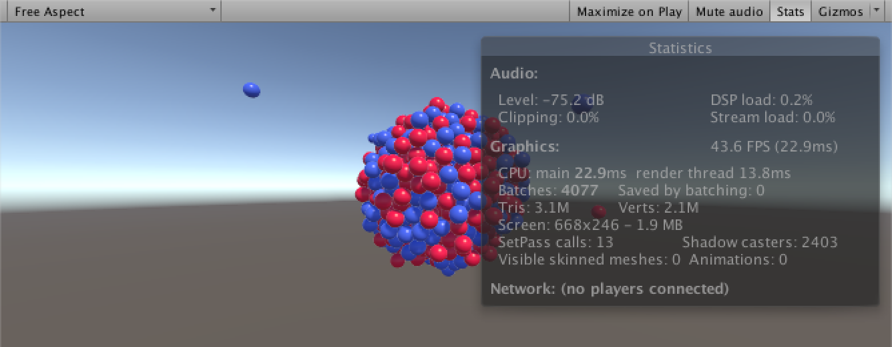

## 概述

Measuring Performance
* Use physics to create an ever-growing atomic nucleus.
* Use the profiler to investigate performance.
* Measure and display the frame rate.
* Prevent the creation of temporary strings.
* Stabilize the frame rate by averaging multiple frames.
* Colorize the frame rate display.

In this tutorial we'll create a simple test scene and then measure its performance. We'll first examine the profiler, then we'll create our own frame rate counter.

This tutorial requires a basic understanding of scripting in Unity. It has been made for Unity 5.0.1 and up. If you're new, have a look at Constructing a Fractal first.


<!--more-->

## Building an Atomic Nucleus

We need a test scene. One that ideally covers both high and low performance situations. I suggest we create an atomic nucleus by fusing more and more nucleons together. As the nucleus gets bigger, performance will worsen.

The nucleons will be simple spheres that will be attracted to the center of the scene, where they will bunch up and form a ball. This is of course not a correct representation of an atom, but that's not the point.

We can model a nucleon with a default sphere and a custom Nucleon component. This component makes sure that a rigidbody is attached to its object and then simply pulls it towards the origin. The strength of the pull is determined by a configurable attraction force and the distance from the center.

```cs
using UnityEngine;

[RequireComponent(typeof(Rigidbody))]
public class Nucleon : MonoBehaviour {

	public float attractionForce;

	Rigidbody body;

	void Awake () {
		body = GetComponent<Rigidbody>();
	}
	
	void FixedUpdate () {
		body.AddForce(transform.localPosition * -attractionForce);
	}
}
```

> Some access modifiers are missing?
> Yes, I'm omitting private modifiers from field and method declarations now, as they are private by default. Let's see how it goes, whether it is confusing or not.

Create two nucleon prefabs, one for protons and another for neutrons. Give each a different material so they look different. We could suffice with only one nucleon type, but that's boring to look at.

  

Nucleon prefabs.

To spawn these nucleons we need to create another component, NucleonSpawner. It needs to know the time interval between spawns, how far away from the center to spawn, and what to spawn.

```cs
using UnityEngine;

public class NucleonSpawner : MonoBehaviour {

	public float timeBetweenSpawns;

	public float spawnDistance;

	public Nucleon[] nucleonPrefabs;
}
```

Create an empty game object, attach a NucleonSpawner component, and configure it as you like.


To spawn at regular intervals, we need to keep track of the time since the last spawn. We can do this with a simple FixedUpdate method.

```cs
	float timeSinceLastSpawn;

	void FixedUpdate () {
		timeSinceLastSpawn += Time.deltaTime;
		if (timeSinceLastSpawn >= timeBetweenSpawns) {
			timeSinceLastSpawn -= timeBetweenSpawns;
			SpawnNucleon();
		}
	}
```

> Why use FixedUpdate and not Update?
> Using FixedUpdate keeps the spawning independent of the frame rate. If the configured time between spawns is shorter than the frame time, using Update would cause spawn delays. And as the point of this scene is to tank our frame rate, that will happen.

> You could use a while loop instead of an if check to catch up on missed spawns, but this would cause infinite spawn loops when timeSinceLastSpawn is accidentally set to zero. Limiting spawning to once per fixed time step is a sane limitation.


The actual spawning consists of three steps. Pick a random prefab, instantiate it, and give it a random position at the desired distance.

```cs
	void SpawnNucleon () {
		Nucleon prefab = nucleonPrefabs[Random.Range(0, nucleonPrefabs.Length)];
		Nucleon spawn = Instantiate<Nucleon>(prefab);
		spawn.transform.localPosition = Random.onUnitSphere * spawnDistance;
	}
```


Building a nucleus through bombardment.

Playing this scene should result in spheres shooting towards the center. They will overshoot for a while, until they collide with each other so much that a ball is formed. This ball will keep growing, physics computations will become more complex, and at some point you will notice a drop in frame rate.

If it takes too long for you to see performance worsen, you can increase the spawn rate. Speeding up time by increasing the time scale works as well. You can find it via Edit / Project Settings / Time. You can also decrease the Fixed Timestep, which will result in more physics calculations per second.


Unity time settings.

> Why is motion not fluid for low time scales?
> When the time scale is set to a low value like 0.1, time will move very slowly. Because the fixed time step is constant, this means that the physics system will update less often. So physics objects will remain motionless until a fixed update happens, which is only once every few frames.

> You can counter this phenomenon by decreasing the fixed time step as you increase the time scale. Alternatively, you could change the interpolation mode of rigidbody components so they interpolate between physics steps, hiding the low update frequency.


## Using the Profiler

Now that we have a scene that will eventually bring down the frame rate of any machine, it is time to measure the actual performance. The quickest thing you can do is enable the statistics overlay of the game view.


Game view statistics overlay.

However, the frame rate shown there isn't accurate at all, it's more like a rough guess. We can do better by opening Unity's profiler, via Window / Profiler. The profiler gives us a lot of useful information, especially the CPU usage and memory data.


If vsync is enabled, it will likely dominate the CPU graph at the start. To get a better idea of how much CPU resources our scene needs, turn vsync off. You can do this via Edit / Project Settings / Quality. It is found at the bottom, under the Other heading.


> I am getting very high frame rates now!
> Without vsync it is possible to get very high frame rates for simple scenes, going well over 100. This can put unnecessary stress on the hardware. You can prevent this by enforcing a maximum frame rate through code by setting the Application.targetFrameRate property. Be aware that this setting persists in the editor even after exiting play mode. Setting it to −1 will remove the limitation.

Now you can get a better look at the CPU usage. In my case physics requires most time, followed by rendering, and then my scripts. This remains true for a long time, even though everything will slow down as the sphere count goes up.


Profiler without vsync.

There are also two unexpected observations that we can make. First, there are occasional spikes of CPU usage. Second, the memory graph shows frequent GC allocation spikes, which indicates that there is memory being allocated and subsequently freed. As we're only creating new objects and never throw anything away, this is odd.

Both phenomena are caused by the Unity editor. The CPU spikes happen whenever you select something in the editor. The memory allocations are caused by a call to GameView.GetMainGameViewRenderRect, which is invoked by the editor. There is additional overhead as well, especially if you have both the game and scene view visible at the same time. In short, the editor itself interferes with our measurements.

You can still get plenty of useful information from in-editor profiling, but if you want to eliminate the editor itself from your measurements, you have to make a standalone build. You can still use the profiler if you make a development build and even automatically connect to it when running your app. You can configure this via File / Build Settings...


The profiler attached to a standalone app.

When profiling a standalone build, the data looks quite different. Memory allocations are now only caused by nucleons being spawned, and no more garbage collection occurs. In my case rendering takes more time, because I'm running the app full-screen instead of in a small game view. Also, the scripts are so insignificant that they're not even visible in the graph.

## Measuring Frames Per Second

The profiles gives us useful information, but it still doesn't gives us a good measurement of the frame rate. The FPS numbers shows are just 1 divided by the CPU time, which is not the actual frame rate that we're getting. So let's measure it ourselves.

We need a simple component that tells us the current frames per second that our app is running at. A single public property suffices. We make it an integer because we don't really need fractional precision.

```cs
using UnityEngine;

public class FPSCounter : MonoBehaviour {

	public int FPS { get; private set; }
}
```

> How does that property work?
> Remember that properties are methods that pretend to be a field. We provide the FPS as public information, but only the component itself needs to update the value. The syntax used is shorthand notation for an automatically generated property, which would look something like this.
  ```cs
	int fps;
	public int FPS {
		get { return fps; }
		private set { fps = value; }
	}
  ```
> This shorthand doesn't work with Unity's serialization, but that's fine because we don't need to save the FPS value anyway.

We measure the frames per second each update by dividing 1 by the time delta of the current frame. We cast the result to an integer, effectively rounding down.

  ```cs
	void Update () {
		FPS = (int)(1f / Time.deltaTime);
	}
  ```
However, there is a problem with this approach. The time delta is not the actual time it took to process the last frame, it is influence by the current time scale. This means that our FPS will be wrong unless the time scale is set to 1. Fortunately, we can also ask Unity for the unscaled time delta.

```cs
	void Update () {
		FPS = (int)(1f / Time.unscaledDeltaTime);
	}
```

Some kind of UI is needed to show the FPS. Let's use Unity's UI for that. Create a canvas with a panel inside it that in turn contains a text object. These can be added via the GameObject / UI submenu. When adding a canvas you'll also get an EventSystem object to handle user input, but we don't need that, so you can remove it.


UI object hierarchy.

I used the default canvas settings, except that I made it pixel-perfect.


A pixel-perfect canvas.

The panel is used to create a semitransparent black background for the FPS label. That way it will always be readable. I put it at the top-left corner of the window. Set its anchor to top-left so it remains in place regardless of the window's size. Set its pivot to (0,1) for easy placement.

Position the label inside the panel in a similar way. Make it white bold text, centered both horizontally and vertically. Design the whole thing so it snugly fits two digits.


  

Building the UI.

Now we need to bind the FPS value to the label. Let's create a component for this purpose. It needs an FPSCounter component to retrieve the value from, and a reference to a Text label from the UnityEngine.UI namespace to assign the value to.

```cs
using UnityEngine;
using UnityEngine.UI;

[RequireComponent(typeof(FPSCounter))]
public class FPSDisplay : MonoBehaviour {

	public Text fpsLabel;
}
```

Add this component to our panel and hook it up. We attach it to the panel because that's our whole FPS display, not to the label. We'll include more labels later.


Setting up the display.

The display component simply has to update the label's text each frame. Let's cache the reference to the counter so we don't need to invoke GetComponent every time.
```cs
	FPSCounter fpsCounter;

	void Awake () {
		fpsCounter = GetComponent<FPSCounter>();
	}

	void Update () {
		fpsLabel.text = fpsCounter.FPS.ToString();
	}
```

The FPS label is now updating! But as we designed it for two digits, it will show useless values whenever our frame rate exceeds 99 per second. So let's clamp displayed value. Anything above 99 performs good enough anyway.
```cs
	void Update () {
		fpsLabel.text = Mathf.Clamp(fpsCounter.FPS, 0, 99).ToString();
	}
```


Now we can see the frame rate.

Everything appears to work fine now, but there is a subtle problem. We are now creating a new string object each update, which is discarded the next update. This pollutes the managed memory, which will trigger the garbage collector. While this isn't a big deal for desktop apps, it is more troublesome for devices with little memory to spare. It also pollutes our profiler data, which is annoying when you're hunting for allocations.


Temporary string objects are created each update.

Can we get rid of these temporary strings? The value that we are displaying can be any integer between 0 and 99. That's 100 different strings. Why not create all these strings once and reuse them, instead of recreating the same content all the time?

```cs
	static string[] stringsFrom00To99 = {
		"00", "01", "02", "03", "04", "05", "06", "07", "08", "09",
		"10", "11", "12", "13", "14", "15", "16", "17", "18", "19",
		"20", "21", "22", "23", "24", "25", "26", "27", "28", "29",
		"30", "31", "32", "33", "34", "35", "36", "37", "38", "39",
		"40", "41", "42", "43", "44", "45", "46", "47", "48", "49",
		"50", "51", "52", "53", "54", "55", "56", "57", "58", "59",
		"60", "61", "62", "63", "64", "65", "66", "67", "68", "69",
		"70", "71", "72", "73", "74", "75", "76", "77", "78", "79",
		"80", "81", "82", "83", "84", "85", "86", "87", "88", "89",
		"90", "91", "92", "93", "94", "95", "96", "97", "98", "99"
	};
	
	void Update () {
		fpsLabel.text = stringsFrom00To99[Mathf.Clamp(fpsCounter.FPS, 0, 99)];
	}
```

By using a fixed array of string representations of every number that we might need, we have eliminated all temporary string allocations!

## Averaging Frames Per Second

Updating the FPS value each frame has an unfortunate side effect. The label will fluctuate constantly when the frame rate isn't stable, making it hard to get a useful reading. We could update the label only once in a while, but then we would no longer get a good impression of how the frame rate is behaving.

A possible solution is to average the frame rate, smoothing the impact of sudden changes, producing a less jittery value. Let's adjust FPSCounter so it does this over a configurable range of frames. Setting this value to 1 would be the same as not averaging at all, so it is effectively optional.

```cs
	public int frameRange = 60;
```


Configurable frame range.

Let's change the property name from FPS to AverageFPS, as that is a better description of the value it now represents. Either use your IDE to refactor the name, or manually update the display component to use the new name.

```cs
	public int AverageFPS { get; private set; }
```

Now we need a buffer to store the FPS values of multiple frames, plus an index so we know where to put the data of the next frame.

```cs
	int[] fpsBuffer;
	int fpsBufferIndex;
```

When initializing this buffer, make sure that frameRange is at least 1, and set the index to 0.

```cs
	void InitializeBuffer () {
		if (frameRange <= 0) {
			frameRange = 1;
		}
		fpsBuffer = new int[frameRange];
		fpsBufferIndex = 0;
	}
```

The Update method becomes a little more complicated. It begins by initializing the buffer if this is needed, either because we just started or because frameRange has changed. Then the buffer has to be updated, after which the average FPS can be calculated.

```cs
	void Update () {
		if (fpsBuffer == null || fpsBuffer.Length != frameRange) {
			InitializeBuffer();
		}
		UpdateBuffer();
		CalculateFPS();
	}
```

Updating the buffer is done by storing the current FPS at the current index, which is then incremented.

```cs
	void UpdateBuffer () {
		fpsBuffer[fpsBufferIndex++] = (int)(1f / Time.unscaledDeltaTime);
	}
```

But we'll quickly fill our entire buffer, and then what? We'll have to discard the oldest value before adding the new one. We could shift all values one position, but the average doesn't care about the order that the values are in. So we can just wrap the index back to the start of the array. That way we always override the oldest value with the newest, once the buffer has been filled.

```cs
	void UpdateBuffer () {
		fpsBuffer[fpsBufferIndex++] = (int)(1f / Time.unscaledDeltaTime);
		if (fpsBufferIndex >= frameRange) {
			fpsBufferIndex = 0;
		}
	}
```

Calculating the average is a simple matter of summing all values in the buffer and dividing by the amount of values.

```cs
	void CalculateFPS () {
		int sum = 0;
		for (int i = 0; i < frameRange; i++) {
			sum += fpsBuffer[i];
		}
		AverageFPS = sum / frameRange;
	}
```

Our average frame rate now works, and with a reasonable frame range it is a lot easier to get a good reading. But we can do even better. As we now have data from multiple frames, we can also expose the highest and lowest FPS in this range too. This gives us a lot more information than just an average.

```cs
	public int HighestFPS { get; private set; }
	public int LowestFPS { get; private set; }
```

We can find these values at the same time that we are calculating the sum.

```cs
	void CalculateFPS () {
		int sum = 0;
		int highest = 0;
		int lowest = int.MaxValue;
		for (int i = 0; i < frameRange; i++) {
			int fps = fpsBuffer[i];
			sum += fps;
			if (fps > highest) {
				highest = fps;
			}
			if (fps < lowest) {
				lowest = fps;
			}
		}
		AverageFPS = sum / frameRange;
		HighestFPS = highest;
		LowestFPS = lowest;
	}
```

Our FPSDisplay components can now bind two additional labels.

```cs
	public Text highestFPSLabel, averageFPSLabel, lowestFPSLabel;

	void Update () {
		highestFPSLabel.text =
			stringsFrom00To99[Mathf.Clamp(fpsCounter.HighestFPS, 0, 99)];
		averageFPSLabel.text =
			stringsFrom00To99[Mathf.Clamp(fpsCounter.AverageFPS, 0, 99)];
		lowestFPSLabel.text =
			stringsFrom00To99[Mathf.Clamp(fpsCounter.LowestFPS, 0, 99)];
	}
```

Add two more labels to the UI and hook them all up. I put the highest FPS at the top and the lowest FPS at the bottom, with the average FPS in the middle.


  
 

More information, less jitter.

## Coloring the Labels

As a final touch to the FPS labels, we can colorize them. This can be done by associating colors with FPS values. Such an association can be represented with a custom struct.

```cs
	[System.Serializable]
	private struct FPSColor {
		public Color color;
		public int minimumFPS;
	}
```

As FPSDisplay is the only thing that will use this structure, we put the struct definition directly inside that class and make it private so that it won't show up in the global namespace. Make it serializable so that it can be exposed by the Unity editor.

Now add an array of these struct so we can configure the coloring of the FPS labels. We'd typically add a public field for that, but we can't do that because the struct itself is private. So make the array private as well and give it the SerializeField attribute so Unity exposes it in the editor and saves it.

```cs
	[SerializeField]
	private FPSColor[] coloring;
```

Go ahead and add some colors! Make sure that there is at least one entry, order them from highest to lowest FPS, with the last entry for 0 FPS.


Coloring.

Before applying the colors to the labels, restructure the Update method by introducing a separate Display method that takes care of adjusting a single label.

```cs
	void Update () {
		Display(highestFPSLabel, fpsCounter.HighestFPS);
		Display(averageFPSLabel, fpsCounter.AverageFPS);
		Display(lowestFPSLabel, fpsCounter.LowestFPS);
	}

	void Display (Text label, int fps) {
		label.text = stringsFrom00To99[Mathf.Clamp(fps, 0, 99)];
	}
```

The correct color can be found by looping through the array until the minimum FPS for a color is met. Then set the color and break out of the loop.

```cs
	void Display (Text label, int fps) {
		label.text = stringsFrom00To99[Mathf.Clamp(fps, 0, 99)];
		for (int i = 0; i < coloring.Length; i++) {
			if (fps >= coloring[i].minimumFPS) {
				label.color = coloring[i].color;
				break;
			}
		}
	}
```

> Why did my labels disappear?
> A default color has all its four channels set to zero. This includes the alpha channel, which controls opacity. If you haven't changed the alpha channels, you'll get fully transparent labels.


Colored fps labels.

Done! Enjoy watching your FPS tank, in color!

## 原文链接

[Frames Per Second ](http://catlikecoding.com/unity/tutorials/frames-per-second/)