## Introduction

In this tutorial you will learn how to make realistic bullets in Unity. You will need this tutorial if you are building a game where accuracy is important, such as a sniper game or if you are firing long-range artillery. You will also learn about Unity's physics engine, so if you are not into war you will also learn something new.

<!--more-->

* In part 1 (this part) you will create the basic scene you will need.
* In part 2 you will learn how to calculate the angle you need to hit a target and display the trajectory path the bullet will take to hit the target.
* In part 3 you will learn how to improve the accuracy of the bullet. We will see that Unity's physics engine is not accurate enough if you want to hit a target with high accuracy. So you have to build your own physics engine, but it's just a few lines of code, so don't worry.
* In part 4 you will add the various forces that might affect the bullet, such as drag force and wind.
* In part 5 you will add a sniper rifle.


### Init

But before we begin we need a basic scene. First create a plane and rename it "Ground" and scale it to 5. Then create a box and rename it "Target" and a sphere called "Bullet" with a scale of 0.1. Make the bullet a prefab. Then create an empty Game Object called "Bullets parent" to which we will parent the bullets to get a less messy scene.

Now we need something that can fire bullets. Create an empty Game Object and rename it to "Turret." To this turret you should add a Line Renderer so we can display the bullet's path through the air. The turret also needs a body, so add a cube as a child to the Turret with position (0, 0.25, 0) and sscale (1, 0.5, 1).

Add an empty Game Object as a child to the Turret and rename it "Barrel connector." Position it at (0, 0.5, 0) in relation to the Turret so it sits on the top of the turret. Next add a cylinder as a child to the Barrel connector, and rename it to "Barrel." Resize it to (0.3, 1, 0.3), rotate it to (90, 0, 0) and position it at (0, 0, 1).

Make sure you can rotate the barrel if you are rotating the barrel connector, that you can rotate the turret, and that it looks like a turret with a gun by adding materials. Anyway, the exact dimensions are not important, but your scene should look like this (Ignore the GameController, it is just holding the camera and the light):

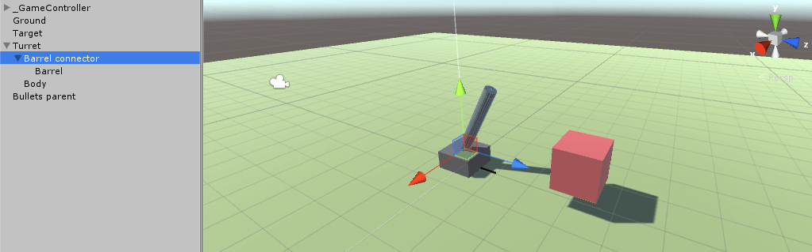
Now let's fire the gun!


## Targeting

When you are finished with this section of the tutorial you will have something that looks like this:

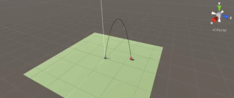

### Part 1. Fire bullets

This tutorial is all about ballistics so I believe the first thing we have to do is to make the turret fire bullets. So create a script called TutorialFireBullets and add the following to it. It's relatively self-explanatory, but the basic idea is to fire a bullet every 2 seconds from the Barrel connector Game Object, so add the script to it.

You also need to add a RigidBody to the bullet so it can fly. Make sure to not add any drag and the mass is not important. The script will give the bullet a speed in the direction the barrel is pointing after parenting the bullet to its parent GameObject so we get a clean workpace. So don't forget to drag the bullet prefab and the Bullets parent Game Object to the script. If you press play you should see bullets fly out of the turret (if you replace TutorialBallistics.bulletSpeed with something like 30f).

```cs
using UnityEngine;
using System.Collections;

public class TutorialFireBullets : MonoBehaviour 
{
    public GameObject bulletObj;
    public Transform bulletParent;
	
    void Start() 
    {
        StartCoroutine(FireBullet());
    }

    public IEnumerator FireBullet() 
    {        
        while (true)
        {
            //Create a new bullet
            GameObject newBullet = Instantiate(bulletObj, transform.position, transform.rotation) as GameObject;

            //Parent it to get a less messy workspace
            newBullet.transform.parent = bulletParent;

            //Add velocity to the bullet with a rigidbody
            newBullet.GetComponent<Rigidbody>().velocity = TutorialBallistics.bulletSpeed * transform.forward;

            yield return new WaitForSeconds(2f);
        }
    }
}
```

### Part 2. Find the angle to hit a target

But bullets flying out from a turret will not kill any targets. What we need is a script called TutorialBallistics, so create it. Also drag the Target cube and the Barrel connector Game Object to the script. Don't worry if you don't understand step size, I can guarantee that you will when the tutorial is over.

```cs
public class TutorialBallistics : MonoBehaviour 
{
    //Drags
    public Transform targetObj;
    public Transform gunObj;

    //The bullet's initial speed in m/s
    //Sniper rifle
    //public static float bulletSpeed = 850f;
    //Test
    public static float bulletSpeed = 20f;

    //The step size
    static float h;

    //For debugging
    private LineRenderer lineRenderer;

    void Awake()
    {
        //Can use a less precise h to speed up calculations
        //Or a more precise to get a more accurate result
        //But lower is not always better because of rounding errors
        h = Time.fixedDeltaTime * 1f;
        
        lineRenderer = GetComponent<LineRenderer>();
    }

    void Update()
    {
        RotateGun();

        //DrawTrajectoryPath();
    }
}
```

Now we will rotate the barrel so it aims at the target box. To help us we are going to use an equation called **Angle theta required to hit coordinate (x,y)** from Wikipedia's [Trajectory of a projectile](https://en.wikipedia.org/wiki/Trajectory_of_a_projectile#Angle_required_to_hit_coordinate_.28x.2Cy.29). That equation will give us 2 angles or none angles if the target is out of range. The angle in the script called highAngle will rotate the barrel to a rotation similar to an artilley gun, while the lowAngle will give us a rotation similar to a sniper rifle. The artillery will try to hit the target from above, while the sniper rifle will try to hit the target from the front. So create a method called RotateGun.

```cs
//Rotate the gun and the turret
void RotateGun()
{
	//Get the 2 angles
	float? highAngle = 0f;
	float? lowAngle = 0f;
	
	CalculateAngleToHitTarget(out highAngle, out lowAngle);

	//Artillery
	float angle = (float)highAngle;
	//Regular gun
	//float angle = (float)lowAngle;

	//If we are within range
	if (angle != null)
	{
		//Rotate the gun
		//The equation we use assumes that if we are rotating the gun up from the
		//pointing "forward" position, the angle increase from 0, but our gun's angles
		//decreases from 360 degress when we are rotating up
		gunObj.localEulerAngles = new Vector3(360f - angle, 0f, 0f);

		//Rotate the turret towards the target
		transform.LookAt(targetObj);
		transform.eulerAngles = new Vector3(0f, transform.rotation.eulerAngles.y, 0f);
	}
}
```

...and a method called CalculateAngleToHitTarget() which will apply the equation from Wikipedia. If you then press play you should be able to drag the Target cube around the scene (if you are in Scene view) and the barrel should rotate up and down.

```
//Which angle do we need to hit the target?
//Returns 0, 1, or 2 angles depending on if we are within range
void CalculateAngleToHitTarget(out float? theta1, out float? theta2)
{
	//Initial speed
	float v = bulletSpeed;

	Vector3 targetVec = targetObj.position - gunObj.position;

	//Vertical distance
	float y = targetVec.y;

	//Reset y so we can get the horizontal distance x
	targetVec.y = 0f;

	//Horizontal distance
	float x = targetVec.magnitude;

	//Gravity
	float g = 9.81f;


	//Calculate the angles
	
	float vSqr = v * v;

	float underTheRoot = (vSqr * vSqr) - g * (g * x * x + 2 * y * vSqr);

	//Check if we are within range
	if (underTheRoot >= 0f)
	{
		float rightSide = Mathf.Sqrt(underTheRoot);

		float top1 = vSqr + rightSide;
		float top2 = vSqr - rightSide;

		float bottom = g * x;

		theta1 = Mathf.Atan2(top1, bottom) * Mathf.Rad2Deg;
		theta2 = Mathf.Atan2(top2, bottom) * Mathf.Rad2Deg;
	}
	else
	{
		theta1 = null;
		theta2 = null;
	}
}
```

### Part 3. Display the trajectory curve

But wouldn't it be cool to also see the trajectory the bullet takes when it is flying towards the target. If we can make such a trajectory it will also be easier to see what's happening, because bullets are sometimes very fast. So create a method called DrawTrajectoryPath() and add the following.

```cs
//Display the trajectory path with a line renderer
void DrawTrajectoryPath()
{
	//How long did it take to hit the target?
	float timeToHitTarget = CalculateTimeToHitTarget();

	//How many segments we will have
	int maxIndex = Mathf.RoundToInt(timeToHitTarget / h);

	lineRenderer.SetVertexCount(maxIndex);

	//Start values
	Vector3 currentVelocity = gunObj.transform.forward * bulletSpeed;
	Vector3 currentPosition = gunObj.transform.position;

	Vector3 newPosition = Vector3.zero;
	Vector3 newVelocity = Vector3.zero;

	//Build the trajectory line
	for (int index = 0; index < maxIndex; index++)
	{
		lineRenderer.SetPosition(index, currentPosition);

		//Calculate the new position of the bullet
		TutorialBallistics.CurrentIntegrationMethod(h, currentPosition, currentVelocity, out newPosition, out newVelocity);

		currentPosition = newPosition;
		currentVelocity = newVelocity;
	}
}
```

To make it more good looking I've decided to first calculate the time it takes to hit the target so the trajectory curve stops when the target has been reached. To be able to do that we have to use a method called [numerical integration](https://en.wikipedia.org/wiki/Numerical_integration). The basic idea behind that method is to use tiny steps to make our way from the initial position where the bullet starts and move our way to the position where it will land, without firing any bullet in Unity's physics engine. We are simulating the bullet's path.

There are several methods to simulate a bullet's path, but we are here going to begin with a method called [Backward Euler](https://en.wikipedia.org/wiki/Backward_Euler_method), which is similar to the method Unity's physics engine is usings. I tried to find exactly which method the physics engine is using but didn't find any good answer. But Backward Euler will yield a similar path as the path the bullet is flying when it has a RigidBody.

The basic idea behind Forward Euler is that if we know the velocity and position at time zero, we will be able to find the velocity and position in the future. To calculate the velocity we are going to use the small time step **h** (calculated in the beginning of this section) in this way: **velocity_next_update = current_velocity + h x acceleration**.  

And if we know the velocity the bullet has, we can calculate its position in this way: **position_next_update = current_position + h x velocity_next_update**. And then we repeat the process until we believe we have hit the target while keeping track of the time. So add the mehod CalculateTimeToHitTarget().

//How long did it take to reach the target (splash in artillery terms)?

```cs
public float CalculateTimeToHitTarget()
{
	//Init values
	Vector3 currentVelocity = gunObj.transform.forward * bulletSpeed;
	Vector3 currentPosition = gunObj.transform.position;

	Vector3 newPosition = Vector3.zero;
	Vector3 newVelocity = Vector3.zero;

	//The total time it will take before we hit the target
	float time = 0f;

	//Limit to 30 seconds to avoid infinite loop if we never reach the target
	for (time = 0f; time < 30f; time += h)
	{
		TutorialBallistics.CurrentIntegrationMethod(h, currentPosition, currentVelocity, out newPosition, out newVelocity);

		//If we are moving downwards and are below the target, then we have hit
		if (newPosition.y < currentPosition.y && newPosition.y < targetObj.position.y)
		{
			//Add 2 times to make sure we end up below the target when we display the path
			time += h * 2f;

			break;
		}

		currentPosition = newPosition;
		currentVelocity = newVelocity;
	}

	return time;
}
```

...and the method CurrentIntegrationMethod()

```cs
//Easier to change integration method once in this method
public static void CurrentIntegrationMethod(
	float h,
	Vector3 currentPosition,
	Vector3 currentVelocity,
	out Vector3 newPosition,
	out Vector3 newVelocity)
{
	//IntegrationMethods.EulerForward(h, currentPosition, currentVelocity, out newPosition, out newVelocity);
	//IntegrationMethods.Heuns(h, currentPosition, currentVelocity, out newPosition, out newVelocity);
	//IntegrationMethods.RungeKutta(h, currentPosition, currentVelocity, out newPosition, out newVelocity);
	IntegrationMethods.BackwardEuler(h, currentPosition, currentVelocity, out newPosition, out newVelocity);
}
```

We are here going to experiment with several integration methods, so create a new script called IntegrationMethods where we can store all of them. The first one is Backward Euler.

```cs
using UnityEngine;
using System.Collections;

public class IntegrationMethods : MonoBehaviour 
{
	public static void BackwardEuler(
		float h,
		Vector3 currentPosition,
		Vector3 currentVelocity,
		out Vector3 newPosition,
		out Vector3 newVelocity)
	{
		//Init acceleration
		//Gravity
		Vector3 acceleartionFactor = Physics.gravity;

		//Main algorithm
		newVelocity = currentVelocity + h * acceleartionFactor;

		newPosition = currentPosition + h * newVelocity;
	}
}
```

If you now press play you should see a nice trajectory line from the turret towards the target. And the bullets fired from the turret should follow that path.

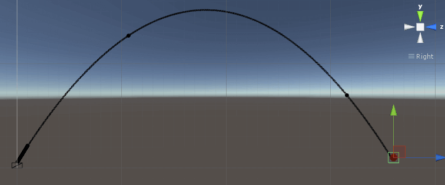

But if you move the target as little as 40 meters away from the turret, you will se that the trajectory line is not crossing the center of the target, and neither are the bullets. They are still hitting the box, but as we move the box further away from the turret, the accuracy will continue to fall. And that is not good enough if we want realistic bullets.

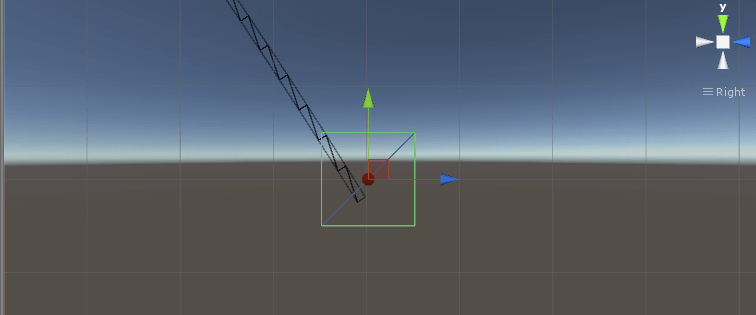

You can change the time step value h to a smaller value, which will improve the accuracy of the line, but the accuracy will not be nearly 100 percent as good as we want it. Also, if you decrease the time step h to a too small value, you will get rounding erros that will decrease the accuracy as if you had a large h. **So h can't be neither too small nor too large**. h has to be "lagom" as we say in Sweden. And how do we increase the accuracy of the bullets? That is the topic of the next part.

## Improve precision

In this part of the tutorial you will learn how to improve the accuracy of the trajectory line by using another integration method. You will also learn how to build your own physics engine with these integration methods so we can improve the accuracy of the bullets.

### Part 1. Different integration methods

To improve the accuracy you need another better integration method. The first one we are going to add is [Euler Forward](https://en.wikipedia.org/wiki/Euler_method), which is very similar to Backward Euler. The main difference is that it is much easier to add external forces that might affect the bullet if you are using Euler Forward because of how the methods work. If you are using Backward Euler you have to figure out the forces in the next time step and not this time step, which may be more complicated. If you are using Euler Forward you can use the current values. The drawback is that Euler Forward is not matching Unity's physics engine. Anyway, add the method EulerForward() to our collection of integration methods. Then change which of the integration method you are using in the TutorialBallistics script and observe the result.

```cs
//Euler's method - one iteration
//Will not match Unity's physics engine
public static void EulerForward(
	float h,
	Vector3 currentPosition,
	Vector3 currentVelocity,
	out Vector3 newPosition,
	out Vector3 newVelocity)
{
	//Init acceleration
	//Gravity
	Vector3 acceleartionFactor = Physics.gravity;
	//acceleartionFactor += CalculateDrag(currentVelocity);


	//Init velocity
	//Current velocity
	Vector3 velocityFactor = currentVelocity;
	//Wind velocity
	//velocityFactor += new Vector3(2f, 0f, 3f);


	//
	//Main algorithm
	//
	newPosition = currentPosition + h * velocityFactor;

	newVelocity = currentVelocity + h * acceleartionFactor;
}
```

You will notice that Euler Forward is overshooting the target in a similar way as Backward Euler was undershooting the target.

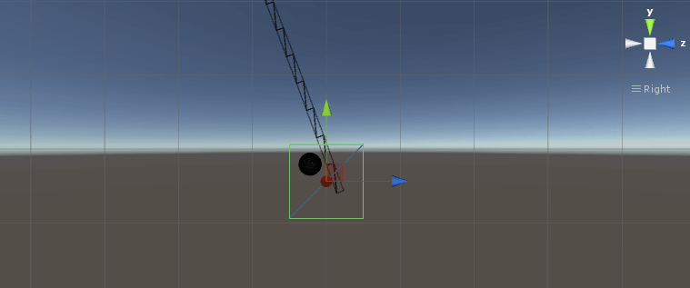

So we need a better integration method. Another integration method is Heun's method, which is using Euler Forward but is adding another step. It looks like this:

```cs
//Heun's method - one iteration
//Will give a better result than Euler forward, but will not match Unity's physics engine
//so the bullets also have to use Heuns method
public static void Heuns(
	float h,
	Vector3 currentPosition,
	Vector3 currentVelocity,
	out Vector3 newPosition,
	out Vector3 newVelocity)
{
	//Init acceleration
	//Gravity
	Vector3 acceleartionFactorEuler = Physics.gravity;
	Vector3 acceleartionFactorHeun = Physics.gravity;


	//Init velocity
	//Current velocity
	Vector3 velocityFactor = currentVelocity;
	//Wind velocity
	//velocityFactor += new Vector3(2f, 0f, 3f);


	//
	//Main algorithm
	//
	//Euler forward
	Vector3 pos_E = currentPosition + h * velocityFactor;

	//acceleartionFactorEuler += CalculateDrag(currentVelocity);

	Vector3 vel_E = currentVelocity + h * acceleartionFactorEuler;


	//Heuns method
	Vector3 pos_H = currentPosition + h * 0.5f * (velocityFactor + vel_E);

	//acceleartionFactorHeun += CalculateDrag(vel_E);

	Vector3 vel_H = currentVelocity + h * 0.5f * (acceleartionFactorEuler + acceleartionFactorHeun);


	newPosition = pos_H;
	newVelocity = vel_H;
}
```

If you now press play you will see something beautiful. The trajectory line goes straight through the target point we are aiming at.


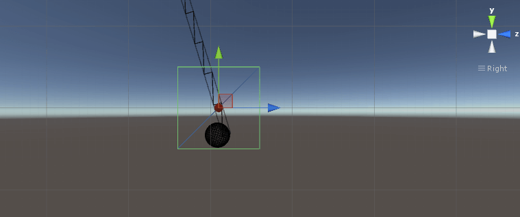

Heun's method is actually a simplified version of [Runge Kutta's method](https://en.wikipedia.org/wiki/Runge%E2%80%93Kutta_methods), which is another method you could add to the collection. I've tested to add it and it gives the same result as Heun's method in this environment. Another integration method used when simulating bullets is [Adams-Bashforth](https://en.wikiversity.org/wiki/Adams-bashforth_and_Adams-moulton_methods), but I haven't tested it because Heun's method is fast and accurate.

### Part 2. Improving the bullets

But a sniper or an artillery officer will not care if the simulated trajectory line goes through the target. To improve the bullets we are going to use Heun's method in a similar way as when we drew the trajectory line. The difference is that we can't change the time step h. If you've ever wondered why you have to place everything in Unity that's using physics in FixedUpdate() and not in Update(), the reason is this time step. It can't be too small nor too large and should be constant. That's why we are using Time.fixedDeltaTime as the time step h.

To improve the bullets you have to remove the RigidBody from it and replace it with a script called TutorialBullet. Also give the target a Tag called "Target" so we can detect if a bullet hit the target. To do that we fire a raycast every update from the last position to the new position as calculated by an integration method, and see if we have hit something. We also destroy the bullet if it falls below a certain level.

```cs
using UnityEngine;
using System.Collections;

public class TutorialBullet : MonoBehaviour
{    
    public Vector3 currentPosition;
    public Vector3 currentVelocity;

    Vector3 newPosition = Vector3.zero;
    Vector3 newVelocity = Vector3.zero;

    void Awake()
    {
        currentPosition = transform.position;
    }

    void Update()
    {
        DestroyBullet();
    }

    void FixedUpdate()
    {
        MoveBullet();
    }

    //Did we hit a target
    void CheckHit() 
    {
        Vector3 fireDirection = (newPosition - currentPosition).normalized;
        float fireDistance = Vector3.Distance(newPosition, currentPosition);

        RaycastHit hit;

        if (Physics.Raycast(currentPosition, fireDirection, out hit, fireDistance))
        {
            if (hit.collider.CompareTag("Target"))
            {
                Debug.Log("Hit target!");
                //Destroy(gameObject);
            }
        }
    }

    void MoveBullet()
    {
        //Use an integration method to calculate the new position of the bullet
        float h = Time.fixedDeltaTime;
        TutorialBallistics.CurrentIntegrationMethod(h, currentPosition, currentVelocity, out newPosition, out newVelocity);

        //First we need these coordinates to check if we have hit something
        CheckHit();

        currentPosition = newPosition;
        currentVelocity = newVelocity;

        //Add the new position to the bullet
        transform.position = currentPosition;
    }

    void DestroyBullet()
    {
        if (transform.position.y < -30f)
        {
            Destroy(gameObject);
        }
    }
}
```

You also need to change one line in the TutorialFireBullets script. Because we have removed the RigidBody from the bullet and replaced it with our own integration method, we need to add the velocity the bullet has at time zero.

```cs
public IEnumerator FireBullet() 
{        
	while (true)
	{
		//Create a new bullet
		GameObject newBullet = Instantiate(bulletObj, transform.position, transform.rotation) as GameObject;

		//Parent it to get a less messy workspace
		newBullet.transform.parent = bulletParent;

		//Add velocity to the non-physics bullet
		newBullet.GetComponent<TutorialBullet>().currentVelocity = TutorialBallistics.bulletSpeed * transform.forward;

		//Add velocity to the bullet with a rigidbody
		//newBullet.GetComponent<Rigidbody>().velocity = TutorialBallistics.bulletSpeed * transform.forward;

		yield return new WaitForSeconds(2f);
	}
}
```

If you now press play you will see that the bullets are also hitting the center of the target. Success!

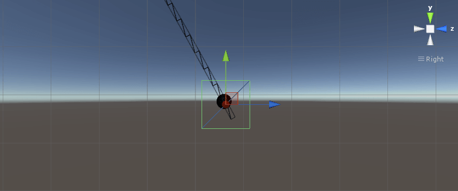


## Add realism
In this section we will add factors that will affect the bullet, such as wind and drag.

### Part 1. Wind
What you need to know if you are going to add realism to the bullet in Heun's method is to calculate the acceleration or velocity with the correct time. Gravity was a constant acceleration and isn't dependent on velocity or position, so we didn't need to care about it when we added gravity. If the wind is constant, we can just add it in the same way as we added gravity. So just uncomment the line "velocityFactor += new Vector3(2f, 0f, 3f);" where the vector is whatever wind you want.

```cs
//Heun's method - one iteration
//Will give a better result than Euler forward, but will not match Unity's physics engine
//so the bullets also have to use Heuns method
public static void Heuns(
	float h,
	Vector3 currentPosition,
	Vector3 currentVelocity,
	out Vector3 newPosition,
	out Vector3 newVelocity)
{
	//Init acceleration
	//Gravity
	Vector3 acceleartionFactorEuler = Physics.gravity;
	Vector3 acceleartionFactorHeun = Physics.gravity;


	//Init velocity
	//Current velocity
	Vector3 velocityFactor = currentVelocity;
	//Wind velocity
	velocityFactor += new Vector3(2f, 0f, 3f);


	//
	//Main algorithm
	//
	//Euler forward
	Vector3 pos_E = currentPosition + h * velocityFactor;

	//acceleartionFactorEuler += BulletPhysics.CalculateDrag(currentVelocity);

	Vector3 vel_E = currentVelocity + h * acceleartionFactorEuler;


	//Heuns method
	Vector3 pos_H = currentPosition + h * 0.5f * (velocityFactor + vel_E);

	//acceleartionFactorHeun += BulletPhysics.CalculateDrag(vel_E);

	Vector3 vel_H = currentVelocity + h * 0.5f * (acceleartionFactorEuler + acceleartionFactorHeun);


	newPosition = pos_H;
	newVelocity = vel_H;
}
```

### Part 2. Drag

Drag force is more complicated to add compared with the wind, because the drag is dependent of the bullet's velocity. So we have to calculate the acceleration from drag 2 times.

```cs
//Heun's method - one iteration
//Will give a better result than Euler forward, but will not match Unity's physics engine
//so the bullets also have to use Heuns method
public static void Heuns(
	float h,
	Vector3 currentPosition,
	Vector3 currentVelocity,
	out Vector3 newPosition,
	out Vector3 newVelocity)
{
	//Init acceleration
	//Gravity
	Vector3 acceleartionFactorEuler = Physics.gravity;
	Vector3 acceleartionFactorHeun = Physics.gravity;


	//Init velocity
	//Current velocity
	Vector3 velocityFactor = currentVelocity;
	//Wind velocity
	velocityFactor += new Vector3(2f, 0f, 3f);


	//
	//Main algorithm
	//
	//Euler forward
	Vector3 pos_E = currentPosition + h * velocityFactor;

	acceleartionFactorEuler += BulletPhysics.CalculateDrag(currentVelocity);

	Vector3 vel_E = currentVelocity + h * acceleartionFactorEuler;


	//Heuns method
	Vector3 pos_H = currentPosition + h * 0.5f * (velocityFactor + vel_E);

	acceleartionFactorHeun += BulletPhysics.CalculateDrag(vel_E);

	Vector3 vel_H = currentVelocity + h * 0.5f * (acceleartionFactorEuler + acceleartionFactorHeun);


	newPosition = pos_H;
	newVelocity = vel_H;
}
```
You should also create a new script called BulletPhysics where you can collect all methods that affect the bullets, and add a method that calculates drag. You should change these parameters, like mass and area, to fit your bullet.

```cs
using UnityEngine;
using System.Collections;

public class BulletPhysics : MonoBehaviour 
{
    //Calculate the bullet's drag's acceleration
    public static Vector3 CalculateDrag(Vector3 velocityVec)
    {
        //F_drag = k * v^2 = m * a
        //k = 0.5 * C_d * rho * A 

        float m = 0.2f; // kg
        float C_d = 0.5f;
        float A = Mathf.PI * 0.05f * 0.05f; // m^2
        float rho = 1.225f; // kg/m3

        float k = 0.5f * C_d * rho * A;

        float vSqr = velocityVec.sqrMagnitude;

        float aDrag = (k * vSqr) / m;

        //Has to be in a direction opposite of the bullet's velocity vector
        Vector3 dragVec = aDrag * velocityVec.normalized * -1f;

        return dragVec;
    }
}
```
That's all of the external factors we are going to add for now. If you press play you will notice that the bullets are no longer hitting the target. The equation we used to calculate the angle is not working if we add drag and wind.

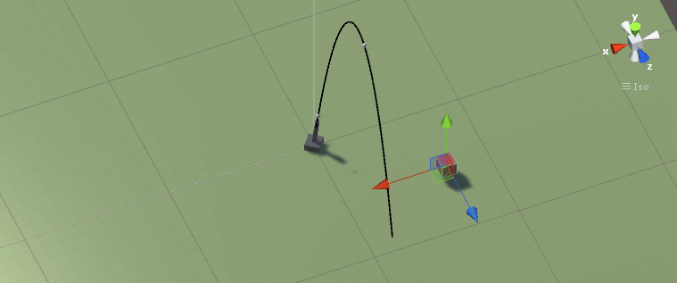

## Add sniper rifle

In this part of the tutorial you will learn how to add a sniper rifle that can zoom and fire realistic bullets

### Part 1. Preparations

First of all we need a sniper rifle, which in this case will consist of a scope, so go to Google and download your favorite scope image. I downloaded [this](http://www.rodypolis.com/free-stuff.html). While you are googling, you should also find an image that we can use as a target. I downloaded [Target for Archery](http://www.turbosquid.com/FullPreview/Index.cfm/ID/439778).

Then drag both of the images into Unity. The target texture should be a Texture and you should add it to a material. Then create 2 cubes with scale 2. Name one Target and the other Target mirror. We will need a mirror of the target to easier see what we hit so we don't have to run to the target and back again each time we have fired a bullet. Add the target material to both cubes.

The scope image should be a Sprite (2D and UI). To add the scope image to the scene, right-click -> UI -> Image, and add the scope as the source image. I also had to scale it 3 times so it fits the entire screen. Also create a cube at the center of the scene so you have somewhere to fire from. Also create some kind of arrow from 2 cubes so we can show in which direction the wind is coming from. Also add Unity's first person controller. When you are done it should look like this:

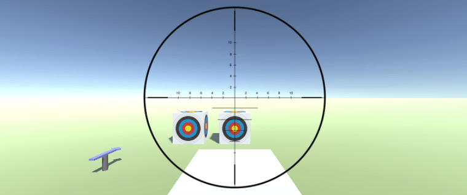

### Part 2. Create a sniper rifle

Create a script called SniperController and add the code below. The mainCamera is the camera attached to the first person controller, the sightImage is our sniper scope, the bulletObj is the bullet we are going to fire, and the targetObj and mirrorTargetObj are the targets we created. The hitMarker is a simple sphere we will add to the position where the bullet hit. So create a sphere, scale it to (0.1, 0.1, 0.1) and add it as a prefab.

We need the "using UnityStandardAssets.Characters.FirstPerson;" so we can change the sensitivity of the mouse when we have zoomed the camera (scope). So we need to access the MouseLook, which is a part of Unity's first person controller. This might be different depending on the Unity version you are using, but you will be able to complete the tutorial if you are not changing the sensitivity. It will just be more difficult to aim.

```cs
using UnityEngine;
using System.Collections;
using UnityStandardAssets.Characters.FirstPerson;

public class SniperController : MonoBehaviour 
{
    //Drags
    public Camera mainCamera;
    public GameObject sightImage;
    public GameObject bulletObj;
    public Transform targetObj;
    public Transform mirrorTargetObj;
    public GameObject hitMarker;
    
    //The bullet's initial speed
    //Sniper rifle
    public float bulletSpeed = 850f;

    //Need the initial camera FOV so we can zoom
    float initialFOV;
    //To change the zoom
    int currentZoom = 1;

    //To change sensitivity when zoomed
    MouseLook mouseLook;
    float standardSensitivity;
    float zoomSensitivity = 0.1f;

    bool canFire = true;

    public static Vector3 windSpeed = new Vector3(2f, 0f, 3f);

    void Start() 
    {
        //Lock and hide the mouse cursor 
        UnityEngine.Cursor.visible = false;
        Cursor.lockState = CursorLockMode.Locked;

        initialFOV = mainCamera.fieldOfView;

        mouseLook = GetComponent<RigidbodyFirstPersonController>().mouseLook;

        standardSensitivity = mouseLook.XSensitivity;
    }

    void Update() 
    {        
        ZoomSight();

        FireBullet();
    }
}
```

Now we will zoom the scope. The sniper rifle I found on Wikipedia can zoom between 3 and 12 times. So add the method ZoomSight(). The basic idea is that we are deactivating the scope image when we are not zooming, we zoom in and out with the mouse wheel, and then we add the new FOV with zoom to the camera.

```cs
 //The sniper rifle can zoom between 3 and 12 times
void ZoomSight()
{
	//Remove the scope sight if we are not zooming
	if (currentZoom == 1) 
	{
		sightImage.SetActive(false);

		//Change sensitivity
		mouseLook.XSensitivity = standardSensitivity;
		mouseLook.YSensitivity = standardSensitivity;
	}
	else 
	{
		sightImage.SetActive(true);

		//Change sensitivity
		mouseLook.XSensitivity = zoomSensitivity;
		mouseLook.YSensitivity = zoomSensitivity;
	}

	//Zoom with mouse wheel
	if (Input.GetAxis("Mouse ScrollWheel") > 0)
	{
		currentZoom += 1;
	}
	else if (Input.GetAxis("Mouse ScrollWheel") < 0)
	{
		currentZoom -= 1;
	}

	//Clamp zoom
	//Keep it between 1 and 11, then add 1 when zoom because zoom is between 3 and 12 times
	currentZoom = Mathf.Clamp(currentZoom, 1, 11);

	//No zoom
	if (currentZoom == 1)
	{
		//If the zoom is 6x, then the FOV is FOV / 6 (according to unscientific research on Internet)
		mainCamera.fieldOfView = initialFOV / (float)currentZoom;
	}
	//Zoom the sight
	else
	{
		mainCamera.fieldOfView = initialFOV / ((float)currentZoom + 1f);
	}
}
```

Let's fire the sniper rifle, so add the method FireBullet(). The problem I had here was that when we aim high, the mouse ends up outside of the webplayer even though we locked it in the beginning. I tried to find a solution, but found that several other people had the same problem and no good solution. It will probably work if you are in full-screen, which might be a good idea because the target will be really small when it's far away.

```cs
void FireBullet() 
{
	//Sometimes when we move the mouse is really high in the webplayer, so the mouse cursor ends up outside
	//of the webplayer so we cant fire, despite locking the cursor, so add alternative fire button
	if ((Input.GetMouseButtonDown(0) || Input.GetKeyDown(KeyCode.F)) && canFire)
	{
		//Create a new bullet
		GameObject newBullet = Instantiate(bulletObj, mainCamera.transform.position, mainCamera.transform.rotation) as GameObject;

		//Give it speed
		newBullet.GetComponent<TutorialBullet>().currentVelocity = bulletSpeed * mainCamera.transform.forward;

		canFire = false;
	}

	//Has to release the trigger to fire again
	if (Input.GetMouseButtonUp(0) || Input.GetKeyUp(KeyCode.F))
	{
		canFire = true;
	}
}
```

We also need to change a few lines in the TutorialBullet script. By the way, don't forget to tag the target cubes you created as "Target," and add the following lines to TutorialBullet:

```cs
if (hit.collider.CompareTag("Target"))
{
	Debug.Log("Hit target!");
	
	//Destroy the bullet
	Destroy(gameObject);

	//Add marker where we hit target
	GameObject.FindGameObjectWithTag("Player").GetComponent<SniperController>().AddMarker(hit.point);
}
```

While working with the bullet, you should also add a Trail Renderer component to the bullet to make it easier to see the fast bullet. It should have a time of 0.5, a start width of 0.2 and an end width of 0.05, or whatever you think looks good. Also give the Trail Renderer an unlit material or it will be pink!

You also need to add another method in SniperController. As I said before, the idea is to mirror the position where we hit the cube that's closer to the position where we fire bullets, so we don't need to spend time running to see where we hit the real target. To make this work we have to translate the coordinate where we hit to the coordinate of the cube that's mirroring the hits.

```cs
//Add marker where we hit target
//Called from the bullet script
public void AddMarker(Vector3 hitCoordinates) 
{
	//Add a marker where we hit the target
	Instantiate(hitMarker, hitCoordinates, Quaternion.identity);

	//The coordinates of the hit in localPosition of the target
	Vector3 localHitCoordinates = targetObj.InverseTransformPoint(hitCoordinates);

	//The global coordinates of the hit but in relation to the mirror target
	//The marker has the same local position in relation to both the target and the mirror
	Vector3 globalMirrorHit = mirrorTargetObj.transform.TransformPoint(localHitCoordinates);

	//Add another marker
	Instantiate(hitMarker, globalMirrorHit, Quaternion.identity);
}
```

Finally, you need to add a script called Wind where we set the rotation of the object that is showing in which way the wind is coming from. It will make it easier to hit the target. Also add the script to the object showing the wind.

```cs
using UnityEngine;
using System.Collections;

public class Wind : MonoBehaviour 
{
    void Start() 
    {
        Vector3 windDirection = SniperController.windSpeed.normalized;
        Quaternion rotation = Quaternion.LookRotation(windDirection);
        transform.rotation = rotation;
    }
}
```

Also change in the script called IterationMethods so the wind comes from the SniperController, so you only have to change the wind velocity in one place.

```cs
//Wind velocity
velocityFactor += SniperController.windSpeed;
```

That's it. Move the target to a z-coordinate of 300, and if you press play you should now be able to fire bullets.

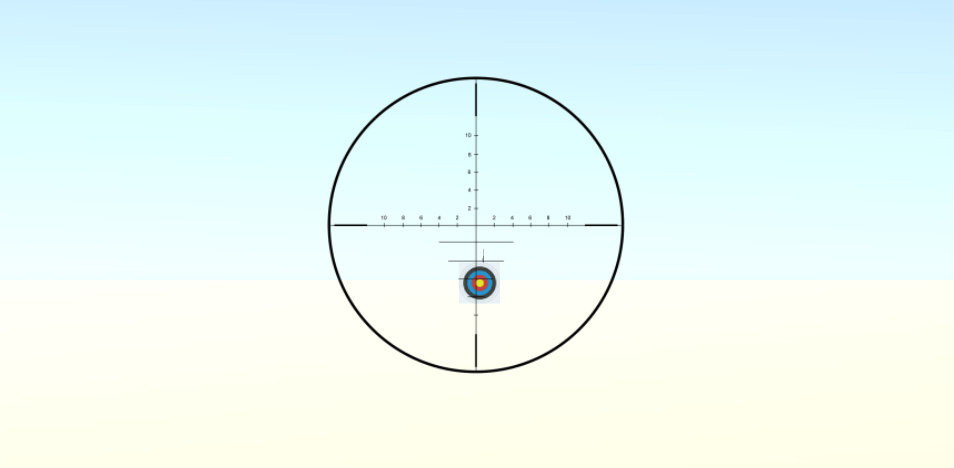

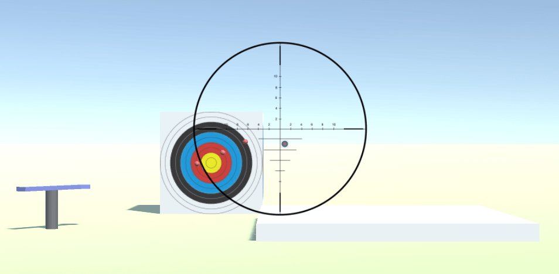


## 参考

* [Make a realistic bullets in Unity with C#](http://www.habrador.com/tutorials/unity-realistic-bullets/)