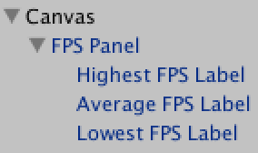
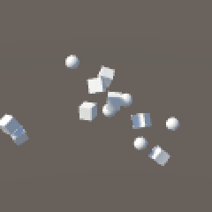
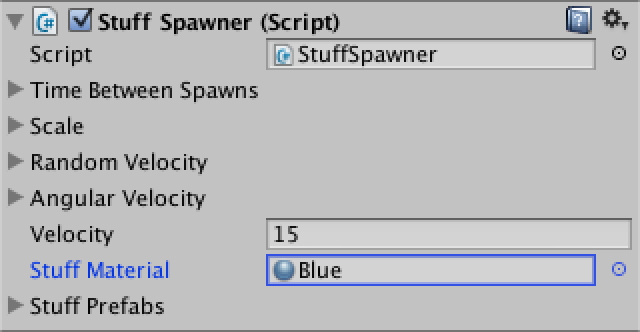
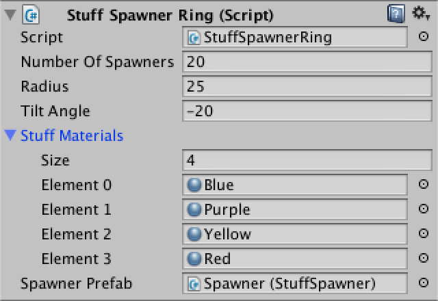

Object Pools Keeping Things Alive

* Create a fountain of stuff with physics.
* Make objects poolable.
* Add functionality to prefabs.
* Generate pools on demand.
* Survive recompiles and scene transitions.

This tutorial is about objects pools. What are they, how do they work, and are they useful?

The tutorial follows Frames per Second. We will be spawning objects in a similar way, and the FPS counter is useful to measure performance.


<!--more-->

## Spawning Lots of Stuff

Object pools are a tool to reuse objects, which is relevant when you are creating and destroying lots of them. So we should begin by spawning lots of objects. And to measure performance, we can reuse the frame rate counter from the previous tutorial. You can grab just the counter bits and delete everything else. It is easiest if you open its scene, turn the counter object into a prefab, and then use that in a new scene for this tutorial.

  
  

Reusing the frame rate counter.

So we need stuff to spawn. And to make it interesting, let's make it physics stuff. We can start with a very simple component for that, similar to the nucleon of the previous tutorial.

```cs
using UnityEngine;

[RequireComponent(typeof(Rigidbody))]
public class Stuff : MonoBehaviour {

	Rigidbody body;

	void Awake () {
		body = GetComponent<Rigidbody>();
	}
}
```

Create a standard cube and sphere, and add this component to both of them. Then turn them into prefabs.

  

Stuff prefabs.

The next thing we need is a spawner of stuff, much like the nucleon spawner.

```cs
using UnityEngine;

public class StuffSpawner : MonoBehaviour {

	public float timeBetweenSpawns;

	public Stuff[] stuffPrefabs;

	float timeSinceLastSpawn;

	void FixedUpdate () {
		timeSinceLastSpawn += Time.deltaTime;
		if (timeSinceLastSpawn >= timeBetweenSpawns) {
			timeSinceLastSpawn -= timeBetweenSpawns;
			SpawnStuff();
		}
	}

	void SpawnStuff () {
		Stuff prefab = stuffPrefabs[Random.Range(0, stuffPrefabs.Length)];
		Stuff spawn = Instantiate<Stuff>(prefab);
		spawn.transform.localPosition = transform.position;
	}
}
```

Create an object with this component. Set the time between spawns to something small, like 0.1. Then put references to the cube and sphere prefabs in the stuff array.

  

A spawner of stuff to spawn stuff.

Now we have a spawner that create cubes and spheres at one point. It doesn't look like much. If we give the spawner access to the stuff's body, it can give them a starting velocity. So turn Stuff.body into a property.

```cs
	public Rigidbody Body { get; private set; }

	void Awake () {
		Body = GetComponent<Rigidbody>();
	}
```

Let's add a configurable velocity to StuffSpawner, which it will use to give its spawns an initial upward momentum.

```cs
	public float velocity;

	void SpawnStuff () {
		Stuff prefab = stuffPrefabs[Random.Range(0, stuffPrefabs.Length)];
		Stuff spawn = Instantiate<Stuff>(prefab);
		spawn.transform.localPosition = transform.position;
		spawn.Body.velocity = transform.up * velocity;
	}
```

  

Building a tower of stuff, bottom-up.

Now we get a neat rising tower of stuff, which quickly collapses, then rises again. If you tilt the spawner, then it will start to look more like a natural flow of stuff. In fact, if we were to put multiple spawners in a ring, it will start to resemble an elaborate fountain. Let's create a component to do just that.

```cs
using UnityEngine;

public class StuffSpawnerRing : MonoBehaviour {

	public int numberOfSpawners;
	
	public float radius, tiltAngle;
	
	public StuffSpawner spawnerPrefab;

	void Awake () {
		for (int i = 0; i < numberOfSpawners; i++) {
			CreateSpawner(i);
		}
	}
}
```

To position the spawners, it is easiest to create a rotater object for each. That way we can deal with the placement and rotations in isolation.

```cs
	void CreateSpawner (int index) {
		Transform rotater = new GameObject("Rotater").transform;
		rotater.SetParent(transform, false);
		rotater.localRotation =
			Quaternion.Euler(0f, index * 360f / numberOfSpawners, 0f);

		StuffSpawner spawner = Instantiate<StuffSpawner>(spawnerPrefab);
		spawner.transform.SetParent(rotater, false);
		spawner.transform.localPosition = new Vector3(0f, 0f, radius);
		spawner.transform.localRotation = Quaternion.Euler(tiltAngle, 0f, 0f);
	}
```

Now turn the spawner into a prefab and make a new spawner ring object.

  

Definitely a lot of stuff.

We now have a fountain of stuff that just keeps on spawning more, resulting in an endless column of falling objects. To prevent our app from choking, we have to get rid of all this stuff at some point. We can do so by introducing a kill zone. All stuff that enters this zone should be destroyed.

Create an object with a box collider marked as a trigger, set it to a very large size, and place it somewhere below the fountain. Then give it a Kill Zone tag so we know its function. This tag doesn't exist, you'll have to add it yourself, which you can do via the Add Tag... option in the tag selector. Note that tags will not be included when importing a unitypackage file, you'll have to add them to your project so they show up correctly.

  

A kill zone.

Now Stuff can respond to entering a trigger by checking whether it is now in a kill zone, and if so terminate itself.

```cs
	void OnTriggerEnter (Collider enteredCollider) {
		if (enteredCollider.CompareTag("Kill Zone")) {
			Destroy(gameObject);
		}
	}
 
```


Stuff gets terminated.

> Why use a tag?
> Comparing tags is quick and our kill zone doesn't need to do anything, so it doesn't need a component of its own.

## Adding Variation

We have our fountain, but it's rather orderly. It could use some more randomness. We can do this by replacing fixed values with random values that fall inside some range. Because we can do this with multiple values, let's make a convenient structure for it.

```cs
using UnityEngine;

[System.Serializable]
public struct FloatRange {

	public float min, max;
	
	public float RandomInRange {
		get {
			return Random.Range(min, max);
		}
	}
}
```

Now we can mess up the timing of StuffSpawner.

```cs
	public FloatRange timeBetweenSpawns;

	float currentSpawnDelay;

	void FixedUpdate () {
		timeSinceLastSpawn += Time.deltaTime;
		if (timeSinceLastSpawn >= currentSpawnDelay) {
			timeSinceLastSpawn -= currentSpawnDelay;
			currentSpawnDelay = timeBetweenSpawns.RandomInRange;
			SpawnStuff();
		}
	}
```


Why not randomize the stuff's scale and rotation as well?

```cs
	public FloatRange timeBetweenSpawns, scale;

	void SpawnStuff () {
		Stuff prefab = stuffPrefabs[Random.Range(0, stuffPrefabs.Length)];
		Stuff spawn = Instantiate<Stuff>(prefab);
		
		spawn.transform.localPosition = transform.position;
		spawn.transform.localScale = Vector3.one * scale.RandomInRange;
		spawn.transform.localRotation = Random.rotation;
		
		spawn.Body.velocity = transform.up * velocity;
	}
```


We can also vary the velocity, but let's make this a 3D randomization. We leave the base velocity unchanged, but also add a random velocity in an arbitrary direction.

```cs
	public FloatRange timeBetweenSpawns, scale, randomVelocity;

	void SpawnStuff () {
		…
		
		spawn.Body.velocity = transform.up * velocity +
			Random.onUnitSphere * randomVelocity.RandomInRange;
	}
```


And as physics allows for angular momentum as well, add a random angular velocity too. Keep in mind that the physics engine limits this velocity to keep the simulation stable. The default maximum is 7.

```cs
	void SpawnStuff () {
		…

		spawn.Body.velocity = transform.up * velocity +
			Random.onUnitSphere * randomVelocity.RandomInRange;
		spawn.Body.angularVelocity =
			Random.onUnitSphere * angularVelocity.RandomInRange;
	}
```


 


Adding some initial spin.

Our fountain of stuff is looking a lot more lively by now. Adding some color would make it even more interesting to watch. We could have spawners select randomly from multiple materials, but let's just give each spawner one material to work with.

```cs
	public Material stuffMaterial;

	void SpawnStuff () {
		…
		
		spawn.GetComponent<MeshRenderer>().material = stuffMaterial;
	}
```



> Why materials and not just colors?
> Assigning colors to the stuff's material would result in each instance getting its own material. This way all materials remain shared.

Of course we won't just use one material. Instead, create a bunch and let StuffSpawnerRing cycle through them while it creates the spawners.

```cs
	public Material[] stuffMaterials;

	void CreateSpawner (int index) {
		…

		spawner.stuffMaterial = stuffMaterials[index % stuffMaterials.Length];
	}
```

> What does % do?
> x % y computes the remainder of x divided by y. So we get repeating sequences going from 0 to stuffMaterials.Length - 1.

  


A colored fountain of stuff.

Our scene will look even more lively if the stuff has something to interact with besides itself. So add a large sphere at the center of the scene. I gave it a uniform scale of 15 and also increased the stuff's velocity to 17 so it has a better chance to land on top of the sphere.


More interesting physics interactions.

Now stuff can bounce around a bit and maybe spend some time on the sphere, before it inevitable ends up in the kill zone. You can add more obstacles to the scene, but the longer you delay stuff from getting to a kill zone, the more work the physics engine has to do.


## Making Heavier Stuff

Ok, so we're spawing stuff. How's the performance of our app? Check the profiler and see what's going on. Make a build and profile that as well, so you see how it runs as a standalone app. As builds performs better than playing in the editor, you could increase the number of spawners to 30 or higher, depending your your machine.

You will see continuous memory allocation and maybe garbage collection runs, which is not surprising. You could see anywhere from a hundred to a thousand bytes being allocated each frame, depending on randomness and the frame rate that your app is running at.

Is this memory allocation significant to warrant special attention? On desktops most likely not. Rendering and physics keep the machine busy, our scripts barely register on the profiler graph.


Our code – the blue line – is not a bottleneck in this case.

Of course this picture might change for other devices. Mobiles and consoles typically have less and slower memory than desktops and laptops. You can end up with frequent garbage collection runs, which can wreak havoc on your app's frame rate. But you have to try and measure it before you can be sure.

For a desktop app, our current approach of simply creating and destroying objects as needed seems perfectly fine. There's no need to add complexity to our app trying to solve a non-exiting problem. But maybe our objects are just too simple? What if our stuff was more complex?

We need bigger stuff! Fox example, a cross made from cubes. Create three cubes, make them children of an empty game object, and set their scales to the three possible permutations of (0.5, 0.5, 2.5). Then add a Stuff component to the root object and turn the whole thing into a prefab. I set its mass to 3 because it's a larger object than the other stuff.

  

Cross prefab.

Add this new type of stuff to the spawner prefab's array so it will be included in the fountain.


Cubes, spheres, and crosses.

Entering play mode right now will give us trouble when trying to assigning materials. Our assumption that stuff objects always have a MeshRenderer is no longer true. So let's move the responsibility of setting the material to Stuff itself. Internally, it can collect all renderers inside itself when it awakens. Then it can forward material assignments to them all when needed.

```cs
	MeshRenderer[] meshRenderers;

	public void SetMaterial (Material m) {
		for (int i = 0; i < meshRenderers.Length; i++) {
			meshRenderers[i].material = m;
		}
	}
	
	void Awake () {
		Body = GetComponent<Rigidbody>();
		meshRenderers = GetComponentsInChildren<MeshRenderer>();
	}
```

Now StuffSpawner just has to invoke this method.

```cs
	void SpawnStuff () {
		…

		spawn.SetMaterial(stuffMaterial);
	}
```


More complex stuff in the fountain.

What about we add caltrops as well? A caltrop consists of four legs that point away from each other. You can put capsules inside those legs to visualize them, with a Y offset of 0.5. The first leg points upwards. The second has rotation (70.52878, 180, 180). The other two have the same X and Z rotation, but their Y rotation should be 300 and 60.

  

Caltrop prefab.

Add the caltrop to the spawner's stuff prefab array as well. You can increase the probability of an option being chosen by adding it more than once.

 

A messy fountain.

How's our app's performance now? We're getting more memory allocations, but it is still not an issue for a desktop app. The physics calculations are much more important. Something drastic is needed to make the creation of stuff matter. For example, add the following line a few times to Stuff.Awake.

```cs
		FindObjectsOfType<Stuff>();
```


This warrants attention.

That did it. Object creation is now significant for our desktop app. Invoking FindObjectsOfType just five times per stuff generates roughly 200KB of memory allocations per frame for me. But this is a ridiculous scenario. Object pooling isn't the solution for this, getting rid of those FindObjectsOfType invocations is. And have a chat with whoever thought it a good idea to put that code there.


## Pooling Objects

Suppose that we do want to use object pooling. How would we do that? We reuse objects by not destroying them, but instead deactivating them and placing them in a buffer. That's our pool. Then whenever we need a new object, we can reactivate one from the pool. If none are available, we create a new object as usual.

Let's create a component for these objects. It needs to know which pool it belongs to, so it can return to it when needed. And just in case it ends up without a pool, it should destroy itself instead.

```cs
using UnityEngine;

public class PooledObject : MonoBehaviour {

	public ObjectPool Pool { get; set; }

	public void ReturnToPool () {
		if (Pool) {
			Pool.AddObject(this);
		}
		else {
			Destroy(gameObject);
		}
	}
}
```

Now we can turn Stuff into a pooled object and have it return to its pool when entering a kill zone.

```cs
public class Stuff : PooledObject {
	
	…

	void OnTriggerEnter (Collider enteredCollider) {
		if (enteredCollider.CompareTag("Kill Zone")) {
			ReturnToPool();
		}
	}
}
```

Of course we now need an `ObjectPool` component. It should be possible to get an object from it and return objects to it. For now, let's just have it create and destroy objects the old-fashioned way and worry about actual reuse later.

While we are here though, let's use the pool as the parent for everything that it creates, so those objects don't clutter the root of the hierarchy.

```cs
using UnityEngine;
using System.Collections.Generic;

public class ObjectPool : MonoBehaviour {

	PooledObject prefab;

	public PooledObject GetObject () {
		PooledObject obj = Instantiate<PooledObject>(prefab);
		obj.transform.SetParent(transform, false);
		obj.Pool = this;
		return obj;
	}

	public void AddObject (PooledObject o) {
		Object.Destroy(o.gameObject) ;
	}
}
```

Next, we have to change `StuffSpawner` so it uses a pool to create stuff, instead of instantiating new stuff all the time. How can we do this? It has to somehow get hold of a pool for each prefab. And we don't want duplicate pools, so all spawners should share them.

It would be very convenient if we could directly get a pooled instance from a prefab, without having to worry about the pools themselves. So let's pretend that we can.

```cs
	void SpawnStuff () {
		Stuff prefab = stuffPrefabs[Random.Range(0, stuffPrefabs.Length)];
		Stuff spawn = prefab.GetPooledInstance<Stuff>();

		…
	}
```

Of course prefabs don't have this functionality, so we have to add it ourselves. What we are actually doing here is simply invoking a method of PooledObject. This object just happens to be a prefab, not an object in a scene.

> You can interact with prefabs?
> Yes. They are object instances, just like scene objects. But they're not part of the scene hierarchy. They are assets, which means that all changes to them in the editor will be permanent. Just like when you'd adjust a shared material, for example.

It is now up to the PooledObject component to take care of the pools. First, we need to give it the required method, which is a generic method, like Instantiate.

```cs
	public T GetPooledInstance<T> () where T : PooledObject {
	}
```

> How does a generic method work?
> They work like regular methods, except that they are also like a template. Instead of a concrete type, you use a placeholder, typically named T. You can then invoke this method with any type. The compiler will make sure that method versions for each requested type are available.
> 
> The where keyword after the method header is used to constrain the types that are allowed to be used with this method. In our case, we only support PooledObject and its subclasses.

All this method needs to do is get an object from some pool instance that belongs to this prefab, cast it to the required type, and return it.

```cs
	public T GetPooledInstance<T> () where T : PooledObject {
		return (T)poolInstanceForPrefab.GetObject();
	}
```

Of course we need to keep track of poolInstanceForPrefab, so it becomes a field of PooledObject. Note that we'll use this field to reference an object in the scene, even though a prefab is an asset and not part of any scene. So we cannot save it as part of the prefab, thus we have to make it non-serializable.

```cs
	[System.NonSerialized]
	ObjectPool poolInstanceForPrefab;
```

> What happens when you serialize it?
> Unity will try to save the pool instance as part of the prefab asset, but will fail. If the field were public, it would show up in the inspector as a type mismatch while in play mode, and as missing otherwise.
> 
> Note that all PooledObject instances have this field. It's just prefabs that should make use of it.

Finally, how do we actually get a reference to the correct pool? We'll ask the ObjectPool class for one when necessary, via a static method.

```cs
	[System.NonSerialized]
	ObjectPool poolInstanceForPrefab;

	public T GetPooledInstance<T> () where T : PooledObject {
		if (!poolInstanceForPrefab) {
			poolInstanceForPrefab = ObjectPool.GetPool(this);
		}
		return (T)poolInstanceForPrefab.GetObject();
	}
```

So off we go to ObjectPool and add the required method.

```cs
	public static ObjectPool GetPool (PooledObject prefab) {
	}
```

At this point we still don't have an actual object pool instance. That's all right, because until this method gets invoked we had no need for one anyway. So this is the right place to create a pool instance.

```cs
	public static ObjectPool GetPool (PooledObject prefab) {
		GameObject obj = new GameObject(prefab.name + " Pool");
		ObjectPool pool = obj.AddComponent<ObjectPool>();
		pool.prefab = prefab;
		return pool;
	}
```

Pools should now appear in play mode, one for each prefab, each neatly containing their own stuff.


Tidy pools.

Unfortunately, duplicate pools will be created each time Unity recompiles the scripts while in play mode. While this isn't an issue for builds, it is annoying when working in the editor. This happens because PooledObject.poolInstanceForPrefab doesn't survive a recompile, as we indicated that it should not be serialized. We can work around this by having ObjectPool.GetPool check whether a pool with the same name already exists.

```cs
	public static ObjectPool GetPool (PooledObject prefab) {
		GameObject obj;
		ObjectPool pool;
		if (Application.isEditor) {
			obj = GameObject.Find(prefab.name + " Pool");
			if (obj) {
				pool = obj.GetComponent<ObjectPool>();
				if (pool) {
					return pool;
				}
			}
		}
		obj = new GameObject(prefab.name + " Pool");
		pool = obj.AddComponent<ObjectPool>();
		pool.prefab = prefab;
		return pool;
	}
```

With that problem solved, let's make ObjectPool actually reuse objects. We can do this with a simple list. We add objects to this list as they return to the pool, and take the last one out of the list whenever a new object is required.

```cs
	List<PooledObject> availableObjects = new List<PooledObject>();
	
	public PooledObject GetObject () {
		PooledObject obj;
		int lastAvailableIndex = availableObjects.Count - 1;
		if (lastAvailableIndex >= 0) {
			obj = availableObjects[lastAvailableIndex];
			availableObjects.RemoveAt(lastAvailableIndex);
			obj.gameObject.SetActive(true);
		}
		else {
			obj = Instantiate<PooledObject>(prefab);
			obj.transform.SetParent(transform, false);
			obj.Pool = this;
		}
		return obj;
	}

	public void AddObject (PooledObject obj) {
		obj.gameObject.SetActive(false);
		availableObjects.Add(obj);
	}
```

> Why take the last object out of the list?
> Lists internally use an array. Removing an item from the list requires all items after it to shift one index forward to fill the gap. This gets more expensive the longer the list gets. Removing the first item of the list is the worst case. Removing the last item from the list is the best case, because there are no items after it that need to be shifted.

> We could have also used a stack, but those aren't serialized by Unity so wouldn't survive a recompile.


Suddenly, we have no more constant memory allocations! New stuff is only created when a pool is empty, which will only happen occasionally once the initial burst of object creation is over.

So, does this improve performance? For desktop apps it most likely won't make a difference whether you use the pools or not. In my case the performance is identical. In other cases, it might be a big help. It might even result in worse performance. You'll have to try to find out.

## Pooling Across Scenes

What would happen to our pools if we were to load a different scene? Everything should be destroyed, right? Let's find out.

A very simple way to change scenes is with a little component that switches between consecutive scenes, wrapping back to the first scene when needed.

```cs
using UnityEngine;

public class SceneSwitcher : MonoBehaviour {

	public void SwitchScene () {
		int nextLevel = (Application.loadedLevel + 1) % Application.levelCount;
		Application.LoadLevel(nextLevel);
	}
}
```

Add a button to the canvas and add this component to it, then hook up its method to the On Click event. Also add an event system to the scene via GameObject / UI / Event System, if don't have one already.

  

Scene switcher.

Now we need more scenes. Save and duplicate the current scene. Then change something in the duplicate so you can tell them apart, like replacing the sphere with a cube. Add both these scenes to the build, via File / Build Settings... and using the Add Current button while being inside the scene that you want to add.


Including two scenes in the build.

The scene switcher is now functional. However, when you try it in the editor Unity might screw up the lighting after loading another scene. This is a problem with the editor only, builds are fine. You can work around this problem by disabling Continuous Baking via Window / Lighting and manually baking each scene once, even when you're not using any baked lighting.


Lighting screws up after switching scenes in play mode.

Indeed, switching scenes destroys everything from the old scene, including the pools. As the stuff prefabs have lost their pools, they will simply request new ones and start fresh.


Switching Scenes.

But maybe we can keep the pools alive? They're all about preventing object destruction and creation, and scene transitions do just that. We can keep them alive by instructing Unity to not destroy our ObjectPool instances when a new scene is loaded.

```cs
	public static ObjectPool GetPool (PooledObject prefab) {
		…
		
		obj = new GameObject(prefab.name + " Pool");
		DontDestroyOnLoad(obj);
		pool = obj.AddComponent<ObjectPool>();
		pool.prefab = prefab;
		return pool;
	}
```

Our pools now survive scene transitions, and so do all their child objects. So all our stuff remains exactly where it is, which means that our fountain's flow is no longer interrupted. Of course changes to the scene can cause some funny physics reactions.


Not destroying pools keeps the flow intact.

Ideally, we would return all stuff to their pools when loading a new scene, instead of either destroying them or keeping them active. Fortunately, we can do this by adding the OnLevelWasLoaded event method to Stuff.

```cs
	void OnLevelWasLoaded () {
		ReturnToPool();
	}
```

That's it! You have created an object pool system that is easy to use and survives both recompiles and scene transitions. Of course this is not the only way to pool objects. You could tweak it to instantiate a whole bunch of objects when a pool is created, or limit the maximum instances per pool, or make other adjustments that fit your use case. Or use an entirely different approach. The most important thing is that you understand what object pooling is, what it can be used for, and when it might or might not solve your problems.

## 原文链接

[Object Pools ](http://catlikecoding.com/unity/tutorials/object-pools/)