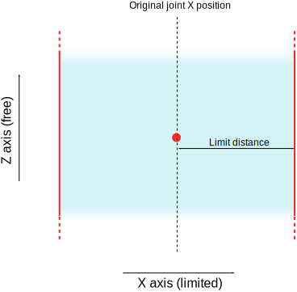
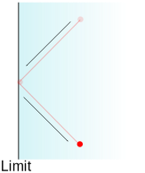
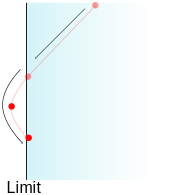
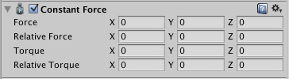
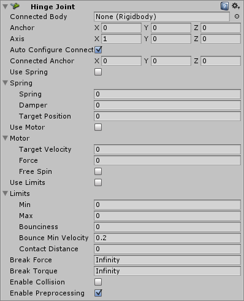
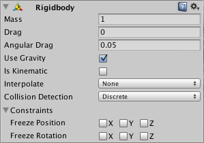
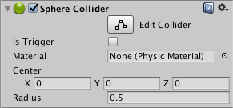

To have convincing physical behaviour, an object in a game must accelerate correctly and be affected by collisions, gravity and other forces. Unity’s built-in physics engines provide components that handle the physical simulation for you. With just a few parameter settings, you can create objects that behave passively in a realistic way (ie, they will be moved by collisions and falls but will not start moving by themselves). By controlling the physics from scripts, you can give an object the dynamics of a vehicle, a machine, or even a piece of fabric. This section gives an overview of the main physics components in Unity, with links for further reading.

Note: there are actually two separate physics engines in Unity: one for 3D physics, and one for 2D physics. The main concepts are identical between the two engines (except for the extra dimension in 3D), but they are implemented using different components. For example, there is Rigidbody component for 3D physics and an analogous Rigidbody 2D for 2D physics.

Related tutorials: [Physics](https://unity3d.com/learn/tutorials/topics/physics); [Physics Best Practices](http://unity3d.com/learn/tutorials/modules/intermediate/physics/physics-best-practices?playlist=30089)

See the [Knowledge Base Physics section](https://support.unity3d.com/hc/en-us/sections/201851913-Physics) for troubleshooting, tips and tricks.

<!--more-->

<!-- TOC -->

- [Physics overview](#physics-overview)
    - [Rigidbody overview](#rigidbody-overview)
        - [Sleeping](#sleeping)
    - [Colliders](#colliders)
        - [Physics materials](#physics-materials)
        - [Triggers](#triggers)
        - [Script actions taken on collision](#script-actions-taken-on-collision)
        - [Collider interactions](#collider-interactions)
            - [Static Collider](#static-collider)
            - [Rigidbody Collider](#rigidbody-collider)
            - [Kinematic Rigidbody Collider](#kinematic-rigidbody-collider)
        - [Collision action matrix](#collision-action-matrix)
    - [Joints](#joints)
    - [Character Controllers](#character-controllers)
- [3D Physics Reference](#3d-physics-reference)
    - [Box Collider](#box-collider)
        - [Properties](#properties)
        - [Details](#details)
    - [Capsule Collider](#capsule-collider)
        - [Properties](#properties-1)
        - [Details](#details-1)
    - [Character Controller](#character-controller)
        - [Details](#details-2)
        - [Fine-tuning your character](#fine-tuning-your-character)
        - [Don’t get stuck](#dont-get-stuck)
        - [Hints](#hints)
    - [Character Joint](#character-joint)
        - [Properties](#properties-2)
        - [Details](#details-3)
            - [Breaking joints](#breaking-joints)
        - [Hints](#hints-1)
    - [Configurable Joint](#configurable-joint)
        - [Properties](#properties-3)
        - [Details](#details-4)
            - [Constraining Movement](#constraining-movement)
            - [Bounciness and Springs](#bounciness-and-springs)
        - [Drive forces](#drive-forces)
            - [Slerp Drive](#slerp-drive)
    - [Constant Force](#constant-force)
        - [Properties](#properties-4)
        - [Hints](#hints-2)
    - [Fixed Joint](#fixed-joint)
        - [Properties](#properties-5)
        - [Details](#details-5)
        - [Breaking joints](#breaking-joints-1)
        - [Hints](#hints-3)
    - [Hinge Joint](#hinge-joint)
        - [Properties](#properties-6)
        - [Details](#details-6)
            - [Chains](#chains)
        - [Hints](#hints-4)
    - [Mesh Collider](#mesh-collider)
        - [Properties](#properties-7)
        - [Details](#details-7)
    - [Rigidbody](#rigidbody)
        - [Properties](#properties-8)
        - [Details](#details-8)
            - [Parenting](#parenting)
            - [Scripting](#scripting)
            - [Animation](#animation)
            - [Colliders](#colliders-1)
            - [Continuous Collision Detection](#continuous-collision-detection)
        - [Use the right size](#use-the-right-size)
        - [Hints](#hints-5)
    - [Sphere Collider](#sphere-collider)
        - [Properties](#properties-9)
        - [Details](#details-9)
    - [Spring Joint](#spring-joint)
        - [Properties](#properties-10)
        - [Details](#details-10)
    - [Cloth](#cloth)
        - [Properties](#properties-11)
            - [Edit Constraints Tool](#edit-constraints-tool)
            - [Collisions](#collisions)
    - [Wheel Collider](#wheel-collider)
        - [Properties](#properties-12)
        - [Details](#details-11)
            - [Wheel collider setup](#wheel-collider-setup)
            - [Collision geometry](#collision-geometry)
            - [Wheel Friction Curves](#wheel-friction-curves)
        - [Hints](#hints-6)
    - [Terrain Collider](#terrain-collider)
        - [Properties](#properties-13)
        - [Details](#details-12)
    - [Physic Material](#physic-material)
        - [Properties](#properties-14)
        - [Details](#details-13)
- [Physics HOWTOs](#physics-howtos)
    - [Ragdoll Wizard](#ragdoll-wizard)
        - [Creating the Character](#creating-the-character)
        - [Using the Wizard](#using-the-wizard)
        - [Note](#note)
    - [Joint and Ragdoll stability](#joint-and-ragdoll-stability)
- [WheelCollider Tutorial](#wheelcollider-tutorial)

<!-- /TOC -->

## Physics overview

These pages briefly describe the main physics components available in Unity, and give details of their usage and links for further reading.

### Rigidbody overview

A Rigidbody is the main component that enables physical behaviour for a GameObject. With a Rigidbody attached, the object will immediately respond to gravity. If one or more Collider components are also added, the GameObject is moved by incoming collisions.

Since a Rigidbody component takes over the movement of the GameObject it is attached to, you shouldn’t try to move it from a script by changing the Transform properties such as position and rotation. Instead, you should apply **forces** to push the GameObject and let the physics engine calculate the results.

There are some cases where you might want a GameObject to have a Rigidbody without having its motion controlled by the physics engine. For example, you may want to control your character directly from script code but still allow it to be detected by triggers (see Triggers below). This kind of non-physical motion produced from a script is known as kinematic motion. The Rigidbody component has a property called **Is Kinematic** which removes it from the control of the physics engine and allow it to be moved kinematically from a script. It is possible to change the value of Is Kinematic from a script to allow physics to be switched on and off for an object, but this comes with a performance overhead and should be used sparingly.

See the Rigidbody and Rigidbody 2D reference pages for further details about the settings and scripting options for these components.

#### Sleeping

When a Rigidbody is moving slower than a defined minimum linear or rotational speed, the physics engine assumes it has come to a halt. When this happens, the GameObject does not move again until it receives a collision or force, and so it is set to “sleeping” mode. This optimisation means that no processor time is spent updating the Rigidbody until the next time it is “awoken” (that is, set in motion again).

For most purposes, the sleeping and waking of a Rigidbody component happens transparently. However, a GameObject might fail to wake up if a Static Collider (that is, one without a Rigidbody) is moved into it or away from it by modifying the Transform position. This might result, say, in the Rigidbody GameObject hanging in the air when the floor has been moved out from beneath it. In cases like this, the GameObject can be woken explicitly using the WakeUp function. See the Rigidbody and Rigidbody 2D component pages for more information about sleeping.


### Colliders

Collider components define the shape of an object for the purposes of physical collisions. A collider, which is invisible, need not be the exact same shape as the object’s mesh and in fact, a rough approximation is often more efficient and indistinguishable in gameplay.

The simplest (and least processor-intensive) colliders are the so-called primitive collider types. In 3D, these are the Box Collider, Sphere Collider and Capsule Collider. In 2D, you can use the Box Collider 2D and Circle Collider 2D. Any number of these can be added to a single object to create compound colliders.

With careful positioning and sizing, compound colliders can often approximate the shape of an object quite well while keeping a low processor overhead. Further flexibility can be gained by having additional colliders on child objects (eg, boxes can be rotated relative to the local axes of the parent object). When creating a compound collider like this, there should only be one Rigidbody component, placed on the root object in the hierarchy.

Note, that primitive colliders will not work correctly with shear transforms - that means that if you use a combination of rotations and non-uniform scales in the tranform hierarchy so that the resulting shape would no longer match a primitive shape, the primitive collider will not be able to represent it correctly.

There are some cases, however, where even compound colliders are not accurate enough. In 3D, you can use Mesh Colliders to match the shape of the object’s mesh exactly. In 2D, the Polygon Collider 2D will generally not match the shape of the sprite graphic perfectly but you can refine the shape to any level of detail you like. These colliders are much more processor-intensive than primitive types, however, so use them sparingly to maintain good performance. Also, a mesh collider will normally be unable to collide with another mesh collider (ie, nothing will happen when they make contact). You can get around this in some cases by marking the mesh collider as Convex in the inspector. This will generate the collider shape as a “convex hull” which is like the original mesh but with any undercuts filled in. The benefit of this is that a convex mesh collider can collide with other mesh colliders so you may be able to use this feature when you have a moving character with a suitable shape. However, a good general rule is to use mesh colliders for scene geometry and approximate the shape of moving objects using compound primitive colliders.

Colliders can be added to an object without a Rigidbody component to create floors, walls and other motionless elements of a scene. These are referred to as static colliders. In general, you should not reposition static colliders by changing the Transform position since this will impact heavily on the performance of the physics engine. Colliders on an object that does have a Rigidbody are known as dynamic colliders. Static colliders can interact with dynamic colliders but since they don’t have a Rigidbody, they will not move in response to collisions.

The reference pages for the various collider types linked above have further information about their properties and uses.

#### Physics materials

When colliders interact, their surfaces need to simulate the properties of the material they are supposed to represent. For example, a sheet of ice will be slippery while a rubber ball will offer a lot of friction and be very bouncy. Although the shape of colliders is not deformed during collisions, their friction and bounce can be configured using Physics Materials. Getting the parameters just right can involve a bit of trial and error but an ice material, for example will have zero (or very low) friction and a rubber material with have high friction and near-perfect bounciness. See the reference pages for Physic Material and Physics Material 2D for further details on the available parameters. Note that for historical reasons, the 3D asset is actually called Physic Material (without the S) but the 2D equivalent is called Physics Material 2D (with the S).

#### Triggers

The scripting system can detect when collisions occur and initiate actions using the OnCollisionEnter function. However, you can also use the physics engine simply to detect when one collider enters the space of another without creating a collision. A collider configured as a Trigger (using the Is Trigger property) does not behave as a solid object and will simply allow other colliders to pass through. When a collider enters its space, a trigger will call the OnTriggerEnter function on the trigger object’s scripts.

#### Script actions taken on collision

When collisions occur, the physics engine calls functions with specific names on any scripts attached to the objects involved. You can place any code you like in these functions to respond to the collision event. For example, you might play a crash sound effect when a car bumps into an obstacle.

On the first physics update where the collision is detected, the OnCollisionEnter function is called. During updates where contact is maintained, OnCollisionStay is called and finally, OnCollisionExit indicates that contact has been broken. Trigger colliders call the analogous OnTriggerEnter, OnTriggerStay and OnTriggerExit functions. Note that for 2D physics, there are equivalent functions with 2D appended to the name, eg, OnCollisionEnter2D. Full details of these functions and code samples can be found on the Script Reference page for the MonoBehaviour class.

With normal, non-trigger collisions, there is an additional detail that at least one of the objects involved must have a non-kinematic Rigidbody (ie, Is Kinematic must be switched off). If both objects are kinematic Rigidbodies then OnCollisionEnter, etc, will not be called. With trigger collisions, this restriction doesn’t apply and so both kinematic and non-kinematic Rigidbodies will prompt a call to OnTriggerEnter when they enter a trigger collider.

#### Collider interactions

Colliders interact with each other differently depending on how their Rigidbody components are configured. The three important configurations are the Static Collider (ie, no Rigidbody is attached at all), the Rigidbody Collider and the Kinematic Rigidbody Collider.

##### Static Collider

This is a GameObject that has a Collider but no Rigidbody. Static colliders are used for level geometry which always stays at the same place and never moves around. Incoming rigidbody objects will collide with the static collider but will not move it.

The physics engine assumes that static colliders never move or change and can make useful optimizations based on this assumption. Consequently, static colliders should not be disabled/enabled, moved or scaled during gameplay. If you do change a static collider then this will result in extra internal recomputation by the physics engine which causes a major drop in performance. Worse still, the changes can sometimes leave the collider in an undefined state that produces erroneous physics calculations. For example a raycast against an altered Static Collider could fail to detect it, or detect it at a random position in space. Furthermore, Rigidbodies that are hit by a moving static collider will not necessarily be “awoken” and the static collider will not apply any friction. For these reasons, only colliders that are Rigidbodies should be altered. If you want a collider object that is not affected by incoming rigidbodies but can still be moved from a script then you should attach a Kinematic Rigidbody component to it rather than no Rigidbody at all.

##### Rigidbody Collider

This is a GameObject with a Collider and a normal, non-kinematic Rigidbody attached. Rigidbody colliders are fully simulated by the physics engine and can react to collisions and forces applied from a script. They can collide with other objects (including static colliders) and are the most commonly used Collider configuration in games that use physics.

##### Kinematic Rigidbody Collider

This is a GameObject with a Collider and a kinematic Rigidbody attached (ie, the IsKinematic property of the Rigidbody is enabled). You can move a kinematic rigidbody object from a script by modifying its Transform Component but it will not respond to collisions and forces like a non-kinematic rigidbody. Kinematic rigidbodies should be used for colliders that can be moved or disabled/enabled occasionally but that should otherwise behave like static colliders. An example of this is a sliding door that should normally act as an immovable physical obstacle but can be opened when necessary. Unlike a static collider, a moving kinematic rigidbody will apply friction to other objects and will “wake up” other rigidbodies when they make contact.

Even when immobile, kinematic rigidbody colliders have different behavior to static colliders. For example, if the collider is set to as a trigger then you also need to add a rigidbody to it in order to receive trigger events in your script. If you don’t want the trigger to fall under gravity or otherwise be affected by physics then you can set the IsKinematic property on its rigidbody.

A Rigidbody component can be switched between normal and kinematic behavior at any time using the IsKinematic property.

A common example of this is the “ragdoll” effect where a character normally moves under animation but is thrown physically by an explosion or a heavy collision. The character’s limbs can each be given their own Rigidbody component with IsKinematic enabled by default. The limbs will move normallly by animation until IsKinematic is switched off for all of them and they immediately behave as physics objects. At this point, a collision or explosion force will send the character flying with its limbs thrown in a convincing way.

#### Collision action matrix

When two objects collide, a number of different script events can occur depending on the configurations of the colliding objects’ rigidbodies. The charts below give details of which event functions are called based on the components that are attached to the objects. Some of the combinations only cause one of the two objects to be affected by the collision, but the general rule is that physics will not be applied to an object that doesn’t have a Rigidbody component attached.

Collision detection occurs and messages are sent upon collision
Static Collider	Rigidbody Collider	Kinematic Rigidbody Collider	Static Trigger Collider	Rigidbody Trigger Collider	Kinematic Rigidbody Trigger Collider
Static Collider	 	Y	 	 	 	 
Rigidbody Collider	Y	Y	Y	 	 	 
Kinematic Rigidbody Collider	 	Y	 	 	 	 
Static Trigger Collider	 	 	 	 	 	 
Rigidbody Trigger Collider	 	 	 	 	 	 
Kinematic Rigidbody Trigger Collider	


Trigger messages are sent upon collision
Static Collider	Rigidbody Collider	Kinematic Rigidbody Collider	Static Trigger Collider	Rigidbody Trigger Collider	Kinematic Rigidbody Trigger Collider
Static Collider	 	 	 	 	Y	Y
Rigidbody Collider	 	 	 	Y	Y	Y
Kinematic Rigidbody Collider	 	 	 	Y	Y	Y
Static Trigger Collider	 	Y	Y	 	Y	Y
Rigidbody Trigger Collider	Y	Y	Y	Y	Y	Y
Kinematic Rigidbody Trigger Collider	Y	Y	Y	Y	Y	Y


### Joints

You can attach one rigidbody object to another or to a fixed point in space using a Joint component. Generally, you want a joint to allow at least some freedom of motion and so Unity provides different Joint components that enforce different restrictions.

For example, a Hinge Joint allows rotation around a specific point and axis while a Spring Joint keeps the objects apart but lets the distance between them stretch slightly.

2D joint components have 2D at the end of the name, eg, Hinge Joint 2D. See Joints 2D for a summary of the 2D joints and useful background information.

Joints also have other options that can enabled for specific effects. For example, you can set a joint to break when the force applied to it exceeds a certain threshold. Some joints also allow a drive force to occur between the connected objects to set them in motion automatically.

See each joint reference page for the Joint classes and for further information about their properties.


### Character Controllers

The character in a first- or third-person game will often need some collision-based physics so that it doesn’t fall through the floor or walk through walls. Usually, though, the character’s acceleration and movement will not be physically realistic, so it may be able to accelerate, brake and change direction almost instantly without being affected by momentum.

In 3D physics, this type of behaviour can be created using a Character Controller. This component gives the character a simple, capsule-shaped collider that is always upright. The controller has its own special functions to set the object’s speed and direction but unlike true colliders, a rigidbody is not needed and the momentum effects are not realistic.

A character controller cannot walk through static colliders in a scene, and so will follow floors and be obstructed by walls. It can push rigidbody objects aside while moving but will not be accelerated by incoming collisions. This means that you can use the standard 3D colliders to create a scene around which the controller will walk but you are not limited by realistic physical behaviour on the character itself.

You can find out more about character controllers on the [reference](file:///Applications/Unity/Documentation/en/Manual/class-CharacterController.html) page.

------------

## 3D Physics Reference

This section gives details of the components used with 3D physics. See [Physics 2D Reference](file:///Applications/Unity/Documentation/en/Manual/Physics2DReference.html) for the equivalent 2D components.

### Box Collider

The **Box Collider** is a basic cube-shaped collision primitive.


#### Properties

Property:	Function:
Is Trigger	If enabled, this Collider is used for triggering events, and is ignored by the physics engine.
Material	Reference to the Physics Material that determines how this Collider interacts with others.
Center	The position of the Collider in the object’s local space.
Size	The size of the Collider in the X, Y, Z directions.

#### Details

Box colliders are obviously useful for anything roughly box-shaped, such as a crate or a chest. However, you can use a thin box as a floor, wall or ramp. The box shape is also a useful element in a compound collider.

------

### Capsule Collider

The Capsule Collider is made of two half-spheres joined together by a cylinder. It is the same shape as the Capsule primitive.


#### Properties


Property:	Function:
Is Trigger	If enabled, this Collider is used for triggering events, and is ignored by the physics engine.
Material	Reference to the Physics Material that determines how this Collider interacts with others.
Center	The position of the Collider in the object’s local space.
Radius	The radius of the Collider’s local width.
Height	The total height of the Collider.
Direction	The axis of the capsule’s lengthwise orientation in the object’s local space.

#### Details

You can adjust the Capsule Collider’s Radius and Height independently of each other. It is used in the Character Controller and works well for poles, or can be combined with other Colliders for unusual shapes.


------

### Character Controller

The Character Controller is mainly used for third-person or first-person player control that does not make use of Rigidbody physics.


Properties


Property:	Function:
Slope Limit	Limits the collider to only climb slopes that are less steep (in degrees) than the indicated value.
Step Offset	The character will step up a stair only if it is closer to the ground than the indicated value. This should not be greater than the Character Controller’s height or it will generate an error.
Skin width	Two colliders can penetrate each other as deep as their Skin Width. Larger Skin Widths reduce jitter. Low Skin Width can cause the character to get stuck. A good setting is to make this value 10% of the Radius.
Min Move Distance	If the character tries to move below the indicated value, it will not move at all. This can be used to reduce jitter. In most situations this value should be left at 0.
Center	This will offset the Capsule Collider in world space, and won’t affect how the Character pivots.
Radius	Length of the Capsule Collider’s radius. This is essentially the width of the collider.
Height	The Character’s Capsule Collider height. Changing this will scale the collider along the Y axis in both positive and negative directions.


#### Details

The traditional Doom-style first person controls are not physically realistic. The character runs 90 miles per hour, comes to a halt immediately and turns on a dime. Because it is so unrealistic, use of Rigidbodies and physics to create this behavior is impractical and will feel wrong. The solution is the specialized Character Controller. It is simply a capsule shaped Collider which can be told to move in some direction from a script. The Controller will then carry out the movement but be constrained by collisions. It will slide along walls, walk up stairs (if they are lower than the Step Offset) and walk on slopes within the Slope Limit.

The Controller does not react to forces on its own and it does not automatically push Rigidbodies away.

If you want to push Rigidbodies or objects with the Character Controller, you can apply forces to any object that it collides with via the OnControllerColliderHit() function through scripting.

On the other hand, if you want your player character to be affected by physics then you might be better off using a Rigidbody instead of the Character Controller.

#### Fine-tuning your character

You can modify the Height and Radius to fit your Character’s mesh. It is recommended to always use around 2 meters for a human-like character. You can also modify the Center of the capsule in case your pivot point is not at the exact center of the Character.

Step Offset can affect this too, make sure that this value is between 0.1 and 0.4 for a 2 meter sized human.

Slope Limit should not be too small. Often using a value of 90 degrees works best. The Character Controller will not be able to climb up walls due to the capsule shape.

#### Don’t get stuck

The Skin Width is one of the most critical properties to get right when tuning your Character Controller. If your character gets stuck it is most likely because your Skin Width is too small. The Skin Width will let objects slightly penetrate the Controller but it removes jitter and prevents it from getting stuck.

It’s good practice to keep your Skin Width at least greater than 0.01 and more than 10% of the Radius.

We recommend keeping Min Move Distance at 0.

See the Character Controller script reference here

You can download an example project showing pre-setup animated and moving character controllers from the Resources area on our website.

#### Hints

* Try adjusting your Skin Width if you find your character getting stuck frequently.
* The Character Controller can affect objects using physics if you write your own scripts.
* The Character Controller can not be affected by objects through physics.
* Note that changing Character Controller properties in the inspector will recreate the controller in the scene, so any existing Trigger contacts will get lost, and you will not get any OnTriggerEntered messages until the controller is moved again.

------

### Character Joint

**Character Joints** are mainly used for Ragdoll effects. They are an extended ball-socket joint which allows you to limit the joint on each axis.

If you just want to set up a ragdoll read about Ragdoll Wizard.


#### Properties

Property:	Function:
Connected Body	Optional reference to the Rigidbody that the joint is dependent upon. If not set, the joint connects to the world.
Anchor	The point in the GameObject’s local space where the joint rotates around.
Axis	The twist axes. Visualized with the orange gizmo cone.
Auto Configure Connected Anchor	If this is enabled, then the Connected Anchor position will be calculated automatically to match the global position of the anchor property. This is the default behavior. If this is disabled, you can configure the position of the connected anchor manually.
Connected Anchor	Manual configuration of the connected anchor position.
Swing Axis	The swing axis. Visualized with the green gizmo cone.
Low Twist Limit	The lower limit of the joint. See below.
High Twist Limit	The higher limit of the joint. See below.
Swing 1 Limit	Limits the rotation around one element of the defined Swing Axis (visualized with the green axis on the gizmo). See below.
Swing 2 Limit	Limits movement around one element of the defined Swing Axis. See below.
Break Force	The force that needs to be applied for this joint to break.
Break Torque	The torque that needs to be applied for this joint to break.
Enable Collision	When checked, this enables collisions between bodies connected with a joint.
Enable Preprocessing	Disabling preprocessing helps to stabilize impossible-to-fulfil configurations.


#### Details

Character joints give you a lot of possibilities for constraining motion like with a universal joint.

The twist axis (visualized with the orange access on the gizmo) gives you most control over the limits as you can specify a lower and upper limit in degrees (the limit angle is measured relative to the starting position). A value of –30 in Low Twist Limit->Limit and 60 in High Twist Limit->Limit limits the rotation around the twist axis (orange gizmo) between –30 and 60 degrees.

The Swing 1 Limit limits the rotation around the swing axis (visualized with the green axis on the gizmo). The limit angle is symmetric. Thus a value of 30 will limit the rotation between –30 and 30.

The Swing 2 Limit axis isn’t visualized on the gizmo but the axis is orthogonal to the two other axes (that is the twist axis visualised in orange on the gizmo and the Swing 1 Limit visualised in green on the gizmo). The angle is symmetric, thus a value of 40 will limit the rotation around that axis between –40 and 40 degrees.

For each of the limits the following values can be set:

Property:	Function:
Bounciness	A value of 0 will not bounce. A value of 1 will bounce without any loss of energy.
Spring	The spring force used to keep the two objects together.
Damper	The damper force used to dampen the spring force.
Contact Distance	Within the contact distance from the limit contacts will persist in order to avoid jitter.

##### Breaking joints

You can use the Break Force and Break Torque properties to set limits for the joint’s strength. If these are less than infinity, and a force/torque greater than these limits are applied to the object, its Fixed Joint will be destroyed and will no longer be confined by its restraints.

#### Hints

* You do not need to assign a Connected Body to your joint for it to work.
* Character Joints require your object to have a Rigidbody attached.
* For Character Joints made with the Ragdoll wizard, take a note that the setup is made such that the joint’s Twist axis corresponds with the limb’s largest swing axis, the joint’s Swing 1 axis corresponds with limb’s smaller swing axis and joint’s Swing 2 is for twisting the limb. This naming scheme is for legacy reasons.

------

### Configurable Joint

Configurable Joints are extremely customisable since they incorporate all the functionality of the other joint types. You can use them to create anything from adapted versions of the existing joints to highly specialised joints of your own design.

#### Properties


Property:	Function:
Connected Body	The other Rigidbody object to which the joint is connected. You can set this to None to indicate that the joint is attached to a fixed position in space rather than another Rigidbody.
Anchor	The point where the center of the joint is defined. All physics-based simulation will use this point as the center in calculations
Axis	The local axis that will define the object’s natural rotation based on physics simulation
Auto Configure Connected Anchor	If this is enabled, then the Connected Anchor position will be calculated automatically to match the global position of the anchor property. This is the default behavior. If this is disabled, you can configure the position of the connected anchor manually.
Connected Anchor	Manual configuration of the connected anchor position.
Secondary Axis	Together, Axis and Secondary Axis define the local coordinate system of the joint. The third axis is set to be orthogonal to the other two.
X, Y, Z Motion	Allow movement along the X, Y or Z axes to be Free, completely Locked, or Limited according to the limit properties described below.
Angular X, Y, Z Motion	Allow rotation around the X, Y or Z axes to be Free, completely Locked, or Limited according to the limit properties described below.
Linear Limit Spring	A spring force applied to pull the object back when it goes past the limit position.
        Spring	The spring force. If this value is set to zero then the limit will be impassable; a value other than zero will make the limit elastic.
        Damper	The reduction of the spring force in proportion to the speed of the joint’s movement. Setting a value above zero allows the joint to “dampen” oscillations which would otherwise carry on indefinitely.
Linear Limit	Limit on the joint’s linear movement (ie, movement over distance rather than rotation), specified as a distance from the joint’s origin.
        Limit	The distance in world units from the origin to the limit.
        Bounciness	Bounce force applied to the object to push it back when it reaches the limit distance.
        Contact Distance	The minimum distance tolerance (between the joint position and the limit) at which the limit will be enforced. A high tolerance makes the limit less likely to be violated when the object is moving fast. However, this will also require the limit to be taken into account by the physics simulation more often and this will tend to reduce performance slightly.
Angular X Limit Spring	A spring torque applied to rotate the object back when it goes past the limit angle of the joint.
        Spring	The spring torque. If this value is set to zero then the limit will be impassable; a value other than zero will make the limit elastic.
        Damper	The reduction of the spring torque in proportion to the speed of the joint’s rotation. Setting a value above zero allows the joint to “dampen” oscillations which would otherwise carry on indefinitely.
Low Angular X Limit	Lower limit on the joint’s rotation around the X axis, specified as a angle from the joint’s original rotation.
        Limit	The limit angle.
        Bounciness	Bounce torque applied to the object when its rotation reaches the limit angle.
        Contact Distance	The minimum angular tolerance (between the joint angle and the limit) at which the limit will be enforced. A high tolerance makes the limit less likely to be violated when the object is moving fast. However, this will also require the limit to be taken into account by the physics simulation more often and this will tend to reduce performance slightly.
High Angular XLimit	This is similar to the Low Angular X Limit property described above but it determines the upper angular limit of the joint’s rotation rather than the lower limit.
Angular YZ Limit Spring	This is similar to the Angular X Limit Spring described above but applies to rotation around both the Y and Z axes.
Angular Y Limit	Analogous to the Angular X Limit properties described above but applies to the Y axis and regards both the upper and lower angular limits as being the same.
Angular Z Limit	Analogous to the Angular X Limit properties described above but applies to the Z axis and regards both the upper and lower angular limits as being the same.
Target Position	The target position that the joint’s drive force should move it to.
Target Velocity	The desired velocity with which the joint should move to the Target Position under the drive force.
XDrive	The drive force that moves the joint linearly along its local X axis.
        Mode	The mode determines whether the joint should move to reach a specified Position, a specified Velocity or both.
        Position Spring	The spring force that moves the joint towards its target position. This is only used when the drive mode is set to Position or Position and Velocity.
        Position Damper	The reduction of the spring force in proportion to the speed of the joint’s movement. Setting a value above zero allows the joint to “dampen” oscillations which would otherwise carry on indefinitely. This is only used when the drive mode is set to Position or Position and Velocity.
        Maximum Force	The force used to accelerate the joint toward its target velocity. This is only used when the drive mode is set to Velocity or Position and Velocity.
YDrive	This is analogous to the X Drive described above but applies to the joint’s Y axis.
ZDrive	This is analogous to the X Drive described above but applies to the joint’s Z axis.
Target Rotation	The orientation that the joint’s rotational drive should rotate towards, specified as a quaternion.
Target Angular Velocity	The angular velocity that the joint’s rotational drive should aim to achieve. This is specified as a vector whose length specifies the rotational speed and whose direction defines the axis of rotation.
Rotation Drive Mode	The way in which the drive force will be applied to the object to rotate it to the target orientation. If the mode is set to X and YZ, the torque will be applied around these axes as specified by the Angular X/YZ Drive properties described below. If Slerp mode is used then the Slerp Drive properties will determine the drive torque.
Angular X Drive	This specifies how the joint will be rotated by the drive torque around its local X axis. It is used only if the Rotation Drive Mode property described above is set to X & YZ.
        Mode	The mode determines whether the joint should move to reach a specified angular Position, a specified angular Velocity or both.
        Position Spring	The spring torque that rotates the joint towards its target position. This is only used when the drive mode is set to Position or Position and Velocity.
        Position Damper	The reduction of the spring torque in proportion to the speed of the joint’s movement. Setting a value above zero allows the joint to “dampen” oscillations which would otherwise carry on indefinitely. This is only used when the drive mode is set to Position or Position and Velocity.
        Maximum Force	The torque used to accelerate the joint toward its target velocity. This is only used when the drive mode is set to Velocity or Position and Velocity.
Angular YZDrive	This is analogous to the Angular X Drive described above but applies to both the joint’s Y and Z axes.
Slerp Drive	This specifies how the joint will be rotated by the drive torque around all local axes. It is used only if the Rotation Drive Mode property described above is set to Slerp.
        Mode	The mode determines whether the joint should move to reach a specified angular Position, a specified angular Velocity or both.
        Position Spring	The spring torque that rotates the joint towards its target position. This is only used when the drive mode is set to Position or Position and Velocity.
        Position Damper	The reduction of the spring torque in proportion to the speed of the joint’s movement. Setting a value above zero allows the joint to “dampen” oscillations which would otherwise carry on indefinitely. This is only used when the drive mode is set to Position or Position and Velocity.
        Maximum Force	The torque used to accelerate the joint toward its target velocity. This is only used when the drive mode is set to Velocity or Position and Velocity.
Projection Mode	This defines how the joint will be snapped back to its constraints when it unexpectedly moves beyond them (due to the physics engine being unable to reconcile the current combination of forces within the simulation). The options are None and Position and Rotation.
Projection Distance	The distance the joint must move beyond its constraints before the physics engine will attempt to snap it back to an acceptable position.
Projection Angle	The angle the joint must rotate beyond its constraints before the physics engine will attempt to snap it back to an acceptable position.
Configured in World Space	Should the values set by the various target and drive properties be calculated in world space instead of the object’s local space?
Swap Bodies	If enabled, this will make the joint behave as though the component were attached to the connected Rigidbody (ie, the other end of the joint).
Break Force	If the joint is pushed beyond its constraints by a force larger than this value then the joint will be permanently “broken” and deleted.
Break Torque	If the joint is rotated beyond its constraints by a torque larger than this value then the joint will be permanently “broken” and deleted.
Enable Collision	Should the object with the joint be able to collide with the connected object (as opposed to just passing through each other)?
Enable Preprocessing	If preprocessing is disabled then certain “impossible” configurations of the joint will be kept more stable rather than drifting wildly out of control.

#### Details

Like the other joints, the Configurable Joint allows you to restrict the movement of an object but also to drive it to a target velocity or position using forces. However, there are many configuration options available and they can be quite subtle when used in combination; you may need to experiment with different options to get the joint to behave exactly the way you want.

##### Constraining Movement

You can constrain both translational movement and rotation on each axis independently using the X, Y, Z Motion and X, Y, Z Rotation properties. If Configured In World Space is enabled then movements will be constrained to the world axes rather than the object’s local axes. Each of these properties can be set to Locked, Limited or Free:

* A Locked axis will allow no movement at all. For example, an object locked in the world Y axis cannot move up or down.
* A Limited axis allows free movement between predefined limits, as explained below. For example, a gun turret might be given a restricted arc of fire by limiting its Y rotation to a specific angular range.
* A Free axis allows any movement.
You can limit translational movement using the Linear Limit property, which defines the maximum distance the joint can move from its point of origin. (measured along each axis separately). For example, you could constrain the puck for an air hockey table by locking the joint in the Y axis (in world space), leaving it free in the Z axis and setting the limit for the X axis to fit the width of the table; the puck would then be constrained to stay within the playing area.



You can also limit rotation using the Angular Limit properties. Unlike the linear limit, these allow you to specify different limit values for each axis. Additionally, you can also define separate upper and lower limits on the angle of rotation for the X axis (the other two axes use the same angle either side of the original rotation). For example, you could construct a “teeter table” using a flat plane with a joint constrained to allow slight tilting in the X and Z directions while leaving the Y rotation locked.

##### Bounciness and Springs

By default, a joint simply stops moving when it runs into its limit. However, an inelastic collision like this is rare in the real world and so it is useful to add some feeling of bounce to a constrained joint. You can use the Bounciness property of the linear and angular limits to make the constrained object bounce back after it hits its limit. Most collisions will look more natural with a small amount of bounciness but you can also set this property higher to simulate unusually bouncy boundaries like, say, the cushions of a pool table.


The joint limits can be softened further using the spring properties: Linear Limit Spring for translation and Angular X/YZ Limit Spring for rotation. If you set the Spring property to a value above zero, the joint will not abruptly stop moving when it hits a limit but will be drawn back to the limit position by a spring force (the strength of the force is determined by the Spring value). By default, the spring is perfectly elastic and will tend to catapult the joint back in the direction opposite to the collision. However, you can use the Damper property to reduce the elasticity and return the joint to the limit more gently. For example, you might use a spring joint to create a lever that can be pulled to the left or right but then springs back to an upright position. If the springs are perfectly elastic then the lever will tend to oscillate back and forth around the centre point after it is released. However, if you add enough damping then the spring will rapidly settle down to the neutral position.



#### Drive forces

Not only can a joint react to the movements of the attached object, but it can also actively apply drive forces to set the object in motion. Some joints simple need to keep the object moving at a constant speed as with, say, a rotary motor turning a fan blade. You can set your desired velocity for such joints using the Target Velocity and Target Angluar Velocity properties. You might also require joints that move their object towards a particular position in space (or a particular orientation); you can set these using the Target Position and Target Rotation properties. For example, you could implement a forklift by mounting the forks on a configurable joint and then setting the target height to raise them from a script.

With the target set, the X, Y, Z Drive and Angular X/YZ Drive (or alternatively Slerp Drive) properties then specify the force used to push the joint toward it. The Drives’ Mode property selects whether the joint should seek a target position, velocity or both. The Position Spring and Position Damper work in the same way as for the joint limits when seeking a target position. In velocity mode, the spring force is dependent on the “distance” between the current velocity and the target velocity; the damper helps the velocity to settle at the chosen value rather than oscillating endlessly around it. The Maximum Force property is a final refinement that prevents the force applied by the spring from exceeding a limit value regardless of how far the joint is from its target. This prevents the circumstance where a joint stretched far from its target rapidly snaps the object back in an uncontrolled way.

Note that with all the drive forces (except for Slerp Drive, described below), the force is applied separately in each axis. So, for example, you could implement a spacecraft that has a high forward flying speed but a relatively low speed in sideways steering motion.

##### Slerp Drive

While the other drive modes apply forces in separate axes, Slerp Drive uses the Quaternion’s spherical interpolation or “slerp” functionality to reorient the joint. Rather than isolating individual axes, the slerp process essentially finds the minimum total rotation that will take the object from the current orientation to the target and applies it on all axes as necessary. Slerp drive is slightly easier to configure and fine for most purposes but does not allow you to specify different drive forces for the X and Y/Z axes.

To enable Slerp drive, you should change the Rotation Drive Mode property from X and YZ to Slerp. Note that the modes are mutually exclusive; the joint will use either the Angular X/YZ Drive values or the Slerp Drive values but not both together.

------

### Constant Force

Constant Force is a quick utility for adding constant forces to a Rigidbody. This works great for one shot objects like rockets, if you don’t want it to start with a large velocity but instead accelerate.



#### Properties

Property:	Function:
Force	The vector of a force to be applied in world space.
Relative Force	The vector of a force to be applied in the object’s local space.
Torque	The vector of a torque, applied in world space. The object will begin spinning around this vector. The longer the vector is, the faster the rotation.
Relative Torque	The vector of a torque, applied in local space. The object will begin spinning around this vector. The longer the vector is, the faster the rotation.
Details

To make a rocket that accelerates forward set the Relative Force to be along the positive z-axis. Then use the Rigidbody’s Drag property to make it not exceed some maximum velocity (the higher the drag the lower the maximum velocity will be). In the Rigidbody, also make sure to turn off gravity so that the rocket will always stay on its path.

#### Hints

* To make an object flow upwards, add a Constant Force with the Force property having a positive Y value.
* To make an object fly forwards, add a Constant Force with the Relative Force property having a positive Z value.

------

### Fixed Joint

Fixed Joints restricts an object’s movement to be dependent upon another object. This is somewhat similar to Parenting but is implemented through physics rather than Transform hierarchy. The best scenarios for using them are when you have objects that you want to easily break apart from each other, or connect two object’s movement without parenting.


#### Properties

Property:	Function:
Connected Body	Optional reference to the Rigidbody that the joint is dependent upon. If not set, the joint connects to the world.
Break Force	The force that needs to be applied for this joint to break.
Break Torque	The torque that needs to be applied for this joint to break.
Enable Collision	When checked, this enables collisions between bodies connected with a joint.
Enable Preprocessing	Disabling preprocessing helps to stabilize impossible-to-fulfil configurations.

#### Details

There may be scenarios in your game where you want objects to stick together permanently or temporarily. Fixed Joints may be a good Component to use for these scenarios, since you will not have to script a change in your object’s hierarchy to achieve the desired effect. The trade-off is that you must use Rigidbodies for any objects that use a Fixed Joint.

For example, if you want to use a “sticky grenade”, you can write a script that will detect collision with another Rigidbody (like an enemy), and then create a Fixed Joint that will attach itself to that Rigidbody. Then as the enemy moves around, the joint will keep the grenade stuck to them.

#### Breaking joints

You can use the Break Force and Break Torque properties to set limits for the joint’s strength. If these are less than infinity, and a force/torque greater than these limits are applied to the object, its Fixed Joint will be destroyed and will no longer be confined by its restraints.

#### Hints

You do not need to assign a Connected Body to your joint for it to work.
Fixed Joints require a Rigidbody.

------

### Hinge Joint

The Hinge Joint groups together two Rigidbodies, constraining them to move like they are connected by a hinge. It is perfect for doors, but can also be used to model chains, pendulums, etc.



#### Properties

Property:	Function:
Connected Body	Optional reference to the Rigidbody that the joint is dependent upon. If not set, the joint connects to the world.
Anchor	The position of the axis around which the body swings. The position is defined in local space.
Axis	The direction of the axis around which the body swings. The direction is defined in local space.
Auto Configure Connected Anchor	If this is enabled, then the Connected Anchor position will be calculated automatically to match the global position of the anchor property. This is the default behavior. If this is disabled, you can configure the position of the connected anchor manually.
Connected Anchor	Manual configuration of the connected anchor position.
Use Spring	Spring makes the Rigidbody reach for a specific angle compared to its connected body.
Spring	Properties of the Spring that are used if Use Spring is enabled.
        Spring	The force the object asserts to move into the position.
        Damper	The higher this value, the more the object will slow down.
        Target Position	Target angle of the spring. The spring pulls towards this angle measured in degrees.
Use Motor	The motor makes the object spin around.
Motor	Properties of the Motor that are used if Use Motor is enabled.
        Target Velocity	The speed the object tries to attain.
        Force	The force applied in order to attain the speed.
        Free Spin	If enabled, the motor is never used to brake the spinning, only accelerate it.
Use Limits	If enabled, the angle of the hinge will be restricted within the Min & Max values.
Limits __ |Properties of the Limits that are used if Use Limits__ is enabled.
        Min	The lowest angle the rotation can go.
        Max	The highest angle the rotation can go.
        Bounciness	How much the object bounces when it hits the minimum or maximum stop limit.
        Contact Distance	Within the contact distance from the limit contacts will persist in order to avoid jitter.
Break Force	The force that needs to be applied for this joint to break.
Break Torque	The torque that needs to be applied for this joint to break.
Enable Collision	When checked, this enables collisions between bodies connected with a joint.
Enable Preprocessing	Disabling preprocessing helps to stabilize impossible-to-fulfil configurations.

#### Details

A single Hinge Joint should be applied to a GameObject. The hinge will rotate at the point specified by the Anchor property, moving around the specified Axis property. You do not need to assign a GameObject to the joint’s Connected Body property. You should only assign a GameObject to the Connected Body property if you want the joint’s Transform to be dependent on the attached object’s Transform.

Think about how the hinge of a door works. The Axis in this case is up, positive along the Y axis. The Anchor is placed somewhere at the intersection between door and wall. You would not need to assign the wall to the Connected Body, because the joint will be connected to the world by default.

Now think about a doggy door hinge. The doggy door’s Axis would be sideways, positive along the relative X axis. The main door should be assigned as the Connected Body, so the doggy door’s hinge is dependent on the main door’s Rigidbody.

##### Chains

Multiple Hinge Joints can also be strung together to create a chain. Add a joint to each link in the chain, and attach the next link as the Connected Body.

#### Hints

* You do not need to assign a Connected Body to your joint for it to work.
* Use Break Force in order to make dynamic damage systems. This is really cool as it allows the player to break a door off its hinge by blasting it with a rocket launcher or running into it with a car.
* The Spring, Motor, and Limits properties allow you to fine-tune your joint’s behaviors.
* Use of Spring, Motor are intended to be mutually exclusive. Using both at the same time leads to unpredictable results.

------

### Mesh Collider

The Mesh Collider takes a Mesh Asset and builds its Collider based on that mesh. It is far more accurate for collision detection than using primitives for complicated meshes. Mesh Colliders that are marked as Convex can collide with other Mesh Colliders.


#### Properties

Property:	Function:
Is Trigger	If enabled, this Collider is used for triggering events, and is ignored by the physics engine.
Material	Reference to the Physics Material that determines how this Collider interacts with others.
Mesh	Reference to the Mesh to use for collisions.
Convex	If enabled, this Mesh Collider will collide with other Mesh Colliders. Convex Mesh Colliders are limited to 255 triangles.

#### Details

The Mesh Collider builds its collision representation from the Mesh attached to the GameObject, and reads the properties of the attached Transform to set its position and scale correctly. The benefit of this is that the shape of the collider can be exactly the same as the shape of the visible mesh for the object, resulting in more precise and authentic collisions. However, this precision comes with a higher processing overhead than collisions involving primitive colliders (sphere, box, capsule) and so it is best to use Mesh Colliders sparingly.

Collision meshes use backface culling. If an object collides with a mesh that will be backface culled graphically it will also not collide with it physically.

There are some limitations when using the Mesh Collider. Non-convex Mesh Colliders are only supported on GameObjects without a rigidbody. If you want to use a Mesh Collider on a rigidbody, it needs to be marked as Convex.

Note that versions of Unity before 5.0 had a Smooth Sphere Collisions property for the Mesh Collider in order to improve interactions between meshes and spheres. This property is now obsolete since the smooth interaction is standard behaviour for the physics engine and there is no particular advantage in switching it off.

------

### Rigidbody

Rigidbodies enable your GameObjects to act under the control of physics. The Rigidbody can receive forces and torque to make your objects move in a realistic way. Any GameObject must contain a Rigidbody to be influenced by gravity, act under added forces via scripting, or interact with other objects through the NVIDIA PhysX physics engine.



#### Properties

Property:	Function:
Mass	The mass of the object (in kilograms by default).
Drag	How much air resistance affects the object when moving from forces. 0 means no air resistance, and infinity makes the object stop moving immediately.
Angular Drag	How much air resistance affects the object when rotating from torque. 0 means no air resistance. Note that you cannot make the object stop rotating just by setting its Angular Drag to infinity.
Use Gravity	If enabled, the object is affected by gravity.
Is Kinematic	If enabled, the object will not be driven by the physics engine, and can only be manipulated by its Transform. This is useful for moving platforms or if you want to animate a Rigidbody that has a HingeJoint attached.
Interpolate	Try one of the options only if you are seeing jerkiness in your Rigidbody’s movement.
- None	No Interpolation is applied.
- Interpolate	Transform is smoothed based on the Transform of the previous frame.
- Extrapolate	Transform is smoothed based on the estimated Transform of the next frame.
Collision Detection	Used to prevent fast moving objects from passing through other objects without detecting collisions.
- Discrete	Use Discreet collision detection against all other colliders in the scene. Other colliders will use Discreet collision detection when testing for collision against it. Used for normal collisions (This is the default value).
- Continuous	Use Discrete collision detection against dynamic colliders (with a rigidbody) and continuous collision detection against static MeshColliders (without a rigidbody). Rigidbodies set to Continuous Dynamic will use continuous collision detection when testing for collision against this rigidbody. Other rigidbodies will use Discreet Collision detection. Used for objects which the Continuous Dynamic detection needs to collide with. (This has a big impact on physics performance, leave it set to Discrete, if you don’t have issues with collisions of fast objects)
- Continuous Dynamic	Use continuous collision detection against objects set to Continuous and Continuous Dynamic Collision. It will also use continuous collision detection against static MeshColliders (without a rigidbody). For all other colliders it uses discreet collision detection. Used for fast moving objects.
Constraints	Restrictions on the Rigidbody’s motion:-
- Freeze Position	Stops the Rigidbody moving in the world X, Y and Z axes selectively.
- Freeze Rotation	Stops the Rigidbody rotating around the local X, Y and Z axes selectively.

#### Details

Rigidbodies allow your GameObjects to act under control of the physics engine. This opens the gateway to realistic collisions, varied types of joints, and other very cool behaviors. Manipulating your GameObjects by adding forces to a Rigidbody creates a very different feel and look than adjusting the Transform Component directly. Generally, you shouldn’t manipulate the Rigidbody and the Transform of the same GameObject - only one or the other.

The biggest difference between manipulating the Transform versus the Rigidbody is the use of forces. Rigidbodies can receive forces and torque, but Transforms cannot. Transforms can be translated and rotated, but this is not the same as using physics. You’ll notice the distinct difference when you try it for yourself. Adding forces/torque to the Rigidbody will actually change the object’s position and rotation of the Transform component. This is why you should only be using one or the other. Changing the Transform while using physics could cause problems with collisions and other calculations.

Rigidbodies must be explicitly added to your GameObject before they will be affected by the physics engine. You can add a Rigidbody to your selected object from Components->Physics->Rigidbody in the menu. Now your object is physics-ready; it will fall under gravity and can receive forces via scripting, but you may need to add a Collider or a Joint to get it to behave exactly how you want.

##### Parenting

When an object is under physics control, it moves semi-independently of the way its transform parents move. If you move any parents, they will pull the Rigidbody child along with them. However, the Rigidbodies will still fall down due to gravity and react to collision events.

##### Scripting

To control your Rigidbodies, you will primarily use scripts to add forces or torque. You do this by calling AddForce() and AddTorque() on the object’s Rigidbody. Remember that you shouldn’t be directly altering the object’s Transform when you are using physics.

##### Animation

For some situations, mainly creating ragdoll effects, it is neccessary to switch control of the object between animations and physics. For this purpose Rigidbodies can be marked isKinematic. While the Rigidbody is marked isKinematic, it will not be affected by collisions, forces, or any other part of the physics system. This means that you will have to control the object by manipulating the Transform component directly. Kinematic Rigidbodies will affect other objects, but they themselves will not be affected by physics. For example, Joints which are attached to Kinematic objects will constrain any other Rigidbodies attached to them and Kinematic Rigidbodies will affect other Rigidbodies through collisions.

##### Colliders

Colliders are another kind of component that must be added alongside the Rigidbody in order to allow collisions to occur. If two Rigidbodies bump into each other, the physics engine will not calculate a collision unless both objects also have a Collider attached. Collider-less Rigidbodies will simply pass through each other during physics simulation.


Add a Collider with the Component->Physics menu. View the Component Reference page of any individual Collider for more specific information:

* [Box Collider]() - primitive shape of a cube
* [Sphere Collider]() - primitive shape of a sphere
* [Capsule Collider]() - primitive shape of a capsule
* [Mesh Collider]() - creates a collider from the object’s mesh, cannot collide with another Mesh Collider
* [Wheel Collider]() - specifically for creating cars or other moving vehicles
* [Terrain Collider]() - handles collision with Unity’s terrain system
Compound Colliders

Compound Colliders are combinations of primitive Colliders, collectively acting as a single Collider. They come in handy when you have a model that would be too complex or costly in terms of performance to simulate exactly, and want to simulate the collision of the shape in an optimal way using simple approximations. To create a Compound Collider, create child objects of your colliding object, then add a Collider component to each child object. This allows you to position, rotate, and scale each Collider easily and independently of one another. You can build your compound collider out of a number of primitive colliders and/or convex mesh colliders.


In the above picture, the Gun Model GameObject has a Rigidbody attached, and multiple primitive Colliders as child GameObjects. When the Rigidbody parent is moved around by forces, the child Colliders move along with it. The primitive Colliders will collide with the environment’s Mesh Collider, and the parent Rigidbody will alter the way it moves based on forces being applied to it and how its child Colliders interact with other Colliders in the Scene.

Mesh Colliders can’t normally collide with each other. If a Mesh Collider is marked as Convex, then it can collide with another Mesh Collider. The typical solution is to use primitive Colliders for any objects that move, and Mesh Colliders for static background objects.

##### Continuous Collision Detection

Continuous collision detection is a feature to prevent fast-moving colliders from passing each other. This may happen when using normal (Discrete) collision detection, when an object is one side of a collider in one frame, and already passed the collider in the next frame. To solve this, you can enable continuous collision detection on the rigidbody of the fast-moving object. Set the collision detection mode to Continuous to prevent the rigidbody from passing through any static (ie, non-rigidbody) MeshColliders. Set it to Continuous Dynamic to also prevent the rigidbody from passing through any other supported rigidbodies with collision detection mode set to Continuous or Continuous Dynamic. Continuous collision detection is supported for Box-, Sphere- and CapsuleColliders. Note that continuous collision detection is intended as a safety net to catch collisions in cases where objects would otherwise pass through each other, but will not deliver physically accurate collision results, so you might still consider decreasing the fixed Time step value in the TimeManager inspector to make the simulation more precise, if you run into problems with fast moving objects.

#### Use the right size

The size of the your GameObject’s mesh is much more important than the mass of the Rigidbody. If you find that your Rigidbody is not behaving exactly how you expect - it moves slowly, floats, or doesn’t collide correctly - consider adjusting the scale of your mesh asset. Unity’s default unit scale is 1 unit = 1 meter, so the scale of your imported mesh is maintained, and applied to physics calculations. For example, a crumbling skyscraper is going to fall apart very differently than a tower made of toy blocks, so objects of different sizes should be modeled to accurate scale.

If you are modeling a human make sure the model is around 2 meters tall in Unity. To check if your object has the right size compare it to the default cube. You can create a cube using GameObject > 3D Object > Cube. The cube’s height will be exactly 1 meter, so your human should be twice as tall.

If you aren’t able to adjust the mesh itself, you can change the uniform scale of a particular mesh asset by selecting it in Project View and choosing Assets->Import Settings… from the menu. Here, you can change the scale and re-import your mesh.

If your game requires that your GameObject needs to be instantiated at different scales, it is okay to adjust the values of your Transform’s scale axes. The downside is that the physics simulation must do more work at the time the object is instantiated, and could cause a performance drop in your game. This isn’t a terrible loss, but it is not as efficient as finalizing your scale with the other two options. Also keep in mind that non-uniform scales can create undesirable behaviors when Parenting is used. For these reasons it is always optimal to create your object at the correct scale in your modeling application.

#### Hints

* The relative Mass of two Rigidbodies determines how they react when they collide with each other.
* Making one Rigidbody have greater Mass than another does not make it fall faster in free fall. Use Drag for that.
* A low Drag value makes an object seem heavy. A high one makes it seem light. Typical values for Drag are between .001 (solid block of metal) and 10 (feather).
* If you are directly manipulating the Transform component of your object but still want physics, attach a Rigidbody and make it Kinematic.
* If you are moving a GameObject through its Transform component but you want to receive Collision/Trigger messages, you must attach a Rigidbody to the object that is moving.
* You cannot make an object stop rotating just by setting its Angular Drag to infinity.

------

### Sphere Collider

The Sphere Collider is a basic sphere-shaped collision primitive.



#### Properties

Property:	Function:
Is Trigger	If enabled, this Collider is used for triggering events, and is ignored by the physics engine.
Material	Reference to the Physics Material that determines how this Collider interacts with others.
Center	The position of the Collider in the object’s local space.
Radius	The size of the Collider.

#### Details

The collider can be resized via the Radius property but cannot be scaled along the three axes independently (ie, you can’t flatten the sphere into an ellipse). As well as the obvious use for spherical objects like tennis balls, etc, the sphere also works well for falling boulders and other objects that need to roll and tumble.

------

### Spring Joint

The Spring Joint joins two Rigidbodies together but allows the distance between them to change as though they were connected by a spring.


#### Properties

Property:	Function:
Connected Body	The Rigidbody object that the object with the spring joint is connected to. If no object is assigned then the spring will be connected to a fixed point in space.
Anchor	The point in the object’s local space at which the joint is attached.
Auto Configure Connected Anchor	Should Unity calculate the position of the connected anchor point automatically?
Connected Anchor	The point in the connected object’s local space at which the joint is attached.
Spring	Strength of the spring.
Damper	Amount that the spring is reduced when active.
Min Distance	Lower limit of the distance range over which the spring will not apply any force.
Max Distance	Upper limit of the distance range over which the spring will not apply any force.
Tolerance	Changes error tolerance. Allows the spring to have a different rest length.
Break Force	The force that needs to be applied for this joint to break.
Break Torque	The torque that needs to be applied for this joint to break.
Enable Collision	Should the two connected objects register collisions with each other?
Enable Preprocessing	Disabling preprocessing helps to stabilize impossible-to-fulfil configurations.

#### Details

The spring acts like a piece of elastic that tries to pull the two anchor points together to the exact same position. The strength of the pull is proportional to the current distance between the points with the force per unit of distance set by the Spring property. To prevent the spring from oscillating endlessly you can set a Damper value that reduces the spring force in proportion to the relative speed between the two objects. The higher the value, the more quickly the oscillation will die down.

You can set the anchor points manually but if you enable Auto Configure Connected Anchor, Unity will set the connected anchor so as to maintain the initial distance between them (ie, the distance you set in the scene view while positioning the objects).

The Min Distance and Max Distance values allow you to set a distance range over which the spring will not apply any force. You could use this, for example, to allow the objects a small amount of independent movement but then pull them together when the distance between them gets too great.

------

### Cloth

The Cloth component provides a physics-based solution for the simulation of fabrics and works in conjunction with the Skinned Mesh Renderer. While it has been specifically designed for character clothing it is still possible to use arbitrary, non-skinned meshes.


#### Properties

Property:	Function:
Stretching Stiffness	Stretching stiffness of the cloth.
Bending Stiffness	Bending stiffness of the cloth.
Use Tethers	Apply constraints that help to prevent the moving cloth particles from going too far away from the fixed ones. This helps to reduce excess stretchiness.
Use Gravity	Should gravitational acceleration be applied to the cloth?
Damping	Motion damping coefficient.
External Acceleration	A constant, external acceleration applied to the cloth.
Random Acceleration	A random, external acceleration applied to the cloth.
World Velocity Scale	How much world-space movement of the character will affect cloth vertices.
World Acceleration Scale	How much world-space acceleration of the character will affect cloth vertices.
Friction	The friction of the cloth when colliding with the character.
Collision Mass Scale	How much to increase mass of colliding particles.
Use Continuous Collision	Enable continuous collision to improve collision stability.
Use Virtual Particles	Add one virtual particle per triangle to improve collision stability.
Solver Frequency	Number of solver iterations per second.
Sleep Threshold	Cloth’s sleep threshold.
Capsule Colliders	An array of CapsuleColliders which this Cloth instance should collide with.
Sphere Colliders	An array of ClothSphereColliderPairs which this Cloth instance should collide with.
Details

Cloth does not react to all colliders in a scene, nor does it apply forces back to the world. When it has been added the Cloth component will not react to or influence any other bodies at all. Thus Cloth and the world do not recognise or see each other until you manually add colliders from the world to the Cloth component. Even after that, the simulation is still one-way: cloth reacts to those bodies but doesn’t apply forces back.

Additionally, you can only use three types of colliders with cloth: a sphere, a capsule, and conical capsule colliders, constructed using two sphere colliders. These restrictions all exist to help boost performance.

##### Edit Constraints Tool

Selecting Edit Constraints will enter the editor into a mode to edit the constraints applied to each of the vertices in the cloth mesh. All vertices will be coloured based on the current Visualization mode to display the difference between their respective values.

Property:	Function:
Visualization	Changes the visual appearance of the tool in the Scene view between Max Distance and Surface Penetration Values. A toggle for Manipulate Backfaces is also available.
Max Distance	The maximum distance a cloth particle can travel from its vertex position.
Surface Penetration	How deep the cloth particle can penetrate the mesh.


There are two modes that can be used for changing the values for each vertex, in Select mode a group of vertices can be selected using the mouse cursor to either draw a selection box or else by individually clicking on vertices one at a time. Once any number of cloth vertices have been selected they can then have either Max Distance or Surface Penetration constraints enabled and a value assigned.

Paint mode allows you to directly adjust each individual vertex by clicking on it, again with options to adjust the Max Distance, Surface Penetration, or both. As before a value can be assigned and the visual representation in the scene view will be updated.

##### Collisions

Cloth is unable to simply collide with arbitrary world geometry, and now will only interact with the colliders specified in either the Capsule Colliders or Sphere Colliders arrays.

The sphere colliders array can contain either a single valid SphereCollider instance (with the second one being null), or a pair. In the former cases the ClothSphereColliderPair just represents a single sphere collider for the cloth to collide against. In the latter case, it represents a conic capsule shape defined by the two spheres, and the cone connecting the two. Conic capsule shapes are useful for modelling limbs of a character.

------

### Wheel Collider

The Wheel Collider is a special collider for grounded vehicles. It has built-in collision detection, wheel physics, and a slip-based tire friction model. It can be used for objects other than wheels, but it is specifically designed for vehicles with wheels.


#### Properties

Property:	Function:
Mass	The Mass of the wheel.
Radius	Radius of the wheel.
Wheel Damping Rate	This is a value of damping applied to a wheel.
Suspension Distance	Maximum extension distance of wheel suspension, measured in local space. Suspension always extends downwards through the local Y-axis.
Force App Point Distance	This parameter defines the point where the wheel forces will applied. This is expected to be in metres from the base of the wheel at rest position along the suspension travel direction. When forceAppPointDistance = 0 the forces will be applied at the wheel base at rest. A better vehicle would have forces applied slightly below the vehicle centre of mass.
Center	Center of the wheel in object local space.
Suspension Spring	The suspension attempts to reach a Target Position by adding spring and damping forces.
        Spring	Spring force attempts to reach the Target Position. A larger value makes the suspension reach the Target Position faster.
        Damper	Dampens the suspension velocity. A larger value makes the Suspension Spring move slower.
        Target Position	The suspension’s rest distance along Suspension Distance. 1 maps to fully extended suspension, and 0 maps to fully compressed suspension. Default value is 0.5, which matches the behavior of a regular car’s suspension.
Forward/Sideways Friction	Properties of tire friction when the wheel is rolling forward and sideways. See the Wheel Friction Curves section below.


#### Details

The wheel’s collision detection is performed by casting a ray from Center downwards through the local Y-axis. The wheel has a Radius and can extend downwards according to the Suspension Distance. The vehicle is controlled from scripting using different properties: motorTorque, brakeTorque and steerAngle. See the Wheel Collider scripting reference for more information.

The Wheel Collider computes friction separately from the rest of physics engine, using a slip-based friction model. This allows for more realistic behaviour but also causes Wheel Colliders to ignore standard Physic Material settings.

##### Wheel collider setup

You do not turn or roll WheelCollider objects to control the car - the objects that have the WheelCollider attached should always be fixed relative to the car itself. However, you might want to turn and roll the graphical wheel representations. The best way to do this is to setup separate objects for Wheel Colliders and visible wheels:


Note that the gizmo graphic for the WheelCollider’s position is not updated in playmode:


##### Collision geometry

Because cars can achieve large velocities, getting race track collision geometry right is very important. Specifically, the collision mesh should not have small bumps or dents that make up the visible models (e.g. fence poles). Usually a collision mesh for the race track is made separately from the visible mesh, making the collision mesh as smooth as possible. It also should not have thin objects - if you have a thin track border, make it wider in a collision mesh (or completely remove the other side if the car can never go there).


##### Wheel Friction Curves

Tire friction can be described by the Wheel Friction Curve shown below. There are separate curves for the wheel’s forward (rolling) direction and sideways direction. In both directions it is first determined how much the tire is slipping (based on the speed difference between the tire’s rubber and the road). Then this slip value is used to find out tire force exerted on the contact point.

The curve takes a measure of tire slip as an input and gives a force as output. The curve is approximated by a two-piece spline. The first section goes from (0 , 0) to (ExtremumSlip , ExtremumValue), at which point the curve’s tangent is zero. The second section goes from (ExtremumSlip , ExtremumValue) to (AsymptoteSlip , AsymptoteValue), where curve’s tangent is again zero:


The property of real tires is that for low slip they can exert high forces, since the rubber compensates for the slip by stretching. Later when the slip gets really high, the forces are reduced as the tire starts to slide or spin. Thus, tire friction curves have a shape like in the image above.

Property:	Function:
Extremum Slip/Value	Curve’s extremum point.
Asymptote Slip/Value	Curve’s asymptote point.
Stiffness	Multiplier for the Extremum Value and Asymptote Value (default is 1). Changes the stiffness of the friction. Setting this to zero will completely disable all friction from the wheel. Usually you modify stiffness at runtime to simulate various ground materials from scripting.

#### Hints

* You might want to decrease physics timestep length in Time Manager to get more stable car physics, especially if it’s a racing car that can achieve high velocities.
* To keep a car from flipping over too easily you can lower its Rigidbody center of mass a bit from script, and apply “down pressure” force that depends on car velocity.

------

### Terrain Collider

The Terrain Collider implements a collision surface with the same shape as the Terrain object it is attached to.


#### Properties

Property:	Function:
Material	Reference to the Physics Material that determines how this Collider interacts with others.
Terrain Data	The terrain data.
Enable Tree Colliders	When selected Tree Colliders will be enabled.

#### Details

You should note that versions of Unity before 5.0 had a Smooth Sphere Collisions property for the Terrain Collider in order to improve interactions between terrains and spheres. This property is now obsolete since the smooth interaction is standard behaviour for the physics engine and there is no particular advantage in switching it off.

------

### Physic Material

The Physic Material is used to adjust friction and bouncing effects of colliding objects.

To create a Physic Material select Assets > Create > Physic Material from the menu bar. Then drag the Physic Material from the Project View onto a Collider in the scene.


#### Properties


Property:	Function:
Dynamic Friction	The friction used when already moving. Usually a value from 0 to 1. A value of zero feels like ice, a value of 1 will make it come to rest very quickly unless a lot of force or gravity pushes the object.
Static Friction	The friction used when an object is laying still on a surface. Usually a value from 0 to 1. A value of zero feels like ice, a value of 1 will make it very hard to get the object moving.
Bounciness	How bouncy is the surface? A value of 0 will not bounce. A value of 1 will bounce without any loss of energy.
Friction Combine	How the friction of two colliding objects is combined.
- Average	The two friction values are averaged.
- Minimum	The smallest of the two values is used.
- Maximum	The largest of the two values is used.
- Multiply	The friction values are multiplied with each other.
Bounce Combine	How the bounciness of two colliding objects is combined. It has the same modes as Friction Combine Mode

#### Details

Friction is the quantity which prevents surfaces from sliding off each other. This value is critical when trying to stack objects. Friction comes in two forms, dynamic and static. Static friction is used when the object is lying still. It will prevent the object from starting to move. If a large enough force is applied to the object it will start moving. At this point Dynamic Friction will come into play. Dynamic Friction will now attempt to slow down the object while in contact with another.

When two bodies are in contact, bounciness and friction modes are applied individually to each agent. So, when body A has a friction combine mode of Average and body B has mode Multiply, then A is going to behave according to average parameters and B according to multiplied parameters.

Please note that the friction model used by the Nvidia PhysX engine is tuned for performance and stability of simulation, and does not necessarily present a close approximation of real-world physics. In particular, contact surfaces which are larger than a single point (such as two boxes resting on each other) will be calculated as having two contact points, and will have friction forces twice as big as they would in real world physics. You may want to multiply your friction coefficients by 0.5 to get more realistic results in such a case.

------

## Physics HOWTOs

This section contains a list of common physics-related tasks in Unity, and how to carry them out.

### Ragdoll Wizard
Unity has a simple wizard that lets you quickly create your own ragdoll. You simply have to drag the different limbs on the respective properties in the wizard. Then select create and Unity will automatically generate all Colliders, Rigidbodies and Joints that make up the Ragdoll for you.

#### Creating the Character

Ragdolls make use of Skinned Meshes, that is a character mesh rigged up with bones in the 3D modeling application. For this reason, you must build ragdoll characters in a 3D package like Maya or Cinema4D.

When you’ve created your character and rigged it, save the asset normally in your Project Folder. When you switch to Unity, you’ll see the character asset file. Select that file and the Import Settings dialog will appear inside the inspector. Make sure that Mesh Colliders is not enabled.

#### Using the Wizard

It’s not possible to make the actual source asset into a ragdoll. This would require modifying the source asset file, and is therefore impossible. You will make an instance of the character asset into a ragdoll, which can then be saved as a Prefab for re-use.

Create an instance of the character by dragging it from the Project View to the Hierarchy View. Expand its Transform Hierarchy by clicking the small arrow to the left of the instance’s name in the Hierarchy. Now you are ready to start assigning your ragdoll parts.

Open the Ragdoll Wizard by choosing GameObject > 3D Object > Ragdoll… from the menu bar. You will now see the Wizard itself.


Assigning parts to the wizard should be self-explanatory. Drag the different Transforms of your character instance to the appropriate property on the wizard. This should be especially easy if you created the character asset yourself.

When you are done, click the Create Button. Now when you enter Play Mode, you will see your character go limp as a ragdoll.

The final step is to save the setup ragdoll as a Prefab. Choose Assets -> Create -> Prefab from the menu bar. You will see a New Prefab appear in the Project View. Rename it to “Ragdoll Prefab”. Drag the ragdoll character instance from the Hierarchy on top of the “Ragdoll Prefab”. You now have a completely set-up, re-usable ragdoll character to use as much as you like in your game.

#### Note

For Character Joints made with the Ragdoll wizard, take a note that the setup is made such that the joint’s Twist axis corresponds with the limb’s largest swing axis, the joint’s Swing 1 axis corresponds with limb’s smaller swing axis and joint’s Swing 2 is for twisting the limb. This naming scheme is for legacy reasons.

---

### Joint and Ragdoll stability

This page provides tips for improving Joint and Ragdoll stability.

* Avoid small Joint angles of Angular Y Limit and Angular Z Limit. Depending on your setup, the minimum angles should be around 5 to 15 degrees in order to be stable. Instead of using a small angle, try setting the angle to zero. This locks the axis and provide a stable simulation.
* Uncheck the Joint’s Enable Preprocessing property. Disabling preprocessing can help prevent Joints from separating or moving erratically if they are forced into situations where there is no possible way to satisfy the Joint constraints. This can occur if Rigidbody components connected by Joints are pulled apart by static collision geometry (for example, spawning a Ragdoll partially inside a wall).
* Under extreme circumstances (such as spawning partially inside a wall or pushed with a large force), the joint solver is unable to keep the Rigidbody components of a Ragdoll together. This can result in stretching. To handle this, enable projection on the Joints using either ConfigurableJoint.projectionMode or CharacterJoint.enableProjection.
* If Rigidbody components connected with Joints are jittering, open the Physics Manager (Edit > Project Settings > Physics) and try increasing the Default Solver Iterations value to between 10 and 20.
* If Rigidbody components connected with Joints are not accurately responding to bounces, open the Physics Manager (Edit > Project Settings > Physics) and try increasing the Default Solver Velocity Iterations value to between 10 and 20.
* Never use direct Transform access with Kinematic Rigidbody components connected by Joints to other Rigidbody components. Doing so skips the step where PhysX computes internal velocities of corresponding Rigidbody components, making the solver provide unwanted results. A common example of bad practice is using direct Transform access in 2D projects to flip characters, by altering Transform.TransformDirection on the root boon of the rig. This behaves much better if you use Rigidbody2D.MovePosition and Rigidbody2D.MoveRotation instead.
* Avoid large differences in the masses between Rigidbody components connected by Joints. It’s okay to have one Rigidbody with twice as much mass as another, but when one mass is ten times larger than the other, the simulation can become jittery.
* Try to avoid scaling different from 1 in the Transform containing Rigidbody or the Joint. The scaling might not be robust in all cases.
* If Rigidbody components are overlapping when inserted into the world, and you cannot avoid the overlap, try lowering the Rigidbody.maxDepenetrationVelocity to make the Rigidbody components exit each other more smoothly.

## WheelCollider Tutorial

The new WheelCollider is powered by the PhysX3 Vehicles SDK that is basically a completely new vehicle simulation library when compared to PhysX2.

Let’s go through the process of creating a basic functioning car in Unity 5.0.

* Start by selecting GameObject -> 3D Object -> Plane. This is the ground the car is going to drive on. Make sure the ground has zero transform (Transform -> Reset) for simplicity. Scale it by putting something like 100 in Transform scale components.

* Create a basic car skeleton:
  1. First, add a GameObject as the car root object: GameObject -> Create Empty. Change the name to car_root.
  2. Add a Physics 3D Rigidbody component to car_root. The default mass of 1 kg is way too light for the default suspension settings. Change it to 1500 kg.
  3. Now create the car body collider: GameObject -> 3D Object -> Cube. Parent the box under car_root. Reset the transform to make it perfectly aligned in local space. Since our car is going to be oriented along the Z axis, scale the box along the Z axis by setting z scaling to 3.
  4. Add the wheels root. Select car_root and GameObject -> Create Empty Child. Change the name to wheels. Reset the transform on it. This node is not mandatory, but it is for tuning convenience later.
  5. Create the first wheel: select the wheels object, GameObject -> Create Empty Child, and name it frontLeft. Reset the transform on it. Set the position to (–1, 0, 1). Add Physics component -> wheel collider to the wheel.
  6. Duplicate the frontLeft object (Cmd-D or Control-D). Change the x position to 1. Change the name to frontRight.
  7. Select both the frontLeft and frontRight objects. Duplicate them. Change the z position of both objects to –1. Change the names to rearLeft and rearRight respectively.
  8. Finally, select the car_root object and using the transform manipulators, raise it slightly above the ground.

* Now you should be able to see something like this:


* To make this car actually drivable we need to write a controller for it. Let’s dive into some scripting:

```cs
    using UnityEngine;
    using System.Collections;
    using System.Collections.Generic;
    
    public class SimpleCarController : MonoBehaviour {
        public List<AxleInfo> axleInfos; // the information about each individual axle
        public float maxMotorTorque; // maximum torque the motor can apply to wheel
        public float maxSteeringAngle; // maximum steer angle the wheel can have
        
        public void FixedUpdate()
        {
            float motor = maxMotorTorque * Input.GetAxis("Vertical");
            float steering = maxSteeringAngle * Input.GetAxis("Horizontal");
            
            foreach (AxleInfo axleInfo in axleInfos) {
                if (axleInfo.steering) {
                    axleInfo.leftWheel.steerAngle = steering;
                    axleInfo.rightWheel.steerAngle = steering;
                }
                if (axleInfo.motor) {
                    axleInfo.leftWheel.motorTorque = motor;
                    axleInfo.rightWheel.motorTorque = motor;
                }
            }
        }
    }
    
    [System.Serializable]
    public class AxleInfo {
        public WheelCollider leftWheel;
        public WheelCollider rightWheel;
        public bool motor; // is this wheel attached to motor?
        public bool steering; // does this wheel apply steer angle?
    }
```

Just drop this snippet on the `car_root` object, tune the script parameters as shown below and kick off to play mode. Play around with the settings, Those shown below seem to work reasonably well:

 

You can have up to 20 wheels on a single vehicle instance with each of them applying steering, motor or braking torque.

* Now we will move on to visual wheels. As can see, WheelCollider doesn’t apply the simulated wheel position and rotation back to WheelCollider’s transform. So adding visual wheel requires some tricks.
  1. We need some wheel geometry here. we can make a simple wheel shape out of a cylinder.
  2. Now there could be several approaches to adding visual wheels: making it so that we have to assign visual wheels manually in script properties or writing some logic to find the corresponding visual wheel automatically. We’ll follow the second approach.
  3. Attach the visual wheels to wheel collider objects.
  4. Now change the controller script:

  ```cs
    using UnityEngine;
    using System.Collections;
    using System.Collections.Generic;

    [System.Serializable]
    public class AxleInfo {
        public WheelCollider leftWheel;
        public WheelCollider rightWheel;
        public bool motor;
        public bool steering;
    }
     
    public class SimpleCarController : MonoBehaviour {
        public List<AxleInfo> axleInfos; 
        public float maxMotorTorque;
        public float maxSteeringAngle;
     
        // finds the corresponding visual wheel
        // correctly applies the transform
        public void ApplyLocalPositionToVisuals(WheelCollider collider)
        {
            if (collider.transform.childCount == 0) {
                return;
            }
     
            Transform visualWheel = collider.transform.GetChild(0);
     
            Vector3 position;
            Quaternion rotation;
            collider.GetWorldPose(out position, out rotation);
     
            visualWheel.transform.position = position;
            visualWheel.transform.rotation = rotation;
        }
     
        public void FixedUpdate()
        {
            float motor = maxMotorTorque * Input.GetAxis("Vertical");
            float steering = maxSteeringAngle * Input.GetAxis("Horizontal");
     
            foreach (AxleInfo axleInfo in axleInfos) {
                if (axleInfo.steering) {
                    axleInfo.leftWheel.steerAngle = steering;
                    axleInfo.rightWheel.steerAngle = steering;
                }
                if (axleInfo.motor) {
                    axleInfo.leftWheel.motorTorque = motor;
                    axleInfo.rightWheel.motorTorque = motor;
                }
                ApplyLocalPositionToVisuals(axleInfo.leftWheel);
                ApplyLocalPositionToVisuals(axleInfo.rightWheel);
            }
        }
    }
```

* One important parameter of WheelCollider component is forceAppPointDistance. This is the distance from the base of the resting wheel to the point where the wheel forces are applied at. The default value is 0, which means to apply the forces at the base of the resting wheel, but actually, it is wise to have this point located somewhere slightly below the car’s centre of mass.